<style>
.t{background:#141414;border-radius:10px;box-shadow:0 12px 40px rgba(0,0,0,.45),0 0 0 1px #2a2a2a;margin:22px 0;font-family:Menlo,Monaco,Cascadia Code,Courier New,monospace;overflow:hidden}
.t-hdr{background:#252525;padding:11px 16px;display:flex;align-items:center;border-bottom:1px solid #1e1e1e}
.t-btn{width:13px;height:13px;border-radius:50%;margin-right:8px;flex-shrink:0}.t-btn.r{background:#ff5f57}.t-btn.y{background:#febc2e}.t-btn.g{background:#28c840}
.t-title{color:#888;font-size:12.5px;margin-left:10px;letter-spacing:.4px}.t-tag{margin-left:auto;background:#1e1e1e;border:1px solid #333;color:#777;font-size:10px;padding:2px 8px;border-radius:3px;letter-spacing:1px;text-transform:uppercase}
.t-body{padding:18px 20px;font-size:13px;line-height:1.65;color:#d4d4d4;overflow-x:auto}.prompt{color:#28c840}.dim{color:#777}.info{color:#8ec5fc}.warn{color:#febc2e}.err{color:#ff5f57}.accent{color:#c9a0dc}
</style>

# Python Production Doctor Report

Run ID: `20260902T005315Z`
Project: `/home/daeron/Projects/cherry-ttt-digital-geomancy`
Started: `2026-09-02T00:53:15.320958Z`
Finished: `2026-09-02T00:53:16.041866Z`
Config hash: `ff1bdc11340bc60264536e0af3ef3174012b7a4d0f3261fc6bb4b21bf2087ab8`

<div class="t">
  <div class="t-hdr"><div class="t-btn r"></div><div class="t-btn y"></div><div class="t-btn g"></div><span class="t-title">python-production-doctor</span><span class="t-tag">DIAGNOSIS</span></div>
  <div class="t-body">
    <div><span class="prompt">doctor@somnus:~$</span> scan /home/daeron/Projects/cherry-ttt-digital-geomancy</div>
    <div class="out info">files scanned: 65</div>
    <div class="out err">critical: 0</div>
    <div class="out warn">serious: 96</div>
    <div class="out dim">minor: 677 | info: 0</div>
    <div class="out accent">production score: 0/100</div>
  </div>
</div>

## Summary

| Metric | Value |
|---|---:|
| Files scanned | 65 |
| Total issues | 773 |
| Critical issues | 0 |
| Serious issues | 96 |
| Minor issues | 677 |
| Syntax-error files | 0 |
| Missing imports | 17 |
| Dependency cycles | 0 |
| Suspiciously short classes | 23 |
| Suspiciously short functions | 192 |

## Issue Categories

| Category | Count |
|---|---:|
| `broad_exceptions` | 11 |
| `complexity` | 14 |
| `missing_docstrings` | 128 |
| `missing_imports` | 17 |
| `security_risks` | 1 |
| `silent_failures` | 16 |
| `stubs` | 28 |
| `suspicious_short_classes` | 23 |
| `suspicious_short_functions` | 192 |
| `type_hint_gaps` | 6 |
| `unused_imports` | 337 |

## Local State Delta

| Delta | Count | Files |
|---|---:|---|
| New | 65 | cherry_ttt/__init__.py, cherry_ttt/attention/__init__.py, cherry_ttt/attention/bias.py, cherry_ttt/attention/candidate_attention.py, cherry_ttt/attention/kernels/__init__.py, cherry_ttt/attention/kernels/reference.py, cherry_ttt/attention/paged_store.py, cherry_ttt/cli.py, cherry_ttt/collect/__init__.py, cherry_ttt/collect/trajectories.py, cherry_ttt/core/__init__.py, cherry_ttt/core/contract_mdp.py |
| Modified | 0 | none |
| Deleted | 0 | none |
| Unchanged | 0 | none |

## Dependency Map

```mermaid
graph TD
    N1["cherry_ttt/__init__.py"]
    N2["cherry_ttt/attention/__init__.py"]
    N3["cherry_ttt/attention/bias.py"]
    N4["cherry_ttt/attention/candidate_attention.py"]
    N5["cherry_ttt/attention/kernels/__init__.py"]
    N6["cherry_ttt/attention/kernels/reference.py"]
    N7["cherry_ttt/attention/paged_store.py"]
    N8["cherry_ttt/cli.py"]
    N9["cherry_ttt/collect/__init__.py"]
    N10["cherry_ttt/collect/trajectories.py"]
    N11["cherry_ttt/core/__init__.py"]
    N12["cherry_ttt/core/contract_mdp.py"]
    N13["cherry_ttt/core/errors.py"]
    N14["cherry_ttt/core/jcs.py"]
    N15["cherry_ttt/core/mdp.py"]
    N16["cherry_ttt/core/schema.py"]
    N17["cherry_ttt/core/types.py"]
    N18["cherry_ttt/encode/__init__.py"]
    N19["cherry_ttt/encode/goal.py"]
    N20["cherry_ttt/encode/hashing.py"]
    N21["cherry_ttt/encode/observation.py"]
    N22["cherry_ttt/encode/schema.py"]
    N23["cherry_ttt/encode/trajectory.py"]
    N24["cherry_ttt/experiment/__init__.py"]
    N25["cherry_ttt/experiment/archive_client.py"]
    N26["cherry_ttt/experiment/archive_memory.py"]
    N27["cherry_ttt/experiment/file_task.py"]
    N28["cherry_ttt/experiment/native_interleave.py"]
    N29["cherry_ttt/experiment/runner.py"]
    N30["cherry_ttt/interleave/__init__.py"]
    N31["cherry_ttt/interleave/context.py"]
    N32["cherry_ttt/interleave/events.py"]
    N33["cherry_ttt/metrics/__init__.py"]
    N34["cherry_ttt/metrics/density.py"]
    N35["cherry_ttt/search/__init__.py"]
    N36["cherry_ttt/search/astar.py"]
    N37["cherry_ttt/search/bon.py"]
    N38["cherry_ttt/search/mcts.py"]
    N39["cherry_ttt/speculate/__init__.py"]
    N40["cherry_ttt/speculate/drafter.py"]
    N41["cherry_ttt/speculate/executor.py"]
    N42["cherry_ttt/speculate/gamma.py"]
    N43["cherry_ttt/substrate/__init__.py"]
    N44["cherry_ttt/substrate/adapters/__init__.py"]
    N45["cherry_ttt/substrate/adapters/archive.py"]
    N46["cherry_ttt/substrate/adapters/fs.py"]
    N47["cherry_ttt/substrate/adapters/memory_kv.py"]
    N48["cherry_ttt/substrate/adapters/sqlite.py"]
    N49["cherry_ttt/substrate/base.py"]
    N50["cherry_ttt/substrate/speculative.py"]
    N51["cherry_ttt/substrate/transactional.py"]
    N52["cherry_ttt/value/__init__.py"]
    N53["cherry_ttt/value/heads.py"]
    N54["cherry_ttt/verify/__init__.py"]
    N55["cherry_ttt/verify/predicates.py"]
    N56["fabric/attention/__init__.py"]
    N57["fabric/attention/reactive_attention_fabric.py"]
    N58["fabric/equalizer/__init__.py"]
    N59["fabric/equalizer/real_time_interrupt_handler.py"]
    N60["fabric/equalizer/symbolic_fault_equalizer.py"]
    N61["tests/ab_lab.py"]
    N62["tests/analyze_python_structure.py"]
    N63["tests/file_lab_probe.py"]
    N64["tests/mcts_budget_probe.py"]
    N65["tests/run_test.py"]
    N1 --> N11
    N1 --> N16
    N1 --> N15
    N1 --> N12
    N1 --> N2
    N1 --> N43
    N1 --> N44
    N1 --> N54
    N1 --> N33
    N1 --> N35
    N1 --> N39
    N1 --> N9
    N1 --> N18
    N1 --> N30
    N1 --> N52
    N1 --> N24
    N2 --> N3
    N2 --> N4
    N2 --> N7
    N4 --> N13
    N4 --> N3
    N4 --> N7
    N6 --> N13
    N7 --> N13
    N7 --> N3
    N8 --> N17
    N8 --> N14
    N8 --> N13
    N8 --> N16
    N8 --> N15
    N8 --> N12
    N8 --> N2
    N8 --> N43
    N8 --> N44
    N8 --> N54
    N8 --> N33
    N8 --> N35
    N8 --> N39
    N8 --> N18
    N8 --> N9
    N8 --> N30
    N8 --> N52
    N8 --> N24
    N9 --> N10
    N10 --> N17
    N10 --> N31
    N10 --> N32
    N10 --> N36
    N10 --> N38
    N11 --> N13
    N11 --> N14
    N11 --> N17
    N12 --> N13
    N12 --> N15
    N12 --> N16
    N12 --> N17
    N12 --> N31
    N12 --> N49
    N12 --> N55
    N14 --> N13
    N15 --> N17
    N16 --> N13
    N16 --> N17
    N17 --> N13
    N17 --> N14
    N18 --> N19
    N18 --> N20
    N18 --> N21
    N18 --> N22
    N18 --> N23
    N19 --> N15
    N19 --> N17
    N19 --> N20
    N20 --> N14
    N21 --> N17
    N21 --> N20
    N22 --> N16
    N22 --> N17
    N22 --> N20
    N23 --> N17
    N23 --> N20
    N24 --> N25
    N24 --> N26
    N24 --> N29
    N25 --> N14
    N25 --> N45
    N26 --> N3
    N26 --> N4
    N26 --> N7
    N26 --> N12
    N26 --> N15
    N26 --> N16
    N26 --> N17
    N26 --> N20
    N26 --> N36
    N26 --> N37
    N26 --> N45
    N26 --> N55
    N26 --> N25
    N27 --> N12
    N27 --> N15
    N27 --> N16
    N27 --> N17
    N27 --> N46
    N27 --> N55
    N28 --> N10
    N28 --> N12
    N28 --> N16
    N28 --> N17
    N28 --> N30
    N28 --> N38
    N28 --> N44
    N28 --> N55
    N29 --> N12
    N29 --> N15
    N29 --> N16
    N29 --> N17
    N29 --> N37
    N29 --> N38
    N29 --> N40
    N29 --> N41
    N29 --> N42
    N29 --> N48
    N29 --> N55
    N30 --> N31
    N30 --> N32
    N31 --> N15
    N31 --> N17
    N33 --> N34
    N34 --> N13
    N34 --> N17
    N35 --> N36
    N35 --> N37
    N35 --> N38
    N36 --> N15
    N36 --> N17
    N36 --> N17
    N37 --> N12
    N37 --> N13
    N37 --> N14
    N37 --> N15
    N37 --> N17
    N38 --> N15
    N38 --> N17
    N39 --> N40
    N39 --> N41
    N39 --> N42
    N40 --> N15
    N40 --> N17
    N41 --> N12
    N41 --> N13
    N41 --> N15
    N41 --> N17
    N41 --> N40
    N41 --> N42
    N43 --> N49
    N43 --> N50
    N43 --> N51
    N44 --> N45
    N44 --> N46
    N44 --> N47
    N44 --> N48
    N45 --> N13
    N45 --> N14
    N45 --> N17
    N45 --> N49
    N46 --> N13
    N46 --> N14
    N46 --> N17
    N46 --> N49
    N47 --> N13
    N47 --> N14
    N47 --> N17
    N47 --> N49
    N48 --> N13
    N48 --> N14
    N48 --> N17
    N48 --> N49
    N49 --> N13
    N49 --> N17
    N50 --> N13
    N50 --> N15
    N50 --> N17
    N51 --> N13
    N51 --> N17
    N51 --> N49
    N52 --> N53
    N53 --> N13
    N53 --> N15
    N53 --> N17
    N54 --> N55
    N55 --> N13
    N55 --> N16
    N55 --> N17
    N61 --> N29
    N61 --> N24
    N61 --> N41
    N63 --> N17
    N63 --> N27
    N63 --> N38
    N64 --> N29
    N64 --> N17
    N64 --> N38
    N65 --> N1
    N65 --> N8
    N65 --> N17
    N65 --> N14
    N65 --> N16
    N65 --> N55
    N65 --> N35
    N65 --> N37
    N65 --> N39
    N65 --> N18
    N65 --> N9
    N65 --> N30
    N65 --> N52
    N65 --> N33
    M1(["missing: numpy"])
    N3 -.-> M1
    M2(["missing: numpy"])
    N4 -.-> M2
    M3(["missing: numpy"])
    N7 -.-> M3
    M4(["missing: numpy"])
    N8 -.-> M4
    M5(["missing: numpy"])
    N19 -.-> M5
    M6(["missing: numpy"])
    N20 -.-> M6
    M7(["missing: numpy"])
    N21 -.-> M7
    M8(["missing: numpy"])
    N22 -.-> M8
    M9(["missing: numpy"])
    N23 -.-> M9
    M10(["missing: knowledge_semantic_archive"])
    N25 -.-> M10
    M11(["missing: numpy"])
    N53 -.-> M11
    M12(["missing: tools.native.attention.reactive_attention_fabric"])
    N56 -.-> M12
    M13(["missing: torch"])
    N57 -.-> M13
    M14(["missing: tools.native.equalizer.symbolic_fault_equalizer"])
    N58 -.-> M14
    M15(["missing: torch"])
    N59 -.-> M15
    M16(["missing: numpy"])
    N59 -.-> M16
    M17(["missing: numpy"])
    N65 -.-> M17
```



### Missing or Unresolved Imports

| Source | Line | Import | Status |
|---|---:|---|---|
| `cherry_ttt/attention/bias.py` | 15 | `numpy` | not found in project index, standard library, or active environment |
| `cherry_ttt/attention/candidate_attention.py` | 16 | `numpy` | not found in project index, standard library, or active environment |
| `cherry_ttt/attention/paged_store.py` | 16 | `numpy` | not found in project index, standard library, or active environment |
| `cherry_ttt/cli.py` | 15 | `numpy` | not found in project index, standard library, or active environment |
| `cherry_ttt/encode/goal.py` | 7 | `numpy` | not found in project index, standard library, or active environment |
| `cherry_ttt/encode/hashing.py` | 16 | `numpy` | not found in project index, standard library, or active environment |
| `cherry_ttt/encode/observation.py` | 7 | `numpy` | not found in project index, standard library, or active environment |
| `cherry_ttt/encode/schema.py` | 11 | `numpy` | not found in project index, standard library, or active environment |
| `cherry_ttt/encode/trajectory.py` | 7 | `numpy` | not found in project index, standard library, or active environment |
| `cherry_ttt/experiment/archive_client.py` | 325 | `knowledge_semantic_archive` | not found in project index, standard library, or active environment |
| `cherry_ttt/value/heads.py` | 14 | `numpy` | not found in project index, standard library, or active environment |
| `fabric/attention/__init__.py` | 15 | `tools.native.attention.reactive_attention_fabric` | not found in project index, standard library, or active environment |
| `fabric/attention/reactive_attention_fabric.py` | 926 | `torch` | not found in project index, standard library, or active environment |
| `fabric/equalizer/__init__.py` | 15 | `tools.native.equalizer.symbolic_fault_equalizer` | not found in project index, standard library, or active environment |
| `fabric/equalizer/real_time_interrupt_handler.py` | 1 | `torch` | not found in project index, standard library, or active environment |
| `fabric/equalizer/real_time_interrupt_handler.py` | 7 | `numpy` | not found in project index, standard library, or active environment |
| `tests/run_test.py` | 185 | `numpy` | not found in project index, standard library, or active environment |

### Dependency Cycles

| Cycle |
|---|
| none |

## Suspiciously Short Classes

- `cherry_ttt/attention/bias.py:19` `CandidateMeta`: Class CandidateMeta is suspiciously short.
- `cherry_ttt/attention/candidate_attention.py:24` `AttentionResult`: Class AttentionResult is suspiciously short.
- `cherry_ttt/attention/paged_store.py:23` `CandidateRecord`: Class CandidateRecord is suspiciously short.
- `cherry_ttt/attention/paged_store.py:34` `StoreStats`: Class StoreStats is suspiciously short.
- `cherry_ttt/core/errors.py:28` `EffectViolation`: Class EffectViolation is suspiciously short.
- `cherry_ttt/core/mdp.py:45` `State`: Class State is suspiciously short.
- `cherry_ttt/core/schema.py:36` `ArgSpec`: Class ArgSpec is suspiciously short.
- `cherry_ttt/core/types.py:50` `SnapshotHandle`: Class SnapshotHandle is suspiciously short.
- `cherry_ttt/core/types.py:287` `TrajectoryStep`: Class TrajectoryStep is suspiciously short.
- `cherry_ttt/experiment/file_task.py:38` `FileTaskInstance`: Class FileTaskInstance is suspiciously short.
- `cherry_ttt/experiment/runner.py:51` `NormalizeLoadInstance`: Class NormalizeLoadInstance is suspiciously short.
- `cherry_ttt/interleave/events.py:16` `InterleavedEvent`: Class InterleavedEvent is suspiciously short.
- `cherry_ttt/speculate/executor.py:61` `CommitReport`: Class CommitReport is suspiciously short.
- `cherry_ttt/substrate/speculative.py:28` `PredictionKey`: Class PredictionKey is suspiciously short.
- `cherry_ttt/substrate/transactional.py:21` `RestoreReceipt`: Class RestoreReceipt is suspiciously short.
- `fabric/attention/reactive_attention_fabric.py:205` `NativeIngress`: Class NativeIngress is suspiciously short.
- `fabric/attention/reactive_attention_fabric.py:340` `MemoryReceipt`: Class MemoryReceipt is suspiciously short.
- `fabric/attention/reactive_attention_fabric.py:461` `ActiveContext`: Class ActiveContext is suspiciously short.
- `fabric/attention/reactive_attention_fabric.py:498` `NumericAttendResult`: Class NumericAttendResult is suspiciously short.
- `tests/ab_lab.py:61` `Check`: Class Check is suspiciously short.
- `tests/ab_lab.py:83` `TestContext`: Class TestContext is suspiciously short.
- `tests/run_test.py:112` `Check`: Class Check is suspiciously short.
- `tests/run_test.py:143` `TestContext`: Class TestContext is suspiciously short.

## Suspiciously Short Functions

- `cherry_ttt/attention/candidate_attention.py:37` `CandidateAttention.__init__`: Function CandidateAttention.__init__ is suspiciously short.
- `cherry_ttt/attention/kernels/reference.py:14` `require_custom_kernel`: Function require_custom_kernel is suspiciously short.
- `cherry_ttt/attention/paged_store.py:87` `PagedCandidateStore.pages`: Function PagedCandidateStore.pages is suspiciously short.
- `cherry_ttt/attention/paged_store.py:90` `PagedCandidateStore.records`: Function PagedCandidateStore.records is suspiciously short.
- `cherry_ttt/cli.py:407` `smoke_report._TestPolicy.propose`: Function smoke_report._TestPolicy.propose is suspiciously short.
- `cherry_ttt/collect/trajectories.py:189` `TrajectoryCollector.__init__`: Function TrajectoryCollector.__init__ is suspiciously short.
- `cherry_ttt/core/contract_mdp.py:67` `ActionProposer.propose`: Function ActionProposer.propose is suspiciously short.
- `cherry_ttt/core/contract_mdp.py:188` `ContractMDP.reward`: Function ContractMDP.reward is suspiciously short.
- `cherry_ttt/core/contract_mdp.py:193` `ContractMDP.action_label`: Function ContractMDP.action_label is suspiciously short.
- `cherry_ttt/core/contract_mdp.py:199` `ContractMDP.unsat_count`: Function ContractMDP.unsat_count is suspiciously short.
- `cherry_ttt/core/contract_mdp.py:204` `ContractMDP.trajectory_of`: Function ContractMDP.trajectory_of is suspiciously short.
- `cherry_ttt/core/jcs.py:150` `canonicalize`: Function canonicalize is suspiciously short.
- `cherry_ttt/core/mdp.py:60` `MDP.initial_state`: Function MDP.initial_state is suspiciously short.
- `cherry_ttt/core/mdp.py:62` `MDP.legal_actions`: Function MDP.legal_actions is suspiciously short.
- `cherry_ttt/core/mdp.py:64` `MDP.transition`: Function MDP.transition is suspiciously short.
- `cherry_ttt/core/mdp.py:66` `MDP.is_terminal`: Function MDP.is_terminal is suspiciously short.
- `cherry_ttt/core/mdp.py:68` `MDP.reward`: Function MDP.reward is suspiciously short.
- `cherry_ttt/core/mdp.py:70` `MDP.action_label`: Function MDP.action_label is suspiciously short.
- `cherry_ttt/core/mdp.py:81` `LexicalPolicy.propose`: Function LexicalPolicy.propose is suspiciously short.
- `cherry_ttt/core/mdp.py:112` `LexicalMDP.__init__`: Function LexicalMDP.__init__ is suspiciously short.
- `cherry_ttt/core/mdp.py:124` `LexicalMDP.initial_state`: Function LexicalMDP.initial_state is suspiciously short.
- `cherry_ttt/core/mdp.py:159` `LexicalMDP.reward`: Function LexicalMDP.reward is suspiciously short.
- `cherry_ttt/core/mdp.py:166` `LexicalMDP.action_label`: Function LexicalMDP.action_label is suspiciously short.
- `cherry_ttt/core/schema.py:59` `SchemaRegistry.__init__`: Function SchemaRegistry.__init__ is suspiciously short.
- `cherry_ttt/core/schema.py:62` `SchemaRegistry.declare`: Function SchemaRegistry.declare is suspiciously short.
- `cherry_ttt/core/schema.py:69` `SchemaRegistry.known`: Function SchemaRegistry.known is suspiciously short.
- `cherry_ttt/core/schema.py:102` `SchemaRegistry.is_valid`: Function SchemaRegistry.is_valid is suspiciously short.
- `cherry_ttt/core/types.py:36` `env_digest`: Function env_digest is suspiciously short.
- `cherry_ttt/core/types.py:106` `ActionCandidate.canonical`: Function ActionCandidate.canonical is suspiciously short.
- `cherry_ttt/core/types.py:121` `ActionCandidate.__eq__`: Function ActionCandidate.__eq__ is suspiciously short.
- `cherry_ttt/core/types.py:126` `ActionCandidate.__hash__`: Function ActionCandidate.__hash__ is suspiciously short.
- `cherry_ttt/core/types.py:142` `Observation.digestible`: Function Observation.digestible is suspiciously short.
- `cherry_ttt/core/types.py:191` `Cost.__radd__`: Function Cost.__radd__ is suspiciously short.
- `cherry_ttt/core/types.py:198` `Cost.__float__`: Function Cost.__float__ is suspiciously short.
- `cherry_ttt/core/types.py:255` `PredicateRef.canonical`: Function PredicateRef.canonical is suspiciously short.
- `cherry_ttt/core/types.py:260` `PredicateRef.__eq__`: Function PredicateRef.__eq__ is suspiciously short.
- `cherry_ttt/core/types.py:265` `PredicateRef.__hash__`: Function PredicateRef.__hash__ is suspiciously short.
- `cherry_ttt/core/types.py:306` `Trajectory.total_cost`: Function Trajectory.total_cost is suspiciously short.
- `cherry_ttt/encode/goal.py:14` `encode_goal`: Function encode_goal is suspiciously short.
- `cherry_ttt/encode/observation.py:13` `encode_observation`: Function encode_observation is suspiciously short.
- `cherry_ttt/encode/schema.py:37` `encode_registry`: Function encode_registry is suspiciously short.
- `cherry_ttt/experiment/archive_client.py:77` `archive_dependency_available`: Function archive_dependency_available is suspiciously short.
- `cherry_ttt/experiment/archive_client.py:169` `KSAProjectReadClient.__enter__`: Function KSAProjectReadClient.__enter__ is suspiciously short.
- `cherry_ttt/experiment/archive_client.py:175` `KSAProjectReadClient.__exit__`: Function KSAProjectReadClient.__exit__ is suspiciously short.
- `cherry_ttt/experiment/archive_client.py:186` `KSAProjectReadClient.fixture`: Function KSAProjectReadClient.fixture is suspiciously short.
- `cherry_ttt/experiment/archive_client.py:192` `KSAProjectReadClient.read_calls`: Function KSAProjectReadClient.read_calls is suspiciously short.
- `cherry_ttt/experiment/archive_client.py:198` `KSAProjectReadClient.read_wall_ms`: Function KSAProjectReadClient.read_wall_ms is suspiciously short.
- `cherry_ttt/experiment/archive_client.py:204` `KSAProjectReadClient.fingerprint_checks`: Function KSAProjectReadClient.fingerprint_checks is suspiciously short.
- `cherry_ttt/experiment/archive_client.py:209` `KSAProjectReadClient.canonical_fingerprint`: Function KSAProjectReadClient.canonical_fingerprint is suspiciously short.
- `cherry_ttt/experiment/archive_client.py:216` `KSAProjectReadClient.search`: Function KSAProjectReadClient.search is suspiciously short.
- `cherry_ttt/experiment/archive_client.py:240` `KSAProjectReadClient.search_conversation_messages`: Function KSAProjectReadClient.search_conversation_messages is suspiciously short.
- `cherry_ttt/experiment/archive_client.py:250` `KSAProjectReadClient.get_recent`: Function KSAProjectReadClient.get_recent is suspiciously short.
- `cherry_ttt/experiment/archive_client.py:255` `KSAProjectReadClient.build_context`: Function KSAProjectReadClient.build_context is suspiciously short.
- `cherry_ttt/experiment/archive_memory.py:173` `ArchivePilotReport.status`: Function ArchivePilotReport.status is suspiciously short.
- `cherry_ttt/experiment/archive_memory.py:219` `ArchiveNoForbiddenEvidencePredicate.__init__`: Function ArchiveNoForbiddenEvidencePredicate.__init__ is suspiciously short.
- `cherry_ttt/experiment/archive_memory.py:225` `ArchiveNoForbiddenEvidencePredicate.check`: Function ArchiveNoForbiddenEvidencePredicate.check is suspiciously short.
- `cherry_ttt/experiment/archive_memory.py:236` `FixedArchiveProposer.__init__`: Function FixedArchiveProposer.__init__ is suspiciously short.
- `cherry_ttt/experiment/file_task.py:67` `FileProposer.__init__`: Function FileProposer.__init__ is suspiciously short.
- `cherry_ttt/experiment/native_interleave.py:33` `ObservationDrivenPilotProposer.__init__`: Function ObservationDrivenPilotProposer.__init__ is suspiciously short.
- `cherry_ttt/interleave/context.py:24` `branch_id_for_trajectory`: Function branch_id_for_trajectory is suspiciously short.
- `cherry_ttt/interleave/context.py:48` `ReasoningContext.branch_id`: Function ReasoningContext.branch_id is suspiciously short.
- `cherry_ttt/interleave/context.py:53` `ReasoningContext.last_step`: Function ReasoningContext.last_step is suspiciously short.
- `cherry_ttt/interleave/context.py:69` `ContextualActionProposer.propose_with_context`: Function ContextualActionProposer.propose_with_context is suspiciously short.
- `cherry_ttt/interleave/events.py:27` `BranchEventLedger.__init__`: Function BranchEventLedger.__init__ is suspiciously short.
- `cherry_ttt/interleave/events.py:30` `BranchEventLedger.append`: Function BranchEventLedger.append is suspiciously short.
- `cherry_ttt/interleave/events.py:35` `BranchEventLedger.events_for`: Function BranchEventLedger.events_for is suspiciously short.
- `cherry_ttt/metrics/density.py:29` `DensityMetrics.action_density`: Function DensityMetrics.action_density is suspiciously short.
- `cherry_ttt/metrics/density.py:33` `DensityMetrics.wasted_call_rate`: Function DensityMetrics.wasted_call_rate is suspiciously short.
- `cherry_ttt/metrics/density.py:40` `DensityMetrics.acceptance_alpha`: Function DensityMetrics.acceptance_alpha is suspiciously short.
- `cherry_ttt/metrics/density.py:44` `DensityMetrics.throughput_actions_per_ms`: Function DensityMetrics.throughput_actions_per_ms is suspiciously short.
- `cherry_ttt/metrics/density.py:48` `DensityMetrics.regret_env_calls`: Function DensityMetrics.regret_env_calls is suspiciously short.
- `cherry_ttt/search/astar.py:50` `path_to_id`: Function path_to_id is suspiciously short.
- `cherry_ttt/search/astar.py:76` `EnvAStarNode.f_score`: Function EnvAStarNode.f_score is suspiciously short.
- `cherry_ttt/search/astar.py:269` `DeclaredHeuristic.__call__`: Function DeclaredHeuristic.__call__ is suspiciously short.
- `cherry_ttt/search/astar.py:273` `admissible_unsat_heuristic`: Function admissible_unsat_heuristic is suspiciously short.
- `cherry_ttt/search/astar.py:312` `_CostNode.f`: Function _CostNode.f is suspiciously short.
- `cherry_ttt/search/bon.py:67` `BestOfNActionSampler.__init__`: Function BestOfNActionSampler.__init__ is suspiciously short.
- `cherry_ttt/search/mcts.py:82` `EnvMCTSNode.value`: Function EnvMCTSNode.value is suspiciously short.
- `cherry_ttt/search/mcts.py:102` `EnvMCTSNode.best_child`: Function EnvMCTSNode.best_child is suspiciously short.
- `cherry_ttt/search/mcts.py:157` `EnvMCTS.__init__`: Function EnvMCTS.__init__ is suspiciously short.
- `cherry_ttt/speculate/drafter.py:35` `Drafter.draft`: Function Drafter.draft is suspiciously short.
- `cherry_ttt/speculate/drafter.py:46` `ActionTemplate.bind`: Function ActionTemplate.bind is suspiciously short.
- `cherry_ttt/speculate/drafter.py:67` `TemplateDrafter.__init__`: Function TemplateDrafter.__init__ is suspiciously short.
- `cherry_ttt/speculate/drafter.py:77` `TemplateDrafter.draft`: Function TemplateDrafter.draft is suspiciously short.
- `cherry_ttt/speculate/drafter.py:96` `TabularDrafter.__init__`: Function TabularDrafter.__init__ is suspiciously short.
- `cherry_ttt/speculate/drafter.py:106` `TabularDrafter.dist`: Function TabularDrafter.dist is suspiciously short.
- `cherry_ttt/speculate/executor.py:94` `SpeculativeExecutor.__init__`: Function SpeculativeExecutor.__init__ is suspiciously short.
- `cherry_ttt/speculate/gamma.py:105` `AdaptiveGammaController.cycle_time`: Function AdaptiveGammaController.cycle_time is suspiciously short.
- `cherry_ttt/substrate/adapters/archive.py:86` `ArchiveEvidence.evidence_id`: Function ArchiveEvidence.evidence_id is suspiciously short.
- `cherry_ttt/substrate/adapters/archive.py:157` `ArchiveReadClient.canonical_fingerprint`: Function ArchiveReadClient.canonical_fingerprint is suspiciously short.
- `cherry_ttt/substrate/adapters/archive.py:161` `ArchiveReadClient.search`: Function ArchiveReadClient.search is suspiciously short.
- `cherry_ttt/substrate/adapters/archive.py:165` `ArchiveReadClient.explore_knowledge_graph`: Function ArchiveReadClient.explore_knowledge_graph is suspiciously short.
- `cherry_ttt/substrate/adapters/archive.py:176` `ArchiveReadClient.search_conversation_messages`: Function ArchiveReadClient.search_conversation_messages is suspiciously short.
- `cherry_ttt/substrate/adapters/archive.py:185` `ArchiveReadClient.get_recent`: Function ArchiveReadClient.get_recent is suspiciously short.
- `cherry_ttt/substrate/adapters/archive.py:189` `ArchiveReadClient.build_context`: Function ArchiveReadClient.build_context is suspiciously short.
- `cherry_ttt/substrate/adapters/archive.py:207` `EpisodeEvidenceLedger.to_payload`: Function EpisodeEvidenceLedger.to_payload is suspiciously short.
- `cherry_ttt/substrate/adapters/archive.py:254` `ArchiveEpisodeSubstrate.ledger`: Function ArchiveEpisodeSubstrate.ledger is suspiciously short.
- `cherry_ttt/substrate/adapters/archive.py:260` `ArchiveEpisodeSubstrate.oracle_evidence_ids`: Function ArchiveEpisodeSubstrate.oracle_evidence_ids is suspiciously short.
- `cherry_ttt/substrate/adapters/archive.py:266` `ArchiveEpisodeSubstrate.archive_fingerprint`: Function ArchiveEpisodeSubstrate.archive_fingerprint is suspiciously short.
- `cherry_ttt/substrate/adapters/archive.py:271` `ArchiveEpisodeSubstrate.selected_evidence`: Function ArchiveEpisodeSubstrate.selected_evidence is suspiciously short.
- `cherry_ttt/substrate/adapters/archive.py:317` `ArchiveEpisodeSubstrate.snapshot_cost_estimate`: Function ArchiveEpisodeSubstrate.snapshot_cost_estimate is suspiciously short.
- `cherry_ttt/substrate/adapters/fs.py:77` `FileSystemSubstrate.close`: Function FileSystemSubstrate.close is suspiciously short.
- `cherry_ttt/substrate/adapters/fs.py:82` `FileSystemSubstrate.__del__`: Function FileSystemSubstrate.__del__ is suspiciously short.
- `cherry_ttt/substrate/adapters/fs.py:145` `FileSystemSubstrate.snapshot_cost_estimate`: Function FileSystemSubstrate.snapshot_cost_estimate is suspiciously short.
- `cherry_ttt/substrate/adapters/memory_kv.py:89` `MemoryKVSubstrate.snapshot`: Function MemoryKVSubstrate.snapshot is suspiciously short.
- `cherry_ttt/substrate/adapters/memory_kv.py:113` `MemoryKVSubstrate.snapshot_cost_estimate`: Function MemoryKVSubstrate.snapshot_cost_estimate is suspiciously short.
- `cherry_ttt/substrate/adapters/sqlite.py:202` `SQLiteSubstrate.snapshot_cost_estimate`: Function SQLiteSubstrate.snapshot_cost_estimate is suspiciously short.
- `cherry_ttt/substrate/adapters/sqlite.py:244` `SQLiteSubstrate.close`: Function SQLiteSubstrate.close is suspiciously short.
- `cherry_ttt/substrate/base.py:37` `ExecutionSubstrate.execute`: Function ExecutionSubstrate.execute is suspiciously short.
- `cherry_ttt/substrate/base.py:39` `ExecutionSubstrate.snapshot`: Function ExecutionSubstrate.snapshot is suspiciously short.
- `cherry_ttt/substrate/base.py:41` `ExecutionSubstrate.restore`: Function ExecutionSubstrate.restore is suspiciously short.
- `cherry_ttt/substrate/base.py:43` `ExecutionSubstrate.digest`: Function ExecutionSubstrate.digest is suspiciously short.
- `cherry_ttt/substrate/base.py:45` `ExecutionSubstrate.effect_class`: Function ExecutionSubstrate.effect_class is suspiciously short.
- `cherry_ttt/substrate/base.py:47` `ExecutionSubstrate.snapshot_cost_estimate`: Function ExecutionSubstrate.snapshot_cost_estimate is suspiciously short.
- `cherry_ttt/substrate/base.py:86` `TransactionalSubstrateBase.snapshot`: Function TransactionalSubstrateBase.snapshot is suspiciously short.
- `cherry_ttt/substrate/base.py:90` `TransactionalSubstrateBase.restore`: Function TransactionalSubstrateBase.restore is suspiciously short.
- `cherry_ttt/substrate/base.py:94` `TransactionalSubstrateBase.digest`: Function TransactionalSubstrateBase.digest is suspiciously short.
- `cherry_ttt/substrate/base.py:98` `TransactionalSubstrateBase.effect_class`: Function TransactionalSubstrateBase.effect_class is suspiciously short.
- `cherry_ttt/substrate/base.py:102` `TransactionalSubstrateBase.snapshot_cost_estimate`: Function TransactionalSubstrateBase.snapshot_cost_estimate is suspiciously short.
- `cherry_ttt/substrate/speculative.py:24` `ObservationPredictor.predict`: Function ObservationPredictor.predict is suspiciously short.
- `cherry_ttt/substrate/speculative.py:42` `CachedObservationPredictor.__init__`: Function CachedObservationPredictor.__init__ is suspiciously short.
- `cherry_ttt/substrate/speculative.py:45` `CachedObservationPredictor.record`: Function CachedObservationPredictor.record is suspiciously short.
- `cherry_ttt/value/heads.py:25` `StateValueLike.score`: Function StateValueLike.score is suspiciously short.
- `cherry_ttt/value/heads.py:35` `LinearStateValue.__post_init__`: Function LinearStateValue.__post_init__ is suspiciously short.
- `cherry_ttt/value/heads.py:41` `LinearStateValue.score_vector`: Function LinearStateValue.score_vector is suspiciously short.
- `cherry_ttt/value/heads.py:75` `ConformalValueWrapper.score_vector`: Function ConformalValueWrapper.score_vector is suspiciously short.
- `cherry_ttt/verify/predicates.py:50` `ReadOnlyView.__init__`: Function ReadOnlyView.__init__ is suspiciously short.
- `cherry_ttt/verify/predicates.py:63` `ReadOnlyView.digest`: Function ReadOnlyView.digest is suspiciously short.
- `cherry_ttt/verify/predicates.py:74` `Predicate.check`: Function Predicate.check is suspiciously short.
- `cherry_ttt/verify/predicates.py:88` `PredicateRegistry.__init__`: Function PredicateRegistry.__init__ is suspiciously short.
- `cherry_ttt/verify/predicates.py:91` `PredicateRegistry.register`: Function PredicateRegistry.register is suspiciously short.
- `cherry_ttt/verify/predicates.py:105` `PredicateRegistry.resolve`: Function PredicateRegistry.resolve is suspiciously short.
- `cherry_ttt/verify/predicates.py:126` `DbPredicate.__init__`: Function DbPredicate.__init__ is suspiciously short.
- `cherry_ttt/verify/predicates.py:155` `KvPredicate.__init__`: Function KvPredicate.__init__ is suspiciously short.
- `cherry_ttt/verify/predicates.py:159` `KvPredicate.check`: Function KvPredicate.check is suspiciously short.
- `cherry_ttt/verify/predicates.py:201` `StateDigestEquals.__init__`: Function StateDigestEquals.__init__ is suspiciously short.
- `cherry_ttt/verify/predicates.py:204` `StateDigestEquals.check`: Function StateDigestEquals.check is suspiciously short.
- `cherry_ttt/verify/predicates.py:217` `SchemaValidity.__init__`: Function SchemaValidity.__init__ is suspiciously short.
- `cherry_ttt/verify/predicates.py:220` `SchemaValidity.check`: Function SchemaValidity.check is suspiciously short.
- `fabric/attention/__init__.py:42` `__getattr__`: Function __getattr__ is suspiciously short.
- `fabric/attention/__init__.py:60` `describe_path`: Function describe_path is suspiciously short.
- `fabric/attention/reactive_attention_fabric.py:73` `AttentionFabricError.__init__`: Function AttentionFabricError.__init__ is suspiciously short.
- `fabric/attention/reactive_attention_fabric.py:414` `WorkMeter.quadratic_pairs_possible`: Function WorkMeter.quadratic_pairs_possible is suspiciously short.
- `fabric/attention/reactive_attention_fabric.py:586` `MemoryRuntime.recall`: Function MemoryRuntime.recall is suspiciously short.
- `fabric/attention/reactive_attention_fabric.py:596` `MemoryRuntime.remember`: Function MemoryRuntime.remember is suspiciously short.
- `fabric/attention/reactive_attention_fabric.py:610` `StreamAdapter.supports`: Function StreamAdapter.supports is suspiciously short.
- `fabric/attention/reactive_attention_fabric.py:620` `StreamAdapter.ingest`: Function StreamAdapter.ingest is suspiciously short.
- `fabric/attention/reactive_attention_fabric.py:637` `AttentionKernel.attend`: Function AttentionKernel.attend is suspiciously short.
- `fabric/attention/reactive_attention_fabric.py:1119` `SqliteStreamAdapter.supports`: Function SqliteStreamAdapter.supports is suspiciously short.
- `fabric/attention/reactive_attention_fabric.py:1283` `StructuredObjectAdapter.supports`: Function StructuredObjectAdapter.supports is suspiciously short.
- `fabric/attention/reactive_attention_fabric.py:1575` `BlockStreamingExactAttention.__init__`: Function BlockStreamingExactAttention.__init__ is suspiciously short.
- `fabric/attention/reactive_attention_fabric.py:1726` `SparseTopKAttention.__init__`: Function SparseTopKAttention.__init__ is suspiciously short.
- `fabric/attention/reactive_attention_fabric.py:1786` `RetrievalFirstAttention.__init__`: Function RetrievalFirstAttention.__init__ is suspiciously short.
- `fabric/attention/reactive_attention_fabric.py:1841` `HierarchicalMultiscaleAttention.__init__`: Function HierarchicalMultiscaleAttention.__init__ is suspiciously short.
- `fabric/attention/reactive_attention_fabric.py:1935` `CrossStreamAttention.__init__`: Function CrossStreamAttention.__init__ is suspiciously short.
- `fabric/attention/reactive_attention_fabric.py:2030` `TemporalEventAttention.__init__`: Function TemporalEventAttention.__init__ is suspiciously short.
- `fabric/attention/reactive_attention_fabric.py:2165` `EventMailbox.__init__`: Function EventMailbox.__init__ is suspiciously short.
- `fabric/attention/reactive_attention_fabric.py:2170` `EventMailbox.push`: Function EventMailbox.push is suspiciously short.
- `fabric/attention/reactive_attention_fabric.py:2180` `EventMailbox.pop`: Function EventMailbox.pop is suspiciously short.
- `fabric/attention/reactive_attention_fabric.py:2191` `EventMailbox.peek_rank`: Function EventMailbox.peek_rank is suspiciously short.
- `fabric/attention/reactive_attention_fabric.py:2202` `EventMailbox.depth`: Function EventMailbox.depth is suspiciously short.
- `fabric/attention/reactive_attention_fabric.py:2279` `ReactiveAttentionFabric.register_adapter`: Function ReactiveAttentionFabric.register_adapter is suspiciously short.
- `fabric/attention/reactive_attention_fabric.py:2312` `ReactiveAttentionFabric.remember`: Function ReactiveAttentionFabric.remember is suspiciously short.
- `fabric/attention/reactive_attention_fabric.py:2323` `ReactiveAttentionFabric.recall`: Function ReactiveAttentionFabric.recall is suspiciously short.
- `fabric/attention/reactive_attention_fabric.py:2334` `ReactiveAttentionFabric.context_snapshot`: Function ReactiveAttentionFabric.context_snapshot is suspiciously short.
- `fabric/attention/reactive_attention_fabric.py:2429` `ReactiveAttentionFabric.drain`: Function ReactiveAttentionFabric.drain is suspiciously short.
- `fabric/equalizer/__init__.py:42` `__getattr__`: Function __getattr__ is suspiciously short.
- `fabric/equalizer/__init__.py:60` `describe_path`: Function describe_path is suspiciously short.
- `fabric/equalizer/real_time_interrupt_handler.py:88` `GenerationContext.suspend`: Function GenerationContext.suspend is suspiciously short.
- `fabric/equalizer/real_time_interrupt_handler.py:92` `GenerationContext.resume`: Function GenerationContext.resume is suspiciously short.
- `fabric/equalizer/real_time_interrupt_handler.py:97` `GenerationContext.update`: Function GenerationContext.update is suspiciously short.
- `fabric/equalizer/real_time_interrupt_handler.py:112` `RealTimeInterruptTimings.__init__`: Function RealTimeInterruptTimings.__init__ is suspiciously short.
- `fabric/equalizer/real_time_interrupt_handler.py:118` `RealTimeInterruptTimings.add_latency`: Function RealTimeInterruptTimings.add_latency is suspiciously short.
- `fabric/equalizer/real_time_interrupt_handler.py:124` `RealTimeInterruptTimings.add_handling_time`: Function RealTimeInterruptTimings.add_handling_time is suspiciously short.
- `fabric/equalizer/real_time_interrupt_handler.py:130` `RealTimeInterruptTimings.add_recovery_time`: Function RealTimeInterruptTimings.add_recovery_time is suspiciously short.
- `fabric/equalizer/real_time_interrupt_handler.py:136` `RealTimeInterruptTimings.add_context_switch_time`: Function RealTimeInterruptTimings.add_context_switch_time is suspiciously short.
- `fabric/equalizer/real_time_interrupt_handler.py:178` `InterruptHandlerMetrics.record_interrupt`: Function InterruptHandlerMetrics.record_interrupt is suspiciously short.
- `fabric/equalizer/real_time_interrupt_handler.py:184` `InterruptHandlerMetrics.record_handled`: Function InterruptHandlerMetrics.record_handled is suspiciously short.
- `fabric/equalizer/real_time_interrupt_handler.py:188` `InterruptHandlerMetrics.record_dropped`: Function InterruptHandlerMetrics.record_dropped is suspiciously short.
- `fabric/equalizer/real_time_interrupt_handler.py:192` `InterruptHandlerMetrics.record_context_switch`: Function InterruptHandlerMetrics.record_context_switch is suspiciously short.
- `fabric/equalizer/real_time_interrupt_handler.py:196` `InterruptHandlerMetrics.record_abort`: Function InterruptHandlerMetrics.record_abort is suspiciously short.
- `fabric/equalizer/real_time_interrupt_handler.py:395` `InterruptHandler.register_handler`: Function InterruptHandler.register_handler is suspiciously short.
- `fabric/equalizer/symbolic_fault_equalizer.py:85` `EqualizerError.__init__`: Function EqualizerError.__init__ is suspiciously short.
- `fabric/equalizer/symbolic_fault_equalizer.py:364` `CausalContext.suspend`: Function CausalContext.suspend is suspiciously short.
- `fabric/equalizer/symbolic_fault_equalizer.py:368` `CausalContext.resume`: Function CausalContext.resume is suspiciously short.
- `fabric/equalizer/symbolic_fault_equalizer.py:436` `CommitSink.accept`: Function CommitSink.accept is suspiciously short.
- `fabric/equalizer/symbolic_fault_equalizer.py:450` `Capability.perform`: Function Capability.perform is suspiciously short.
- `fabric/equalizer/symbolic_fault_equalizer.py:1327` `Equalizer.register_capability`: Function Equalizer.register_capability is suspiciously short.
- `fabric/equalizer/symbolic_fault_equalizer.py:1337` `Equalizer.register_handler`: Function Equalizer.register_handler is suspiciously short.
- `fabric/equalizer/symbolic_fault_equalizer.py:1512` `Equalizer.witness_history`: Function Equalizer.witness_history is suspiciously short.
- `tests/ab_lab.py:78` `TestOutcome.passed`: Function TestOutcome.passed is suspiciously short.
- `tests/run_test.py:138` `TestOutcome.passed`: Function TestOutcome.passed is suspiciously short.

## Full Issue Index

| Severity | Category | File | Line | Symbol | Message |
|---|---|---|---:|---|---|
| minor | `unused_imports` | `cherry_ttt/__init__.py` | 8 | `annotations` | Imported name appears unused: annotations. |
| minor | `unused_imports` | `cherry_ttt/__init__.py` | 13 | `ActionCandidate` | Imported name appears unused: ActionCandidate. |
| minor | `unused_imports` | `cherry_ttt/__init__.py` | 13 | `CanonicalizationError` | Imported name appears unused: CanonicalizationError. |
| minor | `unused_imports` | `cherry_ttt/__init__.py` | 13 | `CherryTTTError` | Imported name appears unused: CherryTTTError. |
| minor | `unused_imports` | `cherry_ttt/__init__.py` | 13 | `ContractViolation` | Imported name appears unused: ContractViolation. |
| minor | `unused_imports` | `cherry_ttt/__init__.py` | 13 | `Cost` | Imported name appears unused: Cost. |
| minor | `unused_imports` | `cherry_ttt/__init__.py` | 13 | `CostWeights` | Imported name appears unused: CostWeights. |
| minor | `unused_imports` | `cherry_ttt/__init__.py` | 13 | `EffectClass` | Imported name appears unused: EffectClass. |
| minor | `unused_imports` | `cherry_ttt/__init__.py` | 13 | `EffectViolation` | Imported name appears unused: EffectViolation. |
| minor | `unused_imports` | `cherry_ttt/__init__.py` | 13 | `EnvDigest` | Imported name appears unused: EnvDigest. |
| minor | `unused_imports` | `cherry_ttt/__init__.py` | 13 | `GoalSpec` | Imported name appears unused: GoalSpec. |
| minor | `unused_imports` | `cherry_ttt/__init__.py` | 13 | `LedgerViolation` | Imported name appears unused: LedgerViolation. |
| minor | `unused_imports` | `cherry_ttt/__init__.py` | 13 | `Observation` | Imported name appears unused: Observation. |
| minor | `unused_imports` | `cherry_ttt/__init__.py` | 13 | `PHASE1_WEIGHTS` | Imported name appears unused: PHASE1_WEIGHTS. |
| minor | `unused_imports` | `cherry_ttt/__init__.py` | 13 | `PredicateRef` | Imported name appears unused: PredicateRef. |
| minor | `unused_imports` | `cherry_ttt/__init__.py` | 13 | `SnapshotError` | Imported name appears unused: SnapshotError. |
| minor | `unused_imports` | `cherry_ttt/__init__.py` | 13 | `SnapshotHandle` | Imported name appears unused: SnapshotHandle. |
| minor | `unused_imports` | `cherry_ttt/__init__.py` | 13 | `SoundnessError` | Imported name appears unused: SoundnessError. |
| minor | `unused_imports` | `cherry_ttt/__init__.py` | 13 | `TerminalStatus` | Imported name appears unused: TerminalStatus. |
| minor | `unused_imports` | `cherry_ttt/__init__.py` | 13 | `Trajectory` | Imported name appears unused: Trajectory. |
| minor | `unused_imports` | `cherry_ttt/__init__.py` | 13 | `TrajectoryStep` | Imported name appears unused: TrajectoryStep. |
| minor | `unused_imports` | `cherry_ttt/__init__.py` | 13 | `ValidationError` | Imported name appears unused: ValidationError. |
| minor | `unused_imports` | `cherry_ttt/__init__.py` | 13 | `canonicalize` | Imported name appears unused: canonicalize. |
| minor | `unused_imports` | `cherry_ttt/__init__.py` | 13 | `env_digest` | Imported name appears unused: env_digest. |
| minor | `unused_imports` | `cherry_ttt/__init__.py` | 40 | `ArgSpec` | Imported name appears unused: ArgSpec. |
| minor | `unused_imports` | `cherry_ttt/__init__.py` | 40 | `SchemaRegistry` | Imported name appears unused: SchemaRegistry. |
| minor | `unused_imports` | `cherry_ttt/__init__.py` | 40 | `ToolSchema` | Imported name appears unused: ToolSchema. |
| minor | `unused_imports` | `cherry_ttt/__init__.py` | 40 | `default_registry` | Imported name appears unused: default_registry. |
| minor | `unused_imports` | `cherry_ttt/__init__.py` | 43 | `LexicalMDP` | Imported name appears unused: LexicalMDP. |
| minor | `unused_imports` | `cherry_ttt/__init__.py` | 43 | `LexicalPolicy` | Imported name appears unused: LexicalPolicy. |
| minor | `unused_imports` | `cherry_ttt/__init__.py` | 43 | `State` | Imported name appears unused: State. |
| minor | `unused_imports` | `cherry_ttt/__init__.py` | 44 | `ContractMDP` | Imported name appears unused: ContractMDP. |
| minor | `unused_imports` | `cherry_ttt/__init__.py` | 47 | `AttentionResult` | Imported name appears unused: AttentionResult. |
| minor | `unused_imports` | `cherry_ttt/__init__.py` | 47 | `BiasQuery` | Imported name appears unused: BiasQuery. |
| minor | `unused_imports` | `cherry_ttt/__init__.py` | 47 | `CandidateAttention` | Imported name appears unused: CandidateAttention. |
| minor | `unused_imports` | `cherry_ttt/__init__.py` | 47 | `CandidateMeta` | Imported name appears unused: CandidateMeta. |
| minor | `unused_imports` | `cherry_ttt/__init__.py` | 47 | `CandidateRecord` | Imported name appears unused: CandidateRecord. |
| minor | `unused_imports` | `cherry_ttt/__init__.py` | 47 | `PagedCandidateStore` | Imported name appears unused: PagedCandidateStore. |
| minor | `unused_imports` | `cherry_ttt/__init__.py` | 47 | `StoreStats` | Imported name appears unused: StoreStats. |
| minor | `unused_imports` | `cherry_ttt/__init__.py` | 47 | `build_structured_bias` | Imported name appears unused: build_structured_bias. |
| minor | `unused_imports` | `cherry_ttt/__init__.py` | 47 | `streaming_topk` | Imported name appears unused: streaming_topk. |
| minor | `unused_imports` | `cherry_ttt/__init__.py` | 60 | `CachedObservationPredictor` | Imported name appears unused: CachedObservationPredictor. |
| minor | `unused_imports` | `cherry_ttt/__init__.py` | 60 | `ExecutionSubstrate` | Imported name appears unused: ExecutionSubstrate. |
| minor | `unused_imports` | `cherry_ttt/__init__.py` | 60 | `ObservationPredictor` | Imported name appears unused: ObservationPredictor. |
| minor | `unused_imports` | `cherry_ttt/__init__.py` | 60 | `PredictionKey` | Imported name appears unused: PredictionKey. |
| minor | `unused_imports` | `cherry_ttt/__init__.py` | 60 | `RestoreReceipt` | Imported name appears unused: RestoreReceipt. |
| minor | `unused_imports` | `cherry_ttt/__init__.py` | 60 | `TransactionalSubstrateBase` | Imported name appears unused: TransactionalSubstrateBase. |
| minor | `unused_imports` | `cherry_ttt/__init__.py` | 60 | `verify_restore_soundness` | Imported name appears unused: verify_restore_soundness. |
| minor | `unused_imports` | `cherry_ttt/__init__.py` | 69 | `ArchiveChannel` | Imported name appears unused: ArchiveChannel. |
| minor | `unused_imports` | `cherry_ttt/__init__.py` | 69 | `ArchiveEpisodeSubstrate` | Imported name appears unused: ArchiveEpisodeSubstrate. |
| minor | `unused_imports` | `cherry_ttt/__init__.py` | 69 | `ArchiveEvidence` | Imported name appears unused: ArchiveEvidence. |
| minor | `unused_imports` | `cherry_ttt/__init__.py` | 69 | `ArchiveEvidenceResult` | Imported name appears unused: ArchiveEvidenceResult. |
| minor | `unused_imports` | `cherry_ttt/__init__.py` | 69 | `ArchiveReadClient` | Imported name appears unused: ArchiveReadClient. |
| minor | `unused_imports` | `cherry_ttt/__init__.py` | 69 | `EpisodeEvidenceLedger` | Imported name appears unused: EpisodeEvidenceLedger. |
| minor | `unused_imports` | `cherry_ttt/__init__.py` | 69 | `FileSystemSubstrate` | Imported name appears unused: FileSystemSubstrate. |
| minor | `unused_imports` | `cherry_ttt/__init__.py` | 69 | `MemoryKVSubstrate` | Imported name appears unused: MemoryKVSubstrate. |
| minor | `unused_imports` | `cherry_ttt/__init__.py` | 69 | `SQLiteSubstrate` | Imported name appears unused: SQLiteSubstrate. |
| minor | `unused_imports` | `cherry_ttt/__init__.py` | 82 | `Predicate` | Imported name appears unused: Predicate. |
| minor | `unused_imports` | `cherry_ttt/__init__.py` | 82 | `PredicateRegistry` | Imported name appears unused: PredicateRegistry. |
| minor | `unused_imports` | `cherry_ttt/__init__.py` | 82 | `ReadOnlyView` | Imported name appears unused: ReadOnlyView. |
| minor | `unused_imports` | `cherry_ttt/__init__.py` | 82 | `SATISFIED` | Imported name appears unused: SATISFIED. |
| minor | `unused_imports` | `cherry_ttt/__init__.py` | 82 | `default_predicate_registry` | Imported name appears unused: default_predicate_registry. |
| minor | `unused_imports` | `cherry_ttt/__init__.py` | 91 | `DensityMetrics` | Imported name appears unused: DensityMetrics. |
| minor | `unused_imports` | `cherry_ttt/__init__.py` | 91 | `gamma_throughput` | Imported name appears unused: gamma_throughput. |
| minor | `unused_imports` | `cherry_ttt/__init__.py` | 94 | `BestOfNActionSampler` | Imported name appears unused: BestOfNActionSampler. |
| minor | `unused_imports` | `cherry_ttt/__init__.py` | 94 | `BoNResult` | Imported name appears unused: BoNResult. |
| minor | `unused_imports` | `cherry_ttt/__init__.py` | 94 | `EnvAStar` | Imported name appears unused: EnvAStar. |
| minor | `unused_imports` | `cherry_ttt/__init__.py` | 94 | `EnvAStarConfig` | Imported name appears unused: EnvAStarConfig. |
| minor | `unused_imports` | `cherry_ttt/__init__.py` | 94 | `EnvMCTS` | Imported name appears unused: EnvMCTS. |
| minor | `unused_imports` | `cherry_ttt/__init__.py` | 94 | `EnvMCTSConfig` | Imported name appears unused: EnvMCTSConfig. |
| minor | `unused_imports` | `cherry_ttt/__init__.py` | 94 | `action_distance` | Imported name appears unused: action_distance. |
| minor | `unused_imports` | `cherry_ttt/__init__.py` | 94 | `path_to_id` | Imported name appears unused: path_to_id. |
| minor | `unused_imports` | `cherry_ttt/__init__.py` | 106 | `ActionTemplate` | Imported name appears unused: ActionTemplate. |
| minor | `unused_imports` | `cherry_ttt/__init__.py` | 106 | `AdaptiveGammaController` | Imported name appears unused: AdaptiveGammaController. |
| minor | `unused_imports` | `cherry_ttt/__init__.py` | 106 | `CommitReport` | Imported name appears unused: CommitReport. |
| minor | `unused_imports` | `cherry_ttt/__init__.py` | 106 | `Drafter` | Imported name appears unused: Drafter. |
| minor | `unused_imports` | `cherry_ttt/__init__.py` | 106 | `GammaControllerConfig` | Imported name appears unused: GammaControllerConfig. |
| minor | `unused_imports` | `cherry_ttt/__init__.py` | 106 | `LatencyModel` | Imported name appears unused: LatencyModel. |
| minor | `unused_imports` | `cherry_ttt/__init__.py` | 106 | `SpeculativeExecutor` | Imported name appears unused: SpeculativeExecutor. |
| minor | `unused_imports` | `cherry_ttt/__init__.py` | 106 | `TabularDrafter` | Imported name appears unused: TabularDrafter. |
| minor | `unused_imports` | `cherry_ttt/__init__.py` | 106 | `TemplateDrafter` | Imported name appears unused: TemplateDrafter. |
| minor | `unused_imports` | `cherry_ttt/__init__.py` | 119 | `TrajectoryCollector` | Imported name appears unused: TrajectoryCollector. |
| minor | `unused_imports` | `cherry_ttt/__init__.py` | 119 | `TrajectorySample` | Imported name appears unused: TrajectorySample. |
| minor | `unused_imports` | `cherry_ttt/__init__.py` | 122 | `HashingEncoder` | Imported name appears unused: HashingEncoder. |
| minor | `unused_imports` | `cherry_ttt/__init__.py` | 122 | `encode_goal` | Imported name appears unused: encode_goal. |
| minor | `unused_imports` | `cherry_ttt/__init__.py` | 122 | `encode_observation` | Imported name appears unused: encode_observation. |
| minor | `unused_imports` | `cherry_ttt/__init__.py` | 122 | `encode_registry` | Imported name appears unused: encode_registry. |
| minor | `unused_imports` | `cherry_ttt/__init__.py` | 122 | `encode_state` | Imported name appears unused: encode_state. |
| minor | `unused_imports` | `cherry_ttt/__init__.py` | 122 | `encode_tool_schema` | Imported name appears unused: encode_tool_schema. |
| minor | `unused_imports` | `cherry_ttt/__init__.py` | 122 | `encode_trajectory` | Imported name appears unused: encode_trajectory. |
| minor | `unused_imports` | `cherry_ttt/__init__.py` | 133 | `BranchEventLedger` | Imported name appears unused: BranchEventLedger. |
| minor | `unused_imports` | `cherry_ttt/__init__.py` | 133 | `ContextualActionProposer` | Imported name appears unused: ContextualActionProposer. |
| minor | `unused_imports` | `cherry_ttt/__init__.py` | 133 | `InterleavedEvent` | Imported name appears unused: InterleavedEvent. |
| minor | `unused_imports` | `cherry_ttt/__init__.py` | 133 | `ReasoningContext` | Imported name appears unused: ReasoningContext. |
| minor | `unused_imports` | `cherry_ttt/__init__.py` | 133 | `branch_id_for_trajectory` | Imported name appears unused: branch_id_for_trajectory. |
| minor | `unused_imports` | `cherry_ttt/__init__.py` | 142 | `ConformalValueWrapper` | Imported name appears unused: ConformalValueWrapper. |
| minor | `unused_imports` | `cherry_ttt/__init__.py` | 142 | `LinearStateValue` | Imported name appears unused: LinearStateValue. |
| minor | `unused_imports` | `cherry_ttt/__init__.py` | 142 | `StateValueLike` | Imported name appears unused: StateValueLike. |
| minor | `unused_imports` | `cherry_ttt/__init__.py` | 145 | `ArchiveFixtureManifest` | Imported name appears unused: ArchiveFixtureManifest. |
| minor | `unused_imports` | `cherry_ttt/__init__.py` | 145 | `ArchivePilotInvariantError` | Imported name appears unused: ArchivePilotInvariantError. |
| minor | `unused_imports` | `cherry_ttt/__init__.py` | 145 | `ArchivePilotReport` | Imported name appears unused: ArchivePilotReport. |
| minor | `unused_imports` | `cherry_ttt/__init__.py` | 145 | `ArchivePilotUnavailable` | Imported name appears unused: ArchivePilotUnavailable. |
| minor | `unused_imports` | `cherry_ttt/__init__.py` | 145 | `ArmResult` | Imported name appears unused: ArmResult. |
| minor | `unused_imports` | `cherry_ttt/__init__.py` | 145 | `KSAProjectReadClient` | Imported name appears unused: KSAProjectReadClient. |
| minor | `unused_imports` | `cherry_ttt/__init__.py` | 145 | `NormalizeLoadInstance` | Imported name appears unused: NormalizeLoadInstance. |
| minor | `unused_imports` | `cherry_ttt/__init__.py` | 145 | `archive_dependency_available` | Imported name appears unused: archive_dependency_available. |
| minor | `unused_imports` | `cherry_ttt/__init__.py` | 145 | `make_instances` | Imported name appears unused: make_instances. |
| minor | `unused_imports` | `cherry_ttt/__init__.py` | 145 | `run_archive_memory_pilot` | Imported name appears unused: run_archive_memory_pilot. |
| minor | `unused_imports` | `cherry_ttt/__init__.py` | 145 | `run_arms` | Imported name appears unused: run_arms. |
| minor | `unused_imports` | `cherry_ttt/attention/__init__.py` | 3 | `annotations` | Imported name appears unused: annotations. |
| minor | `unused_imports` | `cherry_ttt/attention/__init__.py` | 5 | `BiasQuery` | Imported name appears unused: BiasQuery. |
| minor | `unused_imports` | `cherry_ttt/attention/__init__.py` | 5 | `CandidateMeta` | Imported name appears unused: CandidateMeta. |
| minor | `unused_imports` | `cherry_ttt/attention/__init__.py` | 5 | `build_structured_bias` | Imported name appears unused: build_structured_bias. |
| minor | `unused_imports` | `cherry_ttt/attention/__init__.py` | 6 | `AttentionResult` | Imported name appears unused: AttentionResult. |
| minor | `unused_imports` | `cherry_ttt/attention/__init__.py` | 6 | `CandidateAttention` | Imported name appears unused: CandidateAttention. |
| minor | `unused_imports` | `cherry_ttt/attention/__init__.py` | 6 | `streaming_topk` | Imported name appears unused: streaming_topk. |
| minor | `unused_imports` | `cherry_ttt/attention/__init__.py` | 7 | `CandidateRecord` | Imported name appears unused: CandidateRecord. |
| minor | `unused_imports` | `cherry_ttt/attention/__init__.py` | 7 | `PagedCandidateStore` | Imported name appears unused: PagedCandidateStore. |
| minor | `unused_imports` | `cherry_ttt/attention/__init__.py` | 7 | `StoreStats` | Imported name appears unused: StoreStats. |
| minor | `unused_imports` | `cherry_ttt/attention/bias.py` | 9 | `annotations` | Imported name appears unused: annotations. |
| serious | `missing_imports` | `cherry_ttt/attention/bias.py` | 15 | `numpy` | Import could not be resolved: numpy. |
| serious | `suspicious_short_classes` | `cherry_ttt/attention/bias.py` | 19 | `CandidateMeta` | Class CandidateMeta is suspiciously short. |
| minor | `unused_imports` | `cherry_ttt/attention/candidate_attention.py` | 11 | `annotations` | Imported name appears unused: annotations. |
| serious | `missing_imports` | `cherry_ttt/attention/candidate_attention.py` | 16 | `numpy` | Import could not be resolved: numpy. |
| serious | `suspicious_short_classes` | `cherry_ttt/attention/candidate_attention.py` | 24 | `AttentionResult` | Class AttentionResult is suspiciously short. |
| minor | `missing_docstrings` | `cherry_ttt/attention/candidate_attention.py` | 37 | `CandidateAttention.__init__` | Function CandidateAttention.__init__ is missing a meaningful docstring. |
| minor | `suspicious_short_functions` | `cherry_ttt/attention/candidate_attention.py` | 37 | `CandidateAttention.__init__` | Function CandidateAttention.__init__ is suspiciously short. |
| minor | `unused_imports` | `cherry_ttt/attention/kernels/__init__.py` | 3 | `annotations` | Imported name appears unused: annotations. |
| minor | `unused_imports` | `cherry_ttt/attention/kernels/reference.py` | 9 | `annotations` | Imported name appears unused: annotations. |
| minor | `suspicious_short_functions` | `cherry_ttt/attention/kernels/reference.py` | 14 | `require_custom_kernel` | Function require_custom_kernel is suspiciously short. |
| minor | `unused_imports` | `cherry_ttt/attention/paged_store.py` | 11 | `annotations` | Imported name appears unused: annotations. |
| serious | `missing_imports` | `cherry_ttt/attention/paged_store.py` | 16 | `numpy` | Import could not be resolved: numpy. |
| serious | `suspicious_short_classes` | `cherry_ttt/attention/paged_store.py` | 23 | `CandidateRecord` | Class CandidateRecord is suspiciously short. |
| minor | `missing_docstrings` | `cherry_ttt/attention/paged_store.py` | 34 | `StoreStats` | Class StoreStats is missing a meaningful docstring. |
| serious | `suspicious_short_classes` | `cherry_ttt/attention/paged_store.py` | 34 | `StoreStats` | Class StoreStats is suspiciously short. |
| minor | `missing_docstrings` | `cherry_ttt/attention/paged_store.py` | 44 | `PagedCandidateStore.__init__` | Function PagedCandidateStore.__init__ is missing a meaningful docstring. |
| minor | `missing_docstrings` | `cherry_ttt/attention/paged_store.py` | 76 | `PagedCandidateStore.extend` | Function PagedCandidateStore.extend is missing a meaningful docstring. |
| minor | `missing_docstrings` | `cherry_ttt/attention/paged_store.py` | 87 | `PagedCandidateStore.pages` | Function PagedCandidateStore.pages is missing a meaningful docstring. |
| minor | `suspicious_short_functions` | `cherry_ttt/attention/paged_store.py` | 87 | `PagedCandidateStore.pages` | Function PagedCandidateStore.pages is suspiciously short. |
| minor | `missing_docstrings` | `cherry_ttt/attention/paged_store.py` | 90 | `PagedCandidateStore.records` | Function PagedCandidateStore.records is missing a meaningful docstring. |
| minor | `suspicious_short_functions` | `cherry_ttt/attention/paged_store.py` | 90 | `PagedCandidateStore.records` | Function PagedCandidateStore.records is suspiciously short. |
| minor | `missing_docstrings` | `cherry_ttt/attention/paged_store.py` | 117 | `PagedCandidateStore.stats` | Function PagedCandidateStore.stats is missing a meaningful docstring. |
| minor | `unused_imports` | `cherry_ttt/cli.py` | 9 | `annotations` | Imported name appears unused: annotations. |
| serious | `missing_imports` | `cherry_ttt/cli.py` | 15 | `numpy` | Import could not be resolved: numpy. |
| minor | `unused_imports` | `cherry_ttt/cli.py` | 18 | `CostWeights` | Imported name appears unused: CostWeights. |
| minor | `unused_imports` | `cherry_ttt/cli.py` | 18 | `Observation` | Imported name appears unused: Observation. |
| minor | `unused_imports` | `cherry_ttt/cli.py` | 18 | `TerminalStatus` | Imported name appears unused: TerminalStatus. |
| minor | `unused_imports` | `cherry_ttt/cli.py` | 18 | `TrajectoryStep` | Imported name appears unused: TrajectoryStep. |
| minor | `unused_imports` | `cherry_ttt/cli.py` | 18 | `env_digest` | Imported name appears unused: env_digest. |
| minor | `unused_imports` | `cherry_ttt/cli.py` | 31 | `canonicalize` | Imported name appears unused: canonicalize. |
| minor | `unused_imports` | `cherry_ttt/cli.py` | 32 | `CherryTTTError` | Imported name appears unused: CherryTTTError. |
| minor | `unused_imports` | `cherry_ttt/cli.py` | 35 | `ArgSpec` | Imported name appears unused: ArgSpec. |
| minor | `unused_imports` | `cherry_ttt/cli.py` | 35 | `SchemaRegistry` | Imported name appears unused: SchemaRegistry. |
| minor | `unused_imports` | `cherry_ttt/cli.py` | 35 | `ToolSchema` | Imported name appears unused: ToolSchema. |
| minor | `unused_imports` | `cherry_ttt/cli.py` | 38 | `LexicalPolicy` | Imported name appears unused: LexicalPolicy. |
| minor | `unused_imports` | `cherry_ttt/cli.py` | 41 | `ContractMDP` | Imported name appears unused: ContractMDP. |
| minor | `unused_imports` | `cherry_ttt/cli.py` | 41 | `ContractMDPConfig` | Imported name appears unused: ContractMDPConfig. |
| minor | `unused_imports` | `cherry_ttt/cli.py` | 44 | `AttentionResult` | Imported name appears unused: AttentionResult. |
| minor | `unused_imports` | `cherry_ttt/cli.py` | 44 | `CandidateRecord` | Imported name appears unused: CandidateRecord. |
| minor | `unused_imports` | `cherry_ttt/cli.py` | 44 | `StoreStats` | Imported name appears unused: StoreStats. |
| minor | `unused_imports` | `cherry_ttt/cli.py` | 44 | `build_structured_bias` | Imported name appears unused: build_structured_bias. |
| minor | `unused_imports` | `cherry_ttt/cli.py` | 44 | `streaming_topk` | Imported name appears unused: streaming_topk. |
| minor | `unused_imports` | `cherry_ttt/cli.py` | 57 | `ExecutionSubstrate` | Imported name appears unused: ExecutionSubstrate. |
| minor | `unused_imports` | `cherry_ttt/cli.py` | 57 | `RestoreReceipt` | Imported name appears unused: RestoreReceipt. |
| minor | `unused_imports` | `cherry_ttt/cli.py` | 57 | `TransactionalSubstrateBase` | Imported name appears unused: TransactionalSubstrateBase. |
| minor | `unused_imports` | `cherry_ttt/cli.py` | 70 | `Predicate` | Imported name appears unused: Predicate. |
| minor | `unused_imports` | `cherry_ttt/cli.py` | 70 | `PredicateRegistry` | Imported name appears unused: PredicateRegistry. |
| minor | `unused_imports` | `cherry_ttt/cli.py` | 70 | `ReadOnlyView` | Imported name appears unused: ReadOnlyView. |
| minor | `unused_imports` | `cherry_ttt/cli.py` | 70 | `SATISFIED` | Imported name appears unused: SATISFIED. |
| minor | `unused_imports` | `cherry_ttt/cli.py` | 82 | `BestOfNActionSampler` | Imported name appears unused: BestOfNActionSampler. |
| minor | `unused_imports` | `cherry_ttt/cli.py` | 82 | `BoNResult` | Imported name appears unused: BoNResult. |
| minor | `unused_imports` | `cherry_ttt/cli.py` | 82 | `EnvAStar` | Imported name appears unused: EnvAStar. |
| minor | `unused_imports` | `cherry_ttt/cli.py` | 82 | `EnvMCTS` | Imported name appears unused: EnvMCTS. |
| minor | `unused_imports` | `cherry_ttt/cli.py` | 94 | `CommitReport` | Imported name appears unused: CommitReport. |
| minor | `unused_imports` | `cherry_ttt/cli.py` | 94 | `LatencyModel` | Imported name appears unused: LatencyModel. |
| minor | `unused_imports` | `cherry_ttt/cli.py` | 94 | `SpeculativeExecutor` | Imported name appears unused: SpeculativeExecutor. |
| minor | `unused_imports` | `cherry_ttt/cli.py` | 94 | `TabularDrafter` | Imported name appears unused: TabularDrafter. |
| minor | `unused_imports` | `cherry_ttt/cli.py` | 107 | `encode_goal` | Imported name appears unused: encode_goal. |
| minor | `unused_imports` | `cherry_ttt/cli.py` | 107 | `encode_observation` | Imported name appears unused: encode_observation. |
| minor | `unused_imports` | `cherry_ttt/cli.py` | 107 | `encode_registry` | Imported name appears unused: encode_registry. |
| minor | `unused_imports` | `cherry_ttt/cli.py` | 107 | `encode_state` | Imported name appears unused: encode_state. |
| minor | `unused_imports` | `cherry_ttt/cli.py` | 107 | `encode_tool_schema` | Imported name appears unused: encode_tool_schema. |
| minor | `unused_imports` | `cherry_ttt/cli.py` | 107 | `encode_trajectory` | Imported name appears unused: encode_trajectory. |
| minor | `unused_imports` | `cherry_ttt/cli.py` | 118 | `TrajectoryCollector` | Imported name appears unused: TrajectoryCollector. |
| minor | `unused_imports` | `cherry_ttt/cli.py` | 121 | `BranchEventLedger` | Imported name appears unused: BranchEventLedger. |
| minor | `unused_imports` | `cherry_ttt/cli.py` | 121 | `ContextualActionProposer` | Imported name appears unused: ContextualActionProposer. |
| minor | `unused_imports` | `cherry_ttt/cli.py` | 121 | `InterleavedEvent` | Imported name appears unused: InterleavedEvent. |
| minor | `unused_imports` | `cherry_ttt/cli.py` | 130 | `StateValueLike` | Imported name appears unused: StateValueLike. |
| minor | `unused_imports` | `cherry_ttt/cli.py` | 133 | `ArmResult` | Imported name appears unused: ArmResult. |
| minor | `unused_imports` | `cherry_ttt/cli.py` | 133 | `run_arms` | Imported name appears unused: run_arms. |
| minor | `missing_docstrings` | `cherry_ttt/cli.py` | 406 | `smoke_report._TestPolicy` | Class smoke_report._TestPolicy is missing a meaningful docstring. |
| minor | `missing_docstrings` | `cherry_ttt/cli.py` | 407 | `smoke_report._TestPolicy.propose` | Function smoke_report._TestPolicy.propose is missing a meaningful docstring. |
| minor | `suspicious_short_functions` | `cherry_ttt/cli.py` | 407 | `smoke_report._TestPolicy.propose` | Function smoke_report._TestPolicy.propose is suspiciously short. |
| minor | `missing_docstrings` | `cherry_ttt/cli.py` | 422 | `main` | Function main is missing a meaningful docstring. |
| minor | `unused_imports` | `cherry_ttt/collect/__init__.py` | 3 | `annotations` | Imported name appears unused: annotations. |
| minor | `unused_imports` | `cherry_ttt/collect/__init__.py` | 5 | `TrajectoryCollector` | Imported name appears unused: TrajectoryCollector. |
| minor | `unused_imports` | `cherry_ttt/collect/__init__.py` | 5 | `TrajectorySample` | Imported name appears unused: TrajectorySample. |
| minor | `unused_imports` | `cherry_ttt/collect/trajectories.py` | 25 | `annotations` | Imported name appears unused: annotations. |
| minor | `missing_docstrings` | `cherry_ttt/collect/trajectories.py` | 189 | `TrajectoryCollector.__init__` | Function TrajectoryCollector.__init__ is missing a meaningful docstring. |
| minor | `suspicious_short_functions` | `cherry_ttt/collect/trajectories.py` | 189 | `TrajectoryCollector.__init__` | Function TrajectoryCollector.__init__ is suspiciously short. |
| minor | `complexity` | `cherry_ttt/collect/trajectories.py` | 196 | `TrajectoryCollector.collect_from_mcts` | Function TrajectoryCollector.collect_from_mcts has high cyclomatic complexity. |
| minor | `complexity` | `cherry_ttt/collect/trajectories.py` | 219 | `TrajectoryCollector.collect_from_mcts.walk` | Function TrajectoryCollector.collect_from_mcts.walk has high cyclomatic complexity. |
| minor | `missing_docstrings` | `cherry_ttt/collect/trajectories.py` | 219 | `TrajectoryCollector.collect_from_mcts.walk` | Function TrajectoryCollector.collect_from_mcts.walk is missing a meaningful docstring. |
| minor | `unused_imports` | `cherry_ttt/core/__init__.py` | 3 | `annotations` | Imported name appears unused: annotations. |
| minor | `unused_imports` | `cherry_ttt/core/__init__.py` | 5 | `CanonicalizationError` | Imported name appears unused: CanonicalizationError. |
| minor | `unused_imports` | `cherry_ttt/core/__init__.py` | 5 | `CherryTTTError` | Imported name appears unused: CherryTTTError. |
| minor | `unused_imports` | `cherry_ttt/core/__init__.py` | 5 | `ContractViolation` | Imported name appears unused: ContractViolation. |
| minor | `unused_imports` | `cherry_ttt/core/__init__.py` | 5 | `EffectViolation` | Imported name appears unused: EffectViolation. |
| minor | `unused_imports` | `cherry_ttt/core/__init__.py` | 5 | `LedgerViolation` | Imported name appears unused: LedgerViolation. |
| minor | `unused_imports` | `cherry_ttt/core/__init__.py` | 5 | `SnapshotError` | Imported name appears unused: SnapshotError. |
| minor | `unused_imports` | `cherry_ttt/core/__init__.py` | 5 | `SoundnessError` | Imported name appears unused: SoundnessError. |
| minor | `unused_imports` | `cherry_ttt/core/__init__.py` | 5 | `ValidationError` | Imported name appears unused: ValidationError. |
| minor | `unused_imports` | `cherry_ttt/core/__init__.py` | 15 | `canonicalize` | Imported name appears unused: canonicalize. |
| minor | `unused_imports` | `cherry_ttt/core/__init__.py` | 16 | `ActionCandidate` | Imported name appears unused: ActionCandidate. |
| minor | `unused_imports` | `cherry_ttt/core/__init__.py` | 16 | `Cost` | Imported name appears unused: Cost. |
| minor | `unused_imports` | `cherry_ttt/core/__init__.py` | 16 | `CostWeights` | Imported name appears unused: CostWeights. |
| minor | `unused_imports` | `cherry_ttt/core/__init__.py` | 16 | `EffectClass` | Imported name appears unused: EffectClass. |
| minor | `unused_imports` | `cherry_ttt/core/__init__.py` | 16 | `EnvDigest` | Imported name appears unused: EnvDigest. |
| minor | `unused_imports` | `cherry_ttt/core/__init__.py` | 16 | `GoalSpec` | Imported name appears unused: GoalSpec. |
| minor | `unused_imports` | `cherry_ttt/core/__init__.py` | 16 | `Observation` | Imported name appears unused: Observation. |
| minor | `unused_imports` | `cherry_ttt/core/__init__.py` | 16 | `PHASE1_WEIGHTS` | Imported name appears unused: PHASE1_WEIGHTS. |
| minor | `unused_imports` | `cherry_ttt/core/__init__.py` | 16 | `PredicateRef` | Imported name appears unused: PredicateRef. |
| minor | `unused_imports` | `cherry_ttt/core/__init__.py` | 16 | `SnapshotHandle` | Imported name appears unused: SnapshotHandle. |
| minor | `unused_imports` | `cherry_ttt/core/__init__.py` | 16 | `TerminalStatus` | Imported name appears unused: TerminalStatus. |
| minor | `unused_imports` | `cherry_ttt/core/__init__.py` | 16 | `Trajectory` | Imported name appears unused: Trajectory. |
| minor | `unused_imports` | `cherry_ttt/core/__init__.py` | 16 | `TrajectoryStep` | Imported name appears unused: TrajectoryStep. |
| minor | `unused_imports` | `cherry_ttt/core/__init__.py` | 16 | `env_digest` | Imported name appears unused: env_digest. |
| minor | `unused_imports` | `cherry_ttt/core/contract_mdp.py` | 36 | `annotations` | Imported name appears unused: annotations. |
| minor | `missing_docstrings` | `cherry_ttt/core/contract_mdp.py` | 67 | `ActionProposer.propose` | Function ActionProposer.propose is missing a meaningful docstring. |
| serious | `stubs` | `cherry_ttt/core/contract_mdp.py` | 67 | `ActionProposer.propose` | Function ActionProposer.propose has a stub implementation. |
| minor | `suspicious_short_functions` | `cherry_ttt/core/contract_mdp.py` | 67 | `ActionProposer.propose` | Function ActionProposer.propose is suspiciously short. |
| minor | `missing_docstrings` | `cherry_ttt/core/contract_mdp.py` | 91 | `ContractMDP.__init__` | Function ContractMDP.__init__ is missing a meaningful docstring. |
| minor | `suspicious_short_functions` | `cherry_ttt/core/contract_mdp.py` | 188 | `ContractMDP.reward` | Function ContractMDP.reward is suspiciously short. |
| minor | `suspicious_short_functions` | `cherry_ttt/core/contract_mdp.py` | 193 | `ContractMDP.action_label` | Function ContractMDP.action_label is suspiciously short. |
| minor | `suspicious_short_functions` | `cherry_ttt/core/contract_mdp.py` | 199 | `ContractMDP.unsat_count` | Function ContractMDP.unsat_count is suspiciously short. |
| minor | `suspicious_short_functions` | `cherry_ttt/core/contract_mdp.py` | 204 | `ContractMDP.trajectory_of` | Function ContractMDP.trajectory_of is suspiciously short. |
| serious | `silent_failures` | `cherry_ttt/core/contract_mdp.py` | 253 | `ContractMDP` | Exception handler can suppress failure without actionable diagnostics. |
| serious | `silent_failures` | `cherry_ttt/core/contract_mdp.py` | 271 | `ContractMDP` | Exception handler can suppress failure without actionable diagnostics. |
| minor | `unused_imports` | `cherry_ttt/core/errors.py` | 17 | `annotations` | Imported name appears unused: annotations. |
| serious | `suspicious_short_classes` | `cherry_ttt/core/errors.py` | 28 | `EffectViolation` | Class EffectViolation is suspiciously short. |
| minor | `unused_imports` | `cherry_ttt/core/jcs.py` | 21 | `annotations` | Imported name appears unused: annotations. |
| minor | `suspicious_short_functions` | `cherry_ttt/core/jcs.py` | 150 | `canonicalize` | Function canonicalize is suspiciously short. |
| minor | `unused_imports` | `cherry_ttt/core/mdp.py` | 24 | `annotations` | Imported name appears unused: annotations. |
| serious | `suspicious_short_classes` | `cherry_ttt/core/mdp.py` | 45 | `State` | Class State is suspiciously short. |
| minor | `missing_docstrings` | `cherry_ttt/core/mdp.py` | 60 | `MDP.initial_state` | Function MDP.initial_state is missing a meaningful docstring. |
| serious | `stubs` | `cherry_ttt/core/mdp.py` | 60 | `MDP.initial_state` | Function MDP.initial_state has a stub implementation. |
| minor | `suspicious_short_functions` | `cherry_ttt/core/mdp.py` | 60 | `MDP.initial_state` | Function MDP.initial_state is suspiciously short. |
| minor | `missing_docstrings` | `cherry_ttt/core/mdp.py` | 62 | `MDP.legal_actions` | Function MDP.legal_actions is missing a meaningful docstring. |
| serious | `stubs` | `cherry_ttt/core/mdp.py` | 62 | `MDP.legal_actions` | Function MDP.legal_actions has a stub implementation. |
| minor | `suspicious_short_functions` | `cherry_ttt/core/mdp.py` | 62 | `MDP.legal_actions` | Function MDP.legal_actions is suspiciously short. |
| minor | `missing_docstrings` | `cherry_ttt/core/mdp.py` | 64 | `MDP.transition` | Function MDP.transition is missing a meaningful docstring. |
| serious | `stubs` | `cherry_ttt/core/mdp.py` | 64 | `MDP.transition` | Function MDP.transition has a stub implementation. |
| minor | `suspicious_short_functions` | `cherry_ttt/core/mdp.py` | 64 | `MDP.transition` | Function MDP.transition is suspiciously short. |
| minor | `missing_docstrings` | `cherry_ttt/core/mdp.py` | 66 | `MDP.is_terminal` | Function MDP.is_terminal is missing a meaningful docstring. |
| serious | `stubs` | `cherry_ttt/core/mdp.py` | 66 | `MDP.is_terminal` | Function MDP.is_terminal has a stub implementation. |
| minor | `suspicious_short_functions` | `cherry_ttt/core/mdp.py` | 66 | `MDP.is_terminal` | Function MDP.is_terminal is suspiciously short. |
| minor | `missing_docstrings` | `cherry_ttt/core/mdp.py` | 68 | `MDP.reward` | Function MDP.reward is missing a meaningful docstring. |
| serious | `stubs` | `cherry_ttt/core/mdp.py` | 68 | `MDP.reward` | Function MDP.reward has a stub implementation. |
| minor | `suspicious_short_functions` | `cherry_ttt/core/mdp.py` | 68 | `MDP.reward` | Function MDP.reward is suspiciously short. |
| minor | `missing_docstrings` | `cherry_ttt/core/mdp.py` | 70 | `MDP.action_label` | Function MDP.action_label is missing a meaningful docstring. |
| serious | `stubs` | `cherry_ttt/core/mdp.py` | 70 | `MDP.action_label` | Function MDP.action_label has a stub implementation. |
| minor | `suspicious_short_functions` | `cherry_ttt/core/mdp.py` | 70 | `MDP.action_label` | Function MDP.action_label is suspiciously short. |
| minor | `missing_docstrings` | `cherry_ttt/core/mdp.py` | 81 | `LexicalPolicy.propose` | Function LexicalPolicy.propose is missing a meaningful docstring. |
| serious | `stubs` | `cherry_ttt/core/mdp.py` | 81 | `LexicalPolicy.propose` | Function LexicalPolicy.propose has a stub implementation. |
| minor | `suspicious_short_functions` | `cherry_ttt/core/mdp.py` | 81 | `LexicalPolicy.propose` | Function LexicalPolicy.propose is suspiciously short. |
| minor | `missing_docstrings` | `cherry_ttt/core/mdp.py` | 112 | `LexicalMDP.__init__` | Function LexicalMDP.__init__ is missing a meaningful docstring. |
| minor | `suspicious_short_functions` | `cherry_ttt/core/mdp.py` | 112 | `LexicalMDP.__init__` | Function LexicalMDP.__init__ is suspiciously short. |
| minor | `suspicious_short_functions` | `cherry_ttt/core/mdp.py` | 124 | `LexicalMDP.initial_state` | Function LexicalMDP.initial_state is suspiciously short. |
| minor | `suspicious_short_functions` | `cherry_ttt/core/mdp.py` | 159 | `LexicalMDP.reward` | Function LexicalMDP.reward is suspiciously short. |
| minor | `suspicious_short_functions` | `cherry_ttt/core/mdp.py` | 166 | `LexicalMDP.action_label` | Function LexicalMDP.action_label is suspiciously short. |
| minor | `unused_imports` | `cherry_ttt/core/schema.py` | 16 | `annotations` | Imported name appears unused: annotations. |
| serious | `suspicious_short_classes` | `cherry_ttt/core/schema.py` | 36 | `ArgSpec` | Class ArgSpec is suspiciously short. |
| minor | `missing_docstrings` | `cherry_ttt/core/schema.py` | 59 | `SchemaRegistry.__init__` | Function SchemaRegistry.__init__ is missing a meaningful docstring. |
| minor | `suspicious_short_functions` | `cherry_ttt/core/schema.py` | 59 | `SchemaRegistry.__init__` | Function SchemaRegistry.__init__ is suspiciously short. |
| minor | `suspicious_short_functions` | `cherry_ttt/core/schema.py` | 62 | `SchemaRegistry.declare` | Function SchemaRegistry.declare is suspiciously short. |
| minor | `suspicious_short_functions` | `cherry_ttt/core/schema.py` | 69 | `SchemaRegistry.known` | Function SchemaRegistry.known is suspiciously short. |
| minor | `suspicious_short_functions` | `cherry_ttt/core/schema.py` | 102 | `SchemaRegistry.is_valid` | Function SchemaRegistry.is_valid is suspiciously short. |
| minor | `unused_imports` | `cherry_ttt/core/types.py` | 17 | `annotations` | Imported name appears unused: annotations. |
| minor | `unused_imports` | `cherry_ttt/core/types.py` | 24 | `CanonicalizationError` | Imported name appears unused: CanonicalizationError. |
| minor | `suspicious_short_functions` | `cherry_ttt/core/types.py` | 36 | `env_digest` | Function env_digest is suspiciously short. |
| serious | `suspicious_short_classes` | `cherry_ttt/core/types.py` | 50 | `SnapshotHandle` | Class SnapshotHandle is suspiciously short. |
| minor | `suspicious_short_functions` | `cherry_ttt/core/types.py` | 106 | `ActionCandidate.canonical` | Function ActionCandidate.canonical is suspiciously short. |
| minor | `missing_docstrings` | `cherry_ttt/core/types.py` | 121 | `ActionCandidate.__eq__` | Function ActionCandidate.__eq__ is missing a meaningful docstring. |
| minor | `suspicious_short_functions` | `cherry_ttt/core/types.py` | 121 | `ActionCandidate.__eq__` | Function ActionCandidate.__eq__ is suspiciously short. |
| minor | `missing_docstrings` | `cherry_ttt/core/types.py` | 126 | `ActionCandidate.__hash__` | Function ActionCandidate.__hash__ is missing a meaningful docstring. |
| minor | `suspicious_short_functions` | `cherry_ttt/core/types.py` | 126 | `ActionCandidate.__hash__` | Function ActionCandidate.__hash__ is suspiciously short. |
| minor | `suspicious_short_functions` | `cherry_ttt/core/types.py` | 142 | `Observation.digestible` | Function Observation.digestible is suspiciously short. |
| minor | `missing_docstrings` | `cherry_ttt/core/types.py` | 181 | `Cost.__add__` | Function Cost.__add__ is missing a meaningful docstring. |
| minor | `missing_docstrings` | `cherry_ttt/core/types.py` | 191 | `Cost.__radd__` | Function Cost.__radd__ is missing a meaningful docstring. |
| minor | `suspicious_short_functions` | `cherry_ttt/core/types.py` | 191 | `Cost.__radd__` | Function Cost.__radd__ is suspiciously short. |
| minor | `missing_docstrings` | `cherry_ttt/core/types.py` | 198 | `Cost.__float__` | Function Cost.__float__ is missing a meaningful docstring. |
| minor | `suspicious_short_functions` | `cherry_ttt/core/types.py` | 198 | `Cost.__float__` | Function Cost.__float__ is suspiciously short. |
| minor | `suspicious_short_functions` | `cherry_ttt/core/types.py` | 255 | `PredicateRef.canonical` | Function PredicateRef.canonical is suspiciously short. |
| minor | `missing_docstrings` | `cherry_ttt/core/types.py` | 260 | `PredicateRef.__eq__` | Function PredicateRef.__eq__ is missing a meaningful docstring. |
| minor | `suspicious_short_functions` | `cherry_ttt/core/types.py` | 260 | `PredicateRef.__eq__` | Function PredicateRef.__eq__ is suspiciously short. |
| minor | `missing_docstrings` | `cherry_ttt/core/types.py` | 265 | `PredicateRef.__hash__` | Function PredicateRef.__hash__ is missing a meaningful docstring. |
| minor | `suspicious_short_functions` | `cherry_ttt/core/types.py` | 265 | `PredicateRef.__hash__` | Function PredicateRef.__hash__ is suspiciously short. |
| minor | `missing_docstrings` | `cherry_ttt/core/types.py` | 278 | `GoalSpec.__post_init__` | Function GoalSpec.__post_init__ is missing a meaningful docstring. |
| serious | `suspicious_short_classes` | `cherry_ttt/core/types.py` | 287 | `TrajectoryStep` | Class TrajectoryStep is suspiciously short. |
| minor | `suspicious_short_functions` | `cherry_ttt/core/types.py` | 306 | `Trajectory.total_cost` | Function Trajectory.total_cost is suspiciously short. |
| minor | `unused_imports` | `cherry_ttt/encode/__init__.py` | 3 | `annotations` | Imported name appears unused: annotations. |
| minor | `unused_imports` | `cherry_ttt/encode/__init__.py` | 5 | `encode_goal` | Imported name appears unused: encode_goal. |
| minor | `unused_imports` | `cherry_ttt/encode/__init__.py` | 5 | `encode_state` | Imported name appears unused: encode_state. |
| minor | `unused_imports` | `cherry_ttt/encode/__init__.py` | 6 | `HashingEncoder` | Imported name appears unused: HashingEncoder. |
| minor | `unused_imports` | `cherry_ttt/encode/__init__.py` | 7 | `encode_observation` | Imported name appears unused: encode_observation. |
| minor | `unused_imports` | `cherry_ttt/encode/__init__.py` | 8 | `encode_registry` | Imported name appears unused: encode_registry. |
| minor | `unused_imports` | `cherry_ttt/encode/__init__.py` | 8 | `encode_tool_schema` | Imported name appears unused: encode_tool_schema. |
| minor | `unused_imports` | `cherry_ttt/encode/__init__.py` | 9 | `encode_trajectory` | Imported name appears unused: encode_trajectory. |
| minor | `unused_imports` | `cherry_ttt/encode/goal.py` | 5 | `annotations` | Imported name appears unused: annotations. |
| serious | `missing_imports` | `cherry_ttt/encode/goal.py` | 7 | `numpy` | Import could not be resolved: numpy. |
| minor | `missing_docstrings` | `cherry_ttt/encode/goal.py` | 14 | `encode_goal` | Function encode_goal is missing a meaningful docstring. |
| minor | `suspicious_short_functions` | `cherry_ttt/encode/goal.py` | 14 | `encode_goal` | Function encode_goal is suspiciously short. |
| minor | `missing_docstrings` | `cherry_ttt/encode/goal.py` | 20 | `encode_state` | Function encode_state is missing a meaningful docstring. |
| minor | `unused_imports` | `cherry_ttt/encode/hashing.py` | 10 | `annotations` | Imported name appears unused: annotations. |
| serious | `missing_imports` | `cherry_ttt/encode/hashing.py` | 16 | `numpy` | Import could not be resolved: numpy. |
| minor | `missing_docstrings` | `cherry_ttt/encode/hashing.py` | 28 | `HashingEncoder.encode_tokens` | Function HashingEncoder.encode_tokens is missing a meaningful docstring. |
| minor | `unused_imports` | `cherry_ttt/encode/observation.py` | 5 | `annotations` | Imported name appears unused: annotations. |
| serious | `missing_imports` | `cherry_ttt/encode/observation.py` | 7 | `numpy` | Import could not be resolved: numpy. |
| minor | `suspicious_short_functions` | `cherry_ttt/encode/observation.py` | 13 | `encode_observation` | Function encode_observation is suspiciously short. |
| minor | `unused_imports` | `cherry_ttt/encode/schema.py` | 9 | `annotations` | Imported name appears unused: annotations. |
| serious | `missing_imports` | `cherry_ttt/encode/schema.py` | 11 | `numpy` | Import could not be resolved: numpy. |
| minor | `suspicious_short_functions` | `cherry_ttt/encode/schema.py` | 37 | `encode_registry` | Function encode_registry is suspiciously short. |
| minor | `unused_imports` | `cherry_ttt/encode/trajectory.py` | 5 | `annotations` | Imported name appears unused: annotations. |
| serious | `missing_imports` | `cherry_ttt/encode/trajectory.py` | 7 | `numpy` | Import could not be resolved: numpy. |
| minor | `missing_docstrings` | `cherry_ttt/encode/trajectory.py` | 13 | `encode_trajectory` | Function encode_trajectory is missing a meaningful docstring. |
| minor | `unused_imports` | `cherry_ttt/experiment/__init__.py` | 3 | `annotations` | Imported name appears unused: annotations. |
| minor | `unused_imports` | `cherry_ttt/experiment/__init__.py` | 5 | `ArchiveFixtureManifest` | Imported name appears unused: ArchiveFixtureManifest. |
| minor | `unused_imports` | `cherry_ttt/experiment/__init__.py` | 5 | `ArchivePilotInvariantError` | Imported name appears unused: ArchivePilotInvariantError. |
| minor | `unused_imports` | `cherry_ttt/experiment/__init__.py` | 5 | `ArchivePilotUnavailable` | Imported name appears unused: ArchivePilotUnavailable. |
| minor | `unused_imports` | `cherry_ttt/experiment/__init__.py` | 5 | `KSAProjectReadClient` | Imported name appears unused: KSAProjectReadClient. |
| minor | `unused_imports` | `cherry_ttt/experiment/__init__.py` | 5 | `archive_dependency_available` | Imported name appears unused: archive_dependency_available. |
| minor | `unused_imports` | `cherry_ttt/experiment/__init__.py` | 12 | `ArchivePilotReport` | Imported name appears unused: ArchivePilotReport. |
| minor | `unused_imports` | `cherry_ttt/experiment/__init__.py` | 12 | `run_archive_memory_pilot` | Imported name appears unused: run_archive_memory_pilot. |
| minor | `unused_imports` | `cherry_ttt/experiment/__init__.py` | 13 | `ArmResult` | Imported name appears unused: ArmResult. |
| minor | `unused_imports` | `cherry_ttt/experiment/__init__.py` | 13 | `NormalizeLoadInstance` | Imported name appears unused: NormalizeLoadInstance. |
| minor | `unused_imports` | `cherry_ttt/experiment/__init__.py` | 13 | `make_instances` | Imported name appears unused: make_instances. |
| minor | `unused_imports` | `cherry_ttt/experiment/__init__.py` | 13 | `run_arms` | Imported name appears unused: run_arms. |
| minor | `unused_imports` | `cherry_ttt/experiment/archive_client.py` | 11 | `annotations` | Imported name appears unused: annotations. |
| minor | `suspicious_short_functions` | `cherry_ttt/experiment/archive_client.py` | 77 | `archive_dependency_available` | Function archive_dependency_available is suspiciously short. |
| minor | `complexity` | `cherry_ttt/experiment/archive_client.py` | 98 | `KSAProjectReadClient.__init__` | Function KSAProjectReadClient.__init__ has high cyclomatic complexity. |
| minor | `missing_docstrings` | `cherry_ttt/experiment/archive_client.py` | 98 | `KSAProjectReadClient.__init__` | Function KSAProjectReadClient.__init__ is missing a meaningful docstring. |
| serious | `broad_exceptions` | `cherry_ttt/experiment/archive_client.py` | 147 | `KSAProjectReadClient.__init__` | Broad exception handler catches BaseException. |
| serious | `broad_exceptions` | `cherry_ttt/experiment/archive_client.py` | 153 | `KSAProjectReadClient.__init__` | Broad exception handler catches BaseException. |
| serious | `silent_failures` | `cherry_ttt/experiment/archive_client.py` | 153 | `KSAProjectReadClient.__init__` | Exception handler can suppress failure without actionable diagnostics. |
| serious | `silent_failures` | `cherry_ttt/experiment/archive_client.py` | 162 | `KSAProjectReadClient.__init__` | Exception handler can suppress failure without actionable diagnostics. |
| minor | `suspicious_short_functions` | `cherry_ttt/experiment/archive_client.py` | 169 | `KSAProjectReadClient.__enter__` | Function KSAProjectReadClient.__enter__ is suspiciously short. |
| minor | `suspicious_short_functions` | `cherry_ttt/experiment/archive_client.py` | 175 | `KSAProjectReadClient.__exit__` | Function KSAProjectReadClient.__exit__ is suspiciously short. |
| minor | `suspicious_short_functions` | `cherry_ttt/experiment/archive_client.py` | 186 | `KSAProjectReadClient.fixture` | Function KSAProjectReadClient.fixture is suspiciously short. |
| minor | `suspicious_short_functions` | `cherry_ttt/experiment/archive_client.py` | 192 | `KSAProjectReadClient.read_calls` | Function KSAProjectReadClient.read_calls is suspiciously short. |
| minor | `suspicious_short_functions` | `cherry_ttt/experiment/archive_client.py` | 198 | `KSAProjectReadClient.read_wall_ms` | Function KSAProjectReadClient.read_wall_ms is suspiciously short. |
| minor | `suspicious_short_functions` | `cherry_ttt/experiment/archive_client.py` | 204 | `KSAProjectReadClient.fingerprint_checks` | Function KSAProjectReadClient.fingerprint_checks is suspiciously short. |
| minor | `suspicious_short_functions` | `cherry_ttt/experiment/archive_client.py` | 209 | `KSAProjectReadClient.canonical_fingerprint` | Function KSAProjectReadClient.canonical_fingerprint is suspiciously short. |
| minor | `suspicious_short_functions` | `cherry_ttt/experiment/archive_client.py` | 216 | `KSAProjectReadClient.search` | Function KSAProjectReadClient.search is suspiciously short. |
| minor | `suspicious_short_functions` | `cherry_ttt/experiment/archive_client.py` | 240 | `KSAProjectReadClient.search_conversation_messages` | Function KSAProjectReadClient.search_conversation_messages is suspiciously short. |
| minor | `suspicious_short_functions` | `cherry_ttt/experiment/archive_client.py` | 250 | `KSAProjectReadClient.get_recent` | Function KSAProjectReadClient.get_recent is suspiciously short. |
| minor | `suspicious_short_functions` | `cherry_ttt/experiment/archive_client.py` | 255 | `KSAProjectReadClient.build_context` | Function KSAProjectReadClient.build_context is suspiciously short. |
| serious | `missing_imports` | `cherry_ttt/experiment/archive_client.py` | 325 | `knowledge_semantic_archive` | Import could not be resolved: knowledge_semantic_archive. |
| minor | `unused_imports` | `cherry_ttt/experiment/archive_memory.py` | 10 | `annotations` | Imported name appears unused: annotations. |
| minor | `suspicious_short_functions` | `cherry_ttt/experiment/archive_memory.py` | 173 | `ArchivePilotReport.status` | Function ArchivePilotReport.status is suspiciously short. |
| minor | `missing_docstrings` | `cherry_ttt/experiment/archive_memory.py` | 184 | `ArchiveEvidencePredicate.__init__` | Function ArchiveEvidencePredicate.__init__ is missing a meaningful docstring. |
| minor | `missing_docstrings` | `cherry_ttt/experiment/archive_memory.py` | 219 | `ArchiveNoForbiddenEvidencePredicate.__init__` | Function ArchiveNoForbiddenEvidencePredicate.__init__ is missing a meaningful docstring. |
| minor | `suspicious_short_functions` | `cherry_ttt/experiment/archive_memory.py` | 219 | `ArchiveNoForbiddenEvidencePredicate.__init__` | Function ArchiveNoForbiddenEvidencePredicate.__init__ is suspiciously short. |
| minor | `suspicious_short_functions` | `cherry_ttt/experiment/archive_memory.py` | 225 | `ArchiveNoForbiddenEvidencePredicate.check` | Function ArchiveNoForbiddenEvidencePredicate.check is suspiciously short. |
| minor | `missing_docstrings` | `cherry_ttt/experiment/archive_memory.py` | 236 | `FixedArchiveProposer.__init__` | Function FixedArchiveProposer.__init__ is missing a meaningful docstring. |
| minor | `suspicious_short_functions` | `cherry_ttt/experiment/archive_memory.py` | 236 | `FixedArchiveProposer.__init__` | Function FixedArchiveProposer.__init__ is suspiciously short. |
| minor | `complexity` | `cherry_ttt/experiment/archive_memory.py` | 249 | `run_archive_memory_pilot` | Function run_archive_memory_pilot has high cyclomatic complexity. |
| minor | `unused_imports` | `cherry_ttt/experiment/file_task.py` | 21 | `annotations` | Imported name appears unused: annotations. |
| minor | `unused_imports` | `cherry_ttt/experiment/file_task.py` | 24 | `field` | Imported name appears unused: field. |
| serious | `suspicious_short_classes` | `cherry_ttt/experiment/file_task.py` | 38 | `FileTaskInstance` | Class FileTaskInstance is suspiciously short. |
| minor | `missing_docstrings` | `cherry_ttt/experiment/file_task.py` | 67 | `FileProposer.__init__` | Function FileProposer.__init__ is missing a meaningful docstring. |
| minor | `suspicious_short_functions` | `cherry_ttt/experiment/file_task.py` | 67 | `FileProposer.__init__` | Function FileProposer.__init__ is suspiciously short. |
| minor | `missing_docstrings` | `cherry_ttt/experiment/file_task.py` | 72 | `FileProposer.propose` | Function FileProposer.propose is missing a meaningful docstring. |
| minor | `missing_docstrings` | `cherry_ttt/experiment/file_task.py` | 82 | `file_goal` | Function file_goal is missing a meaningful docstring. |
| minor | `missing_docstrings` | `cherry_ttt/experiment/file_task.py` | 90 | `file_mdp` | Function file_mdp is missing a meaningful docstring. |
| minor | `unused_imports` | `cherry_ttt/experiment/native_interleave.py` | 12 | `annotations` | Imported name appears unused: annotations. |
| minor | `missing_docstrings` | `cherry_ttt/experiment/native_interleave.py` | 33 | `ObservationDrivenPilotProposer.__init__` | Function ObservationDrivenPilotProposer.__init__ is missing a meaningful docstring. |
| minor | `suspicious_short_functions` | `cherry_ttt/experiment/native_interleave.py` | 33 | `ObservationDrivenPilotProposer.__init__` | Function ObservationDrivenPilotProposer.__init__ is suspiciously short. |
| minor | `missing_docstrings` | `cherry_ttt/experiment/native_interleave.py` | 37 | `ObservationDrivenPilotProposer.propose_with_context` | Function ObservationDrivenPilotProposer.propose_with_context is missing a meaningful docstring. |
| minor | `missing_docstrings` | `cherry_ttt/experiment/native_interleave.py` | 182 | `main` | Function main is missing a meaningful docstring. |
| minor | `unused_imports` | `cherry_ttt/experiment/runner.py` | 24 | `annotations` | Imported name appears unused: annotations. |
| serious | `suspicious_short_classes` | `cherry_ttt/experiment/runner.py` | 51 | `NormalizeLoadInstance` | Class NormalizeLoadInstance is suspiciously short. |
| minor | `missing_docstrings` | `cherry_ttt/experiment/runner.py` | 86 | `CsvProposer.__init__` | Function CsvProposer.__init__ is missing a meaningful docstring. |
| minor | `missing_docstrings` | `cherry_ttt/experiment/runner.py` | 96 | `CsvProposer.propose` | Function CsvProposer.propose is missing a meaningful docstring. |
| minor | `missing_docstrings` | `cherry_ttt/experiment/runner.py` | 128 | `ArmResult` | Class ArmResult is missing a meaningful docstring. |
| minor | `unused_imports` | `cherry_ttt/interleave/__init__.py` | 3 | `ContextualActionProposer` | Imported name appears unused: ContextualActionProposer. |
| minor | `unused_imports` | `cherry_ttt/interleave/__init__.py` | 3 | `ReasoningContext` | Imported name appears unused: ReasoningContext. |
| minor | `unused_imports` | `cherry_ttt/interleave/__init__.py` | 3 | `branch_id_for_trajectory` | Imported name appears unused: branch_id_for_trajectory. |
| minor | `unused_imports` | `cherry_ttt/interleave/__init__.py` | 4 | `BranchEventLedger` | Imported name appears unused: BranchEventLedger. |
| minor | `unused_imports` | `cherry_ttt/interleave/__init__.py` | 4 | `InterleavedEvent` | Imported name appears unused: InterleavedEvent. |
| minor | `unused_imports` | `cherry_ttt/interleave/context.py` | 13 | `annotations` | Imported name appears unused: annotations. |
| minor | `suspicious_short_functions` | `cherry_ttt/interleave/context.py` | 24 | `branch_id_for_trajectory` | Function branch_id_for_trajectory is suspiciously short. |
| minor | `suspicious_short_functions` | `cherry_ttt/interleave/context.py` | 48 | `ReasoningContext.branch_id` | Function ReasoningContext.branch_id is suspiciously short. |
| minor | `suspicious_short_functions` | `cherry_ttt/interleave/context.py` | 53 | `ReasoningContext.last_step` | Function ReasoningContext.last_step is suspiciously short. |
| minor | `missing_docstrings` | `cherry_ttt/interleave/context.py` | 69 | `ContextualActionProposer.propose_with_context` | Function ContextualActionProposer.propose_with_context is missing a meaningful docstring. |
| serious | `stubs` | `cherry_ttt/interleave/context.py` | 69 | `ContextualActionProposer.propose_with_context` | Function ContextualActionProposer.propose_with_context has a stub implementation. |
| minor | `suspicious_short_functions` | `cherry_ttt/interleave/context.py` | 69 | `ContextualActionProposer.propose_with_context` | Function ContextualActionProposer.propose_with_context is suspiciously short. |
| minor | `unused_imports` | `cherry_ttt/interleave/events.py` | 9 | `annotations` | Imported name appears unused: annotations. |
| serious | `suspicious_short_classes` | `cherry_ttt/interleave/events.py` | 16 | `InterleavedEvent` | Class InterleavedEvent is suspiciously short. |
| minor | `missing_docstrings` | `cherry_ttt/interleave/events.py` | 27 | `BranchEventLedger.__init__` | Function BranchEventLedger.__init__ is missing a meaningful docstring. |
| minor | `suspicious_short_functions` | `cherry_ttt/interleave/events.py` | 27 | `BranchEventLedger.__init__` | Function BranchEventLedger.__init__ is suspiciously short. |
| minor | `missing_docstrings` | `cherry_ttt/interleave/events.py` | 30 | `BranchEventLedger.append` | Function BranchEventLedger.append is missing a meaningful docstring. |
| minor | `suspicious_short_functions` | `cherry_ttt/interleave/events.py` | 30 | `BranchEventLedger.append` | Function BranchEventLedger.append is suspiciously short. |
| minor | `missing_docstrings` | `cherry_ttt/interleave/events.py` | 35 | `BranchEventLedger.events_for` | Function BranchEventLedger.events_for is missing a meaningful docstring. |
| minor | `suspicious_short_functions` | `cherry_ttt/interleave/events.py` | 35 | `BranchEventLedger.events_for` | Function BranchEventLedger.events_for is suspiciously short. |
| minor | `unused_imports` | `cherry_ttt/metrics/__init__.py` | 3 | `annotations` | Imported name appears unused: annotations. |
| minor | `unused_imports` | `cherry_ttt/metrics/__init__.py` | 5 | `DensityMetrics` | Imported name appears unused: DensityMetrics. |
| minor | `unused_imports` | `cherry_ttt/metrics/__init__.py` | 5 | `gamma_throughput` | Imported name appears unused: gamma_throughput. |
| minor | `unused_imports` | `cherry_ttt/metrics/density.py` | 9 | `annotations` | Imported name appears unused: annotations. |
| minor | `missing_docstrings` | `cherry_ttt/metrics/density.py` | 18 | `DensityMetrics` | Class DensityMetrics is missing a meaningful docstring. |
| minor | `missing_docstrings` | `cherry_ttt/metrics/density.py` | 29 | `DensityMetrics.action_density` | Function DensityMetrics.action_density is missing a meaningful docstring. |
| minor | `suspicious_short_functions` | `cherry_ttt/metrics/density.py` | 29 | `DensityMetrics.action_density` | Function DensityMetrics.action_density is suspiciously short. |
| minor | `missing_docstrings` | `cherry_ttt/metrics/density.py` | 33 | `DensityMetrics.wasted_call_rate` | Function DensityMetrics.wasted_call_rate is missing a meaningful docstring. |
| minor | `suspicious_short_functions` | `cherry_ttt/metrics/density.py` | 33 | `DensityMetrics.wasted_call_rate` | Function DensityMetrics.wasted_call_rate is suspiciously short. |
| minor | `missing_docstrings` | `cherry_ttt/metrics/density.py` | 40 | `DensityMetrics.acceptance_alpha` | Function DensityMetrics.acceptance_alpha is missing a meaningful docstring. |
| minor | `suspicious_short_functions` | `cherry_ttt/metrics/density.py` | 40 | `DensityMetrics.acceptance_alpha` | Function DensityMetrics.acceptance_alpha is suspiciously short. |
| minor | `missing_docstrings` | `cherry_ttt/metrics/density.py` | 44 | `DensityMetrics.throughput_actions_per_ms` | Function DensityMetrics.throughput_actions_per_ms is missing a meaningful docstring. |
| minor | `suspicious_short_functions` | `cherry_ttt/metrics/density.py` | 44 | `DensityMetrics.throughput_actions_per_ms` | Function DensityMetrics.throughput_actions_per_ms is suspiciously short. |
| minor | `missing_docstrings` | `cherry_ttt/metrics/density.py` | 48 | `DensityMetrics.regret_env_calls` | Function DensityMetrics.regret_env_calls is missing a meaningful docstring. |
| minor | `suspicious_short_functions` | `cherry_ttt/metrics/density.py` | 48 | `DensityMetrics.regret_env_calls` | Function DensityMetrics.regret_env_calls is suspiciously short. |
| minor | `unused_imports` | `cherry_ttt/search/__init__.py` | 3 | `annotations` | Imported name appears unused: annotations. |
| minor | `unused_imports` | `cherry_ttt/search/__init__.py` | 5 | `EnvAStar` | Imported name appears unused: EnvAStar. |
| minor | `unused_imports` | `cherry_ttt/search/__init__.py` | 5 | `EnvAStarConfig` | Imported name appears unused: EnvAStarConfig. |
| minor | `unused_imports` | `cherry_ttt/search/__init__.py` | 5 | `path_to_id` | Imported name appears unused: path_to_id. |
| minor | `unused_imports` | `cherry_ttt/search/__init__.py` | 6 | `BestOfNActionSampler` | Imported name appears unused: BestOfNActionSampler. |
| minor | `unused_imports` | `cherry_ttt/search/__init__.py` | 6 | `BoNResult` | Imported name appears unused: BoNResult. |
| minor | `unused_imports` | `cherry_ttt/search/__init__.py` | 6 | `action_distance` | Imported name appears unused: action_distance. |
| minor | `unused_imports` | `cherry_ttt/search/__init__.py` | 7 | `EnvMCTS` | Imported name appears unused: EnvMCTS. |
| minor | `unused_imports` | `cherry_ttt/search/__init__.py` | 7 | `EnvMCTSConfig` | Imported name appears unused: EnvMCTSConfig. |
| minor | `unused_imports` | `cherry_ttt/search/astar.py` | 26 | `annotations` | Imported name appears unused: annotations. |
| minor | `suspicious_short_functions` | `cherry_ttt/search/astar.py` | 50 | `path_to_id` | Function path_to_id is suspiciously short. |
| minor | `missing_docstrings` | `cherry_ttt/search/astar.py` | 76 | `EnvAStarNode.f_score` | Function EnvAStarNode.f_score is missing a meaningful docstring. |
| minor | `suspicious_short_functions` | `cherry_ttt/search/astar.py` | 76 | `EnvAStarNode.f_score` | Function EnvAStarNode.f_score is suspiciously short. |
| minor | `missing_docstrings` | `cherry_ttt/search/astar.py` | 96 | `EnvAStar.__init__` | Function EnvAStar.__init__ is missing a meaningful docstring. |
| minor | `complexity` | `cherry_ttt/search/astar.py` | 110 | `EnvAStar.decode` | Function EnvAStar.decode has high cyclomatic complexity. |
| minor | `missing_docstrings` | `cherry_ttt/search/astar.py` | 269 | `DeclaredHeuristic.__call__` | Function DeclaredHeuristic.__call__ is missing a meaningful docstring. |
| minor | `suspicious_short_functions` | `cherry_ttt/search/astar.py` | 269 | `DeclaredHeuristic.__call__` | Function DeclaredHeuristic.__call__ is suspiciously short. |
| minor | `suspicious_short_functions` | `cherry_ttt/search/astar.py` | 273 | `admissible_unsat_heuristic` | Function admissible_unsat_heuristic is suspiciously short. |
| minor | `missing_docstrings` | `cherry_ttt/search/astar.py` | 301 | `_CostNode` | Class _CostNode is missing a meaningful docstring. |
| minor | `missing_docstrings` | `cherry_ttt/search/astar.py` | 312 | `_CostNode.f` | Function _CostNode.f is missing a meaningful docstring. |
| minor | `suspicious_short_functions` | `cherry_ttt/search/astar.py` | 312 | `_CostNode.f` | Function _CostNode.f is suspiciously short. |
| minor | `unused_imports` | `cherry_ttt/search/bon.py` | 20 | `annotations` | Imported name appears unused: annotations. |
| minor | `missing_docstrings` | `cherry_ttt/search/bon.py` | 67 | `BestOfNActionSampler.__init__` | Function BestOfNActionSampler.__init__ is missing a meaningful docstring. |
| minor | `suspicious_short_functions` | `cherry_ttt/search/bon.py` | 67 | `BestOfNActionSampler.__init__` | Function BestOfNActionSampler.__init__ is suspiciously short. |
| minor | `complexity` | `cherry_ttt/search/bon.py` | 72 | `BestOfNActionSampler.run` | Function BestOfNActionSampler.run has high cyclomatic complexity. |
| serious | `silent_failures` | `cherry_ttt/search/bon.py` | 103 | `BestOfNActionSampler.run` | Exception handler can suppress failure without actionable diagnostics. |
| minor | `unused_imports` | `cherry_ttt/search/mcts.py` | 26 | `annotations` | Imported name appears unused: annotations. |
| minor | `missing_docstrings` | `cherry_ttt/search/mcts.py` | 59 | `EnvMCTSNode.__init__` | Function EnvMCTSNode.__init__ is missing a meaningful docstring. |
| minor | `suspicious_short_functions` | `cherry_ttt/search/mcts.py` | 82 | `EnvMCTSNode.value` | Function EnvMCTSNode.value is suspiciously short. |
| minor | `suspicious_short_functions` | `cherry_ttt/search/mcts.py` | 102 | `EnvMCTSNode.best_child` | Function EnvMCTSNode.best_child is suspiciously short. |
| minor | `missing_docstrings` | `cherry_ttt/search/mcts.py` | 157 | `EnvMCTS.__init__` | Function EnvMCTS.__init__ is missing a meaningful docstring. |
| minor | `suspicious_short_functions` | `cherry_ttt/search/mcts.py` | 157 | `EnvMCTS.__init__` | Function EnvMCTS.__init__ is suspiciously short. |
| minor | `unused_imports` | `cherry_ttt/speculate/__init__.py` | 3 | `annotations` | Imported name appears unused: annotations. |
| minor | `unused_imports` | `cherry_ttt/speculate/__init__.py` | 5 | `ActionTemplate` | Imported name appears unused: ActionTemplate. |
| minor | `unused_imports` | `cherry_ttt/speculate/__init__.py` | 5 | `Drafter` | Imported name appears unused: Drafter. |
| minor | `unused_imports` | `cherry_ttt/speculate/__init__.py` | 5 | `TabularDrafter` | Imported name appears unused: TabularDrafter. |
| minor | `unused_imports` | `cherry_ttt/speculate/__init__.py` | 5 | `TemplateDrafter` | Imported name appears unused: TemplateDrafter. |
| minor | `unused_imports` | `cherry_ttt/speculate/__init__.py` | 6 | `CommitReport` | Imported name appears unused: CommitReport. |
| minor | `unused_imports` | `cherry_ttt/speculate/__init__.py` | 6 | `LatencyModel` | Imported name appears unused: LatencyModel. |
| minor | `unused_imports` | `cherry_ttt/speculate/__init__.py` | 6 | `SpeculativeExecutor` | Imported name appears unused: SpeculativeExecutor. |
| minor | `unused_imports` | `cherry_ttt/speculate/__init__.py` | 7 | `AdaptiveGammaController` | Imported name appears unused: AdaptiveGammaController. |
| minor | `unused_imports` | `cherry_ttt/speculate/__init__.py` | 7 | `GammaControllerConfig` | Imported name appears unused: GammaControllerConfig. |
| minor | `unused_imports` | `cherry_ttt/speculate/drafter.py` | 18 | `annotations` | Imported name appears unused: annotations. |
| minor | `missing_docstrings` | `cherry_ttt/speculate/drafter.py` | 35 | `Drafter.draft` | Function Drafter.draft is missing a meaningful docstring. |
| serious | `stubs` | `cherry_ttt/speculate/drafter.py` | 35 | `Drafter.draft` | Function Drafter.draft has a stub implementation. |
| minor | `suspicious_short_functions` | `cherry_ttt/speculate/drafter.py` | 35 | `Drafter.draft` | Function Drafter.draft is suspiciously short. |
| minor | `suspicious_short_functions` | `cherry_ttt/speculate/drafter.py` | 46 | `ActionTemplate.bind` | Function ActionTemplate.bind is suspiciously short. |
| minor | `missing_docstrings` | `cherry_ttt/speculate/drafter.py` | 67 | `TemplateDrafter.__init__` | Function TemplateDrafter.__init__ is missing a meaningful docstring. |
| minor | `suspicious_short_functions` | `cherry_ttt/speculate/drafter.py` | 67 | `TemplateDrafter.__init__` | Function TemplateDrafter.__init__ is suspiciously short. |
| minor | `suspicious_short_functions` | `cherry_ttt/speculate/drafter.py` | 77 | `TemplateDrafter.draft` | Function TemplateDrafter.draft is suspiciously short. |
| minor | `missing_docstrings` | `cherry_ttt/speculate/drafter.py` | 96 | `TabularDrafter.__init__` | Function TabularDrafter.__init__ is missing a meaningful docstring. |
| minor | `suspicious_short_functions` | `cherry_ttt/speculate/drafter.py` | 96 | `TabularDrafter.__init__` | Function TabularDrafter.__init__ is suspiciously short. |
| minor | `suspicious_short_functions` | `cherry_ttt/speculate/drafter.py` | 106 | `TabularDrafter.dist` | Function TabularDrafter.dist is suspiciously short. |
| minor | `unused_imports` | `cherry_ttt/speculate/executor.py` | 39 | `annotations` | Imported name appears unused: annotations. |
| serious | `suspicious_short_classes` | `cherry_ttt/speculate/executor.py` | 61 | `CommitReport` | Class CommitReport is suspiciously short. |
| minor | `missing_docstrings` | `cherry_ttt/speculate/executor.py` | 82 | `LatencyModel.sample` | Function LatencyModel.sample is missing a meaningful docstring. |
| minor | `missing_docstrings` | `cherry_ttt/speculate/executor.py` | 94 | `SpeculativeExecutor.__init__` | Function SpeculativeExecutor.__init__ is missing a meaningful docstring. |
| minor | `suspicious_short_functions` | `cherry_ttt/speculate/executor.py` | 94 | `SpeculativeExecutor.__init__` | Function SpeculativeExecutor.__init__ is suspiciously short. |
| minor | `complexity` | `cherry_ttt/speculate/executor.py` | 188 | `SpeculativeExecutor.run_overlapped` | Function SpeculativeExecutor.run_overlapped has high cyclomatic complexity. |
| minor | `unused_imports` | `cherry_ttt/speculate/gamma.py` | 24 | `annotations` | Imported name appears unused: annotations. |
| minor | `missing_docstrings` | `cherry_ttt/speculate/gamma.py` | 43 | `AdaptiveGammaController.__init__` | Function AdaptiveGammaController.__init__ is missing a meaningful docstring. |
| minor | `suspicious_short_functions` | `cherry_ttt/speculate/gamma.py` | 105 | `AdaptiveGammaController.cycle_time` | Function AdaptiveGammaController.cycle_time is suspiciously short. |
| minor | `unused_imports` | `cherry_ttt/substrate/__init__.py` | 3 | `annotations` | Imported name appears unused: annotations. |
| minor | `unused_imports` | `cherry_ttt/substrate/__init__.py` | 5 | `ExecutionSubstrate` | Imported name appears unused: ExecutionSubstrate. |
| minor | `unused_imports` | `cherry_ttt/substrate/__init__.py` | 5 | `TransactionalSubstrateBase` | Imported name appears unused: TransactionalSubstrateBase. |
| minor | `unused_imports` | `cherry_ttt/substrate/__init__.py` | 6 | `CachedObservationPredictor` | Imported name appears unused: CachedObservationPredictor. |
| minor | `unused_imports` | `cherry_ttt/substrate/__init__.py` | 6 | `ObservationPredictor` | Imported name appears unused: ObservationPredictor. |
| minor | `unused_imports` | `cherry_ttt/substrate/__init__.py` | 6 | `PredictionKey` | Imported name appears unused: PredictionKey. |
| minor | `unused_imports` | `cherry_ttt/substrate/__init__.py` | 7 | `RestoreReceipt` | Imported name appears unused: RestoreReceipt. |
| minor | `unused_imports` | `cherry_ttt/substrate/__init__.py` | 7 | `verify_restore_soundness` | Imported name appears unused: verify_restore_soundness. |
| minor | `unused_imports` | `cherry_ttt/substrate/adapters/__init__.py` | 3 | `annotations` | Imported name appears unused: annotations. |
| minor | `unused_imports` | `cherry_ttt/substrate/adapters/__init__.py` | 5 | `ArchiveChannel` | Imported name appears unused: ArchiveChannel. |
| minor | `unused_imports` | `cherry_ttt/substrate/adapters/__init__.py` | 5 | `ArchiveEpisodeSubstrate` | Imported name appears unused: ArchiveEpisodeSubstrate. |
| minor | `unused_imports` | `cherry_ttt/substrate/adapters/__init__.py` | 5 | `ArchiveEvidence` | Imported name appears unused: ArchiveEvidence. |
| minor | `unused_imports` | `cherry_ttt/substrate/adapters/__init__.py` | 5 | `ArchiveEvidenceResult` | Imported name appears unused: ArchiveEvidenceResult. |
| minor | `unused_imports` | `cherry_ttt/substrate/adapters/__init__.py` | 5 | `ArchiveReadClient` | Imported name appears unused: ArchiveReadClient. |
| minor | `unused_imports` | `cherry_ttt/substrate/adapters/__init__.py` | 5 | `EpisodeEvidenceLedger` | Imported name appears unused: EpisodeEvidenceLedger. |
| minor | `unused_imports` | `cherry_ttt/substrate/adapters/__init__.py` | 13 | `FileSystemSubstrate` | Imported name appears unused: FileSystemSubstrate. |
| minor | `unused_imports` | `cherry_ttt/substrate/adapters/__init__.py` | 14 | `MemoryKVSubstrate` | Imported name appears unused: MemoryKVSubstrate. |
| minor | `unused_imports` | `cherry_ttt/substrate/adapters/__init__.py` | 15 | `SQLiteSubstrate` | Imported name appears unused: SQLiteSubstrate. |
| minor | `unused_imports` | `cherry_ttt/substrate/adapters/archive.py` | 11 | `annotations` | Imported name appears unused: annotations. |
| minor | `missing_docstrings` | `cherry_ttt/substrate/adapters/archive.py` | 72 | `ArchiveEvidence.__post_init__` | Function ArchiveEvidence.__post_init__ is missing a meaningful docstring. |
| minor | `suspicious_short_functions` | `cherry_ttt/substrate/adapters/archive.py` | 86 | `ArchiveEvidence.evidence_id` | Function ArchiveEvidence.evidence_id is suspiciously short. |
| minor | `missing_docstrings` | `cherry_ttt/substrate/adapters/archive.py` | 122 | `ArchiveEvidenceResult.__post_init__` | Function ArchiveEvidenceResult.__post_init__ is missing a meaningful docstring. |
| serious | `stubs` | `cherry_ttt/substrate/adapters/archive.py` | 157 | `ArchiveReadClient.canonical_fingerprint` | Function ArchiveReadClient.canonical_fingerprint has a stub implementation. |
| minor | `suspicious_short_functions` | `cherry_ttt/substrate/adapters/archive.py` | 157 | `ArchiveReadClient.canonical_fingerprint` | Function ArchiveReadClient.canonical_fingerprint is suspiciously short. |
| serious | `stubs` | `cherry_ttt/substrate/adapters/archive.py` | 161 | `ArchiveReadClient.search` | Function ArchiveReadClient.search has a stub implementation. |
| minor | `suspicious_short_functions` | `cherry_ttt/substrate/adapters/archive.py` | 161 | `ArchiveReadClient.search` | Function ArchiveReadClient.search is suspiciously short. |
| serious | `stubs` | `cherry_ttt/substrate/adapters/archive.py` | 165 | `ArchiveReadClient.explore_knowledge_graph` | Function ArchiveReadClient.explore_knowledge_graph has a stub implementation. |
| minor | `suspicious_short_functions` | `cherry_ttt/substrate/adapters/archive.py` | 165 | `ArchiveReadClient.explore_knowledge_graph` | Function ArchiveReadClient.explore_knowledge_graph is suspiciously short. |
| serious | `stubs` | `cherry_ttt/substrate/adapters/archive.py` | 176 | `ArchiveReadClient.search_conversation_messages` | Function ArchiveReadClient.search_conversation_messages has a stub implementation. |
| minor | `suspicious_short_functions` | `cherry_ttt/substrate/adapters/archive.py` | 176 | `ArchiveReadClient.search_conversation_messages` | Function ArchiveReadClient.search_conversation_messages is suspiciously short. |
| serious | `stubs` | `cherry_ttt/substrate/adapters/archive.py` | 185 | `ArchiveReadClient.get_recent` | Function ArchiveReadClient.get_recent has a stub implementation. |
| minor | `suspicious_short_functions` | `cherry_ttt/substrate/adapters/archive.py` | 185 | `ArchiveReadClient.get_recent` | Function ArchiveReadClient.get_recent is suspiciously short. |
| serious | `stubs` | `cherry_ttt/substrate/adapters/archive.py` | 189 | `ArchiveReadClient.build_context` | Function ArchiveReadClient.build_context has a stub implementation. |
| minor | `suspicious_short_functions` | `cherry_ttt/substrate/adapters/archive.py` | 189 | `ArchiveReadClient.build_context` | Function ArchiveReadClient.build_context is suspiciously short. |
| minor | `suspicious_short_functions` | `cherry_ttt/substrate/adapters/archive.py` | 207 | `EpisodeEvidenceLedger.to_payload` | Function EpisodeEvidenceLedger.to_payload is suspiciously short. |
| minor | `missing_docstrings` | `cherry_ttt/substrate/adapters/archive.py` | 231 | `ArchiveEpisodeSubstrate.__init__` | Function ArchiveEpisodeSubstrate.__init__ is missing a meaningful docstring. |
| minor | `suspicious_short_functions` | `cherry_ttt/substrate/adapters/archive.py` | 254 | `ArchiveEpisodeSubstrate.ledger` | Function ArchiveEpisodeSubstrate.ledger is suspiciously short. |
| minor | `suspicious_short_functions` | `cherry_ttt/substrate/adapters/archive.py` | 260 | `ArchiveEpisodeSubstrate.oracle_evidence_ids` | Function ArchiveEpisodeSubstrate.oracle_evidence_ids is suspiciously short. |
| minor | `suspicious_short_functions` | `cherry_ttt/substrate/adapters/archive.py` | 266 | `ArchiveEpisodeSubstrate.archive_fingerprint` | Function ArchiveEpisodeSubstrate.archive_fingerprint is suspiciously short. |
| minor | `suspicious_short_functions` | `cherry_ttt/substrate/adapters/archive.py` | 271 | `ArchiveEpisodeSubstrate.selected_evidence` | Function ArchiveEpisodeSubstrate.selected_evidence is suspiciously short. |
| minor | `suspicious_short_functions` | `cherry_ttt/substrate/adapters/archive.py` | 317 | `ArchiveEpisodeSubstrate.snapshot_cost_estimate` | Function ArchiveEpisodeSubstrate.snapshot_cost_estimate is suspiciously short. |
| minor | `unused_imports` | `cherry_ttt/substrate/adapters/fs.py` | 12 | `annotations` | Imported name appears unused: annotations. |
| minor | `missing_docstrings` | `cherry_ttt/substrate/adapters/fs.py` | 57 | `FileSystemSubstrate.__init__` | Function FileSystemSubstrate.__init__ is missing a meaningful docstring. |
| minor | `suspicious_short_functions` | `cherry_ttt/substrate/adapters/fs.py` | 77 | `FileSystemSubstrate.close` | Function FileSystemSubstrate.close is suspiciously short. |
| minor | `missing_docstrings` | `cherry_ttt/substrate/adapters/fs.py` | 82 | `FileSystemSubstrate.__del__` | Function FileSystemSubstrate.__del__ is missing a meaningful docstring. |
| minor | `suspicious_short_functions` | `cherry_ttt/substrate/adapters/fs.py` | 82 | `FileSystemSubstrate.__del__` | Function FileSystemSubstrate.__del__ is suspiciously short. |
| serious | `silent_failures` | `cherry_ttt/substrate/adapters/fs.py` | 85 | `FileSystemSubstrate.__del__` | Exception handler can suppress failure without actionable diagnostics. |
| minor | `missing_docstrings` | `cherry_ttt/substrate/adapters/fs.py` | 90 | `FileSystemSubstrate.effect_class` | Function FileSystemSubstrate.effect_class is missing a meaningful docstring. |
| minor | `missing_docstrings` | `cherry_ttt/substrate/adapters/fs.py` | 114 | `FileSystemSubstrate.restore` | Function FileSystemSubstrate.restore is missing a meaningful docstring. |
| minor | `missing_docstrings` | `cherry_ttt/substrate/adapters/fs.py` | 145 | `FileSystemSubstrate.snapshot_cost_estimate` | Function FileSystemSubstrate.snapshot_cost_estimate is missing a meaningful docstring. |
| minor | `suspicious_short_functions` | `cherry_ttt/substrate/adapters/fs.py` | 145 | `FileSystemSubstrate.snapshot_cost_estimate` | Function FileSystemSubstrate.snapshot_cost_estimate is suspiciously short. |
| minor | `unused_imports` | `cherry_ttt/substrate/adapters/memory_kv.py` | 19 | `annotations` | Imported name appears unused: annotations. |
| minor | `missing_docstrings` | `cherry_ttt/substrate/adapters/memory_kv.py` | 60 | `MemoryKVSubstrate.__init__` | Function MemoryKVSubstrate.__init__ is missing a meaningful docstring. |
| minor | `suspicious_short_functions` | `cherry_ttt/substrate/adapters/memory_kv.py` | 89 | `MemoryKVSubstrate.snapshot` | Function MemoryKVSubstrate.snapshot is suspiciously short. |
| minor | `suspicious_short_functions` | `cherry_ttt/substrate/adapters/memory_kv.py` | 113 | `MemoryKVSubstrate.snapshot_cost_estimate` | Function MemoryKVSubstrate.snapshot_cost_estimate is suspiciously short. |
| minor | `unused_imports` | `cherry_ttt/substrate/adapters/sqlite.py` | 30 | `annotations` | Imported name appears unused: annotations. |
| minor | `missing_docstrings` | `cherry_ttt/substrate/adapters/sqlite.py` | 97 | `SQLiteSubstrate.__init__` | Function SQLiteSubstrate.__init__ is missing a meaningful docstring. |
| minor | `suspicious_short_functions` | `cherry_ttt/substrate/adapters/sqlite.py` | 202 | `SQLiteSubstrate.snapshot_cost_estimate` | Function SQLiteSubstrate.snapshot_cost_estimate is suspiciously short. |
| serious | `silent_failures` | `cherry_ttt/substrate/adapters/sqlite.py` | 226 | `SQLiteSubstrate` | Exception handler can suppress failure without actionable diagnostics. |
| minor | `suspicious_short_functions` | `cherry_ttt/substrate/adapters/sqlite.py` | 244 | `SQLiteSubstrate.close` | Function SQLiteSubstrate.close is suspiciously short. |
| minor | `unused_imports` | `cherry_ttt/substrate/base.py` | 15 | `annotations` | Imported name appears unused: annotations. |
| minor | `missing_docstrings` | `cherry_ttt/substrate/base.py` | 37 | `ExecutionSubstrate.execute` | Function ExecutionSubstrate.execute is missing a meaningful docstring. |
| serious | `stubs` | `cherry_ttt/substrate/base.py` | 37 | `ExecutionSubstrate.execute` | Function ExecutionSubstrate.execute has a stub implementation. |
| minor | `suspicious_short_functions` | `cherry_ttt/substrate/base.py` | 37 | `ExecutionSubstrate.execute` | Function ExecutionSubstrate.execute is suspiciously short. |
| minor | `missing_docstrings` | `cherry_ttt/substrate/base.py` | 39 | `ExecutionSubstrate.snapshot` | Function ExecutionSubstrate.snapshot is missing a meaningful docstring. |
| serious | `stubs` | `cherry_ttt/substrate/base.py` | 39 | `ExecutionSubstrate.snapshot` | Function ExecutionSubstrate.snapshot has a stub implementation. |
| minor | `suspicious_short_functions` | `cherry_ttt/substrate/base.py` | 39 | `ExecutionSubstrate.snapshot` | Function ExecutionSubstrate.snapshot is suspiciously short. |
| minor | `missing_docstrings` | `cherry_ttt/substrate/base.py` | 41 | `ExecutionSubstrate.restore` | Function ExecutionSubstrate.restore is missing a meaningful docstring. |
| serious | `stubs` | `cherry_ttt/substrate/base.py` | 41 | `ExecutionSubstrate.restore` | Function ExecutionSubstrate.restore has a stub implementation. |
| minor | `suspicious_short_functions` | `cherry_ttt/substrate/base.py` | 41 | `ExecutionSubstrate.restore` | Function ExecutionSubstrate.restore is suspiciously short. |
| minor | `missing_docstrings` | `cherry_ttt/substrate/base.py` | 43 | `ExecutionSubstrate.digest` | Function ExecutionSubstrate.digest is missing a meaningful docstring. |
| serious | `stubs` | `cherry_ttt/substrate/base.py` | 43 | `ExecutionSubstrate.digest` | Function ExecutionSubstrate.digest has a stub implementation. |
| minor | `suspicious_short_functions` | `cherry_ttt/substrate/base.py` | 43 | `ExecutionSubstrate.digest` | Function ExecutionSubstrate.digest is suspiciously short. |
| minor | `missing_docstrings` | `cherry_ttt/substrate/base.py` | 45 | `ExecutionSubstrate.effect_class` | Function ExecutionSubstrate.effect_class is missing a meaningful docstring. |
| serious | `stubs` | `cherry_ttt/substrate/base.py` | 45 | `ExecutionSubstrate.effect_class` | Function ExecutionSubstrate.effect_class has a stub implementation. |
| minor | `suspicious_short_functions` | `cherry_ttt/substrate/base.py` | 45 | `ExecutionSubstrate.effect_class` | Function ExecutionSubstrate.effect_class is suspiciously short. |
| minor | `missing_docstrings` | `cherry_ttt/substrate/base.py` | 47 | `ExecutionSubstrate.snapshot_cost_estimate` | Function ExecutionSubstrate.snapshot_cost_estimate is missing a meaningful docstring. |
| serious | `stubs` | `cherry_ttt/substrate/base.py` | 47 | `ExecutionSubstrate.snapshot_cost_estimate` | Function ExecutionSubstrate.snapshot_cost_estimate has a stub implementation. |
| minor | `suspicious_short_functions` | `cherry_ttt/substrate/base.py` | 47 | `ExecutionSubstrate.snapshot_cost_estimate` | Function ExecutionSubstrate.snapshot_cost_estimate is suspiciously short. |
| minor | `suspicious_short_functions` | `cherry_ttt/substrate/base.py` | 86 | `TransactionalSubstrateBase.snapshot` | Function TransactionalSubstrateBase.snapshot is suspiciously short. |
| minor | `suspicious_short_functions` | `cherry_ttt/substrate/base.py` | 90 | `TransactionalSubstrateBase.restore` | Function TransactionalSubstrateBase.restore is suspiciously short. |
| minor | `suspicious_short_functions` | `cherry_ttt/substrate/base.py` | 94 | `TransactionalSubstrateBase.digest` | Function TransactionalSubstrateBase.digest is suspiciously short. |
| minor | `suspicious_short_functions` | `cherry_ttt/substrate/base.py` | 98 | `TransactionalSubstrateBase.effect_class` | Function TransactionalSubstrateBase.effect_class is suspiciously short. |
| minor | `suspicious_short_functions` | `cherry_ttt/substrate/base.py` | 102 | `TransactionalSubstrateBase.snapshot_cost_estimate` | Function TransactionalSubstrateBase.snapshot_cost_estimate is suspiciously short. |
| minor | `unused_imports` | `cherry_ttt/substrate/speculative.py` | 10 | `annotations` | Imported name appears unused: annotations. |
| minor | `missing_docstrings` | `cherry_ttt/substrate/speculative.py` | 24 | `ObservationPredictor.predict` | Function ObservationPredictor.predict is missing a meaningful docstring. |
| serious | `stubs` | `cherry_ttt/substrate/speculative.py` | 24 | `ObservationPredictor.predict` | Function ObservationPredictor.predict has a stub implementation. |
| minor | `suspicious_short_functions` | `cherry_ttt/substrate/speculative.py` | 24 | `ObservationPredictor.predict` | Function ObservationPredictor.predict is suspiciously short. |
| serious | `suspicious_short_classes` | `cherry_ttt/substrate/speculative.py` | 28 | `PredictionKey` | Class PredictionKey is suspiciously short. |
| minor | `missing_docstrings` | `cherry_ttt/substrate/speculative.py` | 42 | `CachedObservationPredictor.__init__` | Function CachedObservationPredictor.__init__ is missing a meaningful docstring. |
| minor | `suspicious_short_functions` | `cherry_ttt/substrate/speculative.py` | 42 | `CachedObservationPredictor.__init__` | Function CachedObservationPredictor.__init__ is suspiciously short. |
| minor | `suspicious_short_functions` | `cherry_ttt/substrate/speculative.py` | 45 | `CachedObservationPredictor.record` | Function CachedObservationPredictor.record is suspiciously short. |
| minor | `unused_imports` | `cherry_ttt/substrate/transactional.py` | 10 | `annotations` | Imported name appears unused: annotations. |
| serious | `suspicious_short_classes` | `cherry_ttt/substrate/transactional.py` | 21 | `RestoreReceipt` | Class RestoreReceipt is suspiciously short. |
| minor | `unused_imports` | `cherry_ttt/value/__init__.py` | 3 | `annotations` | Imported name appears unused: annotations. |
| minor | `unused_imports` | `cherry_ttt/value/__init__.py` | 5 | `ConformalValueWrapper` | Imported name appears unused: ConformalValueWrapper. |
| minor | `unused_imports` | `cherry_ttt/value/__init__.py` | 5 | `LinearStateValue` | Imported name appears unused: LinearStateValue. |
| minor | `unused_imports` | `cherry_ttt/value/__init__.py` | 5 | `StateValueLike` | Imported name appears unused: StateValueLike. |
| minor | `unused_imports` | `cherry_ttt/value/heads.py` | 9 | `annotations` | Imported name appears unused: annotations. |
| serious | `missing_imports` | `cherry_ttt/value/heads.py` | 14 | `numpy` | Import could not be resolved: numpy. |
| minor | `missing_docstrings` | `cherry_ttt/value/heads.py` | 25 | `StateValueLike.score` | Function StateValueLike.score is missing a meaningful docstring. |
| serious | `stubs` | `cherry_ttt/value/heads.py` | 25 | `StateValueLike.score` | Function StateValueLike.score has a stub implementation. |
| minor | `suspicious_short_functions` | `cherry_ttt/value/heads.py` | 25 | `StateValueLike.score` | Function StateValueLike.score is suspiciously short. |
| minor | `missing_docstrings` | `cherry_ttt/value/heads.py` | 35 | `LinearStateValue.__post_init__` | Function LinearStateValue.__post_init__ is missing a meaningful docstring. |
| minor | `suspicious_short_functions` | `cherry_ttt/value/heads.py` | 35 | `LinearStateValue.__post_init__` | Function LinearStateValue.__post_init__ is suspiciously short. |
| minor | `missing_docstrings` | `cherry_ttt/value/heads.py` | 41 | `LinearStateValue.score_vector` | Function LinearStateValue.score_vector is missing a meaningful docstring. |
| minor | `suspicious_short_functions` | `cherry_ttt/value/heads.py` | 41 | `LinearStateValue.score_vector` | Function LinearStateValue.score_vector is suspiciously short. |
| minor | `missing_docstrings` | `cherry_ttt/value/heads.py` | 61 | `ConformalValueWrapper.from_residuals` | Function ConformalValueWrapper.from_residuals is missing a meaningful docstring. |
| minor | `missing_docstrings` | `cherry_ttt/value/heads.py` | 75 | `ConformalValueWrapper.score_vector` | Function ConformalValueWrapper.score_vector is missing a meaningful docstring. |
| minor | `suspicious_short_functions` | `cherry_ttt/value/heads.py` | 75 | `ConformalValueWrapper.score_vector` | Function ConformalValueWrapper.score_vector is suspiciously short. |
| minor | `unused_imports` | `cherry_ttt/verify/__init__.py` | 3 | `annotations` | Imported name appears unused: annotations. |
| minor | `unused_imports` | `cherry_ttt/verify/__init__.py` | 5 | `Predicate` | Imported name appears unused: Predicate. |
| minor | `unused_imports` | `cherry_ttt/verify/__init__.py` | 5 | `PredicateRegistry` | Imported name appears unused: PredicateRegistry. |
| minor | `unused_imports` | `cherry_ttt/verify/__init__.py` | 5 | `ReadOnlyView` | Imported name appears unused: ReadOnlyView. |
| minor | `unused_imports` | `cherry_ttt/verify/__init__.py` | 5 | `SATISFIED` | Imported name appears unused: SATISFIED. |
| minor | `unused_imports` | `cherry_ttt/verify/__init__.py` | 5 | `default_predicate_registry` | Imported name appears unused: default_predicate_registry. |
| minor | `unused_imports` | `cherry_ttt/verify/predicates.py` | 20 | `annotations` | Imported name appears unused: annotations. |
| minor | `missing_docstrings` | `cherry_ttt/verify/predicates.py` | 50 | `ReadOnlyView.__init__` | Function ReadOnlyView.__init__ is missing a meaningful docstring. |
| minor | `suspicious_short_functions` | `cherry_ttt/verify/predicates.py` | 50 | `ReadOnlyView.__init__` | Function ReadOnlyView.__init__ is suspiciously short. |
| minor | `suspicious_short_functions` | `cherry_ttt/verify/predicates.py` | 63 | `ReadOnlyView.digest` | Function ReadOnlyView.digest is suspiciously short. |
| minor | `missing_docstrings` | `cherry_ttt/verify/predicates.py` | 74 | `Predicate.check` | Function Predicate.check is missing a meaningful docstring. |
| serious | `stubs` | `cherry_ttt/verify/predicates.py` | 74 | `Predicate.check` | Function Predicate.check has a stub implementation. |
| minor | `suspicious_short_functions` | `cherry_ttt/verify/predicates.py` | 74 | `Predicate.check` | Function Predicate.check is suspiciously short. |
| minor | `missing_docstrings` | `cherry_ttt/verify/predicates.py` | 88 | `PredicateRegistry.__init__` | Function PredicateRegistry.__init__ is missing a meaningful docstring. |
| minor | `suspicious_short_functions` | `cherry_ttt/verify/predicates.py` | 88 | `PredicateRegistry.__init__` | Function PredicateRegistry.__init__ is suspiciously short. |
| minor | `missing_docstrings` | `cherry_ttt/verify/predicates.py` | 91 | `PredicateRegistry.register` | Function PredicateRegistry.register is missing a meaningful docstring. |
| minor | `suspicious_short_functions` | `cherry_ttt/verify/predicates.py` | 91 | `PredicateRegistry.register` | Function PredicateRegistry.register is suspiciously short. |
| minor | `suspicious_short_functions` | `cherry_ttt/verify/predicates.py` | 105 | `PredicateRegistry.resolve` | Function PredicateRegistry.resolve is suspiciously short. |
| minor | `missing_docstrings` | `cherry_ttt/verify/predicates.py` | 126 | `DbPredicate.__init__` | Function DbPredicate.__init__ is missing a meaningful docstring. |
| minor | `suspicious_short_functions` | `cherry_ttt/verify/predicates.py` | 126 | `DbPredicate.__init__` | Function DbPredicate.__init__ is suspiciously short. |
| minor | `missing_docstrings` | `cherry_ttt/verify/predicates.py` | 131 | `DbPredicate.check` | Function DbPredicate.check is missing a meaningful docstring. |
| minor | `missing_docstrings` | `cherry_ttt/verify/predicates.py` | 155 | `KvPredicate.__init__` | Function KvPredicate.__init__ is missing a meaningful docstring. |
| minor | `suspicious_short_functions` | `cherry_ttt/verify/predicates.py` | 155 | `KvPredicate.__init__` | Function KvPredicate.__init__ is suspiciously short. |
| minor | `missing_docstrings` | `cherry_ttt/verify/predicates.py` | 159 | `KvPredicate.check` | Function KvPredicate.check is missing a meaningful docstring. |
| minor | `suspicious_short_functions` | `cherry_ttt/verify/predicates.py` | 159 | `KvPredicate.check` | Function KvPredicate.check is suspiciously short. |
| minor | `missing_docstrings` | `cherry_ttt/verify/predicates.py` | 173 | `FilePredicate.__init__` | Function FilePredicate.__init__ is missing a meaningful docstring. |
| minor | `missing_docstrings` | `cherry_ttt/verify/predicates.py` | 180 | `FilePredicate.check` | Function FilePredicate.check is missing a meaningful docstring. |
| minor | `missing_docstrings` | `cherry_ttt/verify/predicates.py` | 201 | `StateDigestEquals.__init__` | Function StateDigestEquals.__init__ is missing a meaningful docstring. |
| minor | `suspicious_short_functions` | `cherry_ttt/verify/predicates.py` | 201 | `StateDigestEquals.__init__` | Function StateDigestEquals.__init__ is suspiciously short. |
| minor | `missing_docstrings` | `cherry_ttt/verify/predicates.py` | 204 | `StateDigestEquals.check` | Function StateDigestEquals.check is missing a meaningful docstring. |
| minor | `suspicious_short_functions` | `cherry_ttt/verify/predicates.py` | 204 | `StateDigestEquals.check` | Function StateDigestEquals.check is suspiciously short. |
| minor | `missing_docstrings` | `cherry_ttt/verify/predicates.py` | 217 | `SchemaValidity.__init__` | Function SchemaValidity.__init__ is missing a meaningful docstring. |
| minor | `suspicious_short_functions` | `cherry_ttt/verify/predicates.py` | 217 | `SchemaValidity.__init__` | Function SchemaValidity.__init__ is suspiciously short. |
| minor | `missing_docstrings` | `cherry_ttt/verify/predicates.py` | 220 | `SchemaValidity.check` | Function SchemaValidity.check is missing a meaningful docstring. |
| minor | `suspicious_short_functions` | `cherry_ttt/verify/predicates.py` | 220 | `SchemaValidity.check` | Function SchemaValidity.check is suspiciously short. |
| minor | `unused_imports` | `fabric/attention/__init__.py` | 9 | `annotations` | Imported name appears unused: annotations. |
| serious | `missing_imports` | `fabric/attention/__init__.py` | 15 | `tools.native.attention.reactive_attention_fabric` | Import could not be resolved: tools.native.attention.reactive_attention_fabric. |
| minor | `suspicious_short_functions` | `fabric/attention/__init__.py` | 42 | `__getattr__` | Function __getattr__ is suspiciously short. |
| minor | `suspicious_short_functions` | `fabric/attention/__init__.py` | 60 | `describe_path` | Function describe_path is suspiciously short. |
| minor | `unused_imports` | `fabric/attention/reactive_attention_fabric.py` | 27 | `annotations` | Imported name appears unused: annotations. |
| minor | `suspicious_short_functions` | `fabric/attention/reactive_attention_fabric.py` | 73 | `AttentionFabricError.__init__` | Function AttentionFabricError.__init__ is suspiciously short. |
| serious | `suspicious_short_classes` | `fabric/attention/reactive_attention_fabric.py` | 205 | `NativeIngress` | Class NativeIngress is suspiciously short. |
| serious | `suspicious_short_classes` | `fabric/attention/reactive_attention_fabric.py` | 340 | `MemoryReceipt` | Class MemoryReceipt is suspiciously short. |
| minor | `suspicious_short_functions` | `fabric/attention/reactive_attention_fabric.py` | 414 | `WorkMeter.quadratic_pairs_possible` | Function WorkMeter.quadratic_pairs_possible is suspiciously short. |
| serious | `suspicious_short_classes` | `fabric/attention/reactive_attention_fabric.py` | 461 | `ActiveContext` | Class ActiveContext is suspiciously short. |
| serious | `suspicious_short_classes` | `fabric/attention/reactive_attention_fabric.py` | 498 | `NumericAttendResult` | Class NumericAttendResult is suspiciously short. |
| minor | `suspicious_short_functions` | `fabric/attention/reactive_attention_fabric.py` | 586 | `MemoryRuntime.recall` | Function MemoryRuntime.recall is suspiciously short. |
| minor | `suspicious_short_functions` | `fabric/attention/reactive_attention_fabric.py` | 596 | `MemoryRuntime.remember` | Function MemoryRuntime.remember is suspiciously short. |
| minor | `suspicious_short_functions` | `fabric/attention/reactive_attention_fabric.py` | 610 | `StreamAdapter.supports` | Function StreamAdapter.supports is suspiciously short. |
| minor | `suspicious_short_functions` | `fabric/attention/reactive_attention_fabric.py` | 620 | `StreamAdapter.ingest` | Function StreamAdapter.ingest is suspiciously short. |
| minor | `suspicious_short_functions` | `fabric/attention/reactive_attention_fabric.py` | 637 | `AttentionKernel.attend` | Function AttentionKernel.attend is suspiciously short. |
| serious | `silent_failures` | `fabric/attention/reactive_attention_fabric.py` | 891 | `sample_resource_pressure` | Exception handler can suppress failure without actionable diagnostics. |
| serious | `silent_failures` | `fabric/attention/reactive_attention_fabric.py` | 909 | `<module>` | Exception handler can suppress failure without actionable diagnostics. |
| serious | `missing_imports` | `fabric/attention/reactive_attention_fabric.py` | 926 | `torch` | Import could not be resolved: torch. |
| serious | `silent_failures` | `fabric/attention/reactive_attention_fabric.py` | 927 | `<module>` | Exception handler can suppress failure without actionable diagnostics. |
| serious | `silent_failures` | `fabric/attention/reactive_attention_fabric.py` | 934 | `<module>` | Exception handler can suppress failure without actionable diagnostics. |
| minor | `suspicious_short_functions` | `fabric/attention/reactive_attention_fabric.py` | 1119 | `SqliteStreamAdapter.supports` | Function SqliteStreamAdapter.supports is suspiciously short. |
| minor | `complexity` | `fabric/attention/reactive_attention_fabric.py` | 1207 | `SqliteStreamAdapter.iter_row_candidates` | Function SqliteStreamAdapter.iter_row_candidates has high cyclomatic complexity. |
| minor | `suspicious_short_functions` | `fabric/attention/reactive_attention_fabric.py` | 1283 | `StructuredObjectAdapter.supports` | Function StructuredObjectAdapter.supports is suspiciously short. |
| minor | `suspicious_short_functions` | `fabric/attention/reactive_attention_fabric.py` | 1575 | `BlockStreamingExactAttention.__init__` | Function BlockStreamingExactAttention.__init__ is suspiciously short. |
| minor | `suspicious_short_functions` | `fabric/attention/reactive_attention_fabric.py` | 1726 | `SparseTopKAttention.__init__` | Function SparseTopKAttention.__init__ is suspiciously short. |
| minor | `suspicious_short_functions` | `fabric/attention/reactive_attention_fabric.py` | 1786 | `RetrievalFirstAttention.__init__` | Function RetrievalFirstAttention.__init__ is suspiciously short. |
| minor | `suspicious_short_functions` | `fabric/attention/reactive_attention_fabric.py` | 1841 | `HierarchicalMultiscaleAttention.__init__` | Function HierarchicalMultiscaleAttention.__init__ is suspiciously short. |
| minor | `suspicious_short_functions` | `fabric/attention/reactive_attention_fabric.py` | 1935 | `CrossStreamAttention.__init__` | Function CrossStreamAttention.__init__ is suspiciously short. |
| minor | `suspicious_short_functions` | `fabric/attention/reactive_attention_fabric.py` | 2030 | `TemporalEventAttention.__init__` | Function TemporalEventAttention.__init__ is suspiciously short. |
| minor | `complexity` | `fabric/attention/reactive_attention_fabric.py` | 2100 | `TopologySelector.select` | Function TopologySelector.select has high cyclomatic complexity. |
| minor | `suspicious_short_functions` | `fabric/attention/reactive_attention_fabric.py` | 2165 | `EventMailbox.__init__` | Function EventMailbox.__init__ is suspiciously short. |
| minor | `suspicious_short_functions` | `fabric/attention/reactive_attention_fabric.py` | 2170 | `EventMailbox.push` | Function EventMailbox.push is suspiciously short. |
| minor | `suspicious_short_functions` | `fabric/attention/reactive_attention_fabric.py` | 2180 | `EventMailbox.pop` | Function EventMailbox.pop is suspiciously short. |
| minor | `suspicious_short_functions` | `fabric/attention/reactive_attention_fabric.py` | 2191 | `EventMailbox.peek_rank` | Function EventMailbox.peek_rank is suspiciously short. |
| minor | `suspicious_short_functions` | `fabric/attention/reactive_attention_fabric.py` | 2202 | `EventMailbox.depth` | Function EventMailbox.depth is suspiciously short. |
| minor | `suspicious_short_functions` | `fabric/attention/reactive_attention_fabric.py` | 2279 | `ReactiveAttentionFabric.register_adapter` | Function ReactiveAttentionFabric.register_adapter is suspiciously short. |
| minor | `suspicious_short_functions` | `fabric/attention/reactive_attention_fabric.py` | 2312 | `ReactiveAttentionFabric.remember` | Function ReactiveAttentionFabric.remember is suspiciously short. |
| minor | `suspicious_short_functions` | `fabric/attention/reactive_attention_fabric.py` | 2323 | `ReactiveAttentionFabric.recall` | Function ReactiveAttentionFabric.recall is suspiciously short. |
| minor | `suspicious_short_functions` | `fabric/attention/reactive_attention_fabric.py` | 2334 | `ReactiveAttentionFabric.context_snapshot` | Function ReactiveAttentionFabric.context_snapshot is suspiciously short. |
| minor | `complexity` | `fabric/attention/reactive_attention_fabric.py` | 2361 | `ReactiveAttentionFabric.observe` | Function ReactiveAttentionFabric.observe has high cyclomatic complexity. |
| minor | `suspicious_short_functions` | `fabric/attention/reactive_attention_fabric.py` | 2429 | `ReactiveAttentionFabric.drain` | Function ReactiveAttentionFabric.drain is suspiciously short. |
| minor | `unused_imports` | `fabric/equalizer/__init__.py` | 9 | `annotations` | Imported name appears unused: annotations. |
| serious | `missing_imports` | `fabric/equalizer/__init__.py` | 15 | `tools.native.equalizer.symbolic_fault_equalizer` | Import could not be resolved: tools.native.equalizer.symbolic_fault_equalizer. |
| minor | `suspicious_short_functions` | `fabric/equalizer/__init__.py` | 42 | `__getattr__` | Function __getattr__ is suspiciously short. |
| minor | `suspicious_short_functions` | `fabric/equalizer/__init__.py` | 60 | `describe_path` | Function describe_path is suspiciously short. |
| minor | `missing_docstrings` | `fabric/equalizer/real_time_interrupt_handler.py` | 1 | `<module>` | Module is missing a meaningful docstring. |
| serious | `missing_imports` | `fabric/equalizer/real_time_interrupt_handler.py` | 1 | `torch` | Import could not be resolved: torch. |
| minor | `unused_imports` | `fabric/equalizer/real_time_interrupt_handler.py` | 4 | `asyncio` | Imported name appears unused: asyncio. |
| serious | `missing_imports` | `fabric/equalizer/real_time_interrupt_handler.py` | 7 | `numpy` | Import could not be resolved: numpy. |
| minor | `unused_imports` | `fabric/equalizer/real_time_interrupt_handler.py` | 8 | `Deque` | Imported name appears unused: Deque. |
| minor | `unused_imports` | `fabric/equalizer/real_time_interrupt_handler.py` | 8 | `Set` | Imported name appears unused: Set. |
| minor | `unused_imports` | `fabric/equalizer/real_time_interrupt_handler.py` | 8 | `Tuple` | Imported name appears unused: Tuple. |
| minor | `unused_imports` | `fabric/equalizer/real_time_interrupt_handler.py` | 11 | `deque` | Imported name appears unused: deque. |
| serious | `stubs` | `fabric/equalizer/real_time_interrupt_handler.py` | 16 | `InterruptError` | Class InterruptError has a stub body. |
| serious | `stubs` | `fabric/equalizer/real_time_interrupt_handler.py` | 20 | `InterruptTimeout` | Class InterruptTimeout has a stub body. |
| serious | `stubs` | `fabric/equalizer/real_time_interrupt_handler.py` | 24 | `InterruptPriorityError` | Class InterruptPriorityError has a stub body. |
| minor | `suspicious_short_functions` | `fabric/equalizer/real_time_interrupt_handler.py` | 88 | `GenerationContext.suspend` | Function GenerationContext.suspend is suspiciously short. |
| minor | `suspicious_short_functions` | `fabric/equalizer/real_time_interrupt_handler.py` | 92 | `GenerationContext.resume` | Function GenerationContext.resume is suspiciously short. |
| minor | `suspicious_short_functions` | `fabric/equalizer/real_time_interrupt_handler.py` | 97 | `GenerationContext.update` | Function GenerationContext.update is suspiciously short. |
| minor | `type_hint_gaps` | `fabric/equalizer/real_time_interrupt_handler.py` | 97 | `GenerationContext.update` | Function GenerationContext.update has incomplete type hints. |
| minor | `missing_docstrings` | `fabric/equalizer/real_time_interrupt_handler.py` | 112 | `RealTimeInterruptTimings.__init__` | Function RealTimeInterruptTimings.__init__ is missing a meaningful docstring. |
| minor | `suspicious_short_functions` | `fabric/equalizer/real_time_interrupt_handler.py` | 112 | `RealTimeInterruptTimings.__init__` | Function RealTimeInterruptTimings.__init__ is suspiciously short. |
| minor | `type_hint_gaps` | `fabric/equalizer/real_time_interrupt_handler.py` | 112 | `RealTimeInterruptTimings.__init__` | Function RealTimeInterruptTimings.__init__ has incomplete type hints. |
| minor | `suspicious_short_functions` | `fabric/equalizer/real_time_interrupt_handler.py` | 118 | `RealTimeInterruptTimings.add_latency` | Function RealTimeInterruptTimings.add_latency is suspiciously short. |
| minor | `suspicious_short_functions` | `fabric/equalizer/real_time_interrupt_handler.py` | 124 | `RealTimeInterruptTimings.add_handling_time` | Function RealTimeInterruptTimings.add_handling_time is suspiciously short. |
| minor | `suspicious_short_functions` | `fabric/equalizer/real_time_interrupt_handler.py` | 130 | `RealTimeInterruptTimings.add_recovery_time` | Function RealTimeInterruptTimings.add_recovery_time is suspiciously short. |
| minor | `suspicious_short_functions` | `fabric/equalizer/real_time_interrupt_handler.py` | 136 | `RealTimeInterruptTimings.add_context_switch_time` | Function RealTimeInterruptTimings.add_context_switch_time is suspiciously short. |
| minor | `missing_docstrings` | `fabric/equalizer/real_time_interrupt_handler.py` | 168 | `InterruptHandlerMetrics.__init__` | Function InterruptHandlerMetrics.__init__ is missing a meaningful docstring. |
| minor | `type_hint_gaps` | `fabric/equalizer/real_time_interrupt_handler.py` | 168 | `InterruptHandlerMetrics.__init__` | Function InterruptHandlerMetrics.__init__ has incomplete type hints. |
| minor | `suspicious_short_functions` | `fabric/equalizer/real_time_interrupt_handler.py` | 178 | `InterruptHandlerMetrics.record_interrupt` | Function InterruptHandlerMetrics.record_interrupt is suspiciously short. |
| minor | `suspicious_short_functions` | `fabric/equalizer/real_time_interrupt_handler.py` | 184 | `InterruptHandlerMetrics.record_handled` | Function InterruptHandlerMetrics.record_handled is suspiciously short. |
| minor | `suspicious_short_functions` | `fabric/equalizer/real_time_interrupt_handler.py` | 188 | `InterruptHandlerMetrics.record_dropped` | Function InterruptHandlerMetrics.record_dropped is suspiciously short. |
| minor | `suspicious_short_functions` | `fabric/equalizer/real_time_interrupt_handler.py` | 192 | `InterruptHandlerMetrics.record_context_switch` | Function InterruptHandlerMetrics.record_context_switch is suspiciously short. |
| minor | `suspicious_short_functions` | `fabric/equalizer/real_time_interrupt_handler.py` | 196 | `InterruptHandlerMetrics.record_abort` | Function InterruptHandlerMetrics.record_abort is suspiciously short. |
| minor | `type_hint_gaps` | `fabric/equalizer/real_time_interrupt_handler.py` | 232 | `InterruptHandler.__init__` | Function InterruptHandler.__init__ has incomplete type hints. |
| minor | `suspicious_short_functions` | `fabric/equalizer/real_time_interrupt_handler.py` | 395 | `InterruptHandler.register_handler` | Function InterruptHandler.register_handler is suspiciously short. |
| serious | `broad_exceptions` | `fabric/equalizer/real_time_interrupt_handler.py` | 620 | `InterruptHandler.trigger_callbacks` | Broad exception handler catches Exception. |
| serious | `broad_exceptions` | `fabric/equalizer/real_time_interrupt_handler.py` | 814 | `InterruptHandler` | Broad exception handler catches Exception. |
| serious | `broad_exceptions` | `fabric/equalizer/real_time_interrupt_handler.py` | 829 | `InterruptHandler` | Broad exception handler catches Exception. |
| serious | `broad_exceptions` | `fabric/equalizer/real_time_interrupt_handler.py` | 855 | `InterruptHandler` | Broad exception handler catches Exception. |
| serious | `broad_exceptions` | `fabric/equalizer/real_time_interrupt_handler.py` | 871 | `InterruptHandler` | Broad exception handler catches Exception. |
| minor | `unused_imports` | `fabric/equalizer/symbolic_fault_equalizer.py` | 31 | `annotations` | Imported name appears unused: annotations. |
| minor | `suspicious_short_functions` | `fabric/equalizer/symbolic_fault_equalizer.py` | 85 | `EqualizerError.__init__` | Function EqualizerError.__init__ is suspiciously short. |
| minor | `suspicious_short_functions` | `fabric/equalizer/symbolic_fault_equalizer.py` | 364 | `CausalContext.suspend` | Function CausalContext.suspend is suspiciously short. |
| minor | `suspicious_short_functions` | `fabric/equalizer/symbolic_fault_equalizer.py` | 368 | `CausalContext.resume` | Function CausalContext.resume is suspiciously short. |
| minor | `suspicious_short_functions` | `fabric/equalizer/symbolic_fault_equalizer.py` | 436 | `CommitSink.accept` | Function CommitSink.accept is suspiciously short. |
| minor | `suspicious_short_functions` | `fabric/equalizer/symbolic_fault_equalizer.py` | 450 | `Capability.perform` | Function Capability.perform is suspiciously short. |
| minor | `complexity` | `fabric/equalizer/symbolic_fault_equalizer.py` | 540 | `ActionNormalizer.coerce` | Function ActionNormalizer.coerce has high cyclomatic complexity. |
| minor | `suspicious_short_functions` | `fabric/equalizer/symbolic_fault_equalizer.py` | 1327 | `Equalizer.register_capability` | Function Equalizer.register_capability is suspiciously short. |
| minor | `suspicious_short_functions` | `fabric/equalizer/symbolic_fault_equalizer.py` | 1337 | `Equalizer.register_handler` | Function Equalizer.register_handler is suspiciously short. |
| minor | `suspicious_short_functions` | `fabric/equalizer/symbolic_fault_equalizer.py` | 1512 | `Equalizer.witness_history` | Function Equalizer.witness_history is suspiciously short. |
| minor | `unused_imports` | `tests/ab_lab.py` | 38 | `annotations` | Imported name appears unused: annotations. |
| minor | `missing_docstrings` | `tests/ab_lab.py` | 61 | `Check` | Class Check is missing a meaningful docstring. |
| serious | `suspicious_short_classes` | `tests/ab_lab.py` | 61 | `Check` | Class Check is suspiciously short. |
| minor | `missing_docstrings` | `tests/ab_lab.py` | 70 | `TestOutcome` | Class TestOutcome is missing a meaningful docstring. |
| minor | `missing_docstrings` | `tests/ab_lab.py` | 78 | `TestOutcome.passed` | Function TestOutcome.passed is missing a meaningful docstring. |
| minor | `suspicious_short_functions` | `tests/ab_lab.py` | 78 | `TestOutcome.passed` | Function TestOutcome.passed is suspiciously short. |
| minor | `missing_docstrings` | `tests/ab_lab.py` | 83 | `TestContext` | Class TestContext is missing a meaningful docstring. |
| serious | `suspicious_short_classes` | `tests/ab_lab.py` | 83 | `TestContext` | Class TestContext is suspiciously short. |
| minor | `complexity` | `tests/ab_lab.py` | 105 | `execute_test` | Function execute_test has high cyclomatic complexity. |
| minor | `missing_docstrings` | `tests/ab_lab.py` | 105 | `execute_test` | Function execute_test is missing a meaningful docstring. |
| serious | `broad_exceptions` | `tests/ab_lab.py` | 331 | `<module>` | Broad exception handler catches Exception. |
| serious | `silent_failures` | `tests/ab_lab.py` | 331 | `<module>` | Exception handler can suppress failure without actionable diagnostics. |
| minor | `missing_docstrings` | `tests/ab_lab.py` | 505 | `main` | Function main is missing a meaningful docstring. |
| serious | `broad_exceptions` | `tests/ab_lab.py` | 552 | `main` | Broad exception handler catches Exception. |
| minor | `unused_imports` | `tests/analyze_python_structure.py` | 16 | `annotations` | Imported name appears unused: annotations. |
| serious | `silent_failures` | `tests/analyze_python_structure.py` | 47 | `<module>` | Exception handler can suppress failure without actionable diagnostics. |
| minor | `complexity` | `tests/analyze_python_structure.py` | 170 | `build_index` | Function build_index has high cyclomatic complexity. |
| minor | `missing_docstrings` | `tests/analyze_python_structure.py` | 291 | `main` | Function main is missing a meaningful docstring. |
| serious | `silent_failures` | `tests/analyze_python_structure.py` | 301 | `main` | Exception handler can suppress failure without actionable diagnostics. |
| serious | `silent_failures` | `tests/analyze_python_structure.py` | 312 | `main` | Exception handler can suppress failure without actionable diagnostics. |
| minor | `unused_imports` | `tests/file_lab_probe.py` | 10 | `annotations` | Imported name appears unused: annotations. |
| minor | `missing_docstrings` | `tests/file_lab_probe.py` | 26 | `run_greedy` | Function run_greedy is missing a meaningful docstring. |
| minor | `type_hint_gaps` | `tests/file_lab_probe.py` | 26 | `run_greedy` | Function run_greedy has incomplete type hints. |
| minor | `missing_docstrings` | `tests/file_lab_probe.py` | 43 | `run_mcts` | Function run_mcts is missing a meaningful docstring. |
| minor | `type_hint_gaps` | `tests/file_lab_probe.py` | 43 | `run_mcts` | Function run_mcts has incomplete type hints. |
| minor | `missing_docstrings` | `tests/file_lab_probe.py` | 73 | `main` | Function main is missing a meaningful docstring. |
| minor | `unused_imports` | `tests/mcts_budget_probe.py` | 25 | `annotations` | Imported name appears unused: annotations. |
| minor | `missing_docstrings` | `tests/mcts_budget_probe.py` | 42 | `greedy_plan_length` | Function greedy_plan_length is missing a meaningful docstring. |
| minor | `missing_docstrings` | `tests/mcts_budget_probe.py` | 56 | `mcts_probe` | Function mcts_probe is missing a meaningful docstring. |
| minor | `missing_docstrings` | `tests/mcts_budget_probe.py` | 97 | `main` | Function main is missing a meaningful docstring. |
| minor | `unused_imports` | `tests/run_test.py` | 83 | `annotations` | Imported name appears unused: annotations. |
| minor | `unused_imports` | `tests/run_test.py` | 100 | `hashlib` | Imported name appears unused: hashlib. |
| minor | `unused_imports` | `tests/run_test.py` | 101 | `shutil` | Imported name appears unused: shutil. |
| minor | `unused_imports` | `tests/run_test.py` | 102 | `sqlite3` | Imported name appears unused: sqlite3. |
| minor | `unused_imports` | `tests/run_test.py` | 104 | `tempfile` | Imported name appears unused: tempfile. |
| serious | `suspicious_short_classes` | `tests/run_test.py` | 112 | `Check` | Class Check is suspiciously short. |
| minor | `missing_docstrings` | `tests/run_test.py` | 138 | `TestOutcome.passed` | Function TestOutcome.passed is missing a meaningful docstring. |
| minor | `suspicious_short_functions` | `tests/run_test.py` | 138 | `TestOutcome.passed` | Function TestOutcome.passed is suspiciously short. |
| serious | `suspicious_short_classes` | `tests/run_test.py` | 143 | `TestContext` | Class TestContext is suspiciously short. |
| minor | `complexity` | `tests/run_test.py` | 166 | `execute_test` | Function execute_test has high cyclomatic complexity. |
| minor | `unused_imports` | `tests/run_test.py` | 184 | `importlib` | Imported name appears unused: importlib. |
| serious | `missing_imports` | `tests/run_test.py` | 185 | `numpy` | Import could not be resolved: numpy. |
| minor | `unused_imports` | `tests/run_test.py` | 270 | `EnvAStar` | Imported name appears unused: EnvAStar. |
| minor | `unused_imports` | `tests/run_test.py` | 270 | `EnvMCTS` | Imported name appears unused: EnvMCTS. |
| minor | `unused_imports` | `tests/run_test.py` | 285 | `SpeculativeExecutor` | Imported name appears unused: SpeculativeExecutor. |
| minor | `unused_imports` | `tests/run_test.py` | 285 | `TabularDrafter` | Imported name appears unused: TabularDrafter. |
| minor | `unused_imports` | `tests/run_test.py` | 285 | `TemplateDrafter` | Imported name appears unused: TemplateDrafter. |
| minor | `unused_imports` | `tests/run_test.py` | 297 | `encode_goal` | Imported name appears unused: encode_goal. |
| minor | `unused_imports` | `tests/run_test.py` | 297 | `encode_observation` | Imported name appears unused: encode_observation. |
| minor | `unused_imports` | `tests/run_test.py` | 318 | `ConformalValueWrapper` | Imported name appears unused: ConformalValueWrapper. |
| serious | `security_risks` | `tests/run_test.py` | 523 | `<module>` | High-risk call detected: subprocess.run. |
| serious | `broad_exceptions` | `tests/run_test.py` | 574 | `<module>` | Broad exception handler catches Exception. |
| serious | `silent_failures` | `tests/run_test.py` | 574 | `<module>` | Exception handler can suppress failure without actionable diagnostics. |
| minor | `missing_docstrings` | `tests/run_test.py` | 757 | `main` | Function main is missing a meaningful docstring. |
| serious | `broad_exceptions` | `tests/run_test.py` | 812 | `main` | Broad exception handler catches Exception. |

## File Diagnostics

### `cherry_ttt/__init__.py`

| Metric | Value |
|---|---:|
| Lines | 211 |
| Code lines | 164 |
| Classes | 0 |
| Functions | 0 |
| Imports | 17 |
| Local dependencies | 16 |
| Missing imports | 0 |
| Max complexity | 0 |

#### Issue 1: `unused_imports` at line 8

Severity: `minor`
Symbol: `annotations`
Message: Imported name appears unused: annotations.
Remediation: Remove the import or use it in a visible code path.

Evidence:
```text
  6: """
  7: 
> 8: from __future__ import annotations
  9: 
  10: __version__ = "0.2.0"
```
Details:
```json
{
  "module": "__future__",
  "raw": "from __future__ import annotations"
}
```

#### Issue 2: `unused_imports` at line 13

Severity: `minor`
Symbol: `ActionCandidate`
Message: Imported name appears unused: ActionCandidate.
Remediation: Remove the import or use it in a visible code path.

Evidence:
```text
  11: 
  12: # ── Core contract surface ──────────────────────────────────────────────
> 13: from .core import (
  14:     PHASE1_WEIGHTS,
  15:     ActionCandidate,
```
Details:
```json
{
  "module": "core",
  "raw": "from .core import PHASE1_WEIGHTS, ActionCandidate, CanonicalizationError, CherryTTTError, ContractViolation, Cost, CostWeights, EffectClass, EffectViolation, EnvDigest, GoalSpec, LedgerViolation, Observation, PredicateRef, SnapshotError, SnapshotHandle, SoundnessError, TerminalStatus, Trajectory, TrajectoryStep, ValidationError, canonicalize, env_digest"
}
```

#### Issue 3: `unused_imports` at line 13

Severity: `minor`
Symbol: `CanonicalizationError`
Message: Imported name appears unused: CanonicalizationError.
Remediation: Remove the import or use it in a visible code path.

Evidence:
```text
  11: 
  12: # ── Core contract surface ──────────────────────────────────────────────
> 13: from .core import (
  14:     PHASE1_WEIGHTS,
  15:     ActionCandidate,
```
Details:
```json
{
  "module": "core",
  "raw": "from .core import PHASE1_WEIGHTS, ActionCandidate, CanonicalizationError, CherryTTTError, ContractViolation, Cost, CostWeights, EffectClass, EffectViolation, EnvDigest, GoalSpec, LedgerViolation, Observation, PredicateRef, SnapshotError, SnapshotHandle, SoundnessError, TerminalStatus, Trajectory, TrajectoryStep, ValidationError, canonicalize, env_digest"
}
```

#### Issue 4: `unused_imports` at line 13

Severity: `minor`
Symbol: `CherryTTTError`
Message: Imported name appears unused: CherryTTTError.
Remediation: Remove the import or use it in a visible code path.

Evidence:
```text
  11: 
  12: # ── Core contract surface ──────────────────────────────────────────────
> 13: from .core import (
  14:     PHASE1_WEIGHTS,
  15:     ActionCandidate,
```
Details:
```json
{
  "module": "core",
  "raw": "from .core import PHASE1_WEIGHTS, ActionCandidate, CanonicalizationError, CherryTTTError, ContractViolation, Cost, CostWeights, EffectClass, EffectViolation, EnvDigest, GoalSpec, LedgerViolation, Observation, PredicateRef, SnapshotError, SnapshotHandle, SoundnessError, TerminalStatus, Trajectory, TrajectoryStep, ValidationError, canonicalize, env_digest"
}
```

#### Issue 5: `unused_imports` at line 13

Severity: `minor`
Symbol: `ContractViolation`
Message: Imported name appears unused: ContractViolation.
Remediation: Remove the import or use it in a visible code path.

Evidence:
```text
  11: 
  12: # ── Core contract surface ──────────────────────────────────────────────
> 13: from .core import (
  14:     PHASE1_WEIGHTS,
  15:     ActionCandidate,
```
Details:
```json
{
  "module": "core",
  "raw": "from .core import PHASE1_WEIGHTS, ActionCandidate, CanonicalizationError, CherryTTTError, ContractViolation, Cost, CostWeights, EffectClass, EffectViolation, EnvDigest, GoalSpec, LedgerViolation, Observation, PredicateRef, SnapshotError, SnapshotHandle, SoundnessError, TerminalStatus, Trajectory, TrajectoryStep, ValidationError, canonicalize, env_digest"
}
```

#### Issue 6: `unused_imports` at line 13

Severity: `minor`
Symbol: `Cost`
Message: Imported name appears unused: Cost.
Remediation: Remove the import or use it in a visible code path.

Evidence:
```text
  11: 
  12: # ── Core contract surface ──────────────────────────────────────────────
> 13: from .core import (
  14:     PHASE1_WEIGHTS,
  15:     ActionCandidate,
```
Details:
```json
{
  "module": "core",
  "raw": "from .core import PHASE1_WEIGHTS, ActionCandidate, CanonicalizationError, CherryTTTError, ContractViolation, Cost, CostWeights, EffectClass, EffectViolation, EnvDigest, GoalSpec, LedgerViolation, Observation, PredicateRef, SnapshotError, SnapshotHandle, SoundnessError, TerminalStatus, Trajectory, TrajectoryStep, ValidationError, canonicalize, env_digest"
}
```

#### Issue 7: `unused_imports` at line 13

Severity: `minor`
Symbol: `CostWeights`
Message: Imported name appears unused: CostWeights.
Remediation: Remove the import or use it in a visible code path.

Evidence:
```text
  11: 
  12: # ── Core contract surface ──────────────────────────────────────────────
> 13: from .core import (
  14:     PHASE1_WEIGHTS,
  15:     ActionCandidate,
```
Details:
```json
{
  "module": "core",
  "raw": "from .core import PHASE1_WEIGHTS, ActionCandidate, CanonicalizationError, CherryTTTError, ContractViolation, Cost, CostWeights, EffectClass, EffectViolation, EnvDigest, GoalSpec, LedgerViolation, Observation, PredicateRef, SnapshotError, SnapshotHandle, SoundnessError, TerminalStatus, Trajectory, TrajectoryStep, ValidationError, canonicalize, env_digest"
}
```

#### Issue 8: `unused_imports` at line 13

Severity: `minor`
Symbol: `EffectClass`
Message: Imported name appears unused: EffectClass.
Remediation: Remove the import or use it in a visible code path.

Evidence:
```text
  11: 
  12: # ── Core contract surface ──────────────────────────────────────────────
> 13: from .core import (
  14:     PHASE1_WEIGHTS,
  15:     ActionCandidate,
```
Details:
```json
{
  "module": "core",
  "raw": "from .core import PHASE1_WEIGHTS, ActionCandidate, CanonicalizationError, CherryTTTError, ContractViolation, Cost, CostWeights, EffectClass, EffectViolation, EnvDigest, GoalSpec, LedgerViolation, Observation, PredicateRef, SnapshotError, SnapshotHandle, SoundnessError, TerminalStatus, Trajectory, TrajectoryStep, ValidationError, canonicalize, env_digest"
}
```

#### Issue 9: `unused_imports` at line 13

Severity: `minor`
Symbol: `EffectViolation`
Message: Imported name appears unused: EffectViolation.
Remediation: Remove the import or use it in a visible code path.

Evidence:
```text
  11: 
  12: # ── Core contract surface ──────────────────────────────────────────────
> 13: from .core import (
  14:     PHASE1_WEIGHTS,
  15:     ActionCandidate,
```
Details:
```json
{
  "module": "core",
  "raw": "from .core import PHASE1_WEIGHTS, ActionCandidate, CanonicalizationError, CherryTTTError, ContractViolation, Cost, CostWeights, EffectClass, EffectViolation, EnvDigest, GoalSpec, LedgerViolation, Observation, PredicateRef, SnapshotError, SnapshotHandle, SoundnessError, TerminalStatus, Trajectory, TrajectoryStep, ValidationError, canonicalize, env_digest"
}
```

#### Issue 10: `unused_imports` at line 13

Severity: `minor`
Symbol: `EnvDigest`
Message: Imported name appears unused: EnvDigest.
Remediation: Remove the import or use it in a visible code path.

Evidence:
```text
  11: 
  12: # ── Core contract surface ──────────────────────────────────────────────
> 13: from .core import (
  14:     PHASE1_WEIGHTS,
  15:     ActionCandidate,
```
Details:
```json
{
  "module": "core",
  "raw": "from .core import PHASE1_WEIGHTS, ActionCandidate, CanonicalizationError, CherryTTTError, ContractViolation, Cost, CostWeights, EffectClass, EffectViolation, EnvDigest, GoalSpec, LedgerViolation, Observation, PredicateRef, SnapshotError, SnapshotHandle, SoundnessError, TerminalStatus, Trajectory, TrajectoryStep, ValidationError, canonicalize, env_digest"
}
```

#### Issue 11: `unused_imports` at line 13

Severity: `minor`
Symbol: `GoalSpec`
Message: Imported name appears unused: GoalSpec.
Remediation: Remove the import or use it in a visible code path.

Evidence:
```text
  11: 
  12: # ── Core contract surface ──────────────────────────────────────────────
> 13: from .core import (
  14:     PHASE1_WEIGHTS,
  15:     ActionCandidate,
```
Details:
```json
{
  "module": "core",
  "raw": "from .core import PHASE1_WEIGHTS, ActionCandidate, CanonicalizationError, CherryTTTError, ContractViolation, Cost, CostWeights, EffectClass, EffectViolation, EnvDigest, GoalSpec, LedgerViolation, Observation, PredicateRef, SnapshotError, SnapshotHandle, SoundnessError, TerminalStatus, Trajectory, TrajectoryStep, ValidationError, canonicalize, env_digest"
}
```

#### Issue 12: `unused_imports` at line 13

Severity: `minor`
Symbol: `LedgerViolation`
Message: Imported name appears unused: LedgerViolation.
Remediation: Remove the import or use it in a visible code path.

Evidence:
```text
  11: 
  12: # ── Core contract surface ──────────────────────────────────────────────
> 13: from .core import (
  14:     PHASE1_WEIGHTS,
  15:     ActionCandidate,
```
Details:
```json
{
  "module": "core",
  "raw": "from .core import PHASE1_WEIGHTS, ActionCandidate, CanonicalizationError, CherryTTTError, ContractViolation, Cost, CostWeights, EffectClass, EffectViolation, EnvDigest, GoalSpec, LedgerViolation, Observation, PredicateRef, SnapshotError, SnapshotHandle, SoundnessError, TerminalStatus, Trajectory, TrajectoryStep, ValidationError, canonicalize, env_digest"
}
```

#### Issue 13: `unused_imports` at line 13

Severity: `minor`
Symbol: `Observation`
Message: Imported name appears unused: Observation.
Remediation: Remove the import or use it in a visible code path.

Evidence:
```text
  11: 
  12: # ── Core contract surface ──────────────────────────────────────────────
> 13: from .core import (
  14:     PHASE1_WEIGHTS,
  15:     ActionCandidate,
```
Details:
```json
{
  "module": "core",
  "raw": "from .core import PHASE1_WEIGHTS, ActionCandidate, CanonicalizationError, CherryTTTError, ContractViolation, Cost, CostWeights, EffectClass, EffectViolation, EnvDigest, GoalSpec, LedgerViolation, Observation, PredicateRef, SnapshotError, SnapshotHandle, SoundnessError, TerminalStatus, Trajectory, TrajectoryStep, ValidationError, canonicalize, env_digest"
}
```

#### Issue 14: `unused_imports` at line 13

Severity: `minor`
Symbol: `PHASE1_WEIGHTS`
Message: Imported name appears unused: PHASE1_WEIGHTS.
Remediation: Remove the import or use it in a visible code path.

Evidence:
```text
  11: 
  12: # ── Core contract surface ──────────────────────────────────────────────
> 13: from .core import (
  14:     PHASE1_WEIGHTS,
  15:     ActionCandidate,
```
Details:
```json
{
  "module": "core",
  "raw": "from .core import PHASE1_WEIGHTS, ActionCandidate, CanonicalizationError, CherryTTTError, ContractViolation, Cost, CostWeights, EffectClass, EffectViolation, EnvDigest, GoalSpec, LedgerViolation, Observation, PredicateRef, SnapshotError, SnapshotHandle, SoundnessError, TerminalStatus, Trajectory, TrajectoryStep, ValidationError, canonicalize, env_digest"
}
```

#### Issue 15: `unused_imports` at line 13

Severity: `minor`
Symbol: `PredicateRef`
Message: Imported name appears unused: PredicateRef.
Remediation: Remove the import or use it in a visible code path.

Evidence:
```text
  11: 
  12: # ── Core contract surface ──────────────────────────────────────────────
> 13: from .core import (
  14:     PHASE1_WEIGHTS,
  15:     ActionCandidate,
```
Details:
```json
{
  "module": "core",
  "raw": "from .core import PHASE1_WEIGHTS, ActionCandidate, CanonicalizationError, CherryTTTError, ContractViolation, Cost, CostWeights, EffectClass, EffectViolation, EnvDigest, GoalSpec, LedgerViolation, Observation, PredicateRef, SnapshotError, SnapshotHandle, SoundnessError, TerminalStatus, Trajectory, TrajectoryStep, ValidationError, canonicalize, env_digest"
}
```

#### Issue 16: `unused_imports` at line 13

Severity: `minor`
Symbol: `SnapshotError`
Message: Imported name appears unused: SnapshotError.
Remediation: Remove the import or use it in a visible code path.

Evidence:
```text
  11: 
  12: # ── Core contract surface ──────────────────────────────────────────────
> 13: from .core import (
  14:     PHASE1_WEIGHTS,
  15:     ActionCandidate,
```
Details:
```json
{
  "module": "core",
  "raw": "from .core import PHASE1_WEIGHTS, ActionCandidate, CanonicalizationError, CherryTTTError, ContractViolation, Cost, CostWeights, EffectClass, EffectViolation, EnvDigest, GoalSpec, LedgerViolation, Observation, PredicateRef, SnapshotError, SnapshotHandle, SoundnessError, TerminalStatus, Trajectory, TrajectoryStep, ValidationError, canonicalize, env_digest"
}
```

#### Issue 17: `unused_imports` at line 13

Severity: `minor`
Symbol: `SnapshotHandle`
Message: Imported name appears unused: SnapshotHandle.
Remediation: Remove the import or use it in a visible code path.

Evidence:
```text
  11: 
  12: # ── Core contract surface ──────────────────────────────────────────────
> 13: from .core import (
  14:     PHASE1_WEIGHTS,
  15:     ActionCandidate,
```
Details:
```json
{
  "module": "core",
  "raw": "from .core import PHASE1_WEIGHTS, ActionCandidate, CanonicalizationError, CherryTTTError, ContractViolation, Cost, CostWeights, EffectClass, EffectViolation, EnvDigest, GoalSpec, LedgerViolation, Observation, PredicateRef, SnapshotError, SnapshotHandle, SoundnessError, TerminalStatus, Trajectory, TrajectoryStep, ValidationError, canonicalize, env_digest"
}
```

#### Issue 18: `unused_imports` at line 13

Severity: `minor`
Symbol: `SoundnessError`
Message: Imported name appears unused: SoundnessError.
Remediation: Remove the import or use it in a visible code path.

Evidence:
```text
  11: 
  12: # ── Core contract surface ──────────────────────────────────────────────
> 13: from .core import (
  14:     PHASE1_WEIGHTS,
  15:     ActionCandidate,
```
Details:
```json
{
  "module": "core",
  "raw": "from .core import PHASE1_WEIGHTS, ActionCandidate, CanonicalizationError, CherryTTTError, ContractViolation, Cost, CostWeights, EffectClass, EffectViolation, EnvDigest, GoalSpec, LedgerViolation, Observation, PredicateRef, SnapshotError, SnapshotHandle, SoundnessError, TerminalStatus, Trajectory, TrajectoryStep, ValidationError, canonicalize, env_digest"
}
```

#### Issue 19: `unused_imports` at line 13

Severity: `minor`
Symbol: `TerminalStatus`
Message: Imported name appears unused: TerminalStatus.
Remediation: Remove the import or use it in a visible code path.

Evidence:
```text
  11: 
  12: # ── Core contract surface ──────────────────────────────────────────────
> 13: from .core import (
  14:     PHASE1_WEIGHTS,
  15:     ActionCandidate,
```
Details:
```json
{
  "module": "core",
  "raw": "from .core import PHASE1_WEIGHTS, ActionCandidate, CanonicalizationError, CherryTTTError, ContractViolation, Cost, CostWeights, EffectClass, EffectViolation, EnvDigest, GoalSpec, LedgerViolation, Observation, PredicateRef, SnapshotError, SnapshotHandle, SoundnessError, TerminalStatus, Trajectory, TrajectoryStep, ValidationError, canonicalize, env_digest"
}
```

#### Issue 20: `unused_imports` at line 13

Severity: `minor`
Symbol: `Trajectory`
Message: Imported name appears unused: Trajectory.
Remediation: Remove the import or use it in a visible code path.

Evidence:
```text
  11: 
  12: # ── Core contract surface ──────────────────────────────────────────────
> 13: from .core import (
  14:     PHASE1_WEIGHTS,
  15:     ActionCandidate,
```
Details:
```json
{
  "module": "core",
  "raw": "from .core import PHASE1_WEIGHTS, ActionCandidate, CanonicalizationError, CherryTTTError, ContractViolation, Cost, CostWeights, EffectClass, EffectViolation, EnvDigest, GoalSpec, LedgerViolation, Observation, PredicateRef, SnapshotError, SnapshotHandle, SoundnessError, TerminalStatus, Trajectory, TrajectoryStep, ValidationError, canonicalize, env_digest"
}
```

#### Issue 21: `unused_imports` at line 13

Severity: `minor`
Symbol: `TrajectoryStep`
Message: Imported name appears unused: TrajectoryStep.
Remediation: Remove the import or use it in a visible code path.

Evidence:
```text
  11: 
  12: # ── Core contract surface ──────────────────────────────────────────────
> 13: from .core import (
  14:     PHASE1_WEIGHTS,
  15:     ActionCandidate,
```
Details:
```json
{
  "module": "core",
  "raw": "from .core import PHASE1_WEIGHTS, ActionCandidate, CanonicalizationError, CherryTTTError, ContractViolation, Cost, CostWeights, EffectClass, EffectViolation, EnvDigest, GoalSpec, LedgerViolation, Observation, PredicateRef, SnapshotError, SnapshotHandle, SoundnessError, TerminalStatus, Trajectory, TrajectoryStep, ValidationError, canonicalize, env_digest"
}
```

#### Issue 22: `unused_imports` at line 13

Severity: `minor`
Symbol: `ValidationError`
Message: Imported name appears unused: ValidationError.
Remediation: Remove the import or use it in a visible code path.

Evidence:
```text
  11: 
  12: # ── Core contract surface ──────────────────────────────────────────────
> 13: from .core import (
  14:     PHASE1_WEIGHTS,
  15:     ActionCandidate,
```
Details:
```json
{
  "module": "core",
  "raw": "from .core import PHASE1_WEIGHTS, ActionCandidate, CanonicalizationError, CherryTTTError, ContractViolation, Cost, CostWeights, EffectClass, EffectViolation, EnvDigest, GoalSpec, LedgerViolation, Observation, PredicateRef, SnapshotError, SnapshotHandle, SoundnessError, TerminalStatus, Trajectory, TrajectoryStep, ValidationError, canonicalize, env_digest"
}
```

#### Issue 23: `unused_imports` at line 13

Severity: `minor`
Symbol: `canonicalize`
Message: Imported name appears unused: canonicalize.
Remediation: Remove the import or use it in a visible code path.

Evidence:
```text
  11: 
  12: # ── Core contract surface ──────────────────────────────────────────────
> 13: from .core import (
  14:     PHASE1_WEIGHTS,
  15:     ActionCandidate,
```
Details:
```json
{
  "module": "core",
  "raw": "from .core import PHASE1_WEIGHTS, ActionCandidate, CanonicalizationError, CherryTTTError, ContractViolation, Cost, CostWeights, EffectClass, EffectViolation, EnvDigest, GoalSpec, LedgerViolation, Observation, PredicateRef, SnapshotError, SnapshotHandle, SoundnessError, TerminalStatus, Trajectory, TrajectoryStep, ValidationError, canonicalize, env_digest"
}
```

#### Issue 24: `unused_imports` at line 13

Severity: `minor`
Symbol: `env_digest`
Message: Imported name appears unused: env_digest.
Remediation: Remove the import or use it in a visible code path.

Evidence:
```text
  11: 
  12: # ── Core contract surface ──────────────────────────────────────────────
> 13: from .core import (
  14:     PHASE1_WEIGHTS,
  15:     ActionCandidate,
```
Details:
```json
{
  "module": "core",
  "raw": "from .core import PHASE1_WEIGHTS, ActionCandidate, CanonicalizationError, CherryTTTError, ContractViolation, Cost, CostWeights, EffectClass, EffectViolation, EnvDigest, GoalSpec, LedgerViolation, Observation, PredicateRef, SnapshotError, SnapshotHandle, SoundnessError, TerminalStatus, Trajectory, TrajectoryStep, ValidationError, canonicalize, env_digest"
}
```

#### Issue 25: `unused_imports` at line 40

Severity: `minor`
Symbol: `ArgSpec`
Message: Imported name appears unused: ArgSpec.
Remediation: Remove the import or use it in a visible code path.

Evidence:
```text
  38: 
  39: # ── Schema ─────────────────────────────────────────────────────────────
> 40: from .core.schema import ArgSpec, SchemaRegistry, ToolSchema, default_registry
  41: 
  42: # ── MDP protocols ──────────────────────────────────────────────────────
```
Details:
```json
{
  "module": "core.schema",
  "raw": "from .core.schema import ArgSpec, SchemaRegistry, ToolSchema, default_registry"
}
```

#### Issue 26: `unused_imports` at line 40

Severity: `minor`
Symbol: `SchemaRegistry`
Message: Imported name appears unused: SchemaRegistry.
Remediation: Remove the import or use it in a visible code path.

Evidence:
```text
  38: 
  39: # ── Schema ─────────────────────────────────────────────────────────────
> 40: from .core.schema import ArgSpec, SchemaRegistry, ToolSchema, default_registry
  41: 
  42: # ── MDP protocols ──────────────────────────────────────────────────────
```
Details:
```json
{
  "module": "core.schema",
  "raw": "from .core.schema import ArgSpec, SchemaRegistry, ToolSchema, default_registry"
}
```

#### Issue 27: `unused_imports` at line 40

Severity: `minor`
Symbol: `ToolSchema`
Message: Imported name appears unused: ToolSchema.
Remediation: Remove the import or use it in a visible code path.

Evidence:
```text
  38: 
  39: # ── Schema ─────────────────────────────────────────────────────────────
> 40: from .core.schema import ArgSpec, SchemaRegistry, ToolSchema, default_registry
  41: 
  42: # ── MDP protocols ──────────────────────────────────────────────────────
```
Details:
```json
{
  "module": "core.schema",
  "raw": "from .core.schema import ArgSpec, SchemaRegistry, ToolSchema, default_registry"
}
```

#### Issue 28: `unused_imports` at line 40

Severity: `minor`
Symbol: `default_registry`
Message: Imported name appears unused: default_registry.
Remediation: Remove the import or use it in a visible code path.

Evidence:
```text
  38: 
  39: # ── Schema ─────────────────────────────────────────────────────────────
> 40: from .core.schema import ArgSpec, SchemaRegistry, ToolSchema, default_registry
  41: 
  42: # ── MDP protocols ──────────────────────────────────────────────────────
```
Details:
```json
{
  "module": "core.schema",
  "raw": "from .core.schema import ArgSpec, SchemaRegistry, ToolSchema, default_registry"
}
```

#### Issue 29: `unused_imports` at line 43

Severity: `minor`
Symbol: `LexicalMDP`
Message: Imported name appears unused: LexicalMDP.
Remediation: Remove the import or use it in a visible code path.

Evidence:
```text
  41: 
  42: # ── MDP protocols ──────────────────────────────────────────────────────
> 43: from .core.mdp import LexicalMDP, LexicalPolicy, State
  44: from .core.contract_mdp import ContractMDP
  45: 
```
Details:
```json
{
  "module": "core.mdp",
  "raw": "from .core.mdp import LexicalMDP, LexicalPolicy, State"
}
```

#### Issue 30: `unused_imports` at line 43

Severity: `minor`
Symbol: `LexicalPolicy`
Message: Imported name appears unused: LexicalPolicy.
Remediation: Remove the import or use it in a visible code path.

Evidence:
```text
  41: 
  42: # ── MDP protocols ──────────────────────────────────────────────────────
> 43: from .core.mdp import LexicalMDP, LexicalPolicy, State
  44: from .core.contract_mdp import ContractMDP
  45: 
```
Details:
```json
{
  "module": "core.mdp",
  "raw": "from .core.mdp import LexicalMDP, LexicalPolicy, State"
}
```

#### Issue 31: `unused_imports` at line 43

Severity: `minor`
Symbol: `State`
Message: Imported name appears unused: State.
Remediation: Remove the import or use it in a visible code path.

Evidence:
```text
  41: 
  42: # ── MDP protocols ──────────────────────────────────────────────────────
> 43: from .core.mdp import LexicalMDP, LexicalPolicy, State
  44: from .core.contract_mdp import ContractMDP
  45: 
```
Details:
```json
{
  "module": "core.mdp",
  "raw": "from .core.mdp import LexicalMDP, LexicalPolicy, State"
}
```

#### Issue 32: `unused_imports` at line 44

Severity: `minor`
Symbol: `ContractMDP`
Message: Imported name appears unused: ContractMDP.
Remediation: Remove the import or use it in a visible code path.

Evidence:
```text
  42: # ── MDP protocols ──────────────────────────────────────────────────────
  43: from .core.mdp import LexicalMDP, LexicalPolicy, State
> 44: from .core.contract_mdp import ContractMDP
  45: 
  46: # ── Attention ──────────────────────────────────────────────────────────
```
Details:
```json
{
  "module": "core.contract_mdp",
  "raw": "from .core.contract_mdp import ContractMDP"
}
```

#### Issue 33: `unused_imports` at line 47

Severity: `minor`
Symbol: `AttentionResult`
Message: Imported name appears unused: AttentionResult.
Remediation: Remove the import or use it in a visible code path.

Evidence:
```text
  45: 
  46: # ── Attention ──────────────────────────────────────────────────────────
> 47: from .attention import (
  48:     AttentionResult,
  49:     BiasQuery,
```
Details:
```json
{
  "module": "attention",
  "raw": "from .attention import AttentionResult, BiasQuery, CandidateAttention, CandidateMeta, CandidateRecord, PagedCandidateStore, StoreStats, build_structured_bias, streaming_topk"
}
```

#### Issue 34: `unused_imports` at line 47

Severity: `minor`
Symbol: `BiasQuery`
Message: Imported name appears unused: BiasQuery.
Remediation: Remove the import or use it in a visible code path.

Evidence:
```text
  45: 
  46: # ── Attention ──────────────────────────────────────────────────────────
> 47: from .attention import (
  48:     AttentionResult,
  49:     BiasQuery,
```
Details:
```json
{
  "module": "attention",
  "raw": "from .attention import AttentionResult, BiasQuery, CandidateAttention, CandidateMeta, CandidateRecord, PagedCandidateStore, StoreStats, build_structured_bias, streaming_topk"
}
```

#### Issue 35: `unused_imports` at line 47

Severity: `minor`
Symbol: `CandidateAttention`
Message: Imported name appears unused: CandidateAttention.
Remediation: Remove the import or use it in a visible code path.

Evidence:
```text
  45: 
  46: # ── Attention ──────────────────────────────────────────────────────────
> 47: from .attention import (
  48:     AttentionResult,
  49:     BiasQuery,
```
Details:
```json
{
  "module": "attention",
  "raw": "from .attention import AttentionResult, BiasQuery, CandidateAttention, CandidateMeta, CandidateRecord, PagedCandidateStore, StoreStats, build_structured_bias, streaming_topk"
}
```

#### Issue 36: `unused_imports` at line 47

Severity: `minor`
Symbol: `CandidateMeta`
Message: Imported name appears unused: CandidateMeta.
Remediation: Remove the import or use it in a visible code path.

Evidence:
```text
  45: 
  46: # ── Attention ──────────────────────────────────────────────────────────
> 47: from .attention import (
  48:     AttentionResult,
  49:     BiasQuery,
```
Details:
```json
{
  "module": "attention",
  "raw": "from .attention import AttentionResult, BiasQuery, CandidateAttention, CandidateMeta, CandidateRecord, PagedCandidateStore, StoreStats, build_structured_bias, streaming_topk"
}
```

#### Issue 37: `unused_imports` at line 47

Severity: `minor`
Symbol: `CandidateRecord`
Message: Imported name appears unused: CandidateRecord.
Remediation: Remove the import or use it in a visible code path.

Evidence:
```text
  45: 
  46: # ── Attention ──────────────────────────────────────────────────────────
> 47: from .attention import (
  48:     AttentionResult,
  49:     BiasQuery,
```
Details:
```json
{
  "module": "attention",
  "raw": "from .attention import AttentionResult, BiasQuery, CandidateAttention, CandidateMeta, CandidateRecord, PagedCandidateStore, StoreStats, build_structured_bias, streaming_topk"
}
```

#### Issue 38: `unused_imports` at line 47

Severity: `minor`
Symbol: `PagedCandidateStore`
Message: Imported name appears unused: PagedCandidateStore.
Remediation: Remove the import or use it in a visible code path.

Evidence:
```text
  45: 
  46: # ── Attention ──────────────────────────────────────────────────────────
> 47: from .attention import (
  48:     AttentionResult,
  49:     BiasQuery,
```
Details:
```json
{
  "module": "attention",
  "raw": "from .attention import AttentionResult, BiasQuery, CandidateAttention, CandidateMeta, CandidateRecord, PagedCandidateStore, StoreStats, build_structured_bias, streaming_topk"
}
```

#### Issue 39: `unused_imports` at line 47

Severity: `minor`
Symbol: `StoreStats`
Message: Imported name appears unused: StoreStats.
Remediation: Remove the import or use it in a visible code path.

Evidence:
```text
  45: 
  46: # ── Attention ──────────────────────────────────────────────────────────
> 47: from .attention import (
  48:     AttentionResult,
  49:     BiasQuery,
```
Details:
```json
{
  "module": "attention",
  "raw": "from .attention import AttentionResult, BiasQuery, CandidateAttention, CandidateMeta, CandidateRecord, PagedCandidateStore, StoreStats, build_structured_bias, streaming_topk"
}
```

#### Issue 40: `unused_imports` at line 47

Severity: `minor`
Symbol: `build_structured_bias`
Message: Imported name appears unused: build_structured_bias.
Remediation: Remove the import or use it in a visible code path.

Evidence:
```text
  45: 
  46: # ── Attention ──────────────────────────────────────────────────────────
> 47: from .attention import (
  48:     AttentionResult,
  49:     BiasQuery,
```
Details:
```json
{
  "module": "attention",
  "raw": "from .attention import AttentionResult, BiasQuery, CandidateAttention, CandidateMeta, CandidateRecord, PagedCandidateStore, StoreStats, build_structured_bias, streaming_topk"
}
```

#### Issue 41: `unused_imports` at line 47

Severity: `minor`
Symbol: `streaming_topk`
Message: Imported name appears unused: streaming_topk.
Remediation: Remove the import or use it in a visible code path.

Evidence:
```text
  45: 
  46: # ── Attention ──────────────────────────────────────────────────────────
> 47: from .attention import (
  48:     AttentionResult,
  49:     BiasQuery,
```
Details:
```json
{
  "module": "attention",
  "raw": "from .attention import AttentionResult, BiasQuery, CandidateAttention, CandidateMeta, CandidateRecord, PagedCandidateStore, StoreStats, build_structured_bias, streaming_topk"
}
```

#### Issue 42: `unused_imports` at line 60

Severity: `minor`
Symbol: `CachedObservationPredictor`
Message: Imported name appears unused: CachedObservationPredictor.
Remediation: Remove the import or use it in a visible code path.

Evidence:
```text
  58: 
  59: # ── Substrates ─────────────────────────────────────────────────────────
> 60: from .substrate import (
  61:     CachedObservationPredictor,
  62:     ExecutionSubstrate,
```
Details:
```json
{
  "module": "substrate",
  "raw": "from .substrate import CachedObservationPredictor, ExecutionSubstrate, ObservationPredictor, PredictionKey, RestoreReceipt, TransactionalSubstrateBase, verify_restore_soundness"
}
```

#### Issue 43: `unused_imports` at line 60

Severity: `minor`
Symbol: `ExecutionSubstrate`
Message: Imported name appears unused: ExecutionSubstrate.
Remediation: Remove the import or use it in a visible code path.

Evidence:
```text
  58: 
  59: # ── Substrates ─────────────────────────────────────────────────────────
> 60: from .substrate import (
  61:     CachedObservationPredictor,
  62:     ExecutionSubstrate,
```
Details:
```json
{
  "module": "substrate",
  "raw": "from .substrate import CachedObservationPredictor, ExecutionSubstrate, ObservationPredictor, PredictionKey, RestoreReceipt, TransactionalSubstrateBase, verify_restore_soundness"
}
```

#### Issue 44: `unused_imports` at line 60

Severity: `minor`
Symbol: `ObservationPredictor`
Message: Imported name appears unused: ObservationPredictor.
Remediation: Remove the import or use it in a visible code path.

Evidence:
```text
  58: 
  59: # ── Substrates ─────────────────────────────────────────────────────────
> 60: from .substrate import (
  61:     CachedObservationPredictor,
  62:     ExecutionSubstrate,
```
Details:
```json
{
  "module": "substrate",
  "raw": "from .substrate import CachedObservationPredictor, ExecutionSubstrate, ObservationPredictor, PredictionKey, RestoreReceipt, TransactionalSubstrateBase, verify_restore_soundness"
}
```

#### Issue 45: `unused_imports` at line 60

Severity: `minor`
Symbol: `PredictionKey`
Message: Imported name appears unused: PredictionKey.
Remediation: Remove the import or use it in a visible code path.

Evidence:
```text
  58: 
  59: # ── Substrates ─────────────────────────────────────────────────────────
> 60: from .substrate import (
  61:     CachedObservationPredictor,
  62:     ExecutionSubstrate,
```
Details:
```json
{
  "module": "substrate",
  "raw": "from .substrate import CachedObservationPredictor, ExecutionSubstrate, ObservationPredictor, PredictionKey, RestoreReceipt, TransactionalSubstrateBase, verify_restore_soundness"
}
```

#### Issue 46: `unused_imports` at line 60

Severity: `minor`
Symbol: `RestoreReceipt`
Message: Imported name appears unused: RestoreReceipt.
Remediation: Remove the import or use it in a visible code path.

Evidence:
```text
  58: 
  59: # ── Substrates ─────────────────────────────────────────────────────────
> 60: from .substrate import (
  61:     CachedObservationPredictor,
  62:     ExecutionSubstrate,
```
Details:
```json
{
  "module": "substrate",
  "raw": "from .substrate import CachedObservationPredictor, ExecutionSubstrate, ObservationPredictor, PredictionKey, RestoreReceipt, TransactionalSubstrateBase, verify_restore_soundness"
}
```

#### Issue 47: `unused_imports` at line 60

Severity: `minor`
Symbol: `TransactionalSubstrateBase`
Message: Imported name appears unused: TransactionalSubstrateBase.
Remediation: Remove the import or use it in a visible code path.

Evidence:
```text
  58: 
  59: # ── Substrates ─────────────────────────────────────────────────────────
> 60: from .substrate import (
  61:     CachedObservationPredictor,
  62:     ExecutionSubstrate,
```
Details:
```json
{
  "module": "substrate",
  "raw": "from .substrate import CachedObservationPredictor, ExecutionSubstrate, ObservationPredictor, PredictionKey, RestoreReceipt, TransactionalSubstrateBase, verify_restore_soundness"
}
```

#### Issue 48: `unused_imports` at line 60

Severity: `minor`
Symbol: `verify_restore_soundness`
Message: Imported name appears unused: verify_restore_soundness.
Remediation: Remove the import or use it in a visible code path.

Evidence:
```text
  58: 
  59: # ── Substrates ─────────────────────────────────────────────────────────
> 60: from .substrate import (
  61:     CachedObservationPredictor,
  62:     ExecutionSubstrate,
```
Details:
```json
{
  "module": "substrate",
  "raw": "from .substrate import CachedObservationPredictor, ExecutionSubstrate, ObservationPredictor, PredictionKey, RestoreReceipt, TransactionalSubstrateBase, verify_restore_soundness"
}
```

#### Issue 49: `unused_imports` at line 69

Severity: `minor`
Symbol: `ArchiveChannel`
Message: Imported name appears unused: ArchiveChannel.
Remediation: Remove the import or use it in a visible code path.

Evidence:
```text
  67:     verify_restore_soundness,
  68: )
> 69: from .substrate.adapters import (
  70:     ArchiveChannel,
  71:     ArchiveEpisodeSubstrate,
```
Details:
```json
{
  "module": "substrate.adapters",
  "raw": "from .substrate.adapters import ArchiveChannel, ArchiveEpisodeSubstrate, ArchiveEvidence, ArchiveEvidenceResult, ArchiveReadClient, EpisodeEvidenceLedger, FileSystemSubstrate, MemoryKVSubstrate, SQLiteSubstrate"
}
```

#### Issue 50: `unused_imports` at line 69

Severity: `minor`
Symbol: `ArchiveEpisodeSubstrate`
Message: Imported name appears unused: ArchiveEpisodeSubstrate.
Remediation: Remove the import or use it in a visible code path.

Evidence:
```text
  67:     verify_restore_soundness,
  68: )
> 69: from .substrate.adapters import (
  70:     ArchiveChannel,
  71:     ArchiveEpisodeSubstrate,
```
Details:
```json
{
  "module": "substrate.adapters",
  "raw": "from .substrate.adapters import ArchiveChannel, ArchiveEpisodeSubstrate, ArchiveEvidence, ArchiveEvidenceResult, ArchiveReadClient, EpisodeEvidenceLedger, FileSystemSubstrate, MemoryKVSubstrate, SQLiteSubstrate"
}
```

#### Issue 51: `unused_imports` at line 69

Severity: `minor`
Symbol: `ArchiveEvidence`
Message: Imported name appears unused: ArchiveEvidence.
Remediation: Remove the import or use it in a visible code path.

Evidence:
```text
  67:     verify_restore_soundness,
  68: )
> 69: from .substrate.adapters import (
  70:     ArchiveChannel,
  71:     ArchiveEpisodeSubstrate,
```
Details:
```json
{
  "module": "substrate.adapters",
  "raw": "from .substrate.adapters import ArchiveChannel, ArchiveEpisodeSubstrate, ArchiveEvidence, ArchiveEvidenceResult, ArchiveReadClient, EpisodeEvidenceLedger, FileSystemSubstrate, MemoryKVSubstrate, SQLiteSubstrate"
}
```

#### Issue 52: `unused_imports` at line 69

Severity: `minor`
Symbol: `ArchiveEvidenceResult`
Message: Imported name appears unused: ArchiveEvidenceResult.
Remediation: Remove the import or use it in a visible code path.

Evidence:
```text
  67:     verify_restore_soundness,
  68: )
> 69: from .substrate.adapters import (
  70:     ArchiveChannel,
  71:     ArchiveEpisodeSubstrate,
```
Details:
```json
{
  "module": "substrate.adapters",
  "raw": "from .substrate.adapters import ArchiveChannel, ArchiveEpisodeSubstrate, ArchiveEvidence, ArchiveEvidenceResult, ArchiveReadClient, EpisodeEvidenceLedger, FileSystemSubstrate, MemoryKVSubstrate, SQLiteSubstrate"
}
```

#### Issue 53: `unused_imports` at line 69

Severity: `minor`
Symbol: `ArchiveReadClient`
Message: Imported name appears unused: ArchiveReadClient.
Remediation: Remove the import or use it in a visible code path.

Evidence:
```text
  67:     verify_restore_soundness,
  68: )
> 69: from .substrate.adapters import (
  70:     ArchiveChannel,
  71:     ArchiveEpisodeSubstrate,
```
Details:
```json
{
  "module": "substrate.adapters",
  "raw": "from .substrate.adapters import ArchiveChannel, ArchiveEpisodeSubstrate, ArchiveEvidence, ArchiveEvidenceResult, ArchiveReadClient, EpisodeEvidenceLedger, FileSystemSubstrate, MemoryKVSubstrate, SQLiteSubstrate"
}
```

#### Issue 54: `unused_imports` at line 69

Severity: `minor`
Symbol: `EpisodeEvidenceLedger`
Message: Imported name appears unused: EpisodeEvidenceLedger.
Remediation: Remove the import or use it in a visible code path.

Evidence:
```text
  67:     verify_restore_soundness,
  68: )
> 69: from .substrate.adapters import (
  70:     ArchiveChannel,
  71:     ArchiveEpisodeSubstrate,
```
Details:
```json
{
  "module": "substrate.adapters",
  "raw": "from .substrate.adapters import ArchiveChannel, ArchiveEpisodeSubstrate, ArchiveEvidence, ArchiveEvidenceResult, ArchiveReadClient, EpisodeEvidenceLedger, FileSystemSubstrate, MemoryKVSubstrate, SQLiteSubstrate"
}
```

#### Issue 55: `unused_imports` at line 69

Severity: `minor`
Symbol: `FileSystemSubstrate`
Message: Imported name appears unused: FileSystemSubstrate.
Remediation: Remove the import or use it in a visible code path.

Evidence:
```text
  67:     verify_restore_soundness,
  68: )
> 69: from .substrate.adapters import (
  70:     ArchiveChannel,
  71:     ArchiveEpisodeSubstrate,
```
Details:
```json
{
  "module": "substrate.adapters",
  "raw": "from .substrate.adapters import ArchiveChannel, ArchiveEpisodeSubstrate, ArchiveEvidence, ArchiveEvidenceResult, ArchiveReadClient, EpisodeEvidenceLedger, FileSystemSubstrate, MemoryKVSubstrate, SQLiteSubstrate"
}
```

#### Issue 56: `unused_imports` at line 69

Severity: `minor`
Symbol: `MemoryKVSubstrate`
Message: Imported name appears unused: MemoryKVSubstrate.
Remediation: Remove the import or use it in a visible code path.

Evidence:
```text
  67:     verify_restore_soundness,
  68: )
> 69: from .substrate.adapters import (
  70:     ArchiveChannel,
  71:     ArchiveEpisodeSubstrate,
```
Details:
```json
{
  "module": "substrate.adapters",
  "raw": "from .substrate.adapters import ArchiveChannel, ArchiveEpisodeSubstrate, ArchiveEvidence, ArchiveEvidenceResult, ArchiveReadClient, EpisodeEvidenceLedger, FileSystemSubstrate, MemoryKVSubstrate, SQLiteSubstrate"
}
```

#### Issue 57: `unused_imports` at line 69

Severity: `minor`
Symbol: `SQLiteSubstrate`
Message: Imported name appears unused: SQLiteSubstrate.
Remediation: Remove the import or use it in a visible code path.

Evidence:
```text
  67:     verify_restore_soundness,
  68: )
> 69: from .substrate.adapters import (
  70:     ArchiveChannel,
  71:     ArchiveEpisodeSubstrate,
```
Details:
```json
{
  "module": "substrate.adapters",
  "raw": "from .substrate.adapters import ArchiveChannel, ArchiveEpisodeSubstrate, ArchiveEvidence, ArchiveEvidenceResult, ArchiveReadClient, EpisodeEvidenceLedger, FileSystemSubstrate, MemoryKVSubstrate, SQLiteSubstrate"
}
```

#### Issue 58: `unused_imports` at line 82

Severity: `minor`
Symbol: `Predicate`
Message: Imported name appears unused: Predicate.
Remediation: Remove the import or use it in a visible code path.

Evidence:
```text
  80: 
  81: # ── Verify ─────────────────────────────────────────────────────────────
> 82: from .verify import (
  83:     SATISFIED,
  84:     Predicate,
```
Details:
```json
{
  "module": "verify",
  "raw": "from .verify import SATISFIED, Predicate, PredicateRegistry, ReadOnlyView, default_predicate_registry"
}
```

#### Issue 59: `unused_imports` at line 82

Severity: `minor`
Symbol: `PredicateRegistry`
Message: Imported name appears unused: PredicateRegistry.
Remediation: Remove the import or use it in a visible code path.

Evidence:
```text
  80: 
  81: # ── Verify ─────────────────────────────────────────────────────────────
> 82: from .verify import (
  83:     SATISFIED,
  84:     Predicate,
```
Details:
```json
{
  "module": "verify",
  "raw": "from .verify import SATISFIED, Predicate, PredicateRegistry, ReadOnlyView, default_predicate_registry"
}
```

#### Issue 60: `unused_imports` at line 82

Severity: `minor`
Symbol: `ReadOnlyView`
Message: Imported name appears unused: ReadOnlyView.
Remediation: Remove the import or use it in a visible code path.

Evidence:
```text
  80: 
  81: # ── Verify ─────────────────────────────────────────────────────────────
> 82: from .verify import (
  83:     SATISFIED,
  84:     Predicate,
```
Details:
```json
{
  "module": "verify",
  "raw": "from .verify import SATISFIED, Predicate, PredicateRegistry, ReadOnlyView, default_predicate_registry"
}
```

#### Issue 61: `unused_imports` at line 82

Severity: `minor`
Symbol: `SATISFIED`
Message: Imported name appears unused: SATISFIED.
Remediation: Remove the import or use it in a visible code path.

Evidence:
```text
  80: 
  81: # ── Verify ─────────────────────────────────────────────────────────────
> 82: from .verify import (
  83:     SATISFIED,
  84:     Predicate,
```
Details:
```json
{
  "module": "verify",
  "raw": "from .verify import SATISFIED, Predicate, PredicateRegistry, ReadOnlyView, default_predicate_registry"
}
```

#### Issue 62: `unused_imports` at line 82

Severity: `minor`
Symbol: `default_predicate_registry`
Message: Imported name appears unused: default_predicate_registry.
Remediation: Remove the import or use it in a visible code path.

Evidence:
```text
  80: 
  81: # ── Verify ─────────────────────────────────────────────────────────────
> 82: from .verify import (
  83:     SATISFIED,
  84:     Predicate,
```
Details:
```json
{
  "module": "verify",
  "raw": "from .verify import SATISFIED, Predicate, PredicateRegistry, ReadOnlyView, default_predicate_registry"
}
```

#### Issue 63: `unused_imports` at line 91

Severity: `minor`
Symbol: `DensityMetrics`
Message: Imported name appears unused: DensityMetrics.
Remediation: Remove the import or use it in a visible code path.

Evidence:
```text
  89: 
  90: # ── Metrics ────────────────────────────────────────────────────────────
> 91: from .metrics import DensityMetrics, gamma_throughput
  92: 
  93: # ── Search ─────────────────────────────────────────────────────────────
```
Details:
```json
{
  "module": "metrics",
  "raw": "from .metrics import DensityMetrics, gamma_throughput"
}
```

#### Issue 64: `unused_imports` at line 91

Severity: `minor`
Symbol: `gamma_throughput`
Message: Imported name appears unused: gamma_throughput.
Remediation: Remove the import or use it in a visible code path.

Evidence:
```text
  89: 
  90: # ── Metrics ────────────────────────────────────────────────────────────
> 91: from .metrics import DensityMetrics, gamma_throughput
  92: 
  93: # ── Search ─────────────────────────────────────────────────────────────
```
Details:
```json
{
  "module": "metrics",
  "raw": "from .metrics import DensityMetrics, gamma_throughput"
}
```

#### Issue 65: `unused_imports` at line 94

Severity: `minor`
Symbol: `BestOfNActionSampler`
Message: Imported name appears unused: BestOfNActionSampler.
Remediation: Remove the import or use it in a visible code path.

Evidence:
```text
  92: 
  93: # ── Search ─────────────────────────────────────────────────────────────
> 94: from .search import (
  95:     BestOfNActionSampler,
  96:     BoNResult,
```
Details:
```json
{
  "module": "search",
  "raw": "from .search import BestOfNActionSampler, BoNResult, EnvAStar, EnvAStarConfig, EnvMCTS, EnvMCTSConfig, action_distance, path_to_id"
}
```

#### Issue 66: `unused_imports` at line 94

Severity: `minor`
Symbol: `BoNResult`
Message: Imported name appears unused: BoNResult.
Remediation: Remove the import or use it in a visible code path.

Evidence:
```text
  92: 
  93: # ── Search ─────────────────────────────────────────────────────────────
> 94: from .search import (
  95:     BestOfNActionSampler,
  96:     BoNResult,
```
Details:
```json
{
  "module": "search",
  "raw": "from .search import BestOfNActionSampler, BoNResult, EnvAStar, EnvAStarConfig, EnvMCTS, EnvMCTSConfig, action_distance, path_to_id"
}
```

#### Issue 67: `unused_imports` at line 94

Severity: `minor`
Symbol: `EnvAStar`
Message: Imported name appears unused: EnvAStar.
Remediation: Remove the import or use it in a visible code path.

Evidence:
```text
  92: 
  93: # ── Search ─────────────────────────────────────────────────────────────
> 94: from .search import (
  95:     BestOfNActionSampler,
  96:     BoNResult,
```
Details:
```json
{
  "module": "search",
  "raw": "from .search import BestOfNActionSampler, BoNResult, EnvAStar, EnvAStarConfig, EnvMCTS, EnvMCTSConfig, action_distance, path_to_id"
}
```

#### Issue 68: `unused_imports` at line 94

Severity: `minor`
Symbol: `EnvAStarConfig`
Message: Imported name appears unused: EnvAStarConfig.
Remediation: Remove the import or use it in a visible code path.

Evidence:
```text
  92: 
  93: # ── Search ─────────────────────────────────────────────────────────────
> 94: from .search import (
  95:     BestOfNActionSampler,
  96:     BoNResult,
```
Details:
```json
{
  "module": "search",
  "raw": "from .search import BestOfNActionSampler, BoNResult, EnvAStar, EnvAStarConfig, EnvMCTS, EnvMCTSConfig, action_distance, path_to_id"
}
```

#### Issue 69: `unused_imports` at line 94

Severity: `minor`
Symbol: `EnvMCTS`
Message: Imported name appears unused: EnvMCTS.
Remediation: Remove the import or use it in a visible code path.

Evidence:
```text
  92: 
  93: # ── Search ─────────────────────────────────────────────────────────────
> 94: from .search import (
  95:     BestOfNActionSampler,
  96:     BoNResult,
```
Details:
```json
{
  "module": "search",
  "raw": "from .search import BestOfNActionSampler, BoNResult, EnvAStar, EnvAStarConfig, EnvMCTS, EnvMCTSConfig, action_distance, path_to_id"
}
```

#### Issue 70: `unused_imports` at line 94

Severity: `minor`
Symbol: `EnvMCTSConfig`
Message: Imported name appears unused: EnvMCTSConfig.
Remediation: Remove the import or use it in a visible code path.

Evidence:
```text
  92: 
  93: # ── Search ─────────────────────────────────────────────────────────────
> 94: from .search import (
  95:     BestOfNActionSampler,
  96:     BoNResult,
```
Details:
```json
{
  "module": "search",
  "raw": "from .search import BestOfNActionSampler, BoNResult, EnvAStar, EnvAStarConfig, EnvMCTS, EnvMCTSConfig, action_distance, path_to_id"
}
```

#### Issue 71: `unused_imports` at line 94

Severity: `minor`
Symbol: `action_distance`
Message: Imported name appears unused: action_distance.
Remediation: Remove the import or use it in a visible code path.

Evidence:
```text
  92: 
  93: # ── Search ─────────────────────────────────────────────────────────────
> 94: from .search import (
  95:     BestOfNActionSampler,
  96:     BoNResult,
```
Details:
```json
{
  "module": "search",
  "raw": "from .search import BestOfNActionSampler, BoNResult, EnvAStar, EnvAStarConfig, EnvMCTS, EnvMCTSConfig, action_distance, path_to_id"
}
```

#### Issue 72: `unused_imports` at line 94

Severity: `minor`
Symbol: `path_to_id`
Message: Imported name appears unused: path_to_id.
Remediation: Remove the import or use it in a visible code path.

Evidence:
```text
  92: 
  93: # ── Search ─────────────────────────────────────────────────────────────
> 94: from .search import (
  95:     BestOfNActionSampler,
  96:     BoNResult,
```
Details:
```json
{
  "module": "search",
  "raw": "from .search import BestOfNActionSampler, BoNResult, EnvAStar, EnvAStarConfig, EnvMCTS, EnvMCTSConfig, action_distance, path_to_id"
}
```

#### Issue 73: `unused_imports` at line 106

Severity: `minor`
Symbol: `ActionTemplate`
Message: Imported name appears unused: ActionTemplate.
Remediation: Remove the import or use it in a visible code path.

Evidence:
```text
  104: 
  105: # ── Speculative execution ─────────────────────────────────────────────
> 106: from .speculate import (
  107:     ActionTemplate,
  108:     AdaptiveGammaController,
```
Details:
```json
{
  "module": "speculate",
  "raw": "from .speculate import ActionTemplate, AdaptiveGammaController, CommitReport, Drafter, GammaControllerConfig, LatencyModel, SpeculativeExecutor, TabularDrafter, TemplateDrafter"
}
```

#### Issue 74: `unused_imports` at line 106

Severity: `minor`
Symbol: `AdaptiveGammaController`
Message: Imported name appears unused: AdaptiveGammaController.
Remediation: Remove the import or use it in a visible code path.

Evidence:
```text
  104: 
  105: # ── Speculative execution ─────────────────────────────────────────────
> 106: from .speculate import (
  107:     ActionTemplate,
  108:     AdaptiveGammaController,
```
Details:
```json
{
  "module": "speculate",
  "raw": "from .speculate import ActionTemplate, AdaptiveGammaController, CommitReport, Drafter, GammaControllerConfig, LatencyModel, SpeculativeExecutor, TabularDrafter, TemplateDrafter"
}
```

#### Issue 75: `unused_imports` at line 106

Severity: `minor`
Symbol: `CommitReport`
Message: Imported name appears unused: CommitReport.
Remediation: Remove the import or use it in a visible code path.

Evidence:
```text
  104: 
  105: # ── Speculative execution ─────────────────────────────────────────────
> 106: from .speculate import (
  107:     ActionTemplate,
  108:     AdaptiveGammaController,
```
Details:
```json
{
  "module": "speculate",
  "raw": "from .speculate import ActionTemplate, AdaptiveGammaController, CommitReport, Drafter, GammaControllerConfig, LatencyModel, SpeculativeExecutor, TabularDrafter, TemplateDrafter"
}
```

#### Issue 76: `unused_imports` at line 106

Severity: `minor`
Symbol: `Drafter`
Message: Imported name appears unused: Drafter.
Remediation: Remove the import or use it in a visible code path.

Evidence:
```text
  104: 
  105: # ── Speculative execution ─────────────────────────────────────────────
> 106: from .speculate import (
  107:     ActionTemplate,
  108:     AdaptiveGammaController,
```
Details:
```json
{
  "module": "speculate",
  "raw": "from .speculate import ActionTemplate, AdaptiveGammaController, CommitReport, Drafter, GammaControllerConfig, LatencyModel, SpeculativeExecutor, TabularDrafter, TemplateDrafter"
}
```

#### Issue 77: `unused_imports` at line 106

Severity: `minor`
Symbol: `GammaControllerConfig`
Message: Imported name appears unused: GammaControllerConfig.
Remediation: Remove the import or use it in a visible code path.

Evidence:
```text
  104: 
  105: # ── Speculative execution ─────────────────────────────────────────────
> 106: from .speculate import (
  107:     ActionTemplate,
  108:     AdaptiveGammaController,
```
Details:
```json
{
  "module": "speculate",
  "raw": "from .speculate import ActionTemplate, AdaptiveGammaController, CommitReport, Drafter, GammaControllerConfig, LatencyModel, SpeculativeExecutor, TabularDrafter, TemplateDrafter"
}
```

#### Issue 78: `unused_imports` at line 106

Severity: `minor`
Symbol: `LatencyModel`
Message: Imported name appears unused: LatencyModel.
Remediation: Remove the import or use it in a visible code path.

Evidence:
```text
  104: 
  105: # ── Speculative execution ─────────────────────────────────────────────
> 106: from .speculate import (
  107:     ActionTemplate,
  108:     AdaptiveGammaController,
```
Details:
```json
{
  "module": "speculate",
  "raw": "from .speculate import ActionTemplate, AdaptiveGammaController, CommitReport, Drafter, GammaControllerConfig, LatencyModel, SpeculativeExecutor, TabularDrafter, TemplateDrafter"
}
```

#### Issue 79: `unused_imports` at line 106

Severity: `minor`
Symbol: `SpeculativeExecutor`
Message: Imported name appears unused: SpeculativeExecutor.
Remediation: Remove the import or use it in a visible code path.

Evidence:
```text
  104: 
  105: # ── Speculative execution ─────────────────────────────────────────────
> 106: from .speculate import (
  107:     ActionTemplate,
  108:     AdaptiveGammaController,
```
Details:
```json
{
  "module": "speculate",
  "raw": "from .speculate import ActionTemplate, AdaptiveGammaController, CommitReport, Drafter, GammaControllerConfig, LatencyModel, SpeculativeExecutor, TabularDrafter, TemplateDrafter"
}
```

#### Issue 80: `unused_imports` at line 106

Severity: `minor`
Symbol: `TabularDrafter`
Message: Imported name appears unused: TabularDrafter.
Remediation: Remove the import or use it in a visible code path.

Evidence:
```text
  104: 
  105: # ── Speculative execution ─────────────────────────────────────────────
> 106: from .speculate import (
  107:     ActionTemplate,
  108:     AdaptiveGammaController,
```
Details:
```json
{
  "module": "speculate",
  "raw": "from .speculate import ActionTemplate, AdaptiveGammaController, CommitReport, Drafter, GammaControllerConfig, LatencyModel, SpeculativeExecutor, TabularDrafter, TemplateDrafter"
}
```

#### Issue 81: `unused_imports` at line 106

Severity: `minor`
Symbol: `TemplateDrafter`
Message: Imported name appears unused: TemplateDrafter.
Remediation: Remove the import or use it in a visible code path.

Evidence:
```text
  104: 
  105: # ── Speculative execution ─────────────────────────────────────────────
> 106: from .speculate import (
  107:     ActionTemplate,
  108:     AdaptiveGammaController,
```
Details:
```json
{
  "module": "speculate",
  "raw": "from .speculate import ActionTemplate, AdaptiveGammaController, CommitReport, Drafter, GammaControllerConfig, LatencyModel, SpeculativeExecutor, TabularDrafter, TemplateDrafter"
}
```

#### Issue 82: `unused_imports` at line 119

Severity: `minor`
Symbol: `TrajectoryCollector`
Message: Imported name appears unused: TrajectoryCollector.
Remediation: Remove the import or use it in a visible code path.

Evidence:
```text
  117: 
  118: # ── Trajectory collection ─────────────────────────────────────────────
> 119: from .collect import TrajectoryCollector, TrajectorySample
  120: 
  121: # ── Encoders ───────────────────────────────────────────────────────────
```
Details:
```json
{
  "module": "collect",
  "raw": "from .collect import TrajectoryCollector, TrajectorySample"
}
```

#### Issue 83: `unused_imports` at line 119

Severity: `minor`
Symbol: `TrajectorySample`
Message: Imported name appears unused: TrajectorySample.
Remediation: Remove the import or use it in a visible code path.

Evidence:
```text
  117: 
  118: # ── Trajectory collection ─────────────────────────────────────────────
> 119: from .collect import TrajectoryCollector, TrajectorySample
  120: 
  121: # ── Encoders ───────────────────────────────────────────────────────────
```
Details:
```json
{
  "module": "collect",
  "raw": "from .collect import TrajectoryCollector, TrajectorySample"
}
```

#### Issue 84: `unused_imports` at line 122

Severity: `minor`
Symbol: `HashingEncoder`
Message: Imported name appears unused: HashingEncoder.
Remediation: Remove the import or use it in a visible code path.

Evidence:
```text
  120: 
  121: # ── Encoders ───────────────────────────────────────────────────────────
> 122: from .encode import (
  123:     HashingEncoder,
  124:     encode_goal,
```
Details:
```json
{
  "module": "encode",
  "raw": "from .encode import HashingEncoder, encode_goal, encode_observation, encode_registry, encode_state, encode_tool_schema, encode_trajectory"
}
```

#### Issue 85: `unused_imports` at line 122

Severity: `minor`
Symbol: `encode_goal`
Message: Imported name appears unused: encode_goal.
Remediation: Remove the import or use it in a visible code path.

Evidence:
```text
  120: 
  121: # ── Encoders ───────────────────────────────────────────────────────────
> 122: from .encode import (
  123:     HashingEncoder,
  124:     encode_goal,
```
Details:
```json
{
  "module": "encode",
  "raw": "from .encode import HashingEncoder, encode_goal, encode_observation, encode_registry, encode_state, encode_tool_schema, encode_trajectory"
}
```

#### Issue 86: `unused_imports` at line 122

Severity: `minor`
Symbol: `encode_observation`
Message: Imported name appears unused: encode_observation.
Remediation: Remove the import or use it in a visible code path.

Evidence:
```text
  120: 
  121: # ── Encoders ───────────────────────────────────────────────────────────
> 122: from .encode import (
  123:     HashingEncoder,
  124:     encode_goal,
```
Details:
```json
{
  "module": "encode",
  "raw": "from .encode import HashingEncoder, encode_goal, encode_observation, encode_registry, encode_state, encode_tool_schema, encode_trajectory"
}
```

#### Issue 87: `unused_imports` at line 122

Severity: `minor`
Symbol: `encode_registry`
Message: Imported name appears unused: encode_registry.
Remediation: Remove the import or use it in a visible code path.

Evidence:
```text
  120: 
  121: # ── Encoders ───────────────────────────────────────────────────────────
> 122: from .encode import (
  123:     HashingEncoder,
  124:     encode_goal,
```
Details:
```json
{
  "module": "encode",
  "raw": "from .encode import HashingEncoder, encode_goal, encode_observation, encode_registry, encode_state, encode_tool_schema, encode_trajectory"
}
```

#### Issue 88: `unused_imports` at line 122

Severity: `minor`
Symbol: `encode_state`
Message: Imported name appears unused: encode_state.
Remediation: Remove the import or use it in a visible code path.

Evidence:
```text
  120: 
  121: # ── Encoders ───────────────────────────────────────────────────────────
> 122: from .encode import (
  123:     HashingEncoder,
  124:     encode_goal,
```
Details:
```json
{
  "module": "encode",
  "raw": "from .encode import HashingEncoder, encode_goal, encode_observation, encode_registry, encode_state, encode_tool_schema, encode_trajectory"
}
```

#### Issue 89: `unused_imports` at line 122

Severity: `minor`
Symbol: `encode_tool_schema`
Message: Imported name appears unused: encode_tool_schema.
Remediation: Remove the import or use it in a visible code path.

Evidence:
```text
  120: 
  121: # ── Encoders ───────────────────────────────────────────────────────────
> 122: from .encode import (
  123:     HashingEncoder,
  124:     encode_goal,
```
Details:
```json
{
  "module": "encode",
  "raw": "from .encode import HashingEncoder, encode_goal, encode_observation, encode_registry, encode_state, encode_tool_schema, encode_trajectory"
}
```

#### Issue 90: `unused_imports` at line 122

Severity: `minor`
Symbol: `encode_trajectory`
Message: Imported name appears unused: encode_trajectory.
Remediation: Remove the import or use it in a visible code path.

Evidence:
```text
  120: 
  121: # ── Encoders ───────────────────────────────────────────────────────────
> 122: from .encode import (
  123:     HashingEncoder,
  124:     encode_goal,
```
Details:
```json
{
  "module": "encode",
  "raw": "from .encode import HashingEncoder, encode_goal, encode_observation, encode_registry, encode_state, encode_tool_schema, encode_trajectory"
}
```

#### Issue 91: `unused_imports` at line 133

Severity: `minor`
Symbol: `BranchEventLedger`
Message: Imported name appears unused: BranchEventLedger.
Remediation: Remove the import or use it in a visible code path.

Evidence:
```text
  131: 
  132: # ── Interleave ─────────────────────────────────────────────────────────
> 133: from .interleave import (
  134:     BranchEventLedger,
  135:     ContextualActionProposer,
```
Details:
```json
{
  "module": "interleave",
  "raw": "from .interleave import BranchEventLedger, ContextualActionProposer, InterleavedEvent, ReasoningContext, branch_id_for_trajectory"
}
```

#### Issue 92: `unused_imports` at line 133

Severity: `minor`
Symbol: `ContextualActionProposer`
Message: Imported name appears unused: ContextualActionProposer.
Remediation: Remove the import or use it in a visible code path.

Evidence:
```text
  131: 
  132: # ── Interleave ─────────────────────────────────────────────────────────
> 133: from .interleave import (
  134:     BranchEventLedger,
  135:     ContextualActionProposer,
```
Details:
```json
{
  "module": "interleave",
  "raw": "from .interleave import BranchEventLedger, ContextualActionProposer, InterleavedEvent, ReasoningContext, branch_id_for_trajectory"
}
```

#### Issue 93: `unused_imports` at line 133

Severity: `minor`
Symbol: `InterleavedEvent`
Message: Imported name appears unused: InterleavedEvent.
Remediation: Remove the import or use it in a visible code path.

Evidence:
```text
  131: 
  132: # ── Interleave ─────────────────────────────────────────────────────────
> 133: from .interleave import (
  134:     BranchEventLedger,
  135:     ContextualActionProposer,
```
Details:
```json
{
  "module": "interleave",
  "raw": "from .interleave import BranchEventLedger, ContextualActionProposer, InterleavedEvent, ReasoningContext, branch_id_for_trajectory"
}
```

#### Issue 94: `unused_imports` at line 133

Severity: `minor`
Symbol: `ReasoningContext`
Message: Imported name appears unused: ReasoningContext.
Remediation: Remove the import or use it in a visible code path.

Evidence:
```text
  131: 
  132: # ── Interleave ─────────────────────────────────────────────────────────
> 133: from .interleave import (
  134:     BranchEventLedger,
  135:     ContextualActionProposer,
```
Details:
```json
{
  "module": "interleave",
  "raw": "from .interleave import BranchEventLedger, ContextualActionProposer, InterleavedEvent, ReasoningContext, branch_id_for_trajectory"
}
```

#### Issue 95: `unused_imports` at line 133

Severity: `minor`
Symbol: `branch_id_for_trajectory`
Message: Imported name appears unused: branch_id_for_trajectory.
Remediation: Remove the import or use it in a visible code path.

Evidence:
```text
  131: 
  132: # ── Interleave ─────────────────────────────────────────────────────────
> 133: from .interleave import (
  134:     BranchEventLedger,
  135:     ContextualActionProposer,
```
Details:
```json
{
  "module": "interleave",
  "raw": "from .interleave import BranchEventLedger, ContextualActionProposer, InterleavedEvent, ReasoningContext, branch_id_for_trajectory"
}
```

#### Issue 96: `unused_imports` at line 142

Severity: `minor`
Symbol: `ConformalValueWrapper`
Message: Imported name appears unused: ConformalValueWrapper.
Remediation: Remove the import or use it in a visible code path.

Evidence:
```text
  140: 
  141: # ── Value heads ────────────────────────────────────────────────────────
> 142: from .value import ConformalValueWrapper, LinearStateValue, StateValueLike
  143: 
  144: # ── Experiment ─────────────────────────────────────────────────────────
```
Details:
```json
{
  "module": "value",
  "raw": "from .value import ConformalValueWrapper, LinearStateValue, StateValueLike"
}
```

#### Issue 97: `unused_imports` at line 142

Severity: `minor`
Symbol: `LinearStateValue`
Message: Imported name appears unused: LinearStateValue.
Remediation: Remove the import or use it in a visible code path.

Evidence:
```text
  140: 
  141: # ── Value heads ────────────────────────────────────────────────────────
> 142: from .value import ConformalValueWrapper, LinearStateValue, StateValueLike
  143: 
  144: # ── Experiment ─────────────────────────────────────────────────────────
```
Details:
```json
{
  "module": "value",
  "raw": "from .value import ConformalValueWrapper, LinearStateValue, StateValueLike"
}
```

#### Issue 98: `unused_imports` at line 142

Severity: `minor`
Symbol: `StateValueLike`
Message: Imported name appears unused: StateValueLike.
Remediation: Remove the import or use it in a visible code path.

Evidence:
```text
  140: 
  141: # ── Value heads ────────────────────────────────────────────────────────
> 142: from .value import ConformalValueWrapper, LinearStateValue, StateValueLike
  143: 
  144: # ── Experiment ─────────────────────────────────────────────────────────
```
Details:
```json
{
  "module": "value",
  "raw": "from .value import ConformalValueWrapper, LinearStateValue, StateValueLike"
}
```

#### Issue 99: `unused_imports` at line 145

Severity: `minor`
Symbol: `ArchiveFixtureManifest`
Message: Imported name appears unused: ArchiveFixtureManifest.
Remediation: Remove the import or use it in a visible code path.

Evidence:
```text
  143: 
  144: # ── Experiment ─────────────────────────────────────────────────────────
> 145: from .experiment import (
  146:     ArchiveFixtureManifest,
  147:     ArchivePilotInvariantError,
```
Details:
```json
{
  "module": "experiment",
  "raw": "from .experiment import ArchiveFixtureManifest, ArchivePilotInvariantError, ArchivePilotReport, ArchivePilotUnavailable, ArmResult, KSAProjectReadClient, NormalizeLoadInstance, archive_dependency_available, make_instances, run_archive_memory_pilot, run_arms"
}
```

#### Issue 100: `unused_imports` at line 145

Severity: `minor`
Symbol: `ArchivePilotInvariantError`
Message: Imported name appears unused: ArchivePilotInvariantError.
Remediation: Remove the import or use it in a visible code path.

Evidence:
```text
  143: 
  144: # ── Experiment ─────────────────────────────────────────────────────────
> 145: from .experiment import (
  146:     ArchiveFixtureManifest,
  147:     ArchivePilotInvariantError,
```
Details:
```json
{
  "module": "experiment",
  "raw": "from .experiment import ArchiveFixtureManifest, ArchivePilotInvariantError, ArchivePilotReport, ArchivePilotUnavailable, ArmResult, KSAProjectReadClient, NormalizeLoadInstance, archive_dependency_available, make_instances, run_archive_memory_pilot, run_arms"
}
```

#### Issue 101: `unused_imports` at line 145

Severity: `minor`
Symbol: `ArchivePilotReport`
Message: Imported name appears unused: ArchivePilotReport.
Remediation: Remove the import or use it in a visible code path.

Evidence:
```text
  143: 
  144: # ── Experiment ─────────────────────────────────────────────────────────
> 145: from .experiment import (
  146:     ArchiveFixtureManifest,
  147:     ArchivePilotInvariantError,
```
Details:
```json
{
  "module": "experiment",
  "raw": "from .experiment import ArchiveFixtureManifest, ArchivePilotInvariantError, ArchivePilotReport, ArchivePilotUnavailable, ArmResult, KSAProjectReadClient, NormalizeLoadInstance, archive_dependency_available, make_instances, run_archive_memory_pilot, run_arms"
}
```

#### Issue 102: `unused_imports` at line 145

Severity: `minor`
Symbol: `ArchivePilotUnavailable`
Message: Imported name appears unused: ArchivePilotUnavailable.
Remediation: Remove the import or use it in a visible code path.

Evidence:
```text
  143: 
  144: # ── Experiment ─────────────────────────────────────────────────────────
> 145: from .experiment import (
  146:     ArchiveFixtureManifest,
  147:     ArchivePilotInvariantError,
```
Details:
```json
{
  "module": "experiment",
  "raw": "from .experiment import ArchiveFixtureManifest, ArchivePilotInvariantError, ArchivePilotReport, ArchivePilotUnavailable, ArmResult, KSAProjectReadClient, NormalizeLoadInstance, archive_dependency_available, make_instances, run_archive_memory_pilot, run_arms"
}
```

#### Issue 103: `unused_imports` at line 145

Severity: `minor`
Symbol: `ArmResult`
Message: Imported name appears unused: ArmResult.
Remediation: Remove the import or use it in a visible code path.

Evidence:
```text
  143: 
  144: # ── Experiment ─────────────────────────────────────────────────────────
> 145: from .experiment import (
  146:     ArchiveFixtureManifest,
  147:     ArchivePilotInvariantError,
```
Details:
```json
{
  "module": "experiment",
  "raw": "from .experiment import ArchiveFixtureManifest, ArchivePilotInvariantError, ArchivePilotReport, ArchivePilotUnavailable, ArmResult, KSAProjectReadClient, NormalizeLoadInstance, archive_dependency_available, make_instances, run_archive_memory_pilot, run_arms"
}
```

#### Issue 104: `unused_imports` at line 145

Severity: `minor`
Symbol: `KSAProjectReadClient`
Message: Imported name appears unused: KSAProjectReadClient.
Remediation: Remove the import or use it in a visible code path.

Evidence:
```text
  143: 
  144: # ── Experiment ─────────────────────────────────────────────────────────
> 145: from .experiment import (
  146:     ArchiveFixtureManifest,
  147:     ArchivePilotInvariantError,
```
Details:
```json
{
  "module": "experiment",
  "raw": "from .experiment import ArchiveFixtureManifest, ArchivePilotInvariantError, ArchivePilotReport, ArchivePilotUnavailable, ArmResult, KSAProjectReadClient, NormalizeLoadInstance, archive_dependency_available, make_instances, run_archive_memory_pilot, run_arms"
}
```

#### Issue 105: `unused_imports` at line 145

Severity: `minor`
Symbol: `NormalizeLoadInstance`
Message: Imported name appears unused: NormalizeLoadInstance.
Remediation: Remove the import or use it in a visible code path.

Evidence:
```text
  143: 
  144: # ── Experiment ─────────────────────────────────────────────────────────
> 145: from .experiment import (
  146:     ArchiveFixtureManifest,
  147:     ArchivePilotInvariantError,
```
Details:
```json
{
  "module": "experiment",
  "raw": "from .experiment import ArchiveFixtureManifest, ArchivePilotInvariantError, ArchivePilotReport, ArchivePilotUnavailable, ArmResult, KSAProjectReadClient, NormalizeLoadInstance, archive_dependency_available, make_instances, run_archive_memory_pilot, run_arms"
}
```

#### Issue 106: `unused_imports` at line 145

Severity: `minor`
Symbol: `archive_dependency_available`
Message: Imported name appears unused: archive_dependency_available.
Remediation: Remove the import or use it in a visible code path.

Evidence:
```text
  143: 
  144: # ── Experiment ─────────────────────────────────────────────────────────
> 145: from .experiment import (
  146:     ArchiveFixtureManifest,
  147:     ArchivePilotInvariantError,
```
Details:
```json
{
  "module": "experiment",
  "raw": "from .experiment import ArchiveFixtureManifest, ArchivePilotInvariantError, ArchivePilotReport, ArchivePilotUnavailable, ArmResult, KSAProjectReadClient, NormalizeLoadInstance, archive_dependency_available, make_instances, run_archive_memory_pilot, run_arms"
}
```

#### Issue 107: `unused_imports` at line 145

Severity: `minor`
Symbol: `make_instances`
Message: Imported name appears unused: make_instances.
Remediation: Remove the import or use it in a visible code path.

Evidence:
```text
  143: 
  144: # ── Experiment ─────────────────────────────────────────────────────────
> 145: from .experiment import (
  146:     ArchiveFixtureManifest,
  147:     ArchivePilotInvariantError,
```
Details:
```json
{
  "module": "experiment",
  "raw": "from .experiment import ArchiveFixtureManifest, ArchivePilotInvariantError, ArchivePilotReport, ArchivePilotUnavailable, ArmResult, KSAProjectReadClient, NormalizeLoadInstance, archive_dependency_available, make_instances, run_archive_memory_pilot, run_arms"
}
```

#### Issue 108: `unused_imports` at line 145

Severity: `minor`
Symbol: `run_archive_memory_pilot`
Message: Imported name appears unused: run_archive_memory_pilot.
Remediation: Remove the import or use it in a visible code path.

Evidence:
```text
  143: 
  144: # ── Experiment ─────────────────────────────────────────────────────────
> 145: from .experiment import (
  146:     ArchiveFixtureManifest,
  147:     ArchivePilotInvariantError,
```
Details:
```json
{
  "module": "experiment",
  "raw": "from .experiment import ArchiveFixtureManifest, ArchivePilotInvariantError, ArchivePilotReport, ArchivePilotUnavailable, ArmResult, KSAProjectReadClient, NormalizeLoadInstance, archive_dependency_available, make_instances, run_archive_memory_pilot, run_arms"
}
```

#### Issue 109: `unused_imports` at line 145

Severity: `minor`
Symbol: `run_arms`
Message: Imported name appears unused: run_arms.
Remediation: Remove the import or use it in a visible code path.

Evidence:
```text
  143: 
  144: # ── Experiment ─────────────────────────────────────────────────────────
> 145: from .experiment import (
  146:     ArchiveFixtureManifest,
  147:     ArchivePilotInvariantError,
```
Details:
```json
{
  "module": "experiment",
  "raw": "from .experiment import ArchiveFixtureManifest, ArchivePilotInvariantError, ArchivePilotReport, ArchivePilotUnavailable, ArmResult, KSAProjectReadClient, NormalizeLoadInstance, archive_dependency_available, make_instances, run_archive_memory_pilot, run_arms"
}
```

### `cherry_ttt/attention/__init__.py`

| Metric | Value |
|---|---:|
| Lines | 19 |
| Code lines | 16 |
| Classes | 0 |
| Functions | 0 |
| Imports | 4 |
| Local dependencies | 3 |
| Missing imports | 0 |
| Max complexity | 0 |

#### Issue 1: `unused_imports` at line 3

Severity: `minor`
Symbol: `annotations`
Message: Imported name appears unused: annotations.
Remediation: Remove the import or use it in a visible code path.

Evidence:
```text
  1: """Candidate attention and paged candidate storage."""
  2: 
> 3: from __future__ import annotations
  4: 
  5: from .bias import BiasQuery, CandidateMeta, build_structured_bias
```
Details:
```json
{
  "module": "__future__",
  "raw": "from __future__ import annotations"
}
```

#### Issue 2: `unused_imports` at line 5

Severity: `minor`
Symbol: `BiasQuery`
Message: Imported name appears unused: BiasQuery.
Remediation: Remove the import or use it in a visible code path.

Evidence:
```text
  3: from __future__ import annotations
  4: 
> 5: from .bias import BiasQuery, CandidateMeta, build_structured_bias
  6: from .candidate_attention import AttentionResult, CandidateAttention, streaming_topk
  7: from .paged_store import CandidateRecord, PagedCandidateStore, StoreStats
```
Details:
```json
{
  "module": "bias",
  "raw": "from .bias import BiasQuery, CandidateMeta, build_structured_bias"
}
```

#### Issue 3: `unused_imports` at line 5

Severity: `minor`
Symbol: `CandidateMeta`
Message: Imported name appears unused: CandidateMeta.
Remediation: Remove the import or use it in a visible code path.

Evidence:
```text
  3: from __future__ import annotations
  4: 
> 5: from .bias import BiasQuery, CandidateMeta, build_structured_bias
  6: from .candidate_attention import AttentionResult, CandidateAttention, streaming_topk
  7: from .paged_store import CandidateRecord, PagedCandidateStore, StoreStats
```
Details:
```json
{
  "module": "bias",
  "raw": "from .bias import BiasQuery, CandidateMeta, build_structured_bias"
}
```

#### Issue 4: `unused_imports` at line 5

Severity: `minor`
Symbol: `build_structured_bias`
Message: Imported name appears unused: build_structured_bias.
Remediation: Remove the import or use it in a visible code path.

Evidence:
```text
  3: from __future__ import annotations
  4: 
> 5: from .bias import BiasQuery, CandidateMeta, build_structured_bias
  6: from .candidate_attention import AttentionResult, CandidateAttention, streaming_topk
  7: from .paged_store import CandidateRecord, PagedCandidateStore, StoreStats
```
Details:
```json
{
  "module": "bias",
  "raw": "from .bias import BiasQuery, CandidateMeta, build_structured_bias"
}
```

#### Issue 5: `unused_imports` at line 6

Severity: `minor`
Symbol: `AttentionResult`
Message: Imported name appears unused: AttentionResult.
Remediation: Remove the import or use it in a visible code path.

Evidence:
```text
  4: 
  5: from .bias import BiasQuery, CandidateMeta, build_structured_bias
> 6: from .candidate_attention import AttentionResult, CandidateAttention, streaming_topk
  7: from .paged_store import CandidateRecord, PagedCandidateStore, StoreStats
  8: 
```
Details:
```json
{
  "module": "candidate_attention",
  "raw": "from .candidate_attention import AttentionResult, CandidateAttention, streaming_topk"
}
```

#### Issue 6: `unused_imports` at line 6

Severity: `minor`
Symbol: `CandidateAttention`
Message: Imported name appears unused: CandidateAttention.
Remediation: Remove the import or use it in a visible code path.

Evidence:
```text
  4: 
  5: from .bias import BiasQuery, CandidateMeta, build_structured_bias
> 6: from .candidate_attention import AttentionResult, CandidateAttention, streaming_topk
  7: from .paged_store import CandidateRecord, PagedCandidateStore, StoreStats
  8: 
```
Details:
```json
{
  "module": "candidate_attention",
  "raw": "from .candidate_attention import AttentionResult, CandidateAttention, streaming_topk"
}
```

#### Issue 7: `unused_imports` at line 6

Severity: `minor`
Symbol: `streaming_topk`
Message: Imported name appears unused: streaming_topk.
Remediation: Remove the import or use it in a visible code path.

Evidence:
```text
  4: 
  5: from .bias import BiasQuery, CandidateMeta, build_structured_bias
> 6: from .candidate_attention import AttentionResult, CandidateAttention, streaming_topk
  7: from .paged_store import CandidateRecord, PagedCandidateStore, StoreStats
  8: 
```
Details:
```json
{
  "module": "candidate_attention",
  "raw": "from .candidate_attention import AttentionResult, CandidateAttention, streaming_topk"
}
```

#### Issue 8: `unused_imports` at line 7

Severity: `minor`
Symbol: `CandidateRecord`
Message: Imported name appears unused: CandidateRecord.
Remediation: Remove the import or use it in a visible code path.

Evidence:
```text
  5: from .bias import BiasQuery, CandidateMeta, build_structured_bias
  6: from .candidate_attention import AttentionResult, CandidateAttention, streaming_topk
> 7: from .paged_store import CandidateRecord, PagedCandidateStore, StoreStats
  8: 
  9: __all__ = [
```
Details:
```json
{
  "module": "paged_store",
  "raw": "from .paged_store import CandidateRecord, PagedCandidateStore, StoreStats"
}
```

#### Issue 9: `unused_imports` at line 7

Severity: `minor`
Symbol: `PagedCandidateStore`
Message: Imported name appears unused: PagedCandidateStore.
Remediation: Remove the import or use it in a visible code path.

Evidence:
```text
  5: from .bias import BiasQuery, CandidateMeta, build_structured_bias
  6: from .candidate_attention import AttentionResult, CandidateAttention, streaming_topk
> 7: from .paged_store import CandidateRecord, PagedCandidateStore, StoreStats
  8: 
  9: __all__ = [
```
Details:
```json
{
  "module": "paged_store",
  "raw": "from .paged_store import CandidateRecord, PagedCandidateStore, StoreStats"
}
```

#### Issue 10: `unused_imports` at line 7

Severity: `minor`
Symbol: `StoreStats`
Message: Imported name appears unused: StoreStats.
Remediation: Remove the import or use it in a visible code path.

Evidence:
```text
  5: from .bias import BiasQuery, CandidateMeta, build_structured_bias
  6: from .candidate_attention import AttentionResult, CandidateAttention, streaming_topk
> 7: from .paged_store import CandidateRecord, PagedCandidateStore, StoreStats
  8: 
  9: __all__ = [
```
Details:
```json
{
  "module": "paged_store",
  "raw": "from .paged_store import CandidateRecord, PagedCandidateStore, StoreStats"
}
```

### `cherry_ttt/attention/bias.py`

| Metric | Value |
|---|---:|
| Lines | 71 |
| Code lines | 56 |
| Classes | 2 |
| Functions | 1 |
| Imports | 5 |
| Local dependencies | 0 |
| Missing imports | 1 |
| Max complexity | 10 |

#### Issue 1: `unused_imports` at line 9

Severity: `minor`
Symbol: `annotations`
Message: Imported name appears unused: annotations.
Remediation: Remove the import or use it in a visible code path.

Evidence:
```text
  7: """
  8: 
> 9: from __future__ import annotations
  10: 
  11: import math
```
Details:
```json
{
  "module": "__future__",
  "raw": "from __future__ import annotations"
}
```

#### Issue 2: `missing_imports` at line 15

Severity: `serious`
Symbol: `numpy`
Message: Import could not be resolved: numpy.
Remediation: Add the dependency, correct the import path, or move the module under the project root.

Evidence:
```text
  13: from typing import Sequence
  14: 
> 15: import numpy as np
  16: 
  17: 
```
Details:
```json
{
  "classification": "missing",
  "raw": "import numpy as np",
  "status": "not found in project index, standard library, or active environment"
}
```

#### Issue 3: `suspicious_short_classes` at line 19

Severity: `serious`
Symbol: `CandidateMeta`
Message: Class CandidateMeta is suspiciously short.
Remediation: Verify the class has real responsibility, merge it into its owner, or expand the contract with production behavior.

Evidence:
```text
  17: 
  18: @dataclass(frozen=True, slots=True)
> 19: class CandidateMeta:
  20:     """Metadata attached to one candidate embedding."""
  21: 
```
Details:
```json
{
  "line_count": 5,
  "method_count": 0,
  "public_method_count": 0
}
```

### `cherry_ttt/attention/candidate_attention.py`

| Metric | Value |
|---|---:|
| Lines | 128 |
| Code lines | 107 |
| Classes | 2 |
| Functions | 3 |
| Imports | 7 |
| Local dependencies | 3 |
| Missing imports | 1 |
| Max complexity | 12 |

#### Issue 1: `unused_imports` at line 11

Severity: `minor`
Symbol: `annotations`
Message: Imported name appears unused: annotations.
Remediation: Remove the import or use it in a visible code path.

Evidence:
```text
  9: """
  10: 
> 11: from __future__ import annotations
  12: 
  13: import math
```
Details:
```json
{
  "module": "__future__",
  "raw": "from __future__ import annotations"
}
```

#### Issue 2: `missing_imports` at line 16

Severity: `serious`
Symbol: `numpy`
Message: Import could not be resolved: numpy.
Remediation: Add the dependency, correct the import path, or move the module under the project root.

Evidence:
```text
  14: from dataclasses import dataclass
  15: 
> 16: import numpy as np
  17: 
  18: from ..core.errors import ValidationError
```
Details:
```json
{
  "classification": "missing",
  "raw": "import numpy as np",
  "status": "not found in project index, standard library, or active environment"
}
```

#### Issue 3: `suspicious_short_classes` at line 24

Severity: `serious`
Symbol: `AttentionResult`
Message: Class AttentionResult is suspiciously short.
Remediation: Verify the class has real responsibility, merge it into its owner, or expand the contract with production behavior.

Evidence:
```text
  22: 
  23: @dataclass(frozen=True, slots=True)
> 24: class AttentionResult:
  25:     """Soft and hard routing outputs."""
  26: 
```
Details:
```json
{
  "line_count": 5,
  "method_count": 0,
  "public_method_count": 0
}
```

#### Issue 4: `missing_docstrings` at line 37

Severity: `minor`
Symbol: `CandidateAttention.__init__`
Message: Function CandidateAttention.__init__ is missing a meaningful docstring.
Remediation: Add Args and Returns blocks for non-trivial signatures and state side effects for private methods.

Evidence:
```text
  35:     """Exact cross-attention and top-k over a PagedCandidateStore."""
  36: 
> 37:     def __init__(self, dim: int) -> None:
  38:         if dim <= 0:
  39:             raise ValidationError("CandidateAttention.dim must be positive")
```
Details:
```json
{
  "entity_type": "function"
}
```

#### Issue 5: `suspicious_short_functions` at line 37

Severity: `minor`
Symbol: `CandidateAttention.__init__`
Message: Function CandidateAttention.__init__ is suspiciously short.
Remediation: Confirm this is a real adapter or expand it until the control path is auditable.

Evidence:
```text
  35:     """Exact cross-attention and top-k over a PagedCandidateStore."""
  36: 
> 37:     def __init__(self, dim: int) -> None:
  38:         if dim <= 0:
  39:             raise ValidationError("CandidateAttention.dim must be positive")
```
Details:
```json
{
  "line_count": 3,
  "minimum": 5
}
```

### `cherry_ttt/attention/kernels/__init__.py`

| Metric | Value |
|---|---:|
| Lines | 3 |
| Code lines | 2 |
| Classes | 0 |
| Functions | 0 |
| Imports | 1 |
| Local dependencies | 0 |
| Missing imports | 0 |
| Max complexity | 0 |

#### Issue 1: `unused_imports` at line 3

Severity: `minor`
Symbol: `annotations`
Message: Imported name appears unused: annotations.
Remediation: Remove the import or use it in a visible code path.

Evidence:
```text
  1: """Cherry TTT package module."""
  2: 
> 3: from __future__ import annotations
```
Details:
```json
{
  "module": "__future__",
  "raw": "from __future__ import annotations"
}
```

### `cherry_ttt/attention/kernels/reference.py`

| Metric | Value |
|---|---:|
| Lines | 22 |
| Code lines | 15 |
| Classes | 0 |
| Functions | 1 |
| Imports | 2 |
| Local dependencies | 1 |
| Missing imports | 0 |
| Max complexity | 1 |

#### Issue 1: `unused_imports` at line 9

Severity: `minor`
Symbol: `annotations`
Message: Imported name appears unused: annotations.
Remediation: Remove the import or use it in a visible code path.

Evidence:
```text
  7: """
  8: 
> 9: from __future__ import annotations
  10: 
  11: from ...core.errors import ValidationError
```
Details:
```json
{
  "module": "__future__",
  "raw": "from __future__ import annotations"
}
```

#### Issue 2: `suspicious_short_functions` at line 14

Severity: `minor`
Symbol: `require_custom_kernel`
Message: Function require_custom_kernel is suspiciously short.
Remediation: Confirm this is a real adapter or expand it until the control path is auditable.

Evidence:
```text
  12: 
  13: 
> 14: def require_custom_kernel(name: str) -> None:
  15:     """Raise for any custom-kernel request until P6 validates one."""
  16:     raise ValidationError(
```
Details:
```json
{
  "line_count": 4,
  "minimum": 5
}
```

### `cherry_ttt/attention/paged_store.py`

| Metric | Value |
|---|---:|
| Lines | 142 |
| Code lines | 117 |
| Classes | 3 |
| Functions | 8 |
| Imports | 6 |
| Local dependencies | 2 |
| Missing imports | 1 |
| Max complexity | 6 |

#### Issue 1: `unused_imports` at line 11

Severity: `minor`
Symbol: `annotations`
Message: Imported name appears unused: annotations.
Remediation: Remove the import or use it in a visible code path.

Evidence:
```text
  9: """
  10: 
> 11: from __future__ import annotations
  12: 
  13: from dataclasses import dataclass
```
Details:
```json
{
  "module": "__future__",
  "raw": "from __future__ import annotations"
}
```

#### Issue 2: `missing_imports` at line 16

Severity: `serious`
Symbol: `numpy`
Message: Import could not be resolved: numpy.
Remediation: Add the dependency, correct the import path, or move the module under the project root.

Evidence:
```text
  14: from typing import Any, Iterable
  15: 
> 16: import numpy as np
  17: 
  18: from ..core.errors import ValidationError
```
Details:
```json
{
  "classification": "missing",
  "raw": "import numpy as np",
  "status": "not found in project index, standard library, or active environment"
}
```

#### Issue 3: `suspicious_short_classes` at line 23

Severity: `serious`
Symbol: `CandidateRecord`
Message: Class CandidateRecord is suspiciously short.
Remediation: Verify the class has real responsibility, merge it into its owner, or expand the contract with production behavior.

Evidence:
```text
  21: 
  22: @dataclass(frozen=True, slots=True)
> 23: class CandidateRecord:
  24:     """One stored candidate embedding."""
  25: 
```
Details:
```json
{
  "line_count": 5,
  "method_count": 0,
  "public_method_count": 0
}
```

#### Issue 4: `missing_docstrings` at line 34

Severity: `minor`
Symbol: `StoreStats`
Message: Class StoreStats is missing a meaningful docstring.
Remediation: Add purpose, origin, and operational contract to the class docstring.

Evidence:
```text
  32: 
  33: @dataclass(frozen=True, slots=True)
> 34: class StoreStats:
  35:     records: int
  36:     pages: int
```
Details:
```json
{
  "entity_type": "class"
}
```

#### Issue 5: `suspicious_short_classes` at line 34

Severity: `serious`
Symbol: `StoreStats`
Message: Class StoreStats is suspiciously short.
Remediation: Verify the class has real responsibility, merge it into its owner, or expand the contract with production behavior.

Evidence:
```text
  32: 
  33: @dataclass(frozen=True, slots=True)
> 34: class StoreStats:
  35:     records: int
  36:     pages: int
```
Details:
```json
{
  "line_count": 4,
  "method_count": 0,
  "public_method_count": 0
}
```

#### Issue 6: `missing_docstrings` at line 44

Severity: `minor`
Symbol: `PagedCandidateStore.__init__`
Message: Function PagedCandidateStore.__init__ is missing a meaningful docstring.
Remediation: Add Args and Returns blocks for non-trivial signatures and state side effects for private methods.

Evidence:
```text
  42:     """Append-mostly embedding store grouped into fixed-size pages."""
  43: 
> 44:     def __init__(self, dim: int, page_size: int = 256, max_pages: int | None = None) -> None:
  45:         if dim <= 0:
  46:             raise ValidationError("PagedCandidateStore.dim must be positive")
```
Details:
```json
{
  "entity_type": "function"
}
```

#### Issue 7: `missing_docstrings` at line 76

Severity: `minor`
Symbol: `PagedCandidateStore.extend`
Message: Function PagedCandidateStore.extend is missing a meaningful docstring.
Remediation: Add Args and Returns blocks for non-trivial signatures and state side effects for private methods.

Evidence:
```text
  74:         self._records.append(CandidateRecord(key, emb, val, meta, payload))
  75: 
> 76:     def extend(self, records: Iterable[CandidateRecord]) -> None:
  77:         for record in records:
  78:             self.add(
```
Details:
```json
{
  "entity_type": "function"
}
```

#### Issue 8: `missing_docstrings` at line 87

Severity: `minor`
Symbol: `PagedCandidateStore.pages`
Message: Function PagedCandidateStore.pages is missing a meaningful docstring.
Remediation: Add Args and Returns blocks for non-trivial signatures and state side effects for private methods.

Evidence:
```text
  85: 
  86:     @property
> 87:     def pages(self) -> int:
  88:         return (len(self._records) + self.page_size - 1) // self.page_size
  89: 
```
Details:
```json
{
  "entity_type": "function"
}
```

#### Issue 9: `suspicious_short_functions` at line 87

Severity: `minor`
Symbol: `PagedCandidateStore.pages`
Message: Function PagedCandidateStore.pages is suspiciously short.
Remediation: Confirm this is a real adapter or expand it until the control path is auditable.

Evidence:
```text
  85: 
  86:     @property
> 87:     def pages(self) -> int:
  88:         return (len(self._records) + self.page_size - 1) // self.page_size
  89: 
```
Details:
```json
{
  "line_count": 1,
  "minimum": 5
}
```

#### Issue 10: `missing_docstrings` at line 90

Severity: `minor`
Symbol: `PagedCandidateStore.records`
Message: Function PagedCandidateStore.records is missing a meaningful docstring.
Remediation: Add Args and Returns blocks for non-trivial signatures and state side effects for private methods.

Evidence:
```text
  88:         return (len(self._records) + self.page_size - 1) // self.page_size
  89: 
> 90:     def records(self) -> tuple[CandidateRecord, ...]:
  91:         return tuple(self._records)
  92: 
```
Details:
```json
{
  "entity_type": "function"
}
```

#### Issue 11: `suspicious_short_functions` at line 90

Severity: `minor`
Symbol: `PagedCandidateStore.records`
Message: Function PagedCandidateStore.records is suspiciously short.
Remediation: Confirm this is a real adapter or expand it until the control path is auditable.

Evidence:
```text
  88:         return (len(self._records) + self.page_size - 1) // self.page_size
  89: 
> 90:     def records(self) -> tuple[CandidateRecord, ...]:
  91:         return tuple(self._records)
  92: 
```
Details:
```json
{
  "line_count": 1,
  "minimum": 5
}
```

#### Issue 12: `missing_docstrings` at line 117

Severity: `minor`
Symbol: `PagedCandidateStore.stats`
Message: Function PagedCandidateStore.stats is missing a meaningful docstring.
Remediation: Add Args and Returns blocks for non-trivial signatures and state side effects for private methods.

Evidence:
```text
  115:         return removed
  116: 
> 117:     def stats(self) -> StoreStats:
  118:         return StoreStats(
  119:             records=len(self._records),
```
Details:
```json
{
  "entity_type": "function"
}
```

### `cherry_ttt/cli.py`

| Metric | Value |
|---|---:|
| Lines | 433 |
| Code lines | 345 |
| Classes | 1 |
| Functions | 3 |
| Imports | 23 |
| Local dependencies | 18 |
| Missing imports | 1 |
| Max complexity | 12 |

#### Issue 1: `unused_imports` at line 9

Severity: `minor`
Symbol: `annotations`
Message: Imported name appears unused: annotations.
Remediation: Remove the import or use it in a visible code path.

Evidence:
```text
  7: """
  8: 
> 9: from __future__ import annotations
  10: 
  11: import argparse
```
Details:
```json
{
  "module": "__future__",
  "raw": "from __future__ import annotations"
}
```

#### Issue 2: `missing_imports` at line 15

Severity: `serious`
Symbol: `numpy`
Message: Import could not be resolved: numpy.
Remediation: Add the dependency, correct the import path, or move the module under the project root.

Evidence:
```text
  13: import tempfile
  14: 
> 15: import numpy as np
  16: 
  17: # ── Core ──────────────────────────────────────────────────────────────
```
Details:
```json
{
  "classification": "missing",
  "raw": "import numpy as np",
  "status": "not found in project index, standard library, or active environment"
}
```

#### Issue 3: `unused_imports` at line 18

Severity: `minor`
Symbol: `CostWeights`
Message: Imported name appears unused: CostWeights.
Remediation: Remove the import or use it in a visible code path.

Evidence:
```text
  16: 
  17: # ── Core ──────────────────────────────────────────────────────────────
> 18: from .core.types import (
  19:     ActionCandidate,
  20:     Cost,
```
Details:
```json
{
  "module": "core.types",
  "raw": "from .core.types import ActionCandidate, Cost, CostWeights, GoalSpec, Observation, PHASE1_WEIGHTS, PredicateRef, Trajectory, TrajectoryStep, TerminalStatus, env_digest"
}
```

#### Issue 4: `unused_imports` at line 18

Severity: `minor`
Symbol: `Observation`
Message: Imported name appears unused: Observation.
Remediation: Remove the import or use it in a visible code path.

Evidence:
```text
  16: 
  17: # ── Core ──────────────────────────────────────────────────────────────
> 18: from .core.types import (
  19:     ActionCandidate,
  20:     Cost,
```
Details:
```json
{
  "module": "core.types",
  "raw": "from .core.types import ActionCandidate, Cost, CostWeights, GoalSpec, Observation, PHASE1_WEIGHTS, PredicateRef, Trajectory, TrajectoryStep, TerminalStatus, env_digest"
}
```

#### Issue 5: `unused_imports` at line 18

Severity: `minor`
Symbol: `TerminalStatus`
Message: Imported name appears unused: TerminalStatus.
Remediation: Remove the import or use it in a visible code path.

Evidence:
```text
  16: 
  17: # ── Core ──────────────────────────────────────────────────────────────
> 18: from .core.types import (
  19:     ActionCandidate,
  20:     Cost,
```
Details:
```json
{
  "module": "core.types",
  "raw": "from .core.types import ActionCandidate, Cost, CostWeights, GoalSpec, Observation, PHASE1_WEIGHTS, PredicateRef, Trajectory, TrajectoryStep, TerminalStatus, env_digest"
}
```

#### Issue 6: `unused_imports` at line 18

Severity: `minor`
Symbol: `TrajectoryStep`
Message: Imported name appears unused: TrajectoryStep.
Remediation: Remove the import or use it in a visible code path.

Evidence:
```text
  16: 
  17: # ── Core ──────────────────────────────────────────────────────────────
> 18: from .core.types import (
  19:     ActionCandidate,
  20:     Cost,
```
Details:
```json
{
  "module": "core.types",
  "raw": "from .core.types import ActionCandidate, Cost, CostWeights, GoalSpec, Observation, PHASE1_WEIGHTS, PredicateRef, Trajectory, TrajectoryStep, TerminalStatus, env_digest"
}
```

#### Issue 7: `unused_imports` at line 18

Severity: `minor`
Symbol: `env_digest`
Message: Imported name appears unused: env_digest.
Remediation: Remove the import or use it in a visible code path.

Evidence:
```text
  16: 
  17: # ── Core ──────────────────────────────────────────────────────────────
> 18: from .core.types import (
  19:     ActionCandidate,
  20:     Cost,
```
Details:
```json
{
  "module": "core.types",
  "raw": "from .core.types import ActionCandidate, Cost, CostWeights, GoalSpec, Observation, PHASE1_WEIGHTS, PredicateRef, Trajectory, TrajectoryStep, TerminalStatus, env_digest"
}
```

#### Issue 8: `unused_imports` at line 31

Severity: `minor`
Symbol: `canonicalize`
Message: Imported name appears unused: canonicalize.
Remediation: Remove the import or use it in a visible code path.

Evidence:
```text
  29:     env_digest,
  30: )
> 31: from .core.jcs import canonicalize
  32: from .core.errors import CherryTTTError
  33: 
```
Details:
```json
{
  "module": "core.jcs",
  "raw": "from .core.jcs import canonicalize"
}
```

#### Issue 9: `unused_imports` at line 32

Severity: `minor`
Symbol: `CherryTTTError`
Message: Imported name appears unused: CherryTTTError.
Remediation: Remove the import or use it in a visible code path.

Evidence:
```text
  30: )
  31: from .core.jcs import canonicalize
> 32: from .core.errors import CherryTTTError
  33: 
  34: # ── Schema ────────────────────────────────────────────────────────────
```
Details:
```json
{
  "module": "core.errors",
  "raw": "from .core.errors import CherryTTTError"
}
```

#### Issue 10: `unused_imports` at line 35

Severity: `minor`
Symbol: `ArgSpec`
Message: Imported name appears unused: ArgSpec.
Remediation: Remove the import or use it in a visible code path.

Evidence:
```text
  33: 
  34: # ── Schema ────────────────────────────────────────────────────────────
> 35: from .core.schema import default_registry, SchemaRegistry, ToolSchema, ArgSpec
  36: 
  37: # ── MDP ───────────────────────────────────────────────────────────────
```
Details:
```json
{
  "module": "core.schema",
  "raw": "from .core.schema import default_registry, SchemaRegistry, ToolSchema, ArgSpec"
}
```

#### Issue 11: `unused_imports` at line 35

Severity: `minor`
Symbol: `SchemaRegistry`
Message: Imported name appears unused: SchemaRegistry.
Remediation: Remove the import or use it in a visible code path.

Evidence:
```text
  33: 
  34: # ── Schema ────────────────────────────────────────────────────────────
> 35: from .core.schema import default_registry, SchemaRegistry, ToolSchema, ArgSpec
  36: 
  37: # ── MDP ───────────────────────────────────────────────────────────────
```
Details:
```json
{
  "module": "core.schema",
  "raw": "from .core.schema import default_registry, SchemaRegistry, ToolSchema, ArgSpec"
}
```

#### Issue 12: `unused_imports` at line 35

Severity: `minor`
Symbol: `ToolSchema`
Message: Imported name appears unused: ToolSchema.
Remediation: Remove the import or use it in a visible code path.

Evidence:
```text
  33: 
  34: # ── Schema ────────────────────────────────────────────────────────────
> 35: from .core.schema import default_registry, SchemaRegistry, ToolSchema, ArgSpec
  36: 
  37: # ── MDP ───────────────────────────────────────────────────────────────
```
Details:
```json
{
  "module": "core.schema",
  "raw": "from .core.schema import default_registry, SchemaRegistry, ToolSchema, ArgSpec"
}
```

#### Issue 13: `unused_imports` at line 38

Severity: `minor`
Symbol: `LexicalPolicy`
Message: Imported name appears unused: LexicalPolicy.
Remediation: Remove the import or use it in a visible code path.

Evidence:
```text
  36: 
  37: # ── MDP ───────────────────────────────────────────────────────────────
> 38: from .core.mdp import LexicalMDP, LexicalPolicy, State
  39: 
  40: # ── ContractMDP ───────────────────────────────────────────────────────
```
Details:
```json
{
  "module": "core.mdp",
  "raw": "from .core.mdp import LexicalMDP, LexicalPolicy, State"
}
```

#### Issue 14: `unused_imports` at line 41

Severity: `minor`
Symbol: `ContractMDP`
Message: Imported name appears unused: ContractMDP.
Remediation: Remove the import or use it in a visible code path.

Evidence:
```text
  39: 
  40: # ── ContractMDP ───────────────────────────────────────────────────────
> 41: from .core.contract_mdp import ContractMDP, ContractMDPConfig
  42: 
  43: # ── Attention ─────────────────────────────────────────────────────────
```
Details:
```json
{
  "module": "core.contract_mdp",
  "raw": "from .core.contract_mdp import ContractMDP, ContractMDPConfig"
}
```

#### Issue 15: `unused_imports` at line 41

Severity: `minor`
Symbol: `ContractMDPConfig`
Message: Imported name appears unused: ContractMDPConfig.
Remediation: Remove the import or use it in a visible code path.

Evidence:
```text
  39: 
  40: # ── ContractMDP ───────────────────────────────────────────────────────
> 41: from .core.contract_mdp import ContractMDP, ContractMDPConfig
  42: 
  43: # ── Attention ─────────────────────────────────────────────────────────
```
Details:
```json
{
  "module": "core.contract_mdp",
  "raw": "from .core.contract_mdp import ContractMDP, ContractMDPConfig"
}
```

#### Issue 16: `unused_imports` at line 44

Severity: `minor`
Symbol: `AttentionResult`
Message: Imported name appears unused: AttentionResult.
Remediation: Remove the import or use it in a visible code path.

Evidence:
```text
  42: 
  43: # ── Attention ─────────────────────────────────────────────────────────
> 44: from .attention import (
  45:     AttentionResult,
  46:     BiasQuery,
```
Details:
```json
{
  "module": "attention",
  "raw": "from .attention import AttentionResult, BiasQuery, CandidateAttention, CandidateMeta, CandidateRecord, PagedCandidateStore, StoreStats, build_structured_bias, streaming_topk"
}
```

#### Issue 17: `unused_imports` at line 44

Severity: `minor`
Symbol: `CandidateRecord`
Message: Imported name appears unused: CandidateRecord.
Remediation: Remove the import or use it in a visible code path.

Evidence:
```text
  42: 
  43: # ── Attention ─────────────────────────────────────────────────────────
> 44: from .attention import (
  45:     AttentionResult,
  46:     BiasQuery,
```
Details:
```json
{
  "module": "attention",
  "raw": "from .attention import AttentionResult, BiasQuery, CandidateAttention, CandidateMeta, CandidateRecord, PagedCandidateStore, StoreStats, build_structured_bias, streaming_topk"
}
```

#### Issue 18: `unused_imports` at line 44

Severity: `minor`
Symbol: `StoreStats`
Message: Imported name appears unused: StoreStats.
Remediation: Remove the import or use it in a visible code path.

Evidence:
```text
  42: 
  43: # ── Attention ─────────────────────────────────────────────────────────
> 44: from .attention import (
  45:     AttentionResult,
  46:     BiasQuery,
```
Details:
```json
{
  "module": "attention",
  "raw": "from .attention import AttentionResult, BiasQuery, CandidateAttention, CandidateMeta, CandidateRecord, PagedCandidateStore, StoreStats, build_structured_bias, streaming_topk"
}
```

#### Issue 19: `unused_imports` at line 44

Severity: `minor`
Symbol: `build_structured_bias`
Message: Imported name appears unused: build_structured_bias.
Remediation: Remove the import or use it in a visible code path.

Evidence:
```text
  42: 
  43: # ── Attention ─────────────────────────────────────────────────────────
> 44: from .attention import (
  45:     AttentionResult,
  46:     BiasQuery,
```
Details:
```json
{
  "module": "attention",
  "raw": "from .attention import AttentionResult, BiasQuery, CandidateAttention, CandidateMeta, CandidateRecord, PagedCandidateStore, StoreStats, build_structured_bias, streaming_topk"
}
```

#### Issue 20: `unused_imports` at line 44

Severity: `minor`
Symbol: `streaming_topk`
Message: Imported name appears unused: streaming_topk.
Remediation: Remove the import or use it in a visible code path.

Evidence:
```text
  42: 
  43: # ── Attention ─────────────────────────────────────────────────────────
> 44: from .attention import (
  45:     AttentionResult,
  46:     BiasQuery,
```
Details:
```json
{
  "module": "attention",
  "raw": "from .attention import AttentionResult, BiasQuery, CandidateAttention, CandidateMeta, CandidateRecord, PagedCandidateStore, StoreStats, build_structured_bias, streaming_topk"
}
```

#### Issue 21: `unused_imports` at line 57

Severity: `minor`
Symbol: `ExecutionSubstrate`
Message: Imported name appears unused: ExecutionSubstrate.
Remediation: Remove the import or use it in a visible code path.

Evidence:
```text
  55: 
  56: # ── Substrates ────────────────────────────────────────────────────────
> 57: from .substrate import (
  58:     ExecutionSubstrate,
  59:     TransactionalSubstrateBase,
```
Details:
```json
{
  "module": "substrate",
  "raw": "from .substrate import ExecutionSubstrate, TransactionalSubstrateBase, verify_restore_soundness, RestoreReceipt"
}
```

#### Issue 22: `unused_imports` at line 57

Severity: `minor`
Symbol: `RestoreReceipt`
Message: Imported name appears unused: RestoreReceipt.
Remediation: Remove the import or use it in a visible code path.

Evidence:
```text
  55: 
  56: # ── Substrates ────────────────────────────────────────────────────────
> 57: from .substrate import (
  58:     ExecutionSubstrate,
  59:     TransactionalSubstrateBase,
```
Details:
```json
{
  "module": "substrate",
  "raw": "from .substrate import ExecutionSubstrate, TransactionalSubstrateBase, verify_restore_soundness, RestoreReceipt"
}
```

#### Issue 23: `unused_imports` at line 57

Severity: `minor`
Symbol: `TransactionalSubstrateBase`
Message: Imported name appears unused: TransactionalSubstrateBase.
Remediation: Remove the import or use it in a visible code path.

Evidence:
```text
  55: 
  56: # ── Substrates ────────────────────────────────────────────────────────
> 57: from .substrate import (
  58:     ExecutionSubstrate,
  59:     TransactionalSubstrateBase,
```
Details:
```json
{
  "module": "substrate",
  "raw": "from .substrate import ExecutionSubstrate, TransactionalSubstrateBase, verify_restore_soundness, RestoreReceipt"
}
```

#### Issue 24: `unused_imports` at line 70

Severity: `minor`
Symbol: `Predicate`
Message: Imported name appears unused: Predicate.
Remediation: Remove the import or use it in a visible code path.

Evidence:
```text
  68: 
  69: # ── Verify ────────────────────────────────────────────────────────────
> 70: from .verify import (
  71:     SATISFIED,
  72:     Predicate,
```
Details:
```json
{
  "module": "verify",
  "raw": "from .verify import SATISFIED, Predicate, PredicateRegistry, ReadOnlyView, default_predicate_registry"
}
```

#### Issue 25: `unused_imports` at line 70

Severity: `minor`
Symbol: `PredicateRegistry`
Message: Imported name appears unused: PredicateRegistry.
Remediation: Remove the import or use it in a visible code path.

Evidence:
```text
  68: 
  69: # ── Verify ────────────────────────────────────────────────────────────
> 70: from .verify import (
  71:     SATISFIED,
  72:     Predicate,
```
Details:
```json
{
  "module": "verify",
  "raw": "from .verify import SATISFIED, Predicate, PredicateRegistry, ReadOnlyView, default_predicate_registry"
}
```

#### Issue 26: `unused_imports` at line 70

Severity: `minor`
Symbol: `ReadOnlyView`
Message: Imported name appears unused: ReadOnlyView.
Remediation: Remove the import or use it in a visible code path.

Evidence:
```text
  68: 
  69: # ── Verify ────────────────────────────────────────────────────────────
> 70: from .verify import (
  71:     SATISFIED,
  72:     Predicate,
```
Details:
```json
{
  "module": "verify",
  "raw": "from .verify import SATISFIED, Predicate, PredicateRegistry, ReadOnlyView, default_predicate_registry"
}
```

#### Issue 27: `unused_imports` at line 70

Severity: `minor`
Symbol: `SATISFIED`
Message: Imported name appears unused: SATISFIED.
Remediation: Remove the import or use it in a visible code path.

Evidence:
```text
  68: 
  69: # ── Verify ────────────────────────────────────────────────────────────
> 70: from .verify import (
  71:     SATISFIED,
  72:     Predicate,
```
Details:
```json
{
  "module": "verify",
  "raw": "from .verify import SATISFIED, Predicate, PredicateRegistry, ReadOnlyView, default_predicate_registry"
}
```

#### Issue 28: `unused_imports` at line 82

Severity: `minor`
Symbol: `BestOfNActionSampler`
Message: Imported name appears unused: BestOfNActionSampler.
Remediation: Remove the import or use it in a visible code path.

Evidence:
```text
  80: 
  81: # ── Search ────────────────────────────────────────────────────────────
> 82: from .search import (
  83:     BestOfNActionSampler,
  84:     BoNResult,
```
Details:
```json
{
  "module": "search",
  "raw": "from .search import BestOfNActionSampler, BoNResult, EnvAStar, EnvAStarConfig, EnvMCTS, EnvMCTSConfig, action_distance, path_to_id"
}
```

#### Issue 29: `unused_imports` at line 82

Severity: `minor`
Symbol: `BoNResult`
Message: Imported name appears unused: BoNResult.
Remediation: Remove the import or use it in a visible code path.

Evidence:
```text
  80: 
  81: # ── Search ────────────────────────────────────────────────────────────
> 82: from .search import (
  83:     BestOfNActionSampler,
  84:     BoNResult,
```
Details:
```json
{
  "module": "search",
  "raw": "from .search import BestOfNActionSampler, BoNResult, EnvAStar, EnvAStarConfig, EnvMCTS, EnvMCTSConfig, action_distance, path_to_id"
}
```

#### Issue 30: `unused_imports` at line 82

Severity: `minor`
Symbol: `EnvAStar`
Message: Imported name appears unused: EnvAStar.
Remediation: Remove the import or use it in a visible code path.

Evidence:
```text
  80: 
  81: # ── Search ────────────────────────────────────────────────────────────
> 82: from .search import (
  83:     BestOfNActionSampler,
  84:     BoNResult,
```
Details:
```json
{
  "module": "search",
  "raw": "from .search import BestOfNActionSampler, BoNResult, EnvAStar, EnvAStarConfig, EnvMCTS, EnvMCTSConfig, action_distance, path_to_id"
}
```

#### Issue 31: `unused_imports` at line 82

Severity: `minor`
Symbol: `EnvMCTS`
Message: Imported name appears unused: EnvMCTS.
Remediation: Remove the import or use it in a visible code path.

Evidence:
```text
  80: 
  81: # ── Search ────────────────────────────────────────────────────────────
> 82: from .search import (
  83:     BestOfNActionSampler,
  84:     BoNResult,
```
Details:
```json
{
  "module": "search",
  "raw": "from .search import BestOfNActionSampler, BoNResult, EnvAStar, EnvAStarConfig, EnvMCTS, EnvMCTSConfig, action_distance, path_to_id"
}
```

#### Issue 32: `unused_imports` at line 94

Severity: `minor`
Symbol: `CommitReport`
Message: Imported name appears unused: CommitReport.
Remediation: Remove the import or use it in a visible code path.

Evidence:
```text
  92: 
  93: # ── Speculative execution ─────────────────────────────────────────────
> 94: from .speculate import (
  95:     ActionTemplate,
  96:     AdaptiveGammaController,
```
Details:
```json
{
  "module": "speculate",
  "raw": "from .speculate import ActionTemplate, AdaptiveGammaController, CommitReport, Drafter, GammaControllerConfig, LatencyModel, SpeculativeExecutor, TabularDrafter, TemplateDrafter"
}
```

#### Issue 33: `unused_imports` at line 94

Severity: `minor`
Symbol: `LatencyModel`
Message: Imported name appears unused: LatencyModel.
Remediation: Remove the import or use it in a visible code path.

Evidence:
```text
  92: 
  93: # ── Speculative execution ─────────────────────────────────────────────
> 94: from .speculate import (
  95:     ActionTemplate,
  96:     AdaptiveGammaController,
```
Details:
```json
{
  "module": "speculate",
  "raw": "from .speculate import ActionTemplate, AdaptiveGammaController, CommitReport, Drafter, GammaControllerConfig, LatencyModel, SpeculativeExecutor, TabularDrafter, TemplateDrafter"
}
```

#### Issue 34: `unused_imports` at line 94

Severity: `minor`
Symbol: `SpeculativeExecutor`
Message: Imported name appears unused: SpeculativeExecutor.
Remediation: Remove the import or use it in a visible code path.

Evidence:
```text
  92: 
  93: # ── Speculative execution ─────────────────────────────────────────────
> 94: from .speculate import (
  95:     ActionTemplate,
  96:     AdaptiveGammaController,
```
Details:
```json
{
  "module": "speculate",
  "raw": "from .speculate import ActionTemplate, AdaptiveGammaController, CommitReport, Drafter, GammaControllerConfig, LatencyModel, SpeculativeExecutor, TabularDrafter, TemplateDrafter"
}
```

#### Issue 35: `unused_imports` at line 94

Severity: `minor`
Symbol: `TabularDrafter`
Message: Imported name appears unused: TabularDrafter.
Remediation: Remove the import or use it in a visible code path.

Evidence:
```text
  92: 
  93: # ── Speculative execution ─────────────────────────────────────────────
> 94: from .speculate import (
  95:     ActionTemplate,
  96:     AdaptiveGammaController,
```
Details:
```json
{
  "module": "speculate",
  "raw": "from .speculate import ActionTemplate, AdaptiveGammaController, CommitReport, Drafter, GammaControllerConfig, LatencyModel, SpeculativeExecutor, TabularDrafter, TemplateDrafter"
}
```

#### Issue 36: `unused_imports` at line 107

Severity: `minor`
Symbol: `encode_goal`
Message: Imported name appears unused: encode_goal.
Remediation: Remove the import or use it in a visible code path.

Evidence:
```text
  105: 
  106: # ── Encoders ──────────────────────────────────────────────────────────
> 107: from .encode import (
  108:     HashingEncoder,
  109:     encode_goal,
```
Details:
```json
{
  "module": "encode",
  "raw": "from .encode import HashingEncoder, encode_goal, encode_observation, encode_registry, encode_state, encode_tool_schema, encode_trajectory"
}
```

#### Issue 37: `unused_imports` at line 107

Severity: `minor`
Symbol: `encode_observation`
Message: Imported name appears unused: encode_observation.
Remediation: Remove the import or use it in a visible code path.

Evidence:
```text
  105: 
  106: # ── Encoders ──────────────────────────────────────────────────────────
> 107: from .encode import (
  108:     HashingEncoder,
  109:     encode_goal,
```
Details:
```json
{
  "module": "encode",
  "raw": "from .encode import HashingEncoder, encode_goal, encode_observation, encode_registry, encode_state, encode_tool_schema, encode_trajectory"
}
```

#### Issue 38: `unused_imports` at line 107

Severity: `minor`
Symbol: `encode_registry`
Message: Imported name appears unused: encode_registry.
Remediation: Remove the import or use it in a visible code path.

Evidence:
```text
  105: 
  106: # ── Encoders ──────────────────────────────────────────────────────────
> 107: from .encode import (
  108:     HashingEncoder,
  109:     encode_goal,
```
Details:
```json
{
  "module": "encode",
  "raw": "from .encode import HashingEncoder, encode_goal, encode_observation, encode_registry, encode_state, encode_tool_schema, encode_trajectory"
}
```

#### Issue 39: `unused_imports` at line 107

Severity: `minor`
Symbol: `encode_state`
Message: Imported name appears unused: encode_state.
Remediation: Remove the import or use it in a visible code path.

Evidence:
```text
  105: 
  106: # ── Encoders ──────────────────────────────────────────────────────────
> 107: from .encode import (
  108:     HashingEncoder,
  109:     encode_goal,
```
Details:
```json
{
  "module": "encode",
  "raw": "from .encode import HashingEncoder, encode_goal, encode_observation, encode_registry, encode_state, encode_tool_schema, encode_trajectory"
}
```

#### Issue 40: `unused_imports` at line 107

Severity: `minor`
Symbol: `encode_tool_schema`
Message: Imported name appears unused: encode_tool_schema.
Remediation: Remove the import or use it in a visible code path.

Evidence:
```text
  105: 
  106: # ── Encoders ──────────────────────────────────────────────────────────
> 107: from .encode import (
  108:     HashingEncoder,
  109:     encode_goal,
```
Details:
```json
{
  "module": "encode",
  "raw": "from .encode import HashingEncoder, encode_goal, encode_observation, encode_registry, encode_state, encode_tool_schema, encode_trajectory"
}
```

#### Issue 41: `unused_imports` at line 107

Severity: `minor`
Symbol: `encode_trajectory`
Message: Imported name appears unused: encode_trajectory.
Remediation: Remove the import or use it in a visible code path.

Evidence:
```text
  105: 
  106: # ── Encoders ──────────────────────────────────────────────────────────
> 107: from .encode import (
  108:     HashingEncoder,
  109:     encode_goal,
```
Details:
```json
{
  "module": "encode",
  "raw": "from .encode import HashingEncoder, encode_goal, encode_observation, encode_registry, encode_state, encode_tool_schema, encode_trajectory"
}
```

#### Issue 42: `unused_imports` at line 118

Severity: `minor`
Symbol: `TrajectoryCollector`
Message: Imported name appears unused: TrajectoryCollector.
Remediation: Remove the import or use it in a visible code path.

Evidence:
```text
  116: 
  117: # ── Trajectory collection ────────────────────────────────────────────
> 118: from .collect import TrajectoryCollector, TrajectorySample
  119: 
  120: # ── Interleave ────────────────────────────────────────────────────────
```
Details:
```json
{
  "module": "collect",
  "raw": "from .collect import TrajectoryCollector, TrajectorySample"
}
```

#### Issue 43: `unused_imports` at line 121

Severity: `minor`
Symbol: `BranchEventLedger`
Message: Imported name appears unused: BranchEventLedger.
Remediation: Remove the import or use it in a visible code path.

Evidence:
```text
  119: 
  120: # ── Interleave ────────────────────────────────────────────────────────
> 121: from .interleave import (
  122:     BranchEventLedger,
  123:     ContextualActionProposer,
```
Details:
```json
{
  "module": "interleave",
  "raw": "from .interleave import BranchEventLedger, ContextualActionProposer, InterleavedEvent, ReasoningContext, branch_id_for_trajectory"
}
```

#### Issue 44: `unused_imports` at line 121

Severity: `minor`
Symbol: `ContextualActionProposer`
Message: Imported name appears unused: ContextualActionProposer.
Remediation: Remove the import or use it in a visible code path.

Evidence:
```text
  119: 
  120: # ── Interleave ────────────────────────────────────────────────────────
> 121: from .interleave import (
  122:     BranchEventLedger,
  123:     ContextualActionProposer,
```
Details:
```json
{
  "module": "interleave",
  "raw": "from .interleave import BranchEventLedger, ContextualActionProposer, InterleavedEvent, ReasoningContext, branch_id_for_trajectory"
}
```

#### Issue 45: `unused_imports` at line 121

Severity: `minor`
Symbol: `InterleavedEvent`
Message: Imported name appears unused: InterleavedEvent.
Remediation: Remove the import or use it in a visible code path.

Evidence:
```text
  119: 
  120: # ── Interleave ────────────────────────────────────────────────────────
> 121: from .interleave import (
  122:     BranchEventLedger,
  123:     ContextualActionProposer,
```
Details:
```json
{
  "module": "interleave",
  "raw": "from .interleave import BranchEventLedger, ContextualActionProposer, InterleavedEvent, ReasoningContext, branch_id_for_trajectory"
}
```

#### Issue 46: `unused_imports` at line 130

Severity: `minor`
Symbol: `StateValueLike`
Message: Imported name appears unused: StateValueLike.
Remediation: Remove the import or use it in a visible code path.

Evidence:
```text
  128: 
  129: # ── Value heads ───────────────────────────────────────────────────────
> 130: from .value import ConformalValueWrapper, LinearStateValue, StateValueLike
  131: 
  132: # ── Experiment ────────────────────────────────────────────────────────
```
Details:
```json
{
  "module": "value",
  "raw": "from .value import ConformalValueWrapper, LinearStateValue, StateValueLike"
}
```

#### Issue 47: `unused_imports` at line 133

Severity: `minor`
Symbol: `ArmResult`
Message: Imported name appears unused: ArmResult.
Remediation: Remove the import or use it in a visible code path.

Evidence:
```text
  131: 
  132: # ── Experiment ────────────────────────────────────────────────────────
> 133: from .experiment import (
  134:     ArmResult,
  135:     NormalizeLoadInstance,
```
Details:
```json
{
  "module": "experiment",
  "raw": "from .experiment import ArmResult, NormalizeLoadInstance, archive_dependency_available, make_instances, run_arms"
}
```

#### Issue 48: `unused_imports` at line 133

Severity: `minor`
Symbol: `run_arms`
Message: Imported name appears unused: run_arms.
Remediation: Remove the import or use it in a visible code path.

Evidence:
```text
  131: 
  132: # ── Experiment ────────────────────────────────────────────────────────
> 133: from .experiment import (
  134:     ArmResult,
  135:     NormalizeLoadInstance,
```
Details:
```json
{
  "module": "experiment",
  "raw": "from .experiment import ArmResult, NormalizeLoadInstance, archive_dependency_available, make_instances, run_arms"
}
```

#### Issue 49: `missing_docstrings` at line 406

Severity: `minor`
Symbol: `smoke_report._TestPolicy`
Message: Class smoke_report._TestPolicy is missing a meaningful docstring.
Remediation: Add purpose, origin, and operational contract to the class docstring.

Evidence:
```text
  404:     # ── 14. MDP protocol ─────────────────────────────────────────────
  405:     # LexicalMDP instantiation check
> 406:     class _TestPolicy:
  407:         def propose(self, ctx: str, n: int) -> list[tuple[str, float]]:
  408:             return [("action_a", 1.0)]
```
Details:
```json
{
  "entity_type": "class"
}
```

#### Issue 50: `missing_docstrings` at line 407

Severity: `minor`
Symbol: `smoke_report._TestPolicy.propose`
Message: Function smoke_report._TestPolicy.propose is missing a meaningful docstring.
Remediation: Add Args and Returns blocks for non-trivial signatures and state side effects for private methods.

Evidence:
```text
  405:     # LexicalMDP instantiation check
  406:     class _TestPolicy:
> 407:         def propose(self, ctx: str, n: int) -> list[tuple[str, float]]:
  408:             return [("action_a", 1.0)]
  409: 
```
Details:
```json
{
  "entity_type": "function"
}
```

#### Issue 51: `suspicious_short_functions` at line 407

Severity: `minor`
Symbol: `smoke_report._TestPolicy.propose`
Message: Function smoke_report._TestPolicy.propose is suspiciously short.
Remediation: Confirm this is a real adapter or expand it until the control path is auditable.

Evidence:
```text
  405:     # LexicalMDP instantiation check
  406:     class _TestPolicy:
> 407:         def propose(self, ctx: str, n: int) -> list[tuple[str, float]]:
  408:             return [("action_a", 1.0)]
  409: 
```
Details:
```json
{
  "line_count": 1,
  "minimum": 5
}
```

#### Issue 52: `missing_docstrings` at line 422

Severity: `minor`
Symbol: `main`
Message: Function main is missing a meaningful docstring.
Remediation: Add Args and Returns blocks for non-trivial signatures and state side effects for private methods.

Evidence:
```text
  420: 
  421: 
> 422: def main(argv: list[str] | None = None) -> int:
  423:     parser = argparse.ArgumentParser(prog="cherry-ttt")
  424:     parser.add_argument("command", choices=["smoke"], help="command to run")
```
Details:
```json
{
  "entity_type": "function"
}
```

### `cherry_ttt/collect/__init__.py`

| Metric | Value |
|---|---:|
| Lines | 7 |
| Code lines | 4 |
| Classes | 0 |
| Functions | 0 |
| Imports | 2 |
| Local dependencies | 1 |
| Missing imports | 0 |
| Max complexity | 0 |

#### Issue 1: `unused_imports` at line 3

Severity: `minor`
Symbol: `annotations`
Message: Imported name appears unused: annotations.
Remediation: Remove the import or use it in a visible code path.

Evidence:
```text
  1: """Collectors: the Cherry training bridge (proposal 6.3)."""
  2: 
> 3: from __future__ import annotations
  4: 
  5: from .trajectories import TrajectoryCollector, TrajectorySample
```
Details:
```json
{
  "module": "__future__",
  "raw": "from __future__ import annotations"
}
```

#### Issue 2: `unused_imports` at line 5

Severity: `minor`
Symbol: `TrajectoryCollector`
Message: Imported name appears unused: TrajectoryCollector.
Remediation: Remove the import or use it in a visible code path.

Evidence:
```text
  3: from __future__ import annotations
  4: 
> 5: from .trajectories import TrajectoryCollector, TrajectorySample
  6: 
  7: __all__ = ["TrajectoryCollector", "TrajectorySample"]
```
Details:
```json
{
  "module": "trajectories",
  "raw": "from .trajectories import TrajectoryCollector, TrajectorySample"
}
```

#### Issue 3: `unused_imports` at line 5

Severity: `minor`
Symbol: `TrajectorySample`
Message: Imported name appears unused: TrajectorySample.
Remediation: Remove the import or use it in a visible code path.

Evidence:
```text
  3: from __future__ import annotations
  4: 
> 5: from .trajectories import TrajectoryCollector, TrajectorySample
  6: 
  7: __all__ = ["TrajectoryCollector", "TrajectorySample"]
```
Details:
```json
{
  "module": "trajectories",
  "raw": "from .trajectories import TrajectoryCollector, TrajectorySample"
}
```

### `cherry_ttt/collect/trajectories.py`

| Metric | Value |
|---|---:|
| Lines | 319 |
| Code lines | 276 |
| Classes | 2 |
| Functions | 5 |
| Imports | 10 |
| Local dependencies | 5 |
| Missing imports | 0 |
| Max complexity | 16 |

#### Issue 1: `unused_imports` at line 25

Severity: `minor`
Symbol: `annotations`
Message: Imported name appears unused: annotations.
Remediation: Remove the import or use it in a visible code path.

Evidence:
```text
  23: """
  24: 
> 25: from __future__ import annotations
  26: 
  27: import json
```
Details:
```json
{
  "module": "__future__",
  "raw": "from __future__ import annotations"
}
```

#### Issue 2: `missing_docstrings` at line 189

Severity: `minor`
Symbol: `TrajectoryCollector.__init__`
Message: Function TrajectoryCollector.__init__ is missing a meaningful docstring.
Remediation: Add Args and Returns blocks for non-trivial signatures and state side effects for private methods.

Evidence:
```text
  187:     """
  188: 
> 189:     def __init__(self, min_reward_threshold: float = float("-inf"),
  190:                  min_group_size: int = 2) -> None:
  191:         self.min_reward_threshold = min_reward_threshold
```
Details:
```json
{
  "entity_type": "function"
}
```

#### Issue 3: `suspicious_short_functions` at line 189

Severity: `minor`
Symbol: `TrajectoryCollector.__init__`
Message: Function TrajectoryCollector.__init__ is suspiciously short.
Remediation: Confirm this is a real adapter or expand it until the control path is auditable.

Evidence:
```text
  187:     """
  188: 
> 189:     def __init__(self, min_reward_threshold: float = float("-inf"),
  190:                  min_group_size: int = 2) -> None:
  191:         self.min_reward_threshold = min_reward_threshold
```
Details:
```json
{
  "line_count": 2,
  "minimum": 5
}
```

#### Issue 4: `complexity` at line 196

Severity: `minor`
Symbol: `TrajectoryCollector.collect_from_mcts`
Message: Function TrajectoryCollector.collect_from_mcts has high cyclomatic complexity.
Remediation: Split validation, collection, and rendering paths into named units with typed result objects.

Evidence:
```text
  194:     # -- MCTS harvesting ---------------------------------------------------------
  195: 
> 196:     def collect_from_mcts(
  197:         self,
  198:         root: EnvMCTSNode,
```
Details:
```json
{
  "complexity": 16,
  "maximum": 12
}
```

#### Issue 5: `complexity` at line 219

Severity: `minor`
Symbol: `TrajectoryCollector.collect_from_mcts.walk`
Message: Function TrajectoryCollector.collect_from_mcts.walk has high cyclomatic complexity.
Remediation: Split validation, collection, and rendering paths into named units with typed result objects.

Evidence:
```text
  217:         samples: list[TrajectorySample] = []
  218: 
> 219:         def walk(node: EnvMCTSNode, labels: list[str]) -> None:
  220:             explored = [c for c in node.children if c.visits >= min_visits]
  221:             if not explored:
```
Details:
```json
{
  "complexity": 14,
  "maximum": 12
}
```

#### Issue 6: `missing_docstrings` at line 219

Severity: `minor`
Symbol: `TrajectoryCollector.collect_from_mcts.walk`
Message: Function TrajectoryCollector.collect_from_mcts.walk is missing a meaningful docstring.
Remediation: Add Args and Returns blocks for non-trivial signatures and state side effects for private methods.

Evidence:
```text
  217:         samples: list[TrajectorySample] = []
  218: 
> 219:         def walk(node: EnvMCTSNode, labels: list[str]) -> None:
  220:             explored = [c for c in node.children if c.visits >= min_visits]
  221:             if not explored:
```
Details:
```json
{
  "entity_type": "function"
}
```

### `cherry_ttt/core/__init__.py`

| Metric | Value |
|---|---:|
| Lines | 40 |
| Code lines | 37 |
| Classes | 0 |
| Functions | 0 |
| Imports | 4 |
| Local dependencies | 3 |
| Missing imports | 0 |
| Max complexity | 0 |

#### Issue 1: `unused_imports` at line 3

Severity: `minor`
Symbol: `annotations`
Message: Imported name appears unused: annotations.
Remediation: Remove the import or use it in a visible code path.

Evidence:
```text
  1: """Core contract surface: frozen Part II types, errors, canonical identity."""
  2: 
> 3: from __future__ import annotations
  4: 
  5: from .errors import (
```
Details:
```json
{
  "module": "__future__",
  "raw": "from __future__ import annotations"
}
```

#### Issue 2: `unused_imports` at line 5

Severity: `minor`
Symbol: `CanonicalizationError`
Message: Imported name appears unused: CanonicalizationError.
Remediation: Remove the import or use it in a visible code path.

Evidence:
```text
  3: from __future__ import annotations
  4: 
> 5: from .errors import (
  6:     CanonicalizationError,
  7:     CherryTTTError,
```
Details:
```json
{
  "module": "errors",
  "raw": "from .errors import CanonicalizationError, CherryTTTError, ContractViolation, EffectViolation, LedgerViolation, SnapshotError, SoundnessError, ValidationError"
}
```

#### Issue 3: `unused_imports` at line 5

Severity: `minor`
Symbol: `CherryTTTError`
Message: Imported name appears unused: CherryTTTError.
Remediation: Remove the import or use it in a visible code path.

Evidence:
```text
  3: from __future__ import annotations
  4: 
> 5: from .errors import (
  6:     CanonicalizationError,
  7:     CherryTTTError,
```
Details:
```json
{
  "module": "errors",
  "raw": "from .errors import CanonicalizationError, CherryTTTError, ContractViolation, EffectViolation, LedgerViolation, SnapshotError, SoundnessError, ValidationError"
}
```

#### Issue 4: `unused_imports` at line 5

Severity: `minor`
Symbol: `ContractViolation`
Message: Imported name appears unused: ContractViolation.
Remediation: Remove the import or use it in a visible code path.

Evidence:
```text
  3: from __future__ import annotations
  4: 
> 5: from .errors import (
  6:     CanonicalizationError,
  7:     CherryTTTError,
```
Details:
```json
{
  "module": "errors",
  "raw": "from .errors import CanonicalizationError, CherryTTTError, ContractViolation, EffectViolation, LedgerViolation, SnapshotError, SoundnessError, ValidationError"
}
```

#### Issue 5: `unused_imports` at line 5

Severity: `minor`
Symbol: `EffectViolation`
Message: Imported name appears unused: EffectViolation.
Remediation: Remove the import or use it in a visible code path.

Evidence:
```text
  3: from __future__ import annotations
  4: 
> 5: from .errors import (
  6:     CanonicalizationError,
  7:     CherryTTTError,
```
Details:
```json
{
  "module": "errors",
  "raw": "from .errors import CanonicalizationError, CherryTTTError, ContractViolation, EffectViolation, LedgerViolation, SnapshotError, SoundnessError, ValidationError"
}
```

#### Issue 6: `unused_imports` at line 5

Severity: `minor`
Symbol: `LedgerViolation`
Message: Imported name appears unused: LedgerViolation.
Remediation: Remove the import or use it in a visible code path.

Evidence:
```text
  3: from __future__ import annotations
  4: 
> 5: from .errors import (
  6:     CanonicalizationError,
  7:     CherryTTTError,
```
Details:
```json
{
  "module": "errors",
  "raw": "from .errors import CanonicalizationError, CherryTTTError, ContractViolation, EffectViolation, LedgerViolation, SnapshotError, SoundnessError, ValidationError"
}
```

#### Issue 7: `unused_imports` at line 5

Severity: `minor`
Symbol: `SnapshotError`
Message: Imported name appears unused: SnapshotError.
Remediation: Remove the import or use it in a visible code path.

Evidence:
```text
  3: from __future__ import annotations
  4: 
> 5: from .errors import (
  6:     CanonicalizationError,
  7:     CherryTTTError,
```
Details:
```json
{
  "module": "errors",
  "raw": "from .errors import CanonicalizationError, CherryTTTError, ContractViolation, EffectViolation, LedgerViolation, SnapshotError, SoundnessError, ValidationError"
}
```

#### Issue 8: `unused_imports` at line 5

Severity: `minor`
Symbol: `SoundnessError`
Message: Imported name appears unused: SoundnessError.
Remediation: Remove the import or use it in a visible code path.

Evidence:
```text
  3: from __future__ import annotations
  4: 
> 5: from .errors import (
  6:     CanonicalizationError,
  7:     CherryTTTError,
```
Details:
```json
{
  "module": "errors",
  "raw": "from .errors import CanonicalizationError, CherryTTTError, ContractViolation, EffectViolation, LedgerViolation, SnapshotError, SoundnessError, ValidationError"
}
```

#### Issue 9: `unused_imports` at line 5

Severity: `minor`
Symbol: `ValidationError`
Message: Imported name appears unused: ValidationError.
Remediation: Remove the import or use it in a visible code path.

Evidence:
```text
  3: from __future__ import annotations
  4: 
> 5: from .errors import (
  6:     CanonicalizationError,
  7:     CherryTTTError,
```
Details:
```json
{
  "module": "errors",
  "raw": "from .errors import CanonicalizationError, CherryTTTError, ContractViolation, EffectViolation, LedgerViolation, SnapshotError, SoundnessError, ValidationError"
}
```

#### Issue 10: `unused_imports` at line 15

Severity: `minor`
Symbol: `canonicalize`
Message: Imported name appears unused: canonicalize.
Remediation: Remove the import or use it in a visible code path.

Evidence:
```text
  13:     ValidationError,
  14: )
> 15: from .jcs import canonicalize
  16: from .types import (
  17:     PHASE1_WEIGHTS,
```
Details:
```json
{
  "module": "jcs",
  "raw": "from .jcs import canonicalize"
}
```

#### Issue 11: `unused_imports` at line 16

Severity: `minor`
Symbol: `ActionCandidate`
Message: Imported name appears unused: ActionCandidate.
Remediation: Remove the import or use it in a visible code path.

Evidence:
```text
  14: )
  15: from .jcs import canonicalize
> 16: from .types import (
  17:     PHASE1_WEIGHTS,
  18:     ActionCandidate,
```
Details:
```json
{
  "module": "types",
  "raw": "from .types import PHASE1_WEIGHTS, ActionCandidate, Cost, CostWeights, EffectClass, EnvDigest, GoalSpec, Observation, PredicateRef, SnapshotHandle, TerminalStatus, Trajectory, TrajectoryStep, env_digest"
}
```

#### Issue 12: `unused_imports` at line 16

Severity: `minor`
Symbol: `Cost`
Message: Imported name appears unused: Cost.
Remediation: Remove the import or use it in a visible code path.

Evidence:
```text
  14: )
  15: from .jcs import canonicalize
> 16: from .types import (
  17:     PHASE1_WEIGHTS,
  18:     ActionCandidate,
```
Details:
```json
{
  "module": "types",
  "raw": "from .types import PHASE1_WEIGHTS, ActionCandidate, Cost, CostWeights, EffectClass, EnvDigest, GoalSpec, Observation, PredicateRef, SnapshotHandle, TerminalStatus, Trajectory, TrajectoryStep, env_digest"
}
```

#### Issue 13: `unused_imports` at line 16

Severity: `minor`
Symbol: `CostWeights`
Message: Imported name appears unused: CostWeights.
Remediation: Remove the import or use it in a visible code path.

Evidence:
```text
  14: )
  15: from .jcs import canonicalize
> 16: from .types import (
  17:     PHASE1_WEIGHTS,
  18:     ActionCandidate,
```
Details:
```json
{
  "module": "types",
  "raw": "from .types import PHASE1_WEIGHTS, ActionCandidate, Cost, CostWeights, EffectClass, EnvDigest, GoalSpec, Observation, PredicateRef, SnapshotHandle, TerminalStatus, Trajectory, TrajectoryStep, env_digest"
}
```

#### Issue 14: `unused_imports` at line 16

Severity: `minor`
Symbol: `EffectClass`
Message: Imported name appears unused: EffectClass.
Remediation: Remove the import or use it in a visible code path.

Evidence:
```text
  14: )
  15: from .jcs import canonicalize
> 16: from .types import (
  17:     PHASE1_WEIGHTS,
  18:     ActionCandidate,
```
Details:
```json
{
  "module": "types",
  "raw": "from .types import PHASE1_WEIGHTS, ActionCandidate, Cost, CostWeights, EffectClass, EnvDigest, GoalSpec, Observation, PredicateRef, SnapshotHandle, TerminalStatus, Trajectory, TrajectoryStep, env_digest"
}
```

#### Issue 15: `unused_imports` at line 16

Severity: `minor`
Symbol: `EnvDigest`
Message: Imported name appears unused: EnvDigest.
Remediation: Remove the import or use it in a visible code path.

Evidence:
```text
  14: )
  15: from .jcs import canonicalize
> 16: from .types import (
  17:     PHASE1_WEIGHTS,
  18:     ActionCandidate,
```
Details:
```json
{
  "module": "types",
  "raw": "from .types import PHASE1_WEIGHTS, ActionCandidate, Cost, CostWeights, EffectClass, EnvDigest, GoalSpec, Observation, PredicateRef, SnapshotHandle, TerminalStatus, Trajectory, TrajectoryStep, env_digest"
}
```

#### Issue 16: `unused_imports` at line 16

Severity: `minor`
Symbol: `GoalSpec`
Message: Imported name appears unused: GoalSpec.
Remediation: Remove the import or use it in a visible code path.

Evidence:
```text
  14: )
  15: from .jcs import canonicalize
> 16: from .types import (
  17:     PHASE1_WEIGHTS,
  18:     ActionCandidate,
```
Details:
```json
{
  "module": "types",
  "raw": "from .types import PHASE1_WEIGHTS, ActionCandidate, Cost, CostWeights, EffectClass, EnvDigest, GoalSpec, Observation, PredicateRef, SnapshotHandle, TerminalStatus, Trajectory, TrajectoryStep, env_digest"
}
```

#### Issue 17: `unused_imports` at line 16

Severity: `minor`
Symbol: `Observation`
Message: Imported name appears unused: Observation.
Remediation: Remove the import or use it in a visible code path.

Evidence:
```text
  14: )
  15: from .jcs import canonicalize
> 16: from .types import (
  17:     PHASE1_WEIGHTS,
  18:     ActionCandidate,
```
Details:
```json
{
  "module": "types",
  "raw": "from .types import PHASE1_WEIGHTS, ActionCandidate, Cost, CostWeights, EffectClass, EnvDigest, GoalSpec, Observation, PredicateRef, SnapshotHandle, TerminalStatus, Trajectory, TrajectoryStep, env_digest"
}
```

#### Issue 18: `unused_imports` at line 16

Severity: `minor`
Symbol: `PHASE1_WEIGHTS`
Message: Imported name appears unused: PHASE1_WEIGHTS.
Remediation: Remove the import or use it in a visible code path.

Evidence:
```text
  14: )
  15: from .jcs import canonicalize
> 16: from .types import (
  17:     PHASE1_WEIGHTS,
  18:     ActionCandidate,
```
Details:
```json
{
  "module": "types",
  "raw": "from .types import PHASE1_WEIGHTS, ActionCandidate, Cost, CostWeights, EffectClass, EnvDigest, GoalSpec, Observation, PredicateRef, SnapshotHandle, TerminalStatus, Trajectory, TrajectoryStep, env_digest"
}
```

#### Issue 19: `unused_imports` at line 16

Severity: `minor`
Symbol: `PredicateRef`
Message: Imported name appears unused: PredicateRef.
Remediation: Remove the import or use it in a visible code path.

Evidence:
```text
  14: )
  15: from .jcs import canonicalize
> 16: from .types import (
  17:     PHASE1_WEIGHTS,
  18:     ActionCandidate,
```
Details:
```json
{
  "module": "types",
  "raw": "from .types import PHASE1_WEIGHTS, ActionCandidate, Cost, CostWeights, EffectClass, EnvDigest, GoalSpec, Observation, PredicateRef, SnapshotHandle, TerminalStatus, Trajectory, TrajectoryStep, env_digest"
}
```

#### Issue 20: `unused_imports` at line 16

Severity: `minor`
Symbol: `SnapshotHandle`
Message: Imported name appears unused: SnapshotHandle.
Remediation: Remove the import or use it in a visible code path.

Evidence:
```text
  14: )
  15: from .jcs import canonicalize
> 16: from .types import (
  17:     PHASE1_WEIGHTS,
  18:     ActionCandidate,
```
Details:
```json
{
  "module": "types",
  "raw": "from .types import PHASE1_WEIGHTS, ActionCandidate, Cost, CostWeights, EffectClass, EnvDigest, GoalSpec, Observation, PredicateRef, SnapshotHandle, TerminalStatus, Trajectory, TrajectoryStep, env_digest"
}
```

#### Issue 21: `unused_imports` at line 16

Severity: `minor`
Symbol: `TerminalStatus`
Message: Imported name appears unused: TerminalStatus.
Remediation: Remove the import or use it in a visible code path.

Evidence:
```text
  14: )
  15: from .jcs import canonicalize
> 16: from .types import (
  17:     PHASE1_WEIGHTS,
  18:     ActionCandidate,
```
Details:
```json
{
  "module": "types",
  "raw": "from .types import PHASE1_WEIGHTS, ActionCandidate, Cost, CostWeights, EffectClass, EnvDigest, GoalSpec, Observation, PredicateRef, SnapshotHandle, TerminalStatus, Trajectory, TrajectoryStep, env_digest"
}
```

#### Issue 22: `unused_imports` at line 16

Severity: `minor`
Symbol: `Trajectory`
Message: Imported name appears unused: Trajectory.
Remediation: Remove the import or use it in a visible code path.

Evidence:
```text
  14: )
  15: from .jcs import canonicalize
> 16: from .types import (
  17:     PHASE1_WEIGHTS,
  18:     ActionCandidate,
```
Details:
```json
{
  "module": "types",
  "raw": "from .types import PHASE1_WEIGHTS, ActionCandidate, Cost, CostWeights, EffectClass, EnvDigest, GoalSpec, Observation, PredicateRef, SnapshotHandle, TerminalStatus, Trajectory, TrajectoryStep, env_digest"
}
```

#### Issue 23: `unused_imports` at line 16

Severity: `minor`
Symbol: `TrajectoryStep`
Message: Imported name appears unused: TrajectoryStep.
Remediation: Remove the import or use it in a visible code path.

Evidence:
```text
  14: )
  15: from .jcs import canonicalize
> 16: from .types import (
  17:     PHASE1_WEIGHTS,
  18:     ActionCandidate,
```
Details:
```json
{
  "module": "types",
  "raw": "from .types import PHASE1_WEIGHTS, ActionCandidate, Cost, CostWeights, EffectClass, EnvDigest, GoalSpec, Observation, PredicateRef, SnapshotHandle, TerminalStatus, Trajectory, TrajectoryStep, env_digest"
}
```

#### Issue 24: `unused_imports` at line 16

Severity: `minor`
Symbol: `env_digest`
Message: Imported name appears unused: env_digest.
Remediation: Remove the import or use it in a visible code path.

Evidence:
```text
  14: )
  15: from .jcs import canonicalize
> 16: from .types import (
  17:     PHASE1_WEIGHTS,
  18:     ActionCandidate,
```
Details:
```json
{
  "module": "types",
  "raw": "from .types import PHASE1_WEIGHTS, ActionCandidate, Cost, CostWeights, EffectClass, EnvDigest, GoalSpec, Observation, PredicateRef, SnapshotHandle, TerminalStatus, Trajectory, TrajectoryStep, env_digest"
}
```

### `cherry_ttt/core/contract_mdp.py`

| Metric | Value |
|---|---:|
| Lines | 309 |
| Code lines | 260 |
| Classes | 3 |
| Functions | 11 |
| Imports | 10 |
| Local dependencies | 7 |
| Missing imports | 0 |
| Max complexity | 5 |

#### Issue 1: `unused_imports` at line 36

Severity: `minor`
Symbol: `annotations`
Message: Imported name appears unused: annotations.
Remediation: Remove the import or use it in a visible code path.

Evidence:
```text
  34: """
  35: 
> 36: from __future__ import annotations
  37: 
  38: from dataclasses import dataclass
```
Details:
```json
{
  "module": "__future__",
  "raw": "from __future__ import annotations"
}
```

#### Issue 2: `missing_docstrings` at line 67

Severity: `minor`
Symbol: `ActionProposer.propose`
Message: Function ActionProposer.propose is missing a meaningful docstring.
Remediation: Add Args and Returns blocks for non-trivial signatures and state side effects for private methods.

Evidence:
```text
  65:     generator, the template drafter (P4, D7), the policy head (later)."""
  66: 
> 67:     def propose(self, s: State, n: int) -> list[tuple[ActionCandidate, float]]: ...
  68: 
  69: 
```
Details:
```json
{
  "entity_type": "function"
}
```

#### Issue 3: `suspicious_short_functions` at line 67

Severity: `minor`
Symbol: `ActionProposer.propose`
Message: Function ActionProposer.propose is suspiciously short.
Remediation: Confirm this is a real adapter or expand it until the control path is auditable.

Evidence:
```text
  65:     generator, the template drafter (P4, D7), the policy head (later)."""
  66: 
> 67:     def propose(self, s: State, n: int) -> list[tuple[ActionCandidate, float]]: ...
  68: 
  69: 
```
Details:
```json
{
  "line_count": 1,
  "minimum": 5
}
```

#### Issue 4: `stubs` at line 67

Severity: `serious`
Symbol: `ActionProposer.propose`
Message: Function ActionProposer.propose has a stub implementation.
Remediation: Replace pass, ellipsis, or NotImplementedError with a real diagnostic path or domain exception.

Evidence:
```text
  65:     generator, the template drafter (P4, D7), the policy head (later)."""
  66: 
> 67:     def propose(self, s: State, n: int) -> list[tuple[ActionCandidate, float]]: ...
  68: 
  69: 
```
Details:
```json
{
  "entity_type": "function"
}
```

#### Issue 5: `missing_docstrings` at line 91

Severity: `minor`
Symbol: `ContractMDP.__init__`
Message: Function ContractMDP.__init__ is missing a meaningful docstring.
Remediation: Add Args and Returns blocks for non-trivial signatures and state side effects for private methods.

Evidence:
```text
  89:     """
  90: 
> 91:     def __init__(
  92:         self,
  93:         substrate: TransactionalSubstrateBase,
```
Details:
```json
{
  "entity_type": "function"
}
```

#### Issue 6: `suspicious_short_functions` at line 188

Severity: `minor`
Symbol: `ContractMDP.reward`
Message: Function ContractMDP.reward is suspiciously short.
Remediation: Confirm this is a real adapter or expand it until the control path is auditable.

Evidence:
```text
  186:         return TerminalStatus.OPEN
  187: 
> 188:     def reward(self, s: State, trajectory: Trajectory) -> float:
  189:         """Mean predicate satisfaction in [0, 1] (decomposable by §10.1)."""
  190:         scores = self._scores(s, trajectory)
```
Details:
```json
{
  "line_count": 2,
  "minimum": 5
}
```

#### Issue 7: `suspicious_short_functions` at line 193

Severity: `minor`
Symbol: `ContractMDP.action_label`
Message: Function ContractMDP.action_label is suspiciously short.
Remediation: Confirm this is a real adapter or expand it until the control path is auditable.

Evidence:
```text
  191:         return sum(scores) / len(scores) if scores else 0.0
  192: 
> 193:     def action_label(self, a: ActionCandidate) -> str:
  194:         """Readable deterministic label (amendment A1 default refined)."""
  195:         return f"{a.tool_id}:{a.canonical()[:8]}"
```
Details:
```json
{
  "line_count": 1,
  "minimum": 5
}
```

#### Issue 8: `suspicious_short_functions` at line 199

Severity: `minor`
Symbol: `ContractMDP.unsat_count`
Message: Function ContractMDP.unsat_count is suspiciously short.
Remediation: Confirm this is a real adapter or expand it until the control path is auditable.

Evidence:
```text
  197:     # -- heuristic support ------------------------------------------------------
  198: 
> 199:     def unsat_count(self, s: State) -> int:
  200:         """Number of unsatisfied predicates at s — the numerator of the
  201:         admissible bound h(s) = |unsat| / k (proposal §2.4)."""
```
Details:
```json
{
  "line_count": 1,
  "minimum": 5
}
```

#### Issue 9: `suspicious_short_functions` at line 204

Severity: `minor`
Symbol: `ContractMDP.trajectory_of`
Message: Function ContractMDP.trajectory_of is suspiciously short.
Remediation: Confirm this is a real adapter or expand it until the control path is auditable.

Evidence:
```text
  202:         return sum(1 for score in self._scores(s) if score < SATISFIED)
  203: 
> 204:     def trajectory_of(self, s: State) -> Trajectory:
  205:         """The committed trajectory reaching s (collector feed, §6.3)."""
  206:         if s.env is None:
```
Details:
```json
{
  "line_count": 3,
  "minimum": 5
}
```

#### Issue 10: `silent_failures` at line 253

Severity: `serious`
Symbol: `ContractMDP`
Message: Exception handler can suppress failure without actionable diagnostics.
Remediation: Log structured context, raise a domain-specific error, or return a structured failure result.

Evidence:
```text
  251:             self._current = token
  252:             return overhead
> 253:         except SnapshotError:
  254:             direct_restore_failed = True
  255:         if not direct_restore_failed:
```
Details:
```json
{
  "handler_body_length": 1
}
```

#### Issue 11: `silent_failures` at line 271

Severity: `serious`
Symbol: `ContractMDP`
Message: Exception handler can suppress failure without actionable diagnostics.
Remediation: Log structured context, raise a domain-specific error, or return a structured failure result.

Evidence:
```text
  269:                     anchor = cursor
  270:                     break
> 271:                 except SnapshotError:
  272:                     continue
  273:             else:
```
Details:
```json
{
  "handler_body_length": 1
}
```

### `cherry_ttt/core/errors.py`

| Metric | Value |
|---|---:|
| Lines | 63 |
| Code lines | 42 |
| Classes | 8 |
| Functions | 0 |
| Imports | 1 |
| Local dependencies | 0 |
| Missing imports | 0 |
| Max complexity | 0 |

#### Issue 1: `unused_imports` at line 17

Severity: `minor`
Symbol: `annotations`
Message: Imported name appears unused: annotations.
Remediation: Remove the import or use it in a visible code path.

Evidence:
```text
  15: """
  16: 
> 17: from __future__ import annotations
  18: 
  19: 
```
Details:
```json
{
  "module": "__future__",
  "raw": "from __future__ import annotations"
}
```

#### Issue 2: `suspicious_short_classes` at line 28

Severity: `serious`
Symbol: `EffectViolation`
Message: Class EffectViolation is suspiciously short.
Remediation: Verify the class has real responsibility, merge it into its owner, or expand the contract with production behavior.

Evidence:
```text
  26: 
  27: 
> 28: class EffectViolation(ContractViolation):
  29:     """An action with a forbidden EffectClass reached a substrate tier that
  30:     must not execute it (D2: Tier T accepts only READ / WRITE_REVERSIBLE).
```
Details:
```json
{
  "line_count": 0,
  "method_count": 0,
  "public_method_count": 0
}
```

### `cherry_ttt/core/jcs.py`

| Metric | Value |
|---|---:|
| Lines | 167 |
| Code lines | 143 |
| Classes | 0 |
| Functions | 1 |
| Imports | 6 |
| Local dependencies | 1 |
| Missing imports | 0 |
| Max complexity | 1 |

#### Issue 1: `unused_imports` at line 21

Severity: `minor`
Symbol: `annotations`
Message: Imported name appears unused: annotations.
Remediation: Remove the import or use it in a visible code path.

Evidence:
```text
  19: """
  20: 
> 21: from __future__ import annotations
  22: 
  23: import math
```
Details:
```json
{
  "module": "__future__",
  "raw": "from __future__ import annotations"
}
```

#### Issue 2: `suspicious_short_functions` at line 150

Severity: `minor`
Symbol: `canonicalize`
Message: Function canonicalize is suspiciously short.
Remediation: Confirm this is a real adapter or expand it until the control path is auditable.

Evidence:
```text
  148: 
  149: 
> 150: def canonicalize(value: Any) -> str:
  151:     """Return the RFC 8785 canonical JSON text of value.
  152: 
```
Details:
```json
{
  "line_count": 3,
  "minimum": 5
}
```

### `cherry_ttt/core/mdp.py`

| Metric | Value |
|---|---:|
| Lines | 169 |
| Code lines | 132 |
| Classes | 5 |
| Functions | 14 |
| Imports | 5 |
| Local dependencies | 1 |
| Missing imports | 0 |
| Max complexity | 6 |

#### Issue 1: `unused_imports` at line 24

Severity: `minor`
Symbol: `annotations`
Message: Imported name appears unused: annotations.
Remediation: Remove the import or use it in a visible code path.

Evidence:
```text
  22: """
  23: 
> 24: from __future__ import annotations
  25: 
  26: import hashlib
```
Details:
```json
{
  "module": "__future__",
  "raw": "from __future__ import annotations"
}
```

#### Issue 2: `suspicious_short_classes` at line 45

Severity: `serious`
Symbol: `State`
Message: Class State is suspiciously short.
Remediation: Verify the class has real responsibility, merge it into its owner, or expand the contract with production behavior.

Evidence:
```text
  43: 
  44: @dataclass(frozen=True, slots=True)
> 45: class State:
  46:     """Search state (frozen, Part II): context text, optional env handle,
  47:     transposition digest, depth. env is None in the degenerate binding."""
```
Details:
```json
{
  "line_count": 4,
  "method_count": 0,
  "public_method_count": 0
}
```

#### Issue 3: `missing_docstrings` at line 60

Severity: `minor`
Symbol: `MDP.initial_state`
Message: Function MDP.initial_state is missing a meaningful docstring.
Remediation: Add Args and Returns blocks for non-trivial signatures and state side effects for private methods.

Evidence:
```text
  58:     plus amendment A1)."""
  59: 
> 60:     def initial_state(self, goal: GoalSpec, ctx: str) -> State: ...
  61: 
  62:     def legal_actions(self, s: State, n: int) -> list[tuple[ActionCandidate, float]]: ...
```
Details:
```json
{
  "entity_type": "function"
}
```

#### Issue 4: `suspicious_short_functions` at line 60

Severity: `minor`
Symbol: `MDP.initial_state`
Message: Function MDP.initial_state is suspiciously short.
Remediation: Confirm this is a real adapter or expand it until the control path is auditable.

Evidence:
```text
  58:     plus amendment A1)."""
  59: 
> 60:     def initial_state(self, goal: GoalSpec, ctx: str) -> State: ...
  61: 
  62:     def legal_actions(self, s: State, n: int) -> list[tuple[ActionCandidate, float]]: ...
```
Details:
```json
{
  "line_count": 1,
  "minimum": 5
}
```

#### Issue 5: `stubs` at line 60

Severity: `serious`
Symbol: `MDP.initial_state`
Message: Function MDP.initial_state has a stub implementation.
Remediation: Replace pass, ellipsis, or NotImplementedError with a real diagnostic path or domain exception.

Evidence:
```text
  58:     plus amendment A1)."""
  59: 
> 60:     def initial_state(self, goal: GoalSpec, ctx: str) -> State: ...
  61: 
  62:     def legal_actions(self, s: State, n: int) -> list[tuple[ActionCandidate, float]]: ...
```
Details:
```json
{
  "entity_type": "function"
}
```

#### Issue 6: `missing_docstrings` at line 62

Severity: `minor`
Symbol: `MDP.legal_actions`
Message: Function MDP.legal_actions is missing a meaningful docstring.
Remediation: Add Args and Returns blocks for non-trivial signatures and state side effects for private methods.

Evidence:
```text
  60:     def initial_state(self, goal: GoalSpec, ctx: str) -> State: ...
  61: 
> 62:     def legal_actions(self, s: State, n: int) -> list[tuple[ActionCandidate, float]]: ...
  63: 
  64:     def transition(self, s: State, a: ActionCandidate) -> tuple[State, Observation, Cost]: ...
```
Details:
```json
{
  "entity_type": "function"
}
```

#### Issue 7: `suspicious_short_functions` at line 62

Severity: `minor`
Symbol: `MDP.legal_actions`
Message: Function MDP.legal_actions is suspiciously short.
Remediation: Confirm this is a real adapter or expand it until the control path is auditable.

Evidence:
```text
  60:     def initial_state(self, goal: GoalSpec, ctx: str) -> State: ...
  61: 
> 62:     def legal_actions(self, s: State, n: int) -> list[tuple[ActionCandidate, float]]: ...
  63: 
  64:     def transition(self, s: State, a: ActionCandidate) -> tuple[State, Observation, Cost]: ...
```
Details:
```json
{
  "line_count": 1,
  "minimum": 5
}
```

#### Issue 8: `stubs` at line 62

Severity: `serious`
Symbol: `MDP.legal_actions`
Message: Function MDP.legal_actions has a stub implementation.
Remediation: Replace pass, ellipsis, or NotImplementedError with a real diagnostic path or domain exception.

Evidence:
```text
  60:     def initial_state(self, goal: GoalSpec, ctx: str) -> State: ...
  61: 
> 62:     def legal_actions(self, s: State, n: int) -> list[tuple[ActionCandidate, float]]: ...
  63: 
  64:     def transition(self, s: State, a: ActionCandidate) -> tuple[State, Observation, Cost]: ...
```
Details:
```json
{
  "entity_type": "function"
}
```

#### Issue 9: `missing_docstrings` at line 64

Severity: `minor`
Symbol: `MDP.transition`
Message: Function MDP.transition is missing a meaningful docstring.
Remediation: Add Args and Returns blocks for non-trivial signatures and state side effects for private methods.

Evidence:
```text
  62:     def legal_actions(self, s: State, n: int) -> list[tuple[ActionCandidate, float]]: ...
  63: 
> 64:     def transition(self, s: State, a: ActionCandidate) -> tuple[State, Observation, Cost]: ...
  65: 
  66:     def is_terminal(self, s: State) -> TerminalStatus: ...
```
Details:
```json
{
  "entity_type": "function"
}
```

#### Issue 10: `suspicious_short_functions` at line 64

Severity: `minor`
Symbol: `MDP.transition`
Message: Function MDP.transition is suspiciously short.
Remediation: Confirm this is a real adapter or expand it until the control path is auditable.

Evidence:
```text
  62:     def legal_actions(self, s: State, n: int) -> list[tuple[ActionCandidate, float]]: ...
  63: 
> 64:     def transition(self, s: State, a: ActionCandidate) -> tuple[State, Observation, Cost]: ...
  65: 
  66:     def is_terminal(self, s: State) -> TerminalStatus: ...
```
Details:
```json
{
  "line_count": 1,
  "minimum": 5
}
```

#### Issue 11: `stubs` at line 64

Severity: `serious`
Symbol: `MDP.transition`
Message: Function MDP.transition has a stub implementation.
Remediation: Replace pass, ellipsis, or NotImplementedError with a real diagnostic path or domain exception.

Evidence:
```text
  62:     def legal_actions(self, s: State, n: int) -> list[tuple[ActionCandidate, float]]: ...
  63: 
> 64:     def transition(self, s: State, a: ActionCandidate) -> tuple[State, Observation, Cost]: ...
  65: 
  66:     def is_terminal(self, s: State) -> TerminalStatus: ...
```
Details:
```json
{
  "entity_type": "function"
}
```

#### Issue 12: `missing_docstrings` at line 66

Severity: `minor`
Symbol: `MDP.is_terminal`
Message: Function MDP.is_terminal is missing a meaningful docstring.
Remediation: Add Args and Returns blocks for non-trivial signatures and state side effects for private methods.

Evidence:
```text
  64:     def transition(self, s: State, a: ActionCandidate) -> tuple[State, Observation, Cost]: ...
  65: 
> 66:     def is_terminal(self, s: State) -> TerminalStatus: ...
  67: 
  68:     def reward(self, s: State, trajectory: Trajectory) -> float: ...
```
Details:
```json
{
  "entity_type": "function"
}
```

#### Issue 13: `suspicious_short_functions` at line 66

Severity: `minor`
Symbol: `MDP.is_terminal`
Message: Function MDP.is_terminal is suspiciously short.
Remediation: Confirm this is a real adapter or expand it until the control path is auditable.

Evidence:
```text
  64:     def transition(self, s: State, a: ActionCandidate) -> tuple[State, Observation, Cost]: ...
  65: 
> 66:     def is_terminal(self, s: State) -> TerminalStatus: ...
  67: 
  68:     def reward(self, s: State, trajectory: Trajectory) -> float: ...
```
Details:
```json
{
  "line_count": 1,
  "minimum": 5
}
```

#### Issue 14: `stubs` at line 66

Severity: `serious`
Symbol: `MDP.is_terminal`
Message: Function MDP.is_terminal has a stub implementation.
Remediation: Replace pass, ellipsis, or NotImplementedError with a real diagnostic path or domain exception.

Evidence:
```text
  64:     def transition(self, s: State, a: ActionCandidate) -> tuple[State, Observation, Cost]: ...
  65: 
> 66:     def is_terminal(self, s: State) -> TerminalStatus: ...
  67: 
  68:     def reward(self, s: State, trajectory: Trajectory) -> float: ...
```
Details:
```json
{
  "entity_type": "function"
}
```

#### Issue 15: `missing_docstrings` at line 68

Severity: `minor`
Symbol: `MDP.reward`
Message: Function MDP.reward is missing a meaningful docstring.
Remediation: Add Args and Returns blocks for non-trivial signatures and state side effects for private methods.

Evidence:
```text
  66:     def is_terminal(self, s: State) -> TerminalStatus: ...
  67: 
> 68:     def reward(self, s: State, trajectory: Trajectory) -> float: ...
  69: 
  70:     def action_label(self, a: ActionCandidate) -> str: ...  # amendment A1
```
Details:
```json
{
  "entity_type": "function"
}
```

#### Issue 16: `suspicious_short_functions` at line 68

Severity: `minor`
Symbol: `MDP.reward`
Message: Function MDP.reward is suspiciously short.
Remediation: Confirm this is a real adapter or expand it until the control path is auditable.

Evidence:
```text
  66:     def is_terminal(self, s: State) -> TerminalStatus: ...
  67: 
> 68:     def reward(self, s: State, trajectory: Trajectory) -> float: ...
  69: 
  70:     def action_label(self, a: ActionCandidate) -> str: ...  # amendment A1
```
Details:
```json
{
  "line_count": 1,
  "minimum": 5
}
```

#### Issue 17: `stubs` at line 68

Severity: `serious`
Symbol: `MDP.reward`
Message: Function MDP.reward has a stub implementation.
Remediation: Replace pass, ellipsis, or NotImplementedError with a real diagnostic path or domain exception.

Evidence:
```text
  66:     def is_terminal(self, s: State) -> TerminalStatus: ...
  67: 
> 68:     def reward(self, s: State, trajectory: Trajectory) -> float: ...
  69: 
  70:     def action_label(self, a: ActionCandidate) -> str: ...  # amendment A1
```
Details:
```json
{
  "entity_type": "function"
}
```

#### Issue 18: `missing_docstrings` at line 70

Severity: `minor`
Symbol: `MDP.action_label`
Message: Function MDP.action_label is missing a meaningful docstring.
Remediation: Add Args and Returns blocks for non-trivial signatures and state side effects for private methods.

Evidence:
```text
  68:     def reward(self, s: State, trajectory: Trajectory) -> float: ...
  69: 
> 70:     def action_label(self, a: ActionCandidate) -> str: ...  # amendment A1
  71: 
  72: 
```
Details:
```json
{
  "entity_type": "function"
}
```

#### Issue 19: `suspicious_short_functions` at line 70

Severity: `minor`
Symbol: `MDP.action_label`
Message: Function MDP.action_label is suspiciously short.
Remediation: Confirm this is a real adapter or expand it until the control path is auditable.

Evidence:
```text
  68:     def reward(self, s: State, trajectory: Trajectory) -> float: ...
  69: 
> 70:     def action_label(self, a: ActionCandidate) -> str: ...  # amendment A1
  71: 
  72: 
```
Details:
```json
{
  "line_count": 1,
  "minimum": 5
}
```

#### Issue 20: `stubs` at line 70

Severity: `serious`
Symbol: `MDP.action_label`
Message: Function MDP.action_label has a stub implementation.
Remediation: Replace pass, ellipsis, or NotImplementedError with a real diagnostic path or domain exception.

Evidence:
```text
  68:     def reward(self, s: State, trajectory: Trajectory) -> float: ...
  69: 
> 70:     def action_label(self, a: ActionCandidate) -> str: ...  # amendment A1
  71: 
  72: 
```
Details:
```json
{
  "entity_type": "function"
}
```

#### Issue 21: `missing_docstrings` at line 81

Severity: `minor`
Symbol: `LexicalPolicy.propose`
Message: Function LexicalPolicy.propose is missing a meaningful docstring.
Remediation: Add Args and Returns blocks for non-trivial signatures and state side effects for private methods.

Evidence:
```text
  79:     not care."""
  80: 
> 81:     def propose(self, ctx: str, n: int, temperature: float) -> list[tuple[str, float]]: ...
  82: 
  83: 
```
Details:
```json
{
  "entity_type": "function"
}
```

#### Issue 22: `suspicious_short_functions` at line 81

Severity: `minor`
Symbol: `LexicalPolicy.propose`
Message: Function LexicalPolicy.propose is suspiciously short.
Remediation: Confirm this is a real adapter or expand it until the control path is auditable.

Evidence:
```text
  79:     not care."""
  80: 
> 81:     def propose(self, ctx: str, n: int, temperature: float) -> list[tuple[str, float]]: ...
  82: 
  83: 
```
Details:
```json
{
  "line_count": 1,
  "minimum": 5
}
```

#### Issue 23: `stubs` at line 81

Severity: `serious`
Symbol: `LexicalPolicy.propose`
Message: Function LexicalPolicy.propose has a stub implementation.
Remediation: Replace pass, ellipsis, or NotImplementedError with a real diagnostic path or domain exception.

Evidence:
```text
  79:     not care."""
  80: 
> 81:     def propose(self, ctx: str, n: int, temperature: float) -> list[tuple[str, float]]: ...
  82: 
  83: 
```
Details:
```json
{
  "entity_type": "function"
}
```

#### Issue 24: `missing_docstrings` at line 112

Severity: `minor`
Symbol: `LexicalMDP.__init__`
Message: Function LexicalMDP.__init__ is missing a meaningful docstring.
Remediation: Add Args and Returns blocks for non-trivial signatures and state side effects for private methods.

Evidence:
```text
  110:     """
  111: 
> 112:     def __init__(
  113:         self,
  114:         policy: LexicalPolicy,
```
Details:
```json
{
  "entity_type": "function"
}
```

#### Issue 25: `suspicious_short_functions` at line 112

Severity: `minor`
Symbol: `LexicalMDP.__init__`
Message: Function LexicalMDP.__init__ is suspiciously short.
Remediation: Confirm this is a real adapter or expand it until the control path is auditable.

Evidence:
```text
  110:     """
  111: 
> 112:     def __init__(
  113:         self,
  114:         policy: LexicalPolicy,
```
Details:
```json
{
  "line_count": 4,
  "minimum": 5
}
```

#### Issue 26: `suspicious_short_functions` at line 124

Severity: `minor`
Symbol: `LexicalMDP.initial_state`
Message: Function LexicalMDP.initial_state is suspiciously short.
Remediation: Confirm this is a real adapter or expand it until the control path is auditable.

Evidence:
```text
  122:         self.reward_fn = reward_fn
  123: 
> 124:     def initial_state(self, goal: GoalSpec, ctx: str) -> State:
  125:         """Root state from prompt text; goal is carried by the caller in
  126:         the degenerate binding (rewards arrive via reward_fn)."""
```
Details:
```json
{
  "line_count": 1,
  "minimum": 5
}
```

#### Issue 27: `suspicious_short_functions` at line 159

Severity: `minor`
Symbol: `LexicalMDP.reward`
Message: Function LexicalMDP.reward is suspiciously short.
Remediation: Confirm this is a real adapter or expand it until the control path is auditable.

Evidence:
```text
  157:         return TerminalStatus.OPEN
  158: 
> 159:     def reward(self, s: State, trajectory: Trajectory) -> float:
  160:         """Delegate to reward_fn over the string state, else 0.0 —
  161:         verbatim semantics of the original."""
```
Details:
```json
{
  "line_count": 3,
  "minimum": 5
}
```

#### Issue 28: `suspicious_short_functions` at line 166

Severity: `minor`
Symbol: `LexicalMDP.action_label`
Message: Function LexicalMDP.action_label is suspiciously short.
Remediation: Confirm this is a real adapter or expand it until the control path is auditable.

Evidence:
```text
  164:         return 0.0
  165: 
> 166:     def action_label(self, a: ActionCandidate) -> str:
  167:         """Lexical label is the raw appended text (D6: trace records and
  168:         tree dumps must match the original files byte-for-byte)."""
```
Details:
```json
{
  "line_count": 1,
  "minimum": 5
}
```

### `cherry_ttt/core/schema.py`

| Metric | Value |
|---|---:|
| Lines | 161 |
| Code lines | 133 |
| Classes | 3 |
| Functions | 7 |
| Imports | 5 |
| Local dependencies | 2 |
| Missing imports | 0 |
| Max complexity | 10 |

#### Issue 1: `unused_imports` at line 16

Severity: `minor`
Symbol: `annotations`
Message: Imported name appears unused: annotations.
Remediation: Remove the import or use it in a visible code path.

Evidence:
```text
  14: """
  15: 
> 16: from __future__ import annotations
  17: 
  18: from dataclasses import dataclass, field
```
Details:
```json
{
  "module": "__future__",
  "raw": "from __future__ import annotations"
}
```

#### Issue 2: `suspicious_short_classes` at line 36

Severity: `serious`
Symbol: `ArgSpec`
Message: Class ArgSpec is suspiciously short.
Remediation: Verify the class has real responsibility, merge it into its owner, or expand the contract with production behavior.

Evidence:
```text
  34: 
  35: @dataclass(frozen=True, slots=True)
> 36: class ArgSpec:
  37:     """One argument's declared contract."""
  38: 
```
Details:
```json
{
  "line_count": 3,
  "method_count": 0,
  "public_method_count": 0
}
```

#### Issue 3: `missing_docstrings` at line 59

Severity: `minor`
Symbol: `SchemaRegistry.__init__`
Message: Function SchemaRegistry.__init__ is missing a meaningful docstring.
Remediation: Add Args and Returns blocks for non-trivial signatures and state side effects for private methods.

Evidence:
```text
  57:     """
  58: 
> 59:     def __init__(self) -> None:
  60:         self._schemas: dict[str, ToolSchema] = {}
  61: 
```
Details:
```json
{
  "entity_type": "function"
}
```

#### Issue 4: `suspicious_short_functions` at line 59

Severity: `minor`
Symbol: `SchemaRegistry.__init__`
Message: Function SchemaRegistry.__init__ is suspiciously short.
Remediation: Confirm this is a real adapter or expand it until the control path is auditable.

Evidence:
```text
  57:     """
  58: 
> 59:     def __init__(self) -> None:
  60:         self._schemas: dict[str, ToolSchema] = {}
  61: 
```
Details:
```json
{
  "line_count": 1,
  "minimum": 5
}
```

#### Issue 5: `suspicious_short_functions` at line 62

Severity: `minor`
Symbol: `SchemaRegistry.declare`
Message: Function SchemaRegistry.declare is suspiciously short.
Remediation: Confirm this is a real adapter or expand it until the control path is auditable.

Evidence:
```text
  60:         self._schemas: dict[str, ToolSchema] = {}
  61: 
> 62:     def declare(self, schema: ToolSchema) -> None:
  63:         """Register a tool schema; redeclaration is a validation error
  64:         (schemas are contracts, not preferences)."""
```
Details:
```json
{
  "line_count": 3,
  "minimum": 5
}
```

#### Issue 6: `suspicious_short_functions` at line 69

Severity: `minor`
Symbol: `SchemaRegistry.known`
Message: Function SchemaRegistry.known is suspiciously short.
Remediation: Confirm this is a real adapter or expand it until the control path is auditable.

Evidence:
```text
  67:         self._schemas[schema.tool_id] = schema
  68: 
> 69:     def known(self, tool_id: str) -> bool:
  70:         """True when tool_id has a declared schema."""
  71:         return tool_id in self._schemas
```
Details:
```json
{
  "line_count": 1,
  "minimum": 5
}
```

#### Issue 7: `suspicious_short_functions` at line 102

Severity: `minor`
Symbol: `SchemaRegistry.is_valid`
Message: Function SchemaRegistry.is_valid is suspiciously short.
Remediation: Confirm this is a real adapter or expand it until the control path is auditable.

Evidence:
```text
  100:         return problems
  101: 
> 102:     def is_valid(self, a: ActionCandidate) -> bool:
  103:         """The BoN hard-filter boolean."""
  104:         return not self.violations(a)
```
Details:
```json
{
  "line_count": 1,
  "minimum": 5
}
```

### `cherry_ttt/core/types.py`

| Metric | Value |
|---|---:|
| Lines | 346 |
| Code lines | 247 |
| Classes | 11 |
| Functions | 15 |
| Imports | 7 |
| Local dependencies | 2 |
| Missing imports | 0 |
| Max complexity | 2 |

#### Issue 1: `unused_imports` at line 17

Severity: `minor`
Symbol: `annotations`
Message: Imported name appears unused: annotations.
Remediation: Remove the import or use it in a visible code path.

Evidence:
```text
  15: """
  16: 
> 17: from __future__ import annotations
  18: 
  19: import hashlib
```
Details:
```json
{
  "module": "__future__",
  "raw": "from __future__ import annotations"
}
```

#### Issue 2: `unused_imports` at line 24

Severity: `minor`
Symbol: `CanonicalizationError`
Message: Imported name appears unused: CanonicalizationError.
Remediation: Remove the import or use it in a visible code path.

Evidence:
```text
  22: from typing import Any, Literal, Mapping, NewType
  23: 
> 24: from .errors import CanonicalizationError, LedgerViolation, ValidationError
  25: from .jcs import canonicalize
  26: 
```
Details:
```json
{
  "module": "errors",
  "raw": "from .errors import CanonicalizationError, LedgerViolation, ValidationError"
}
```

#### Issue 3: `suspicious_short_functions` at line 36

Severity: `minor`
Symbol: `env_digest`
Message: Function env_digest is suspiciously short.
Remediation: Confirm this is a real adapter or expand it until the control path is auditable.

Evidence:
```text
  34: 
  35: 
> 36: def env_digest(data: bytes) -> EnvDigest:
  37:     """Compute the standard EnvDigest of raw digestible bytes.
  38: 
```
Details:
```json
{
  "line_count": 1,
  "minimum": 5
}
```

#### Issue 4: `suspicious_short_classes` at line 50

Severity: `serious`
Symbol: `SnapshotHandle`
Message: Class SnapshotHandle is suspiciously short.
Remediation: Verify the class has real responsibility, merge it into its owner, or expand the contract with production behavior.

Evidence:
```text
  48: 
  49: @dataclass(frozen=True, slots=True)
> 50: class SnapshotHandle:
  51:     """Opaque reference to a substrate snapshot (D2).
  52: 
```
Details:
```json
{
  "line_count": 3,
  "method_count": 0,
  "public_method_count": 0
}
```

#### Issue 5: `suspicious_short_functions` at line 106

Severity: `minor`
Symbol: `ActionCandidate.canonical`
Message: Function ActionCandidate.canonical is suspiciously short.
Remediation: Confirm this is a real adapter or expand it until the control path is auditable.

Evidence:
```text
  104:     args: Mapping[str, Any] = field(default_factory=dict)
  105: 
> 106:     def canonical(self) -> str:
  107:         """Return the D3 canonical identity: sha256(tool_id + jcs(args))[:16].
  108: 
```
Details:
```json
{
  "line_count": 2,
  "minimum": 5
}
```

#### Issue 6: `missing_docstrings` at line 121

Severity: `minor`
Symbol: `ActionCandidate.__eq__`
Message: Function ActionCandidate.__eq__ is missing a meaningful docstring.
Remediation: Add Args and Returns blocks for non-trivial signatures and state side effects for private methods.

Evidence:
```text
  119:         return hashlib.sha256(payload.encode("utf-8")).hexdigest()[:16]
  120: 
> 121:     def __eq__(self, other: object) -> bool:
  122:         if not isinstance(other, ActionCandidate):
  123:             return NotImplemented
```
Details:
```json
{
  "entity_type": "function"
}
```

#### Issue 7: `suspicious_short_functions` at line 121

Severity: `minor`
Symbol: `ActionCandidate.__eq__`
Message: Function ActionCandidate.__eq__ is suspiciously short.
Remediation: Confirm this is a real adapter or expand it until the control path is auditable.

Evidence:
```text
  119:         return hashlib.sha256(payload.encode("utf-8")).hexdigest()[:16]
  120: 
> 121:     def __eq__(self, other: object) -> bool:
  122:         if not isinstance(other, ActionCandidate):
  123:             return NotImplemented
```
Details:
```json
{
  "line_count": 3,
  "minimum": 5
}
```

#### Issue 8: `missing_docstrings` at line 126

Severity: `minor`
Symbol: `ActionCandidate.__hash__`
Message: Function ActionCandidate.__hash__ is missing a meaningful docstring.
Remediation: Add Args and Returns blocks for non-trivial signatures and state side effects for private methods.

Evidence:
```text
  124:         return self.canonical() == other.canonical()
  125: 
> 126:     def __hash__(self) -> int:
  127:         return hash(self.canonical())
  128: 
```
Details:
```json
{
  "entity_type": "function"
}
```

#### Issue 9: `suspicious_short_functions` at line 126

Severity: `minor`
Symbol: `ActionCandidate.__hash__`
Message: Function ActionCandidate.__hash__ is suspiciously short.
Remediation: Confirm this is a real adapter or expand it until the control path is auditable.

Evidence:
```text
  124:         return self.canonical() == other.canonical()
  125: 
> 126:     def __hash__(self) -> int:
  127:         return hash(self.canonical())
  128: 
```
Details:
```json
{
  "line_count": 1,
  "minimum": 5
}
```

#### Issue 10: `suspicious_short_functions` at line 142

Severity: `minor`
Symbol: `Observation.digestible`
Message: Function Observation.digestible is suspiciously short.
Remediation: Confirm this is a real adapter or expand it until the control path is auditable.

Evidence:
```text
  140:     payload: Any = None
  141: 
> 142:     def digestible(self) -> bytes:
  143:         """Return deterministic bytes for digest/transposition purposes.
  144: 
```
Details:
```json
{
  "line_count": 4,
  "minimum": 5
}
```

#### Issue 11: `missing_docstrings` at line 181

Severity: `minor`
Symbol: `Cost.__add__`
Message: Function Cost.__add__ is missing a meaningful docstring.
Remediation: Add Args and Returns blocks for non-trivial signatures and state side effects for private methods.

Evidence:
```text
  179:     risk: float = 0.0
  180: 
> 181:     def __add__(self, other: "Cost") -> "Cost":
  182:         if not isinstance(other, Cost):
  183:             return NotImplemented
```
Details:
```json
{
  "entity_type": "function"
}
```

#### Issue 12: `missing_docstrings` at line 191

Severity: `minor`
Symbol: `Cost.__radd__`
Message: Function Cost.__radd__ is missing a meaningful docstring.
Remediation: Add Args and Returns blocks for non-trivial signatures and state side effects for private methods.

Evidence:
```text
  189:         )
  190: 
> 191:     def __radd__(self, other: object) -> "Cost":
  192:         # Enables sum(costs) with the int 0 start value; any other type
  193:         # is a contract breach, not silent coercion.
```
Details:
```json
{
  "entity_type": "function"
}
```

#### Issue 13: `suspicious_short_functions` at line 191

Severity: `minor`
Symbol: `Cost.__radd__`
Message: Function Cost.__radd__ is suspiciously short.
Remediation: Confirm this is a real adapter or expand it until the control path is auditable.

Evidence:
```text
  189:         )
  190: 
> 191:     def __radd__(self, other: object) -> "Cost":
  192:         # Enables sum(costs) with the int 0 start value; any other type
  193:         # is a contract breach, not silent coercion.
```
Details:
```json
{
  "line_count": 3,
  "minimum": 5
}
```

#### Issue 14: `missing_docstrings` at line 198

Severity: `minor`
Symbol: `Cost.__float__`
Message: Function Cost.__float__ is missing a meaningful docstring.
Remediation: Add Args and Returns blocks for non-trivial signatures and state side effects for private methods.

Evidence:
```text
  196:         return NotImplemented
  197: 
> 198:     def __float__(self) -> float:
  199:         raise LedgerViolation(
  200:             "Cost must never be collapsed implicitly; use "
```
Details:
```json
{
  "entity_type": "function"
}
```

#### Issue 15: `suspicious_short_functions` at line 198

Severity: `minor`
Symbol: `Cost.__float__`
Message: Function Cost.__float__ is suspiciously short.
Remediation: Confirm this is a real adapter or expand it until the control path is auditable.

Evidence:
```text
  196:         return NotImplemented
  197: 
> 198:     def __float__(self) -> float:
  199:         raise LedgerViolation(
  200:             "Cost must never be collapsed implicitly; use "
```
Details:
```json
{
  "line_count": 4,
  "minimum": 5
}
```

#### Issue 16: `suspicious_short_functions` at line 255

Severity: `minor`
Symbol: `PredicateRef.canonical`
Message: Function PredicateRef.canonical is suspiciously short.
Remediation: Confirm this is a real adapter or expand it until the control path is auditable.

Evidence:
```text
  253:     params: Mapping[str, Any] = field(default_factory=dict)
  254: 
> 255:     def canonical(self) -> str:
  256:         """Return sha256(name + jcs(params))[:16], the D3 identity."""
  257:         payload = self.name + canonicalize(self.params)
```
Details:
```json
{
  "line_count": 2,
  "minimum": 5
}
```

#### Issue 17: `missing_docstrings` at line 260

Severity: `minor`
Symbol: `PredicateRef.__eq__`
Message: Function PredicateRef.__eq__ is missing a meaningful docstring.
Remediation: Add Args and Returns blocks for non-trivial signatures and state side effects for private methods.

Evidence:
```text
  258:         return hashlib.sha256(payload.encode("utf-8")).hexdigest()[:16]
  259: 
> 260:     def __eq__(self, other: object) -> bool:
  261:         if not isinstance(other, PredicateRef):
  262:             return NotImplemented
```
Details:
```json
{
  "entity_type": "function"
}
```

#### Issue 18: `suspicious_short_functions` at line 260

Severity: `minor`
Symbol: `PredicateRef.__eq__`
Message: Function PredicateRef.__eq__ is suspiciously short.
Remediation: Confirm this is a real adapter or expand it until the control path is auditable.

Evidence:
```text
  258:         return hashlib.sha256(payload.encode("utf-8")).hexdigest()[:16]
  259: 
> 260:     def __eq__(self, other: object) -> bool:
  261:         if not isinstance(other, PredicateRef):
  262:             return NotImplemented
```
Details:
```json
{
  "line_count": 3,
  "minimum": 5
}
```

#### Issue 19: `missing_docstrings` at line 265

Severity: `minor`
Symbol: `PredicateRef.__hash__`
Message: Function PredicateRef.__hash__ is missing a meaningful docstring.
Remediation: Add Args and Returns blocks for non-trivial signatures and state side effects for private methods.

Evidence:
```text
  263:         return self.canonical() == other.canonical()
  264: 
> 265:     def __hash__(self) -> int:
  266:         return hash(self.canonical())
  267: 
```
Details:
```json
{
  "entity_type": "function"
}
```

#### Issue 20: `suspicious_short_functions` at line 265

Severity: `minor`
Symbol: `PredicateRef.__hash__`
Message: Function PredicateRef.__hash__ is suspiciously short.
Remediation: Confirm this is a real adapter or expand it until the control path is auditable.

Evidence:
```text
  263:         return self.canonical() == other.canonical()
  264: 
> 265:     def __hash__(self) -> int:
  266:         return hash(self.canonical())
  267: 
```
Details:
```json
{
  "line_count": 1,
  "minimum": 5
}
```

#### Issue 21: `missing_docstrings` at line 278

Severity: `minor`
Symbol: `GoalSpec.__post_init__`
Message: Function GoalSpec.__post_init__ is missing a meaningful docstring.
Remediation: Add Args and Returns blocks for non-trivial signatures and state side effects for private methods.

Evidence:
```text
  276:     max_per_action: int = 1
  277: 
> 278:     def __post_init__(self) -> None:
  279:         if self.max_per_action < 1:
  280:             raise ValidationError(
```
Details:
```json
{
  "entity_type": "function"
}
```

#### Issue 22: `suspicious_short_classes` at line 287

Severity: `serious`
Symbol: `TrajectoryStep`
Message: Class TrajectoryStep is suspiciously short.
Remediation: Verify the class has real responsibility, merge it into its owner, or expand the contract with production behavior.

Evidence:
```text
  285: 
  286: @dataclass(frozen=True, slots=True)
> 287: class TrajectoryStep:
  288:     """One committed transition: (action, observation, cost, post-digest)."""
  289: 
```
Details:
```json
{
  "line_count": 4,
  "method_count": 0,
  "public_method_count": 0
}
```

#### Issue 23: `suspicious_short_functions` at line 306

Severity: `minor`
Symbol: `Trajectory.total_cost`
Message: Function Trajectory.total_cost is suspiciously short.
Remediation: Confirm this is a real adapter or expand it until the control path is auditable.

Evidence:
```text
  304:     status: TerminalStatus = TerminalStatus.OPEN
  305: 
> 306:     def total_cost(self) -> Cost:
  307:         """Return the un-collapsed vector sum of all step costs."""
  308:         total = Cost()
```
Details:
```json
{
  "line_count": 4,
  "minimum": 5
}
```

### `cherry_ttt/encode/__init__.py`

| Metric | Value |
|---|---:|
| Lines | 19 |
| Code lines | 16 |
| Classes | 0 |
| Functions | 0 |
| Imports | 6 |
| Local dependencies | 5 |
| Missing imports | 0 |
| Max complexity | 0 |

#### Issue 1: `unused_imports` at line 3

Severity: `minor`
Symbol: `annotations`
Message: Imported name appears unused: annotations.
Remediation: Remove the import or use it in a visible code path.

Evidence:
```text
  1: """Deterministic encoders for schema, observations, goals, states and trajectories."""
  2: 
> 3: from __future__ import annotations
  4: 
  5: from .goal import encode_goal, encode_state
```
Details:
```json
{
  "module": "__future__",
  "raw": "from __future__ import annotations"
}
```

#### Issue 2: `unused_imports` at line 5

Severity: `minor`
Symbol: `encode_goal`
Message: Imported name appears unused: encode_goal.
Remediation: Remove the import or use it in a visible code path.

Evidence:
```text
  3: from __future__ import annotations
  4: 
> 5: from .goal import encode_goal, encode_state
  6: from .hashing import HashingEncoder
  7: from .observation import encode_observation
```
Details:
```json
{
  "module": "goal",
  "raw": "from .goal import encode_goal, encode_state"
}
```

#### Issue 3: `unused_imports` at line 5

Severity: `minor`
Symbol: `encode_state`
Message: Imported name appears unused: encode_state.
Remediation: Remove the import or use it in a visible code path.

Evidence:
```text
  3: from __future__ import annotations
  4: 
> 5: from .goal import encode_goal, encode_state
  6: from .hashing import HashingEncoder
  7: from .observation import encode_observation
```
Details:
```json
{
  "module": "goal",
  "raw": "from .goal import encode_goal, encode_state"
}
```

#### Issue 4: `unused_imports` at line 6

Severity: `minor`
Symbol: `HashingEncoder`
Message: Imported name appears unused: HashingEncoder.
Remediation: Remove the import or use it in a visible code path.

Evidence:
```text
  4: 
  5: from .goal import encode_goal, encode_state
> 6: from .hashing import HashingEncoder
  7: from .observation import encode_observation
  8: from .schema import encode_registry, encode_tool_schema
```
Details:
```json
{
  "module": "hashing",
  "raw": "from .hashing import HashingEncoder"
}
```

#### Issue 5: `unused_imports` at line 7

Severity: `minor`
Symbol: `encode_observation`
Message: Imported name appears unused: encode_observation.
Remediation: Remove the import or use it in a visible code path.

Evidence:
```text
  5: from .goal import encode_goal, encode_state
  6: from .hashing import HashingEncoder
> 7: from .observation import encode_observation
  8: from .schema import encode_registry, encode_tool_schema
  9: from .trajectory import encode_trajectory
```
Details:
```json
{
  "module": "observation",
  "raw": "from .observation import encode_observation"
}
```

#### Issue 6: `unused_imports` at line 8

Severity: `minor`
Symbol: `encode_registry`
Message: Imported name appears unused: encode_registry.
Remediation: Remove the import or use it in a visible code path.

Evidence:
```text
  6: from .hashing import HashingEncoder
  7: from .observation import encode_observation
> 8: from .schema import encode_registry, encode_tool_schema
  9: from .trajectory import encode_trajectory
  10: 
```
Details:
```json
{
  "module": "schema",
  "raw": "from .schema import encode_registry, encode_tool_schema"
}
```

#### Issue 7: `unused_imports` at line 8

Severity: `minor`
Symbol: `encode_tool_schema`
Message: Imported name appears unused: encode_tool_schema.
Remediation: Remove the import or use it in a visible code path.

Evidence:
```text
  6: from .hashing import HashingEncoder
  7: from .observation import encode_observation
> 8: from .schema import encode_registry, encode_tool_schema
  9: from .trajectory import encode_trajectory
  10: 
```
Details:
```json
{
  "module": "schema",
  "raw": "from .schema import encode_registry, encode_tool_schema"
}
```

#### Issue 8: `unused_imports` at line 9

Severity: `minor`
Symbol: `encode_trajectory`
Message: Imported name appears unused: encode_trajectory.
Remediation: Remove the import or use it in a visible code path.

Evidence:
```text
  7: from .observation import encode_observation
  8: from .schema import encode_registry, encode_tool_schema
> 9: from .trajectory import encode_trajectory
  10: 
  11: __all__ = [
```
Details:
```json
{
  "module": "trajectory",
  "raw": "from .trajectory import encode_trajectory"
}
```

### `cherry_ttt/encode/goal.py`

| Metric | Value |
|---|---:|
| Lines | 31 |
| Code lines | 22 |
| Classes | 0 |
| Functions | 2 |
| Imports | 5 |
| Local dependencies | 3 |
| Missing imports | 1 |
| Max complexity | 3 |

#### Issue 1: `unused_imports` at line 5

Severity: `minor`
Symbol: `annotations`
Message: Imported name appears unused: annotations.
Remediation: Remove the import or use it in a visible code path.

Evidence:
```text
  3: """
  4: 
> 5: from __future__ import annotations
  6: 
  7: import numpy as np
```
Details:
```json
{
  "module": "__future__",
  "raw": "from __future__ import annotations"
}
```

#### Issue 2: `missing_imports` at line 7

Severity: `serious`
Symbol: `numpy`
Message: Import could not be resolved: numpy.
Remediation: Add the dependency, correct the import path, or move the module under the project root.

Evidence:
```text
  5: from __future__ import annotations
  6: 
> 7: import numpy as np
  8: 
  9: from ..core.mdp import State
```
Details:
```json
{
  "classification": "missing",
  "raw": "import numpy as np",
  "status": "not found in project index, standard library, or active environment"
}
```

#### Issue 3: `missing_docstrings` at line 14

Severity: `minor`
Symbol: `encode_goal`
Message: Function encode_goal is missing a meaningful docstring.
Remediation: Add Args and Returns blocks for non-trivial signatures and state side effects for private methods.

Evidence:
```text
  12: 
  13: 
> 14: def encode_goal(goal: GoalSpec, dim: int = 128) -> np.ndarray:
  15:     tokens = [f"max_per_action:{goal.max_per_action}"]
  16:     tokens.extend(f"predicate:{ref.name}:{ref.canonical()}" for ref in goal.predicates)
```
Details:
```json
{
  "entity_type": "function"
}
```

#### Issue 4: `suspicious_short_functions` at line 14

Severity: `minor`
Symbol: `encode_goal`
Message: Function encode_goal is suspiciously short.
Remediation: Confirm this is a real adapter or expand it until the control path is auditable.

Evidence:
```text
  12: 
  13: 
> 14: def encode_goal(goal: GoalSpec, dim: int = 128) -> np.ndarray:
  15:     tokens = [f"max_per_action:{goal.max_per_action}"]
  16:     tokens.extend(f"predicate:{ref.name}:{ref.canonical()}" for ref in goal.predicates)
```
Details:
```json
{
  "line_count": 3,
  "minimum": 5
}
```

#### Issue 5: `missing_docstrings` at line 20

Severity: `minor`
Symbol: `encode_state`
Message: Function encode_state is missing a meaningful docstring.
Remediation: Add Args and Returns blocks for non-trivial signatures and state side effects for private methods.

Evidence:
```text
  18: 
  19: 
> 20: def encode_state(state: State, goal: GoalSpec | None = None, dim: int = 128) -> np.ndarray:
  21:     tokens = [
  22:         f"digest:{state.digest}",
```
Details:
```json
{
  "entity_type": "function"
}
```

### `cherry_ttt/encode/hashing.py`

| Metric | Value |
|---|---:|
| Lines | 51 |
| Code lines | 39 |
| Classes | 1 |
| Functions | 2 |
| Imports | 6 |
| Local dependencies | 1 |
| Missing imports | 1 |
| Max complexity | 5 |

#### Issue 1: `unused_imports` at line 10

Severity: `minor`
Symbol: `annotations`
Message: Imported name appears unused: annotations.
Remediation: Remove the import or use it in a visible code path.

Evidence:
```text
  8: """
  9: 
> 10: from __future__ import annotations
  11: 
  12: import hashlib
```
Details:
```json
{
  "module": "__future__",
  "raw": "from __future__ import annotations"
}
```

#### Issue 2: `missing_imports` at line 16

Severity: `serious`
Symbol: `numpy`
Message: Import could not be resolved: numpy.
Remediation: Add the dependency, correct the import path, or move the module under the project root.

Evidence:
```text
  14: from typing import Any, Iterable
  15: 
> 16: import numpy as np
  17: 
  18: from ..core.jcs import canonicalize
```
Details:
```json
{
  "classification": "missing",
  "raw": "import numpy as np",
  "status": "not found in project index, standard library, or active environment"
}
```

#### Issue 3: `missing_docstrings` at line 28

Severity: `minor`
Symbol: `HashingEncoder.encode_tokens`
Message: Function HashingEncoder.encode_tokens is missing a meaningful docstring.
Remediation: Add Args and Returns blocks for non-trivial signatures and state side effects for private methods.

Evidence:
```text
  26:     salt: str = "cherry_ttt"
  27: 
> 28:     def encode_tokens(self, tokens: Iterable[str]) -> np.ndarray:
  29:         if self.dim <= 0:
  30:             raise ValueError("HashingEncoder.dim must be positive")
```
Details:
```json
{
  "entity_type": "function"
}
```

### `cherry_ttt/encode/observation.py`

| Metric | Value |
|---|---:|
| Lines | 19 |
| Code lines | 12 |
| Classes | 0 |
| Functions | 1 |
| Imports | 4 |
| Local dependencies | 2 |
| Missing imports | 1 |
| Max complexity | 1 |

#### Issue 1: `unused_imports` at line 5

Severity: `minor`
Symbol: `annotations`
Message: Imported name appears unused: annotations.
Remediation: Remove the import or use it in a visible code path.

Evidence:
```text
  3: """
  4: 
> 5: from __future__ import annotations
  6: 
  7: import numpy as np
```
Details:
```json
{
  "module": "__future__",
  "raw": "from __future__ import annotations"
}
```

#### Issue 2: `missing_imports` at line 7

Severity: `serious`
Symbol: `numpy`
Message: Import could not be resolved: numpy.
Remediation: Add the dependency, correct the import path, or move the module under the project root.

Evidence:
```text
  5: from __future__ import annotations
  6: 
> 7: import numpy as np
  8: 
  9: from ..core.types import Observation
```
Details:
```json
{
  "classification": "missing",
  "raw": "import numpy as np",
  "status": "not found in project index, standard library, or active environment"
}
```

#### Issue 3: `suspicious_short_functions` at line 13

Severity: `minor`
Symbol: `encode_observation`
Message: Function encode_observation is suspiciously short.
Remediation: Confirm this is a real adapter or expand it until the control path is auditable.

Evidence:
```text
  11: 
  12: 
> 13: def encode_observation(obs: Observation, dim: int = 128) -> np.ndarray:
  14:     """Encode observation kind and digestible payload bytes."""
  15:     tokens = [f"kind:{obs.kind}", f"bytes:{obs.digestible().hex()}"]
```
Details:
```json
{
  "line_count": 2,
  "minimum": 5
}
```

### `cherry_ttt/encode/schema.py`

| Metric | Value |
|---|---:|
| Lines | 48 |
| Code lines | 37 |
| Classes | 0 |
| Functions | 2 |
| Imports | 5 |
| Local dependencies | 3 |
| Missing imports | 1 |
| Max complexity | 4 |

#### Issue 1: `unused_imports` at line 9

Severity: `minor`
Symbol: `annotations`
Message: Imported name appears unused: annotations.
Remediation: Remove the import or use it in a visible code path.

Evidence:
```text
  7: """
  8: 
> 9: from __future__ import annotations
  10: 
  11: import numpy as np
```
Details:
```json
{
  "module": "__future__",
  "raw": "from __future__ import annotations"
}
```

#### Issue 2: `missing_imports` at line 11

Severity: `serious`
Symbol: `numpy`
Message: Import could not be resolved: numpy.
Remediation: Add the dependency, correct the import path, or move the module under the project root.

Evidence:
```text
  9: from __future__ import annotations
  10: 
> 11: import numpy as np
  12: 
  13: from ..core.schema import SchemaRegistry, ToolSchema
```
Details:
```json
{
  "classification": "missing",
  "raw": "import numpy as np",
  "status": "not found in project index, standard library, or active environment"
}
```

#### Issue 3: `suspicious_short_functions` at line 37

Severity: `minor`
Symbol: `encode_registry`
Message: Function encode_registry is suspiciously short.
Remediation: Confirm this is a real adapter or expand it until the control path is auditable.

Evidence:
```text
  35: 
  36: 
> 37: def encode_registry(registry: SchemaRegistry, dim: int = 128) -> dict[str, np.ndarray]:
  38:     """Encode all declared schemas.
  39: 
```
Details:
```json
{
  "line_count": 2,
  "minimum": 5
}
```

### `cherry_ttt/encode/trajectory.py`

| Metric | Value |
|---|---:|
| Lines | 26 |
| Code lines | 19 |
| Classes | 0 |
| Functions | 1 |
| Imports | 4 |
| Local dependencies | 2 |
| Missing imports | 1 |
| Max complexity | 2 |

#### Issue 1: `unused_imports` at line 5

Severity: `minor`
Symbol: `annotations`
Message: Imported name appears unused: annotations.
Remediation: Remove the import or use it in a visible code path.

Evidence:
```text
  3: """
  4: 
> 5: from __future__ import annotations
  6: 
  7: import numpy as np
```
Details:
```json
{
  "module": "__future__",
  "raw": "from __future__ import annotations"
}
```

#### Issue 2: `missing_imports` at line 7

Severity: `serious`
Symbol: `numpy`
Message: Import could not be resolved: numpy.
Remediation: Add the dependency, correct the import path, or move the module under the project root.

Evidence:
```text
  5: from __future__ import annotations
  6: 
> 7: import numpy as np
  8: 
  9: from ..core.types import Trajectory
```
Details:
```json
{
  "classification": "missing",
  "raw": "import numpy as np",
  "status": "not found in project index, standard library, or active environment"
}
```

#### Issue 3: `missing_docstrings` at line 13

Severity: `minor`
Symbol: `encode_trajectory`
Message: Function encode_trajectory is missing a meaningful docstring.
Remediation: Add Args and Returns blocks for non-trivial signatures and state side effects for private methods.

Evidence:
```text
  11: 
  12: 
> 13: def encode_trajectory(traj: Trajectory, dim: int = 128) -> np.ndarray:
  14:     tokens = [f"initial:{traj.initial_digest}", f"status:{traj.status.name}"]
  15:     for index, step in enumerate(traj.steps):
```
Details:
```json
{
  "entity_type": "function"
}
```

### `cherry_ttt/experiment/__init__.py`

| Metric | Value |
|---|---:|
| Lines | 28 |
| Code lines | 24 |
| Classes | 0 |
| Functions | 0 |
| Imports | 4 |
| Local dependencies | 3 |
| Missing imports | 0 |
| Max complexity | 0 |

#### Issue 1: `unused_imports` at line 3

Severity: `minor`
Symbol: `annotations`
Message: Imported name appears unused: annotations.
Remediation: Remove the import or use it in a visible code path.

Evidence:
```text
  1: """Experiment engines for synthetic parity and real archive validation."""
  2: 
> 3: from __future__ import annotations
  4: 
  5: from .archive_client import (
```
Details:
```json
{
  "module": "__future__",
  "raw": "from __future__ import annotations"
}
```

#### Issue 2: `unused_imports` at line 5

Severity: `minor`
Symbol: `ArchiveFixtureManifest`
Message: Imported name appears unused: ArchiveFixtureManifest.
Remediation: Remove the import or use it in a visible code path.

Evidence:
```text
  3: from __future__ import annotations
  4: 
> 5: from .archive_client import (
  6:     ArchiveFixtureManifest,
  7:     ArchivePilotInvariantError,
```
Details:
```json
{
  "module": "archive_client",
  "raw": "from .archive_client import ArchiveFixtureManifest, ArchivePilotInvariantError, ArchivePilotUnavailable, KSAProjectReadClient, archive_dependency_available"
}
```

#### Issue 3: `unused_imports` at line 5

Severity: `minor`
Symbol: `ArchivePilotInvariantError`
Message: Imported name appears unused: ArchivePilotInvariantError.
Remediation: Remove the import or use it in a visible code path.

Evidence:
```text
  3: from __future__ import annotations
  4: 
> 5: from .archive_client import (
  6:     ArchiveFixtureManifest,
  7:     ArchivePilotInvariantError,
```
Details:
```json
{
  "module": "archive_client",
  "raw": "from .archive_client import ArchiveFixtureManifest, ArchivePilotInvariantError, ArchivePilotUnavailable, KSAProjectReadClient, archive_dependency_available"
}
```

#### Issue 4: `unused_imports` at line 5

Severity: `minor`
Symbol: `ArchivePilotUnavailable`
Message: Imported name appears unused: ArchivePilotUnavailable.
Remediation: Remove the import or use it in a visible code path.

Evidence:
```text
  3: from __future__ import annotations
  4: 
> 5: from .archive_client import (
  6:     ArchiveFixtureManifest,
  7:     ArchivePilotInvariantError,
```
Details:
```json
{
  "module": "archive_client",
  "raw": "from .archive_client import ArchiveFixtureManifest, ArchivePilotInvariantError, ArchivePilotUnavailable, KSAProjectReadClient, archive_dependency_available"
}
```

#### Issue 5: `unused_imports` at line 5

Severity: `minor`
Symbol: `KSAProjectReadClient`
Message: Imported name appears unused: KSAProjectReadClient.
Remediation: Remove the import or use it in a visible code path.

Evidence:
```text
  3: from __future__ import annotations
  4: 
> 5: from .archive_client import (
  6:     ArchiveFixtureManifest,
  7:     ArchivePilotInvariantError,
```
Details:
```json
{
  "module": "archive_client",
  "raw": "from .archive_client import ArchiveFixtureManifest, ArchivePilotInvariantError, ArchivePilotUnavailable, KSAProjectReadClient, archive_dependency_available"
}
```

#### Issue 6: `unused_imports` at line 5

Severity: `minor`
Symbol: `archive_dependency_available`
Message: Imported name appears unused: archive_dependency_available.
Remediation: Remove the import or use it in a visible code path.

Evidence:
```text
  3: from __future__ import annotations
  4: 
> 5: from .archive_client import (
  6:     ArchiveFixtureManifest,
  7:     ArchivePilotInvariantError,
```
Details:
```json
{
  "module": "archive_client",
  "raw": "from .archive_client import ArchiveFixtureManifest, ArchivePilotInvariantError, ArchivePilotUnavailable, KSAProjectReadClient, archive_dependency_available"
}
```

#### Issue 7: `unused_imports` at line 12

Severity: `minor`
Symbol: `ArchivePilotReport`
Message: Imported name appears unused: ArchivePilotReport.
Remediation: Remove the import or use it in a visible code path.

Evidence:
```text
  10:     archive_dependency_available,
  11: )
> 12: from .archive_memory import ArchivePilotReport, run_archive_memory_pilot
  13: from .runner import ArmResult, NormalizeLoadInstance, make_instances, run_arms
  14: 
```
Details:
```json
{
  "module": "archive_memory",
  "raw": "from .archive_memory import ArchivePilotReport, run_archive_memory_pilot"
}
```

#### Issue 8: `unused_imports` at line 12

Severity: `minor`
Symbol: `run_archive_memory_pilot`
Message: Imported name appears unused: run_archive_memory_pilot.
Remediation: Remove the import or use it in a visible code path.

Evidence:
```text
  10:     archive_dependency_available,
  11: )
> 12: from .archive_memory import ArchivePilotReport, run_archive_memory_pilot
  13: from .runner import ArmResult, NormalizeLoadInstance, make_instances, run_arms
  14: 
```
Details:
```json
{
  "module": "archive_memory",
  "raw": "from .archive_memory import ArchivePilotReport, run_archive_memory_pilot"
}
```

#### Issue 9: `unused_imports` at line 13

Severity: `minor`
Symbol: `ArmResult`
Message: Imported name appears unused: ArmResult.
Remediation: Remove the import or use it in a visible code path.

Evidence:
```text
  11: )
  12: from .archive_memory import ArchivePilotReport, run_archive_memory_pilot
> 13: from .runner import ArmResult, NormalizeLoadInstance, make_instances, run_arms
  14: 
  15: __all__ = [
```
Details:
```json
{
  "module": "runner",
  "raw": "from .runner import ArmResult, NormalizeLoadInstance, make_instances, run_arms"
}
```

#### Issue 10: `unused_imports` at line 13

Severity: `minor`
Symbol: `NormalizeLoadInstance`
Message: Imported name appears unused: NormalizeLoadInstance.
Remediation: Remove the import or use it in a visible code path.

Evidence:
```text
  11: )
  12: from .archive_memory import ArchivePilotReport, run_archive_memory_pilot
> 13: from .runner import ArmResult, NormalizeLoadInstance, make_instances, run_arms
  14: 
  15: __all__ = [
```
Details:
```json
{
  "module": "runner",
  "raw": "from .runner import ArmResult, NormalizeLoadInstance, make_instances, run_arms"
}
```

#### Issue 11: `unused_imports` at line 13

Severity: `minor`
Symbol: `make_instances`
Message: Imported name appears unused: make_instances.
Remediation: Remove the import or use it in a visible code path.

Evidence:
```text
  11: )
  12: from .archive_memory import ArchivePilotReport, run_archive_memory_pilot
> 13: from .runner import ArmResult, NormalizeLoadInstance, make_instances, run_arms
  14: 
  15: __all__ = [
```
Details:
```json
{
  "module": "runner",
  "raw": "from .runner import ArmResult, NormalizeLoadInstance, make_instances, run_arms"
}
```

#### Issue 12: `unused_imports` at line 13

Severity: `minor`
Symbol: `run_arms`
Message: Imported name appears unused: run_arms.
Remediation: Remove the import or use it in a visible code path.

Evidence:
```text
  11: )
  12: from .archive_memory import ArchivePilotReport, run_archive_memory_pilot
> 13: from .runner import ArmResult, NormalizeLoadInstance, make_instances, run_arms
  14: 
  15: __all__ = [
```
Details:
```json
{
  "module": "runner",
  "raw": "from .runner import ArmResult, NormalizeLoadInstance, make_instances, run_arms"
}
```

### `cherry_ttt/experiment/archive_client.py`

| Metric | Value |
|---|---:|
| Lines | 851 |
| Code lines | 743 |
| Classes | 4 |
| Functions | 16 |
| Imports | 15 |
| Local dependencies | 2 |
| Missing imports | 1 |
| Max complexity | 14 |

#### Issue 1: `unused_imports` at line 11

Severity: `minor`
Symbol: `annotations`
Message: Imported name appears unused: annotations.
Remediation: Remove the import or use it in a visible code path.

Evidence:
```text
  9: """
  10: 
> 11: from __future__ import annotations
  12: 
  13: import asyncio
```
Details:
```json
{
  "module": "__future__",
  "raw": "from __future__ import annotations"
}
```

#### Issue 2: `suspicious_short_functions` at line 77

Severity: `minor`
Symbol: `archive_dependency_available`
Message: Function archive_dependency_available is suspiciously short.
Remediation: Confirm this is a real adapter or expand it until the control path is auditable.

Evidence:
```text
  75: 
  76: 
> 77: def archive_dependency_available() -> bool:
  78:     """Return whether the optional real archive package can be imported."""
  79: 
```
Details:
```json
{
  "line_count": 1,
  "minimum": 5
}
```

#### Issue 3: `complexity` at line 98

Severity: `minor`
Symbol: `KSAProjectReadClient.__init__`
Message: Function KSAProjectReadClient.__init__ has high cyclomatic complexity.
Remediation: Split validation, collection, and rendering paths into named units with typed result objects.

Evidence:
```text
  96:     """
  97: 
> 98:     def __init__(
  99:         self,
  100:         runtime_root: Path,
```
Details:
```json
{
  "complexity": 14,
  "maximum": 12
}
```

#### Issue 4: `missing_docstrings` at line 98

Severity: `minor`
Symbol: `KSAProjectReadClient.__init__`
Message: Function KSAProjectReadClient.__init__ is missing a meaningful docstring.
Remediation: Add Args and Returns blocks for non-trivial signatures and state side effects for private methods.

Evidence:
```text
  96:     """
  97: 
> 98:     def __init__(
  99:         self,
  100:         runtime_root: Path,
```
Details:
```json
{
  "entity_type": "function"
}
```

#### Issue 5: `broad_exceptions` at line 147

Severity: `serious`
Symbol: `KSAProjectReadClient.__init__`
Message: Broad exception handler catches BaseException.
Remediation: Catch specific domain exceptions or convert known library exceptions at the boundary.

Evidence:
```text
  145:         try:
  146:             self._fixture = self._submit(self._initialize())
> 147:         except BaseException as initialization_error:
  148:             # `_initialize` installs service/facade references before it seeds
  149:             # and validates fixtures. If any later proof fails, close those
```
Details:
```json
{
  "handler": "BaseException"
}
```

#### Issue 6: `broad_exceptions` at line 153

Severity: `serious`
Symbol: `KSAProjectReadClient.__init__`
Message: Broad exception handler catches BaseException.
Remediation: Catch specific domain exceptions or convert known library exceptions at the boundary.

Evidence:
```text
  151:             try:
  152:                 self._submit(self._close_async())
> 153:             except BaseException as cleanup_error:
  154:                 initialization_error.add_note(
  155:                     "archive initialization cleanup also failed: "
```
Details:
```json
{
  "handler": "BaseException"
}
```

#### Issue 7: `silent_failures` at line 153

Severity: `serious`
Symbol: `KSAProjectReadClient.__init__`
Message: Exception handler can suppress failure without actionable diagnostics.
Remediation: Log structured context, raise a domain-specific error, or return a structured failure result.

Evidence:
```text
  151:             try:
  152:                 self._submit(self._close_async())
> 153:             except BaseException as cleanup_error:
  154:                 initialization_error.add_note(
  155:                     "archive initialization cleanup also failed: "
```
Details:
```json
{
  "handler_body_length": 1
}
```

#### Issue 8: `silent_failures` at line 162

Severity: `serious`
Symbol: `KSAProjectReadClient.__init__`
Message: Exception handler can suppress failure without actionable diagnostics.
Remediation: Log structured context, raise a domain-specific error, or return a structured failure result.

Evidence:
```text
  160:             try:
  161:                 self._stop_loop()
> 162:             except ArchivePilotInvariantError as cleanup_error:
  163:                 initialization_error.add_note(
  164:                     "archive event-loop cleanup also failed: "
```
Details:
```json
{
  "handler_body_length": 1
}
```

#### Issue 9: `suspicious_short_functions` at line 169

Severity: `minor`
Symbol: `KSAProjectReadClient.__enter__`
Message: Function KSAProjectReadClient.__enter__ is suspiciously short.
Remediation: Confirm this is a real adapter or expand it until the control path is auditable.

Evidence:
```text
  167:             raise
  168: 
> 169:     def __enter__(self) -> KSAProjectReadClient:
  170:         """Return this open client."""
  171: 
```
Details:
```json
{
  "line_count": 2,
  "minimum": 5
}
```

#### Issue 10: `suspicious_short_functions` at line 175

Severity: `minor`
Symbol: `KSAProjectReadClient.__exit__`
Message: Function KSAProjectReadClient.__exit__ is suspiciously short.
Remediation: Confirm this is a real adapter or expand it until the control path is auditable.

Evidence:
```text
  173:         return self
  174: 
> 175:     def __exit__(
  176:         self,
  177:         exc_type: type[BaseException] | None,
```
Details:
```json
{
  "line_count": 1,
  "minimum": 5
}
```

#### Issue 11: `suspicious_short_functions` at line 186

Severity: `minor`
Symbol: `KSAProjectReadClient.fixture`
Message: Function KSAProjectReadClient.fixture is suspiciously short.
Remediation: Confirm this is a real adapter or expand it until the control path is auditable.

Evidence:
```text
  184: 
  185:     @property
> 186:     def fixture(self) -> ArchiveFixtureManifest:
  187:         """Return immutable canonical ids established during fixture setup."""
  188: 
```
Details:
```json
{
  "line_count": 1,
  "minimum": 5
}
```

#### Issue 12: `suspicious_short_functions` at line 192

Severity: `minor`
Symbol: `KSAProjectReadClient.read_calls`
Message: Function KSAProjectReadClient.read_calls is suspiciously short.
Remediation: Confirm this is a real adapter or expand it until the control path is auditable.

Evidence:
```text
  190: 
  191:     @property
> 192:     def read_calls(self) -> int:
  193:         """Return normalized archive action reads, excluding fingerprint checks."""
  194: 
```
Details:
```json
{
  "line_count": 1,
  "minimum": 5
}
```

#### Issue 13: `suspicious_short_functions` at line 198

Severity: `minor`
Symbol: `KSAProjectReadClient.read_wall_ms`
Message: Function KSAProjectReadClient.read_wall_ms is suspiciously short.
Remediation: Confirm this is a real adapter or expand it until the control path is auditable.

Evidence:
```text
  196: 
  197:     @property
> 198:     def read_wall_ms(self) -> float:
  199:         """Return wall time spent in normalized archive action reads."""
  200: 
```
Details:
```json
{
  "line_count": 1,
  "minimum": 5
}
```

#### Issue 14: `suspicious_short_functions` at line 204

Severity: `minor`
Symbol: `KSAProjectReadClient.fingerprint_checks`
Message: Function KSAProjectReadClient.fingerprint_checks is suspiciously short.
Remediation: Confirm this is a real adapter or expand it until the control path is auditable.

Evidence:
```text
  202: 
  203:     @property
> 204:     def fingerprint_checks(self) -> int:
  205:         """Return public canonical-state fingerprint evaluations."""
  206: 
```
Details:
```json
{
  "line_count": 1,
  "minimum": 5
}
```

#### Issue 15: `suspicious_short_functions` at line 209

Severity: `minor`
Symbol: `KSAProjectReadClient.canonical_fingerprint`
Message: Function KSAProjectReadClient.canonical_fingerprint is suspiciously short.
Remediation: Confirm this is a real adapter or expand it until the control path is auditable.

Evidence:
```text
  207:         return self._fingerprint_checks
  208: 
> 209:     def canonical_fingerprint(self) -> str:
  210:         """Hash validated public records, canonical links, and canonical count."""
  211: 
```
Details:
```json
{
  "line_count": 3,
  "minimum": 5
}
```

#### Issue 16: `suspicious_short_functions` at line 216

Severity: `minor`
Symbol: `KSAProjectReadClient.search`
Message: Function KSAProjectReadClient.search is suspiciously short.
Remediation: Confirm this is a real adapter or expand it until the control path is auditable.

Evidence:
```text
  214:         return self._submit(self._canonical_fingerprint_async())
  215: 
> 216:     def search(self, query: str, *, limit: int) -> ArchiveEvidenceResult:
  217:         """Run deterministic scoped lexical search through ProjectRecorder."""
  218: 
```
Details:
```json
{
  "line_count": 1,
  "minimum": 5
}
```

#### Issue 17: `suspicious_short_functions` at line 240

Severity: `minor`
Symbol: `KSAProjectReadClient.search_conversation_messages`
Message: Function KSAProjectReadClient.search_conversation_messages is suspiciously short.
Remediation: Confirm this is a real adapter or expand it until the control path is auditable.

Evidence:
```text
  238:         )
  239: 
> 240:     def search_conversation_messages(
  241:         self,
  242:         query: str,
```
Details:
```json
{
  "line_count": 1,
  "minimum": 5
}
```

#### Issue 18: `suspicious_short_functions` at line 250

Severity: `minor`
Symbol: `KSAProjectReadClient.get_recent`
Message: Function KSAProjectReadClient.get_recent is suspiciously short.
Remediation: Confirm this is a real adapter or expand it until the control path is auditable.

Evidence:
```text
  248:         return self._timed_read(self._temporal_async(query, limit=limit))
  249: 
> 250:     def get_recent(self, *, limit: int) -> ArchiveEvidenceResult:
  251:         """Return recent authenticated project records."""
  252: 
```
Details:
```json
{
  "line_count": 1,
  "minimum": 5
}
```

#### Issue 19: `suspicious_short_functions` at line 255

Severity: `minor`
Symbol: `KSAProjectReadClient.build_context`
Message: Function KSAProjectReadClient.build_context is suspiciously short.
Remediation: Confirm this is a real adapter or expand it until the control path is auditable.

Evidence:
```text
  253:         return self._timed_read(self._recent_async(limit=limit))
  254: 
> 255:     def build_context(
  256:         self,
  257:         query: str,
```
Details:
```json
{
  "line_count": 3,
  "minimum": 5
}
```

#### Issue 20: `missing_imports` at line 325

Severity: `serious`
Symbol: `knowledge_semantic_archive`
Message: Import could not be resolved: knowledge_semantic_archive.
Remediation: Add the dependency, correct the import path, or move the module under the project root.

Evidence:
```text
  323:         """Open the real service, seed signed fixtures, and prove their shape."""
  324: 
> 325:         from knowledge_semantic_archive import (
  326:             ArchiveConfig,
  327:             ConversationInput,
```
Details:
```json
{
  "classification": "missing",
  "raw": "from knowledge_semantic_archive import ArchiveConfig, ConversationInput, ConversationMessageInput, MemoryArchiveService, Principal, ProjectRecorder",
  "status": "not found in project index, standard library, or active environment"
}
```

### `cherry_ttt/experiment/archive_memory.py`

| Metric | Value |
|---|---:|
| Lines | 1058 |
| Code lines | 947 |
| Classes | 6 |
| Functions | 11 |
| Imports | 24 |
| Local dependencies | 13 |
| Missing imports | 0 |
| Max complexity | 17 |

#### Issue 1: `unused_imports` at line 10

Severity: `minor`
Symbol: `annotations`
Message: Imported name appears unused: annotations.
Remediation: Remove the import or use it in a visible code path.

Evidence:
```text
  8: """
  9: 
> 10: from __future__ import annotations
  11: 
  12: import argparse
```
Details:
```json
{
  "module": "__future__",
  "raw": "from __future__ import annotations"
}
```

#### Issue 2: `suspicious_short_functions` at line 173

Severity: `minor`
Symbol: `ArchivePilotReport.status`
Message: Function ArchivePilotReport.status is suspiciously short.
Remediation: Confirm this is a real adapter or expand it until the control path is auditable.

Evidence:
```text
  171: 
  172:     @property
> 173:     def status(self) -> str:
  174:         """Return the top-level pass/fail status."""
  175: 
```
Details:
```json
{
  "line_count": 1,
  "minimum": 5
}
```

#### Issue 3: `missing_docstrings` at line 184

Severity: `minor`
Symbol: `ArchiveEvidencePredicate.__init__`
Message: Function ArchiveEvidencePredicate.__init__ is missing a meaningful docstring.
Remediation: Add Args and Returns blocks for non-trivial signatures and state side effects for private methods.

Evidence:
```text
  182:     name = "archive_evidence"
  183: 
> 184:     def __init__(self, params: Mapping[str, object]) -> None:
  185:         self._source_id = str(params["source_id"])
  186:         self._channel = str(params["channel"]) if "channel" in params else None
```
Details:
```json
{
  "entity_type": "function"
}
```

#### Issue 4: `missing_docstrings` at line 219

Severity: `minor`
Symbol: `ArchiveNoForbiddenEvidencePredicate.__init__`
Message: Function ArchiveNoForbiddenEvidencePredicate.__init__ is missing a meaningful docstring.
Remediation: Add Args and Returns blocks for non-trivial signatures and state side effects for private methods.

Evidence:
```text
  217:     name = "archive_no_forbidden_evidence"
  218: 
> 219:     def __init__(self, params: Mapping[str, object]) -> None:
  220:         raw = params.get("source_ids", ())
  221:         if not isinstance(raw, Sequence) or isinstance(raw, (str, bytes, bytearray)):
```
Details:
```json
{
  "entity_type": "function"
}
```

#### Issue 5: `suspicious_short_functions` at line 219

Severity: `minor`
Symbol: `ArchiveNoForbiddenEvidencePredicate.__init__`
Message: Function ArchiveNoForbiddenEvidencePredicate.__init__ is suspiciously short.
Remediation: Confirm this is a real adapter or expand it until the control path is auditable.

Evidence:
```text
  217:     name = "archive_no_forbidden_evidence"
  218: 
> 219:     def __init__(self, params: Mapping[str, object]) -> None:
  220:         raw = params.get("source_ids", ())
  221:         if not isinstance(raw, Sequence) or isinstance(raw, (str, bytes, bytearray)):
```
Details:
```json
{
  "line_count": 4,
  "minimum": 5
}
```

#### Issue 6: `suspicious_short_functions` at line 225

Severity: `minor`
Symbol: `ArchiveNoForbiddenEvidencePredicate.check`
Message: Function ArchiveNoForbiddenEvidencePredicate.check is suspiciously short.
Remediation: Confirm this is a real adapter or expand it until the control path is auditable.

Evidence:
```text
  223:         self._forbidden = frozenset(str(item) for item in raw)
  224: 
> 225:     def check(self, sub: ReadOnlyView, trajectory: Trajectory) -> float:
  226:         """Return one while all protected foreign ids remain absent."""
  227: 
```
Details:
```json
{
  "line_count": 3,
  "minimum": 5
}
```

#### Issue 7: `missing_docstrings` at line 236

Severity: `minor`
Symbol: `FixedArchiveProposer.__init__`
Message: Function FixedArchiveProposer.__init__ is missing a meaningful docstring.
Remediation: Add Args and Returns blocks for non-trivial signatures and state side effects for private methods.

Evidence:
```text
  234:     """Expose one task's bounded action set in deterministic fixed order."""
  235: 
> 236:     def __init__(self, actions: Sequence[ActionCandidate]) -> None:
  237:         self._actions = tuple(actions)
  238: 
```
Details:
```json
{
  "entity_type": "function"
}
```

#### Issue 8: `suspicious_short_functions` at line 236

Severity: `minor`
Symbol: `FixedArchiveProposer.__init__`
Message: Function FixedArchiveProposer.__init__ is suspiciously short.
Remediation: Confirm this is a real adapter or expand it until the control path is auditable.

Evidence:
```text
  234:     """Expose one task's bounded action set in deterministic fixed order."""
  235: 
> 236:     def __init__(self, actions: Sequence[ActionCandidate]) -> None:
  237:         self._actions = tuple(actions)
  238: 
```
Details:
```json
{
  "line_count": 1,
  "minimum": 5
}
```

#### Issue 9: `complexity` at line 249

Severity: `minor`
Symbol: `run_archive_memory_pilot`
Message: Function run_archive_memory_pilot has high cyclomatic complexity.
Remediation: Split validation, collection, and rendering paths into named units with typed result objects.

Evidence:
```text
  247: 
  248: 
> 249: def run_archive_memory_pilot(
  250:     output_dir: Path,
  251:     *,
```
Details:
```json
{
  "complexity": 17,
  "maximum": 12
}
```

### `cherry_ttt/experiment/file_task.py`

| Metric | Value |
|---|---:|
| Lines | 102 |
| Code lines | 82 |
| Classes | 2 |
| Functions | 5 |
| Imports | 10 |
| Local dependencies | 6 |
| Missing imports | 0 |
| Max complexity | 4 |

#### Issue 1: `unused_imports` at line 21

Severity: `minor`
Symbol: `annotations`
Message: Imported name appears unused: annotations.
Remediation: Remove the import or use it in a visible code path.

Evidence:
```text
  19: """
  20: 
> 21: from __future__ import annotations
  22: 
  23: import random
```
Details:
```json
{
  "module": "__future__",
  "raw": "from __future__ import annotations"
}
```

#### Issue 2: `unused_imports` at line 24

Severity: `minor`
Symbol: `field`
Message: Imported name appears unused: field.
Remediation: Remove the import or use it in a visible code path.

Evidence:
```text
  22: 
  23: import random
> 24: from dataclasses import dataclass, field
  25: from pathlib import Path
  26: 
```
Details:
```json
{
  "module": "dataclasses",
  "raw": "from dataclasses import dataclass, field"
}
```

#### Issue 3: `suspicious_short_classes` at line 38

Severity: `serious`
Symbol: `FileTaskInstance`
Message: Class FileTaskInstance is suspiciously short.
Remediation: Verify the class has real responsibility, merge it into its owner, or expand the contract with production behavior.

Evidence:
```text
  36: 
  37: @dataclass(frozen=True)
> 38: class FileTaskInstance:
  39:     """One mini task: a set of target files, each needing distinct content."""
  40: 
```
Details:
```json
{
  "line_count": 3,
  "method_count": 0,
  "public_method_count": 0
}
```

#### Issue 4: `missing_docstrings` at line 67

Severity: `minor`
Symbol: `FileProposer.__init__`
Message: Function FileProposer.__init__ is missing a meaningful docstring.
Remediation: Add Args and Returns blocks for non-trivial signatures and state side effects for private methods.

Evidence:
```text
  65:     discipline so arms differ by SEARCH, not by proposal quality."""
  66: 
> 67:     def __init__(self, instance: FileTaskInstance) -> None:
  68:         self.actions: list[ActionCandidate] = []
  69:         for path, content in sorted(instance.files.items()):
```
Details:
```json
{
  "entity_type": "function"
}
```

#### Issue 5: `suspicious_short_functions` at line 67

Severity: `minor`
Symbol: `FileProposer.__init__`
Message: Function FileProposer.__init__ is suspiciously short.
Remediation: Confirm this is a real adapter or expand it until the control path is auditable.

Evidence:
```text
  65:     discipline so arms differ by SEARCH, not by proposal quality."""
  66: 
> 67:     def __init__(self, instance: FileTaskInstance) -> None:
  68:         self.actions: list[ActionCandidate] = []
  69:         for path, content in sorted(instance.files.items()):
```
Details:
```json
{
  "line_count": 3,
  "minimum": 5
}
```

#### Issue 6: `missing_docstrings` at line 72

Severity: `minor`
Symbol: `FileProposer.propose`
Message: Function FileProposer.propose is missing a meaningful docstring.
Remediation: Add Args and Returns blocks for non-trivial signatures and state side effects for private methods.

Evidence:
```text
  70:             self.actions.append(ActionCandidate("fs.write", {"path": path, "content": content}))
  71: 
> 72:     def propose(self, s: State, n: int) -> list[tuple[ActionCandidate, float]]:
  73:         prior = 1.0 / max(1, len(self.actions))
  74:         ordered = sorted(
```
Details:
```json
{
  "entity_type": "function"
}
```

#### Issue 7: `missing_docstrings` at line 82

Severity: `minor`
Symbol: `file_goal`
Message: Function file_goal is missing a meaningful docstring.
Remediation: Add Args and Returns blocks for non-trivial signatures and state side effects for private methods.

Evidence:
```text
  80: 
  81: 
> 82: def file_goal(instance: FileTaskInstance) -> GoalSpec:
  83:     predicates = tuple(
  84:         PredicateRef("file_predicate", {"path": path, "exists": True, "contains": content})
```
Details:
```json
{
  "entity_type": "function"
}
```

#### Issue 8: `missing_docstrings` at line 90

Severity: `minor`
Symbol: `file_mdp`
Message: Function file_mdp is missing a meaningful docstring.
Remediation: Add Args and Returns blocks for non-trivial signatures and state side effects for private methods.

Evidence:
```text
  88: 
  89: 
> 90: def file_mdp(instance: FileTaskInstance, root: str | Path) -> ContractMDP:
  91:     schema = default_registry()
  92:     substrate = FileSystemSubstrate(root, substrate_id=f"fs-{instance.name}")
```
Details:
```json
{
  "entity_type": "function"
}
```

### `cherry_ttt/experiment/native_interleave.py`

| Metric | Value |
|---|---:|
| Lines | 192 |
| Code lines | 174 |
| Classes | 1 |
| Functions | 4 |
| Imports | 14 |
| Local dependencies | 8 |
| Missing imports | 0 |
| Max complexity | 11 |

#### Issue 1: `unused_imports` at line 12

Severity: `minor`
Symbol: `annotations`
Message: Imported name appears unused: annotations.
Remediation: Remove the import or use it in a visible code path.

Evidence:
```text
  10: """
  11: 
> 12: from __future__ import annotations
  13: 
  14: import argparse
```
Details:
```json
{
  "module": "__future__",
  "raw": "from __future__ import annotations"
}
```

#### Issue 2: `missing_docstrings` at line 33

Severity: `minor`
Symbol: `ObservationDrivenPilotProposer.__init__`
Message: Function ObservationDrivenPilotProposer.__init__ is missing a meaningful docstring.
Remediation: Add Args and Returns blocks for non-trivial signatures and state side effects for private methods.

Evidence:
```text
  31:     """Deterministic contextual policy used only by this mechanism pilot."""
  32: 
> 33:     def __init__(self, events: BranchEventLedger) -> None:
  34:         self.events = events
  35:         self._recorded_branches: set[str] = set()
```
Details:
```json
{
  "entity_type": "function"
}
```

#### Issue 3: `suspicious_short_functions` at line 33

Severity: `minor`
Symbol: `ObservationDrivenPilotProposer.__init__`
Message: Function ObservationDrivenPilotProposer.__init__ is suspiciously short.
Remediation: Confirm this is a real adapter or expand it until the control path is auditable.

Evidence:
```text
  31:     """Deterministic contextual policy used only by this mechanism pilot."""
  32: 
> 33:     def __init__(self, events: BranchEventLedger) -> None:
  34:         self.events = events
  35:         self._recorded_branches: set[str] = set()
```
Details:
```json
{
  "line_count": 2,
  "minimum": 5
}
```

#### Issue 4: `missing_docstrings` at line 37

Severity: `minor`
Symbol: `ObservationDrivenPilotProposer.propose_with_context`
Message: Function ObservationDrivenPilotProposer.propose_with_context is missing a meaningful docstring.
Remediation: Add Args and Returns blocks for non-trivial signatures and state side effects for private methods.

Evidence:
```text
  35:         self._recorded_branches: set[str] = set()
  36: 
> 37:     def propose_with_context(
  38:         self,
  39:         context: ReasoningContext,
```
Details:
```json
{
  "entity_type": "function"
}
```

#### Issue 5: `missing_docstrings` at line 182

Severity: `minor`
Symbol: `main`
Message: Function main is missing a meaningful docstring.
Remediation: Add Args and Returns blocks for non-trivial signatures and state side effects for private methods.

Evidence:
```text
  180: 
  181: 
> 182: def main(argv: list[str] | None = None) -> int:
  183:     parser = argparse.ArgumentParser()
  184:     parser.add_argument("--output-dir", required=True)
```
Details:
```json
{
  "entity_type": "function"
}
```

### `cherry_ttt/experiment/runner.py`

| Metric | Value |
|---|---:|
| Lines | 246 |
| Code lines | 199 |
| Classes | 3 |
| Functions | 4 |
| Imports | 17 |
| Local dependencies | 11 |
| Missing imports | 0 |
| Max complexity | 12 |

#### Issue 1: `unused_imports` at line 24

Severity: `minor`
Symbol: `annotations`
Message: Imported name appears unused: annotations.
Remediation: Remove the import or use it in a visible code path.

Evidence:
```text
  22: """
  23: 
> 24: from __future__ import annotations
  25: 
  26: import csv
```
Details:
```json
{
  "module": "__future__",
  "raw": "from __future__ import annotations"
}
```

#### Issue 2: `suspicious_short_classes` at line 51

Severity: `serious`
Symbol: `NormalizeLoadInstance`
Message: Class NormalizeLoadInstance is suspiciously short.
Remediation: Verify the class has real responsibility, merge it into its owner, or expand the contract with production behavior.

Evidence:
```text
  49: 
  50: @dataclass(frozen=True)
> 51: class NormalizeLoadInstance:
  52:     """One mini task: CSV text per table -> row-count predicates."""
  53: 
```
Details:
```json
{
  "line_count": 3,
  "method_count": 0,
  "public_method_count": 0
}
```

#### Issue 3: `missing_docstrings` at line 86

Severity: `minor`
Symbol: `CsvProposer.__init__`
Message: Function CsvProposer.__init__ is missing a meaningful docstring.
Remediation: Add Args and Returns blocks for non-trivial signatures and state side effects for private methods.

Evidence:
```text
  84:     by proposal quality (matched-budget discipline)."""
  85: 
> 86:     def __init__(self, instance: NormalizeLoadInstance) -> None:
  87:         self.actions: list[ActionCandidate] = []
  88:         for table, text in sorted(instance.csvs.items()):
```
Details:
```json
{
  "entity_type": "function"
}
```

#### Issue 4: `missing_docstrings` at line 96

Severity: `minor`
Symbol: `CsvProposer.propose`
Message: Function CsvProposer.propose is missing a meaningful docstring.
Remediation: Add Args and Returns blocks for non-trivial signatures and state side effects for private methods.

Evidence:
```text
  94:                     f"INSERT INTO {table} (name, qty) VALUES ('{name}', {qty})"}))
  95: 
> 96:     def propose(self, s: State, n: int) -> list[tuple[ActionCandidate, float]]:
  97:         # Novelty-ordered window (pure function of state): ctx carries the
  98:         # committed action labels, so actions executed fewer times sort
```
Details:
```json
{
  "entity_type": "function"
}
```

#### Issue 5: `missing_docstrings` at line 128

Severity: `minor`
Symbol: `ArmResult`
Message: Class ArmResult is missing a meaningful docstring.
Remediation: Add purpose, origin, and operational contract to the class docstring.

Evidence:
```text
  126: 
  127: @dataclass
> 128: class ArmResult:
  129:     solved: int = 0
  130:     env_calls: int = 0
```
Details:
```json
{
  "entity_type": "class"
}
```

### `cherry_ttt/interleave/__init__.py`

| Metric | Value |
|---|---:|
| Lines | 12 |
| Code lines | 10 |
| Classes | 0 |
| Functions | 0 |
| Imports | 2 |
| Local dependencies | 2 |
| Missing imports | 0 |
| Max complexity | 0 |

#### Issue 1: `unused_imports` at line 3

Severity: `minor`
Symbol: `ContextualActionProposer`
Message: Imported name appears unused: ContextualActionProposer.
Remediation: Remove the import or use it in a visible code path.

Evidence:
```text
  1: """Native reasoning/tool interleave surfaces."""
  2: 
> 3: from .context import ContextualActionProposer, ReasoningContext, branch_id_for_trajectory
  4: from .events import BranchEventLedger, InterleavedEvent
  5: 
```
Details:
```json
{
  "module": "context",
  "raw": "from .context import ContextualActionProposer, ReasoningContext, branch_id_for_trajectory"
}
```

#### Issue 2: `unused_imports` at line 3

Severity: `minor`
Symbol: `ReasoningContext`
Message: Imported name appears unused: ReasoningContext.
Remediation: Remove the import or use it in a visible code path.

Evidence:
```text
  1: """Native reasoning/tool interleave surfaces."""
  2: 
> 3: from .context import ContextualActionProposer, ReasoningContext, branch_id_for_trajectory
  4: from .events import BranchEventLedger, InterleavedEvent
  5: 
```
Details:
```json
{
  "module": "context",
  "raw": "from .context import ContextualActionProposer, ReasoningContext, branch_id_for_trajectory"
}
```

#### Issue 3: `unused_imports` at line 3

Severity: `minor`
Symbol: `branch_id_for_trajectory`
Message: Imported name appears unused: branch_id_for_trajectory.
Remediation: Remove the import or use it in a visible code path.

Evidence:
```text
  1: """Native reasoning/tool interleave surfaces."""
  2: 
> 3: from .context import ContextualActionProposer, ReasoningContext, branch_id_for_trajectory
  4: from .events import BranchEventLedger, InterleavedEvent
  5: 
```
Details:
```json
{
  "module": "context",
  "raw": "from .context import ContextualActionProposer, ReasoningContext, branch_id_for_trajectory"
}
```

#### Issue 4: `unused_imports` at line 4

Severity: `minor`
Symbol: `BranchEventLedger`
Message: Imported name appears unused: BranchEventLedger.
Remediation: Remove the import or use it in a visible code path.

Evidence:
```text
  2: 
  3: from .context import ContextualActionProposer, ReasoningContext, branch_id_for_trajectory
> 4: from .events import BranchEventLedger, InterleavedEvent
  5: 
  6: __all__ = [
```
Details:
```json
{
  "module": "events",
  "raw": "from .events import BranchEventLedger, InterleavedEvent"
}
```

#### Issue 5: `unused_imports` at line 4

Severity: `minor`
Symbol: `InterleavedEvent`
Message: Imported name appears unused: InterleavedEvent.
Remediation: Remove the import or use it in a visible code path.

Evidence:
```text
  2: 
  3: from .context import ContextualActionProposer, ReasoningContext, branch_id_for_trajectory
> 4: from .events import BranchEventLedger, InterleavedEvent
  5: 
  6: __all__ = [
```
Details:
```json
{
  "module": "events",
  "raw": "from .events import BranchEventLedger, InterleavedEvent"
}
```

### `cherry_ttt/interleave/context.py`

| Metric | Value |
|---|---:|
| Lines | 76 |
| Code lines | 57 |
| Classes | 2 |
| Functions | 4 |
| Imports | 7 |
| Local dependencies | 2 |
| Missing imports | 0 |
| Max complexity | 2 |

#### Issue 1: `unused_imports` at line 13

Severity: `minor`
Symbol: `annotations`
Message: Imported name appears unused: annotations.
Remediation: Remove the import or use it in a visible code path.

Evidence:
```text
  11: """
  12: 
> 13: from __future__ import annotations
  14: 
  15: import hashlib
```
Details:
```json
{
  "module": "__future__",
  "raw": "from __future__ import annotations"
}
```

#### Issue 2: `suspicious_short_functions` at line 24

Severity: `minor`
Symbol: `branch_id_for_trajectory`
Message: Function branch_id_for_trajectory is suspiciously short.
Remediation: Confirm this is a real adapter or expand it until the control path is auditable.

Evidence:
```text
  22: 
  23: 
> 24: def branch_id_for_trajectory(trajectory: Trajectory) -> str:
  25:     """Stable branch identity from the canonical action sequence."""
  26:     path = [step.action.canonical() for step in trajectory.steps]
```
Details:
```json
{
  "line_count": 3,
  "minimum": 5
}
```

#### Issue 3: `suspicious_short_functions` at line 48

Severity: `minor`
Symbol: `ReasoningContext.branch_id`
Message: Function ReasoningContext.branch_id is suspiciously short.
Remediation: Confirm this is a real adapter or expand it until the control path is auditable.

Evidence:
```text
  46: 
  47:     @property
> 48:     def branch_id(self) -> str:
  49:         """Stable identity shared by reasoning events and trajectory export."""
  50:         return branch_id_for_trajectory(self.trajectory)
```
Details:
```json
{
  "line_count": 1,
  "minimum": 5
}
```

#### Issue 4: `suspicious_short_functions` at line 53

Severity: `minor`
Symbol: `ReasoningContext.last_step`
Message: Function ReasoningContext.last_step is suspiciously short.
Remediation: Confirm this is a real adapter or expand it until the control path is auditable.

Evidence:
```text
  51: 
  52:     @property
> 53:     def last_step(self) -> TrajectoryStep | None:
  54:         """Return the latest action/observation transition, if one exists."""
  55:         if not self.trajectory.steps:
```
Details:
```json
{
  "line_count": 3,
  "minimum": 5
}
```

#### Issue 5: `missing_docstrings` at line 69

Severity: `minor`
Symbol: `ContextualActionProposer.propose_with_context`
Message: Function ContextualActionProposer.propose_with_context is missing a meaningful docstring.
Remediation: Add Args and Returns blocks for non-trivial signatures and state side effects for private methods.

Evidence:
```text
  67:     """
  68: 
> 69:     def propose_with_context(
  70:         self,
  71:         context: ReasoningContext,
```
Details:
```json
{
  "entity_type": "function"
}
```

#### Issue 6: `suspicious_short_functions` at line 69

Severity: `minor`
Symbol: `ContextualActionProposer.propose_with_context`
Message: Function ContextualActionProposer.propose_with_context is suspiciously short.
Remediation: Confirm this is a real adapter or expand it until the control path is auditable.

Evidence:
```text
  67:     """
  68: 
> 69:     def propose_with_context(
  70:         self,
  71:         context: ReasoningContext,
```
Details:
```json
{
  "line_count": 1,
  "minimum": 5
}
```

#### Issue 7: `stubs` at line 69

Severity: `serious`
Symbol: `ContextualActionProposer.propose_with_context`
Message: Function ContextualActionProposer.propose_with_context has a stub implementation.
Remediation: Replace pass, ellipsis, or NotImplementedError with a real diagnostic path or domain exception.

Evidence:
```text
  67:     """
  68: 
> 69:     def propose_with_context(
  70:         self,
  71:         context: ReasoningContext,
```
Details:
```json
{
  "entity_type": "function"
}
```

### `cherry_ttt/interleave/events.py`

| Metric | Value |
|---|---:|
| Lines | 39 |
| Code lines | 26 |
| Classes | 2 |
| Functions | 3 |
| Imports | 3 |
| Local dependencies | 0 |
| Missing imports | 0 |
| Max complexity | 2 |

#### Issue 1: `unused_imports` at line 9

Severity: `minor`
Symbol: `annotations`
Message: Imported name appears unused: annotations.
Remediation: Remove the import or use it in a visible code path.

Evidence:
```text
  7: """
  8: 
> 9: from __future__ import annotations
  10: 
  11: from dataclasses import dataclass, field
```
Details:
```json
{
  "module": "__future__",
  "raw": "from __future__ import annotations"
}
```

#### Issue 2: `suspicious_short_classes` at line 16

Severity: `serious`
Symbol: `InterleavedEvent`
Message: Class InterleavedEvent is suspiciously short.
Remediation: Verify the class has real responsibility, merge it into its owner, or expand the contract with production behavior.

Evidence:
```text
  14: 
  15: @dataclass(frozen=True, slots=True)
> 16: class InterleavedEvent:
  17:     """One provenance-visible event attached to a search branch."""
  18: 
```
Details:
```json
{
  "line_count": 3,
  "method_count": 0,
  "public_method_count": 0
}
```

#### Issue 3: `missing_docstrings` at line 27

Severity: `minor`
Symbol: `BranchEventLedger.__init__`
Message: Function BranchEventLedger.__init__ is missing a meaningful docstring.
Remediation: Add Args and Returns blocks for non-trivial signatures and state side effects for private methods.

Evidence:
```text
  25:     """Append-only in-memory event ledger keyed by stable branch id."""
  26: 
> 27:     def __init__(self) -> None:
  28:         self._events: dict[str, list[InterleavedEvent]] = {}
  29: 
```
Details:
```json
{
  "entity_type": "function"
}
```

#### Issue 4: `suspicious_short_functions` at line 27

Severity: `minor`
Symbol: `BranchEventLedger.__init__`
Message: Function BranchEventLedger.__init__ is suspiciously short.
Remediation: Confirm this is a real adapter or expand it until the control path is auditable.

Evidence:
```text
  25:     """Append-only in-memory event ledger keyed by stable branch id."""
  26: 
> 27:     def __init__(self) -> None:
  28:         self._events: dict[str, list[InterleavedEvent]] = {}
  29: 
```
Details:
```json
{
  "line_count": 1,
  "minimum": 5
}
```

#### Issue 5: `missing_docstrings` at line 30

Severity: `minor`
Symbol: `BranchEventLedger.append`
Message: Function BranchEventLedger.append is missing a meaningful docstring.
Remediation: Add Args and Returns blocks for non-trivial signatures and state side effects for private methods.

Evidence:
```text
  28:         self._events: dict[str, list[InterleavedEvent]] = {}
  29: 
> 30:     def append(self, branch_id: str, event: InterleavedEvent) -> None:
  31:         if not branch_id:
  32:             raise ValueError("branch_id must be non-empty")
```
Details:
```json
{
  "entity_type": "function"
}
```

#### Issue 6: `suspicious_short_functions` at line 30

Severity: `minor`
Symbol: `BranchEventLedger.append`
Message: Function BranchEventLedger.append is suspiciously short.
Remediation: Confirm this is a real adapter or expand it until the control path is auditable.

Evidence:
```text
  28:         self._events: dict[str, list[InterleavedEvent]] = {}
  29: 
> 30:     def append(self, branch_id: str, event: InterleavedEvent) -> None:
  31:         if not branch_id:
  32:             raise ValueError("branch_id must be non-empty")
```
Details:
```json
{
  "line_count": 3,
  "minimum": 5
}
```

#### Issue 7: `missing_docstrings` at line 35

Severity: `minor`
Symbol: `BranchEventLedger.events_for`
Message: Function BranchEventLedger.events_for is missing a meaningful docstring.
Remediation: Add Args and Returns blocks for non-trivial signatures and state side effects for private methods.

Evidence:
```text
  33:         self._events.setdefault(branch_id, []).append(event)
  34: 
> 35:     def events_for(self, branch_id: str) -> tuple[InterleavedEvent, ...]:
  36:         return tuple(self._events.get(branch_id, ()))
  37: 
```
Details:
```json
{
  "entity_type": "function"
}
```

#### Issue 8: `suspicious_short_functions` at line 35

Severity: `minor`
Symbol: `BranchEventLedger.events_for`
Message: Function BranchEventLedger.events_for is suspiciously short.
Remediation: Confirm this is a real adapter or expand it until the control path is auditable.

Evidence:
```text
  33:         self._events.setdefault(branch_id, []).append(event)
  34: 
> 35:     def events_for(self, branch_id: str) -> tuple[InterleavedEvent, ...]:
  36:         return tuple(self._events.get(branch_id, ()))
  37: 
```
Details:
```json
{
  "line_count": 1,
  "minimum": 5
}
```

### `cherry_ttt/metrics/__init__.py`

| Metric | Value |
|---|---:|
| Lines | 7 |
| Code lines | 4 |
| Classes | 0 |
| Functions | 0 |
| Imports | 2 |
| Local dependencies | 1 |
| Missing imports | 0 |
| Max complexity | 0 |

#### Issue 1: `unused_imports` at line 3

Severity: `minor`
Symbol: `annotations`
Message: Imported name appears unused: annotations.
Remediation: Remove the import or use it in a visible code path.

Evidence:
```text
  1: """Metrics for density, speculation and experiment accounting."""
  2: 
> 3: from __future__ import annotations
  4: 
  5: from .density import DensityMetrics, gamma_throughput
```
Details:
```json
{
  "module": "__future__",
  "raw": "from __future__ import annotations"
}
```

#### Issue 2: `unused_imports` at line 5

Severity: `minor`
Symbol: `DensityMetrics`
Message: Imported name appears unused: DensityMetrics.
Remediation: Remove the import or use it in a visible code path.

Evidence:
```text
  3: from __future__ import annotations
  4: 
> 5: from .density import DensityMetrics, gamma_throughput
  6: 
  7: __all__ = ["DensityMetrics", "gamma_throughput"]
```
Details:
```json
{
  "module": "density",
  "raw": "from .density import DensityMetrics, gamma_throughput"
}
```

#### Issue 3: `unused_imports` at line 5

Severity: `minor`
Symbol: `gamma_throughput`
Message: Imported name appears unused: gamma_throughput.
Remediation: Remove the import or use it in a visible code path.

Evidence:
```text
  3: from __future__ import annotations
  4: 
> 5: from .density import DensityMetrics, gamma_throughput
  6: 
  7: __all__ = ["DensityMetrics", "gamma_throughput"]
```
Details:
```json
{
  "module": "density",
  "raw": "from .density import DensityMetrics, gamma_throughput"
}
```

### `cherry_ttt/metrics/density.py`

| Metric | Value |
|---|---:|
| Lines | 68 |
| Code lines | 53 |
| Classes | 1 |
| Functions | 6 |
| Imports | 4 |
| Local dependencies | 2 |
| Missing imports | 0 |
| Max complexity | 5 |

#### Issue 1: `unused_imports` at line 9

Severity: `minor`
Symbol: `annotations`
Message: Imported name appears unused: annotations.
Remediation: Remove the import or use it in a visible code path.

Evidence:
```text
  7: """
  8: 
> 9: from __future__ import annotations
  10: 
  11: from dataclasses import dataclass
```
Details:
```json
{
  "module": "__future__",
  "raw": "from __future__ import annotations"
}
```

#### Issue 2: `missing_docstrings` at line 18

Severity: `minor`
Symbol: `DensityMetrics`
Message: Class DensityMetrics is missing a meaningful docstring.
Remediation: Add purpose, origin, and operational contract to the class docstring.

Evidence:
```text
  16: 
  17: @dataclass(frozen=True, slots=True)
> 18: class DensityMetrics:
  19:     useful_actions: int
  20:     total_actions: int
```
Details:
```json
{
  "entity_type": "class"
}
```

#### Issue 3: `missing_docstrings` at line 29

Severity: `minor`
Symbol: `DensityMetrics.action_density`
Message: Function DensityMetrics.action_density is missing a meaningful docstring.
Remediation: Add Args and Returns blocks for non-trivial signatures and state side effects for private methods.

Evidence:
```text
  27: 
  28:     @property
> 29:     def action_density(self) -> float:
  30:         return self.useful_actions / self.total_actions if self.total_actions else 0.0
  31: 
```
Details:
```json
{
  "entity_type": "function"
}
```

#### Issue 4: `suspicious_short_functions` at line 29

Severity: `minor`
Symbol: `DensityMetrics.action_density`
Message: Function DensityMetrics.action_density is suspiciously short.
Remediation: Confirm this is a real adapter or expand it until the control path is auditable.

Evidence:
```text
  27: 
  28:     @property
> 29:     def action_density(self) -> float:
  30:         return self.useful_actions / self.total_actions if self.total_actions else 0.0
  31: 
```
Details:
```json
{
  "line_count": 1,
  "minimum": 5
}
```

#### Issue 5: `missing_docstrings` at line 33

Severity: `minor`
Symbol: `DensityMetrics.wasted_call_rate`
Message: Function DensityMetrics.wasted_call_rate is missing a meaningful docstring.
Remediation: Add Args and Returns blocks for non-trivial signatures and state side effects for private methods.

Evidence:
```text
  31: 
  32:     @property
> 33:     def wasted_call_rate(self) -> float:
  34:         if self.env_calls <= 0:
  35:             return 0.0
```
Details:
```json
{
  "entity_type": "function"
}
```

#### Issue 6: `suspicious_short_functions` at line 33

Severity: `minor`
Symbol: `DensityMetrics.wasted_call_rate`
Message: Function DensityMetrics.wasted_call_rate is suspiciously short.
Remediation: Confirm this is a real adapter or expand it until the control path is auditable.

Evidence:
```text
  31: 
  32:     @property
> 33:     def wasted_call_rate(self) -> float:
  34:         if self.env_calls <= 0:
  35:             return 0.0
```
Details:
```json
{
  "line_count": 4,
  "minimum": 5
}
```

#### Issue 7: `missing_docstrings` at line 40

Severity: `minor`
Symbol: `DensityMetrics.acceptance_alpha`
Message: Function DensityMetrics.acceptance_alpha is missing a meaningful docstring.
Remediation: Add Args and Returns blocks for non-trivial signatures and state side effects for private methods.

Evidence:
```text
  38: 
  39:     @property
> 40:     def acceptance_alpha(self) -> float:
  41:         return self.accepted / self.drafted if self.drafted else 0.0
  42: 
```
Details:
```json
{
  "entity_type": "function"
}
```

#### Issue 8: `suspicious_short_functions` at line 40

Severity: `minor`
Symbol: `DensityMetrics.acceptance_alpha`
Message: Function DensityMetrics.acceptance_alpha is suspiciously short.
Remediation: Confirm this is a real adapter or expand it until the control path is auditable.

Evidence:
```text
  38: 
  39:     @property
> 40:     def acceptance_alpha(self) -> float:
  41:         return self.accepted / self.drafted if self.drafted else 0.0
  42: 
```
Details:
```json
{
  "line_count": 1,
  "minimum": 5
}
```

#### Issue 9: `missing_docstrings` at line 44

Severity: `minor`
Symbol: `DensityMetrics.throughput_actions_per_ms`
Message: Function DensityMetrics.throughput_actions_per_ms is missing a meaningful docstring.
Remediation: Add Args and Returns blocks for non-trivial signatures and state side effects for private methods.

Evidence:
```text
  42: 
  43:     @property
> 44:     def throughput_actions_per_ms(self) -> float:
  45:         return self.useful_actions / self.wall_ms if self.wall_ms > 0 else 0.0
  46: 
```
Details:
```json
{
  "entity_type": "function"
}
```

#### Issue 10: `suspicious_short_functions` at line 44

Severity: `minor`
Symbol: `DensityMetrics.throughput_actions_per_ms`
Message: Function DensityMetrics.throughput_actions_per_ms is suspiciously short.
Remediation: Confirm this is a real adapter or expand it until the control path is auditable.

Evidence:
```text
  42: 
  43:     @property
> 44:     def throughput_actions_per_ms(self) -> float:
  45:         return self.useful_actions / self.wall_ms if self.wall_ms > 0 else 0.0
  46: 
```
Details:
```json
{
  "line_count": 1,
  "minimum": 5
}
```

#### Issue 11: `missing_docstrings` at line 48

Severity: `minor`
Symbol: `DensityMetrics.regret_env_calls`
Message: Function DensityMetrics.regret_env_calls is missing a meaningful docstring.
Remediation: Add Args and Returns blocks for non-trivial signatures and state side effects for private methods.

Evidence:
```text
  46: 
  47:     @property
> 48:     def regret_env_calls(self) -> int | None:
  49:         if self.oracle_cost is None or self.observed_cost is None:
  50:             return None
```
Details:
```json
{
  "entity_type": "function"
}
```

#### Issue 12: `suspicious_short_functions` at line 48

Severity: `minor`
Symbol: `DensityMetrics.regret_env_calls`
Message: Function DensityMetrics.regret_env_calls is suspiciously short.
Remediation: Confirm this is a real adapter or expand it until the control path is auditable.

Evidence:
```text
  46: 
  47:     @property
> 48:     def regret_env_calls(self) -> int | None:
  49:         if self.oracle_cost is None or self.observed_cost is None:
  50:             return None
```
Details:
```json
{
  "line_count": 3,
  "minimum": 5
}
```

### `cherry_ttt/search/__init__.py`

| Metric | Value |
|---|---:|
| Lines | 12 |
| Code lines | 9 |
| Classes | 0 |
| Functions | 0 |
| Imports | 4 |
| Local dependencies | 3 |
| Missing imports | 0 |
| Max complexity | 0 |

#### Issue 1: `unused_imports` at line 3

Severity: `minor`
Symbol: `annotations`
Message: Imported name appears unused: annotations.
Remediation: Remove the import or use it in a visible code path.

Evidence:
```text
  1: """Search core — token-agnostic, binding-blind (standing invariant 1)."""
  2: 
> 3: from __future__ import annotations
  4: 
  5: from .astar import EnvAStar, EnvAStarConfig, path_to_id
```
Details:
```json
{
  "module": "__future__",
  "raw": "from __future__ import annotations"
}
```

#### Issue 2: `unused_imports` at line 5

Severity: `minor`
Symbol: `EnvAStar`
Message: Imported name appears unused: EnvAStar.
Remediation: Remove the import or use it in a visible code path.

Evidence:
```text
  3: from __future__ import annotations
  4: 
> 5: from .astar import EnvAStar, EnvAStarConfig, path_to_id
  6: from .bon import BestOfNActionSampler, BoNResult, action_distance
  7: from .mcts import EnvMCTS, EnvMCTSConfig
```
Details:
```json
{
  "module": "astar",
  "raw": "from .astar import EnvAStar, EnvAStarConfig, path_to_id"
}
```

#### Issue 3: `unused_imports` at line 5

Severity: `minor`
Symbol: `EnvAStarConfig`
Message: Imported name appears unused: EnvAStarConfig.
Remediation: Remove the import or use it in a visible code path.

Evidence:
```text
  3: from __future__ import annotations
  4: 
> 5: from .astar import EnvAStar, EnvAStarConfig, path_to_id
  6: from .bon import BestOfNActionSampler, BoNResult, action_distance
  7: from .mcts import EnvMCTS, EnvMCTSConfig
```
Details:
```json
{
  "module": "astar",
  "raw": "from .astar import EnvAStar, EnvAStarConfig, path_to_id"
}
```

#### Issue 4: `unused_imports` at line 5

Severity: `minor`
Symbol: `path_to_id`
Message: Imported name appears unused: path_to_id.
Remediation: Remove the import or use it in a visible code path.

Evidence:
```text
  3: from __future__ import annotations
  4: 
> 5: from .astar import EnvAStar, EnvAStarConfig, path_to_id
  6: from .bon import BestOfNActionSampler, BoNResult, action_distance
  7: from .mcts import EnvMCTS, EnvMCTSConfig
```
Details:
```json
{
  "module": "astar",
  "raw": "from .astar import EnvAStar, EnvAStarConfig, path_to_id"
}
```

#### Issue 5: `unused_imports` at line 6

Severity: `minor`
Symbol: `BestOfNActionSampler`
Message: Imported name appears unused: BestOfNActionSampler.
Remediation: Remove the import or use it in a visible code path.

Evidence:
```text
  4: 
  5: from .astar import EnvAStar, EnvAStarConfig, path_to_id
> 6: from .bon import BestOfNActionSampler, BoNResult, action_distance
  7: from .mcts import EnvMCTS, EnvMCTSConfig
  8: 
```
Details:
```json
{
  "module": "bon",
  "raw": "from .bon import BestOfNActionSampler, BoNResult, action_distance"
}
```

#### Issue 6: `unused_imports` at line 6

Severity: `minor`
Symbol: `BoNResult`
Message: Imported name appears unused: BoNResult.
Remediation: Remove the import or use it in a visible code path.

Evidence:
```text
  4: 
  5: from .astar import EnvAStar, EnvAStarConfig, path_to_id
> 6: from .bon import BestOfNActionSampler, BoNResult, action_distance
  7: from .mcts import EnvMCTS, EnvMCTSConfig
  8: 
```
Details:
```json
{
  "module": "bon",
  "raw": "from .bon import BestOfNActionSampler, BoNResult, action_distance"
}
```

#### Issue 7: `unused_imports` at line 6

Severity: `minor`
Symbol: `action_distance`
Message: Imported name appears unused: action_distance.
Remediation: Remove the import or use it in a visible code path.

Evidence:
```text
  4: 
  5: from .astar import EnvAStar, EnvAStarConfig, path_to_id
> 6: from .bon import BestOfNActionSampler, BoNResult, action_distance
  7: from .mcts import EnvMCTS, EnvMCTSConfig
  8: 
```
Details:
```json
{
  "module": "bon",
  "raw": "from .bon import BestOfNActionSampler, BoNResult, action_distance"
}
```

#### Issue 8: `unused_imports` at line 7

Severity: `minor`
Symbol: `EnvMCTS`
Message: Imported name appears unused: EnvMCTS.
Remediation: Remove the import or use it in a visible code path.

Evidence:
```text
  5: from .astar import EnvAStar, EnvAStarConfig, path_to_id
  6: from .bon import BestOfNActionSampler, BoNResult, action_distance
> 7: from .mcts import EnvMCTS, EnvMCTSConfig
  8: 
  9: __all__ = [
```
Details:
```json
{
  "module": "mcts",
  "raw": "from .mcts import EnvMCTS, EnvMCTSConfig"
}
```

#### Issue 9: `unused_imports` at line 7

Severity: `minor`
Symbol: `EnvMCTSConfig`
Message: Imported name appears unused: EnvMCTSConfig.
Remediation: Remove the import or use it in a visible code path.

Evidence:
```text
  5: from .astar import EnvAStar, EnvAStarConfig, path_to_id
  6: from .bon import BestOfNActionSampler, BoNResult, action_distance
> 7: from .mcts import EnvMCTS, EnvMCTSConfig
  8: 
  9: __all__ = [
```
Details:
```json
{
  "module": "mcts",
  "raw": "from .mcts import EnvMCTS, EnvMCTSConfig"
}
```

### `cherry_ttt/search/astar.py`

| Metric | Value |
|---|---:|
| Lines | 407 |
| Code lines | 334 |
| Classes | 6 |
| Functions | 7 |
| Imports | 9 |
| Local dependencies | 3 |
| Missing imports | 0 |
| Max complexity | 20 |

#### Issue 1: `unused_imports` at line 26

Severity: `minor`
Symbol: `annotations`
Message: Imported name appears unused: annotations.
Remediation: Remove the import or use it in a visible code path.

Evidence:
```text
  24: """
  25: 
> 26: from __future__ import annotations
  27: 
  28: import hashlib
```
Details:
```json
{
  "module": "__future__",
  "raw": "from __future__ import annotations"
}
```

#### Issue 2: `suspicious_short_functions` at line 50

Severity: `minor`
Symbol: `path_to_id`
Message: Function path_to_id is suspiciously short.
Remediation: Confirm this is a real adapter or expand it until the control path is auditable.

Evidence:
```text
  48: 
  49: 
> 50: def path_to_id(path: list[str]) -> str:
  51:     """Stable deterministic ID for an action-label path — VERBATIM port of
  52:     _path_to_id: sha256(json.dumps(path, ensure_ascii=False))[:16].
```
Details:
```json
{
  "line_count": 3,
  "minimum": 5
}
```

#### Issue 3: `missing_docstrings` at line 76

Severity: `minor`
Symbol: `EnvAStarNode.f_score`
Message: Function EnvAStarNode.f_score is missing a meaningful docstring.
Remediation: Add Args and Returns blocks for non-trivial signatures and state side effects for private methods.

Evidence:
```text
  74: 
  75:     @property
> 76:     def f_score(self) -> float:
  77:         return self.g_score + self.h_score
  78: 
```
Details:
```json
{
  "entity_type": "function"
}
```

#### Issue 4: `suspicious_short_functions` at line 76

Severity: `minor`
Symbol: `EnvAStarNode.f_score`
Message: Function EnvAStarNode.f_score is suspiciously short.
Remediation: Confirm this is a real adapter or expand it until the control path is auditable.

Evidence:
```text
  74: 
  75:     @property
> 76:     def f_score(self) -> float:
  77:         return self.g_score + self.h_score
  78: 
```
Details:
```json
{
  "line_count": 1,
  "minimum": 5
}
```

#### Issue 5: `missing_docstrings` at line 96

Severity: `minor`
Symbol: `EnvAStar.__init__`
Message: Function EnvAStar.__init__ is missing a meaningful docstring.
Remediation: Add Args and Returns blocks for non-trivial signatures and state side effects for private methods.

Evidence:
```text
  94:     """
  95: 
> 96:     def __init__(
  97:         self,
  98:         mdp: MDP,
```
Details:
```json
{
  "entity_type": "function"
}
```

#### Issue 6: `complexity` at line 110

Severity: `minor`
Symbol: `EnvAStar.decode`
Message: Function EnvAStar.decode has high cyclomatic complexity.
Remediation: Split validation, collection, and rendering paths into named units with typed result objects.

Evidence:
```text
  108:         self.goal = goal or GoalSpec(predicates=())
  109: 
> 110:     def decode(
  111:         self,
  112:         ctx: str,
```
Details:
```json
{
  "complexity": 20,
  "maximum": 12
}
```

#### Issue 7: `missing_docstrings` at line 269

Severity: `minor`
Symbol: `DeclaredHeuristic.__call__`
Message: Function DeclaredHeuristic.__call__ is missing a meaningful docstring.
Remediation: Add Args and Returns blocks for non-trivial signatures and state side effects for private methods.

Evidence:
```text
  267:     weight: float = 1.0
  268: 
> 269:     def __call__(self, s: State) -> float:
  270:         return float(self.fn(s)) * self.weight
  271: 
```
Details:
```json
{
  "entity_type": "function"
}
```

#### Issue 8: `suspicious_short_functions` at line 269

Severity: `minor`
Symbol: `DeclaredHeuristic.__call__`
Message: Function DeclaredHeuristic.__call__ is suspiciously short.
Remediation: Confirm this is a real adapter or expand it until the control path is auditable.

Evidence:
```text
  267:     weight: float = 1.0
  268: 
> 269:     def __call__(self, s: State) -> float:
  270:         return float(self.fn(s)) * self.weight
  271: 
```
Details:
```json
{
  "line_count": 1,
  "minimum": 5
}
```

#### Issue 9: `suspicious_short_functions` at line 273

Severity: `minor`
Symbol: `admissible_unsat_heuristic`
Message: Function admissible_unsat_heuristic is suspiciously short.
Remediation: Confirm this is a real adapter or expand it until the control path is auditable.

Evidence:
```text
  271: 
  272: 
> 273: def admissible_unsat_heuristic(mdp: Any, goal: GoalSpec) -> DeclaredHeuristic:
  274:     """h(s) = |unsat(G, s)| / k — admissible when every action's collapsed
  275:     cost >= 1 and each action satisfies at most k predicates (§2.4).
```
Details:
```json
{
  "line_count": 2,
  "minimum": 5
}
```

#### Issue 10: `missing_docstrings` at line 301

Severity: `minor`
Symbol: `_CostNode`
Message: Class _CostNode is missing a meaningful docstring.
Remediation: Add purpose, origin, and operational contract to the class docstring.

Evidence:
```text
  299: 
  300: @dataclass(eq=False)
> 301: class _CostNode:
  302:     state: State
  303:     g: float
```
Details:
```json
{
  "entity_type": "class"
}
```

#### Issue 11: `missing_docstrings` at line 312

Severity: `minor`
Symbol: `_CostNode.f`
Message: Function _CostNode.f is missing a meaningful docstring.
Remediation: Add Args and Returns blocks for non-trivial signatures and state side effects for private methods.

Evidence:
```text
  310: 
  311:     @property
> 312:     def f(self) -> float:
  313:         return self.g + self.h
  314: 
```
Details:
```json
{
  "entity_type": "function"
}
```

#### Issue 12: `suspicious_short_functions` at line 312

Severity: `minor`
Symbol: `_CostNode.f`
Message: Function _CostNode.f is suspiciously short.
Remediation: Confirm this is a real adapter or expand it until the control path is auditable.

Evidence:
```text
  310: 
  311:     @property
> 312:     def f(self) -> float:
  313:         return self.g + self.h
  314: 
```
Details:
```json
{
  "line_count": 1,
  "minimum": 5
}
```

### `cherry_ttt/search/bon.py`

| Metric | Value |
|---|---:|
| Lines | 139 |
| Code lines | 109 |
| Classes | 2 |
| Functions | 3 |
| Imports | 7 |
| Local dependencies | 5 |
| Missing imports | 0 |
| Max complexity | 15 |

#### Issue 1: `unused_imports` at line 20

Severity: `minor`
Symbol: `annotations`
Message: Imported name appears unused: annotations.
Remediation: Remove the import or use it in a visible code path.

Evidence:
```text
  18: """
  19: 
> 20: from __future__ import annotations
  21: 
  22: from dataclasses import dataclass
```
Details:
```json
{
  "module": "__future__",
  "raw": "from __future__ import annotations"
}
```

#### Issue 2: `missing_docstrings` at line 67

Severity: `minor`
Symbol: `BestOfNActionSampler.__init__`
Message: Function BestOfNActionSampler.__init__ is missing a meaningful docstring.
Remediation: Add Args and Returns blocks for non-trivial signatures and state side effects for private methods.

Evidence:
```text
  65:     """
  66: 
> 67:     def __init__(self, mdp: ContractMDP, n: int = 8, diversity_weight: float = 0.05) -> None:
  68:         self.mdp = mdp
  69:         self.n = n
```
Details:
```json
{
  "entity_type": "function"
}
```

#### Issue 3: `suspicious_short_functions` at line 67

Severity: `minor`
Symbol: `BestOfNActionSampler.__init__`
Message: Function BestOfNActionSampler.__init__ is suspiciously short.
Remediation: Confirm this is a real adapter or expand it until the control path is auditable.

Evidence:
```text
  65:     """
  66: 
> 67:     def __init__(self, mdp: ContractMDP, n: int = 8, diversity_weight: float = 0.05) -> None:
  68:         self.mdp = mdp
  69:         self.n = n
```
Details:
```json
{
  "line_count": 3,
  "minimum": 5
}
```

#### Issue 4: `complexity` at line 72

Severity: `minor`
Symbol: `BestOfNActionSampler.run`
Message: Function BestOfNActionSampler.run has high cyclomatic complexity.
Remediation: Split validation, collection, and rendering paths into named units with typed result objects.

Evidence:
```text
  70:         self.diversity_weight = diversity_weight
  71: 
> 72:     def run(self, goal: GoalSpec, ctx: str, max_steps: int = 16) -> BoNResult:
  73:         """Greedy loop: trial all candidates, commit the best, repeat.
  74: 
```
Details:
```json
{
  "complexity": 15,
  "maximum": 12
}
```

#### Issue 5: `silent_failures` at line 103

Severity: `serious`
Symbol: `BestOfNActionSampler.run`
Message: Exception handler can suppress failure without actionable diagnostics.
Remediation: Log structured context, raise a domain-specific error, or return a structured failure result.

Evidence:
```text
  101:                 try:
  102:                     new_state, _obs, cost = self.mdp.transition(state, action)
> 103:                 except EffectViolation:
  104:                     continue  # boundary filter should prevent this; stay safe
  105:                 trial_cost = trial_cost + cost
```
Details:
```json
{
  "handler_body_length": 1
}
```

### `cherry_ttt/search/mcts.py`

| Metric | Value |
|---|---:|
| Lines | 352 |
| Code lines | 299 |
| Classes | 3 |
| Functions | 8 |
| Imports | 7 |
| Local dependencies | 2 |
| Missing imports | 0 |
| Max complexity | 10 |

#### Issue 1: `unused_imports` at line 26

Severity: `minor`
Symbol: `annotations`
Message: Imported name appears unused: annotations.
Remediation: Remove the import or use it in a visible code path.

Evidence:
```text
  24: """
  25: 
> 26: from __future__ import annotations
  27: 
  28: import json
```
Details:
```json
{
  "module": "__future__",
  "raw": "from __future__ import annotations"
}
```

#### Issue 2: `missing_docstrings` at line 59

Severity: `minor`
Symbol: `EnvMCTSNode.__init__`
Message: Function EnvMCTSNode.__init__ is missing a meaningful docstring.
Remediation: Add Args and Returns blocks for non-trivial signatures and state side effects for private methods.

Evidence:
```text
  57:     append order and is parity-load-bearing (max() takes first maximum)."""
  58: 
> 59:     def __init__(
  60:         self,
  61:         state: State,
```
Details:
```json
{
  "entity_type": "function"
}
```

#### Issue 3: `suspicious_short_functions` at line 82

Severity: `minor`
Symbol: `EnvMCTSNode.value`
Message: Function EnvMCTSNode.value is suspiciously short.
Remediation: Confirm this is a real adapter or expand it until the control path is auditable.

Evidence:
```text
  80:         self.is_terminal = False
  81: 
> 82:     def value(self) -> float:
  83:         """Mean value; 0.0 when unvisited (original semantics)."""
  84:         if self.visits == 0:
```
Details:
```json
{
  "line_count": 3,
  "minimum": 5
}
```

#### Issue 4: `suspicious_short_functions` at line 102

Severity: `minor`
Symbol: `EnvMCTSNode.best_child`
Message: Function EnvMCTSNode.best_child is suspiciously short.
Remediation: Confirm this is a real adapter or expand it until the control path is auditable.

Evidence:
```text
  100:         return q_value + u_value
  101: 
> 102:     def best_child(self, c_puct: float, c2: float = 19652.0) -> "EnvMCTSNode":
  103:         """Max PUCT; first maximum wins ties, so child order matters."""
  104:         return max(self.children, key=lambda c: c.ucb_score(c_puct, c2))
```
Details:
```json
{
  "line_count": 1,
  "minimum": 5
}
```

#### Issue 5: `missing_docstrings` at line 157

Severity: `minor`
Symbol: `EnvMCTS.__init__`
Message: Function EnvMCTS.__init__ is missing a meaningful docstring.
Remediation: Add Args and Returns blocks for non-trivial signatures and state side effects for private methods.

Evidence:
```text
  155:     """
  156: 
> 157:     def __init__(
  158:         self,
  159:         mdp: MDP,
```
Details:
```json
{
  "entity_type": "function"
}
```

#### Issue 6: `suspicious_short_functions` at line 157

Severity: `minor`
Symbol: `EnvMCTS.__init__`
Message: Function EnvMCTS.__init__ is suspiciously short.
Remediation: Confirm this is a real adapter or expand it until the control path is auditable.

Evidence:
```text
  155:     """
  156: 
> 157:     def __init__(
  158:         self,
  159:         mdp: MDP,
```
Details:
```json
{
  "line_count": 4,
  "minimum": 5
}
```

### `cherry_ttt/speculate/__init__.py`

| Metric | Value |
|---|---:|
| Lines | 11 |
| Code lines | 8 |
| Classes | 0 |
| Functions | 0 |
| Imports | 4 |
| Local dependencies | 3 |
| Missing imports | 0 |
| Max complexity | 0 |

#### Issue 1: `unused_imports` at line 3

Severity: `minor`
Symbol: `annotations`
Message: Imported name appears unused: annotations.
Remediation: Remove the import or use it in a visible code path.

Evidence:
```text
  1: """Speculative execution: drafters, L2/L3 executor, adaptive-gamma (§3)."""
  2: 
> 3: from __future__ import annotations
  4: 
  5: from .drafter import ActionTemplate, Drafter, TabularDrafter, TemplateDrafter
```
Details:
```json
{
  "module": "__future__",
  "raw": "from __future__ import annotations"
}
```

#### Issue 2: `unused_imports` at line 5

Severity: `minor`
Symbol: `ActionTemplate`
Message: Imported name appears unused: ActionTemplate.
Remediation: Remove the import or use it in a visible code path.

Evidence:
```text
  3: from __future__ import annotations
  4: 
> 5: from .drafter import ActionTemplate, Drafter, TabularDrafter, TemplateDrafter
  6: from .executor import CommitReport, LatencyModel, SpeculativeExecutor
  7: from .gamma import AdaptiveGammaController, GammaControllerConfig
```
Details:
```json
{
  "module": "drafter",
  "raw": "from .drafter import ActionTemplate, Drafter, TabularDrafter, TemplateDrafter"
}
```

#### Issue 3: `unused_imports` at line 5

Severity: `minor`
Symbol: `Drafter`
Message: Imported name appears unused: Drafter.
Remediation: Remove the import or use it in a visible code path.

Evidence:
```text
  3: from __future__ import annotations
  4: 
> 5: from .drafter import ActionTemplate, Drafter, TabularDrafter, TemplateDrafter
  6: from .executor import CommitReport, LatencyModel, SpeculativeExecutor
  7: from .gamma import AdaptiveGammaController, GammaControllerConfig
```
Details:
```json
{
  "module": "drafter",
  "raw": "from .drafter import ActionTemplate, Drafter, TabularDrafter, TemplateDrafter"
}
```

#### Issue 4: `unused_imports` at line 5

Severity: `minor`
Symbol: `TabularDrafter`
Message: Imported name appears unused: TabularDrafter.
Remediation: Remove the import or use it in a visible code path.

Evidence:
```text
  3: from __future__ import annotations
  4: 
> 5: from .drafter import ActionTemplate, Drafter, TabularDrafter, TemplateDrafter
  6: from .executor import CommitReport, LatencyModel, SpeculativeExecutor
  7: from .gamma import AdaptiveGammaController, GammaControllerConfig
```
Details:
```json
{
  "module": "drafter",
  "raw": "from .drafter import ActionTemplate, Drafter, TabularDrafter, TemplateDrafter"
}
```

#### Issue 5: `unused_imports` at line 5

Severity: `minor`
Symbol: `TemplateDrafter`
Message: Imported name appears unused: TemplateDrafter.
Remediation: Remove the import or use it in a visible code path.

Evidence:
```text
  3: from __future__ import annotations
  4: 
> 5: from .drafter import ActionTemplate, Drafter, TabularDrafter, TemplateDrafter
  6: from .executor import CommitReport, LatencyModel, SpeculativeExecutor
  7: from .gamma import AdaptiveGammaController, GammaControllerConfig
```
Details:
```json
{
  "module": "drafter",
  "raw": "from .drafter import ActionTemplate, Drafter, TabularDrafter, TemplateDrafter"
}
```

#### Issue 6: `unused_imports` at line 6

Severity: `minor`
Symbol: `CommitReport`
Message: Imported name appears unused: CommitReport.
Remediation: Remove the import or use it in a visible code path.

Evidence:
```text
  4: 
  5: from .drafter import ActionTemplate, Drafter, TabularDrafter, TemplateDrafter
> 6: from .executor import CommitReport, LatencyModel, SpeculativeExecutor
  7: from .gamma import AdaptiveGammaController, GammaControllerConfig
  8: 
```
Details:
```json
{
  "module": "executor",
  "raw": "from .executor import CommitReport, LatencyModel, SpeculativeExecutor"
}
```

#### Issue 7: `unused_imports` at line 6

Severity: `minor`
Symbol: `LatencyModel`
Message: Imported name appears unused: LatencyModel.
Remediation: Remove the import or use it in a visible code path.

Evidence:
```text
  4: 
  5: from .drafter import ActionTemplate, Drafter, TabularDrafter, TemplateDrafter
> 6: from .executor import CommitReport, LatencyModel, SpeculativeExecutor
  7: from .gamma import AdaptiveGammaController, GammaControllerConfig
  8: 
```
Details:
```json
{
  "module": "executor",
  "raw": "from .executor import CommitReport, LatencyModel, SpeculativeExecutor"
}
```

#### Issue 8: `unused_imports` at line 6

Severity: `minor`
Symbol: `SpeculativeExecutor`
Message: Imported name appears unused: SpeculativeExecutor.
Remediation: Remove the import or use it in a visible code path.

Evidence:
```text
  4: 
  5: from .drafter import ActionTemplate, Drafter, TabularDrafter, TemplateDrafter
> 6: from .executor import CommitReport, LatencyModel, SpeculativeExecutor
  7: from .gamma import AdaptiveGammaController, GammaControllerConfig
  8: 
```
Details:
```json
{
  "module": "executor",
  "raw": "from .executor import CommitReport, LatencyModel, SpeculativeExecutor"
}
```

#### Issue 9: `unused_imports` at line 7

Severity: `minor`
Symbol: `AdaptiveGammaController`
Message: Imported name appears unused: AdaptiveGammaController.
Remediation: Remove the import or use it in a visible code path.

Evidence:
```text
  5: from .drafter import ActionTemplate, Drafter, TabularDrafter, TemplateDrafter
  6: from .executor import CommitReport, LatencyModel, SpeculativeExecutor
> 7: from .gamma import AdaptiveGammaController, GammaControllerConfig
  8: 
  9: __all__ = ["ActionTemplate", "AdaptiveGammaController", "CommitReport", "Drafter",
```
Details:
```json
{
  "module": "gamma",
  "raw": "from .gamma import AdaptiveGammaController, GammaControllerConfig"
}
```

#### Issue 10: `unused_imports` at line 7

Severity: `minor`
Symbol: `GammaControllerConfig`
Message: Imported name appears unused: GammaControllerConfig.
Remediation: Remove the import or use it in a visible code path.

Evidence:
```text
  5: from .drafter import ActionTemplate, Drafter, TabularDrafter, TemplateDrafter
  6: from .executor import CommitReport, LatencyModel, SpeculativeExecutor
> 7: from .gamma import AdaptiveGammaController, GammaControllerConfig
  8: 
  9: __all__ = ["ActionTemplate", "AdaptiveGammaController", "CommitReport", "Drafter",
```
Details:
```json
{
  "module": "gamma",
  "raw": "from .gamma import AdaptiveGammaController, GammaControllerConfig"
}
```

### `cherry_ttt/speculate/drafter.py`

| Metric | Value |
|---|---:|
| Lines | 125 |
| Code lines | 100 |
| Classes | 4 |
| Functions | 7 |
| Imports | 6 |
| Local dependencies | 2 |
| Missing imports | 0 |
| Max complexity | 3 |

#### Issue 1: `unused_imports` at line 18

Severity: `minor`
Symbol: `annotations`
Message: Imported name appears unused: annotations.
Remediation: Remove the import or use it in a visible code path.

Evidence:
```text
  16: """
  17: 
> 18: from __future__ import annotations
  19: 
  20: import random
```
Details:
```json
{
  "module": "__future__",
  "raw": "from __future__ import annotations"
}
```

#### Issue 2: `missing_docstrings` at line 35

Severity: `minor`
Symbol: `Drafter.draft`
Message: Function Drafter.draft is missing a meaningful docstring.
Remediation: Add Args and Returns blocks for non-trivial signatures and state side effects for private methods.

Evidence:
```text
  33:     """
  34: 
> 35:     def draft(self, s: State, gamma: int) -> list[tuple[ActionCandidate, float | None]]: ...
  36: 
  37: 
```
Details:
```json
{
  "entity_type": "function"
}
```

#### Issue 3: `suspicious_short_functions` at line 35

Severity: `minor`
Symbol: `Drafter.draft`
Message: Function Drafter.draft is suspiciously short.
Remediation: Confirm this is a real adapter or expand it until the control path is auditable.

Evidence:
```text
  33:     """
  34: 
> 35:     def draft(self, s: State, gamma: int) -> list[tuple[ActionCandidate, float | None]]: ...
  36: 
  37: 
```
Details:
```json
{
  "line_count": 1,
  "minimum": 5
}
```

#### Issue 4: `stubs` at line 35

Severity: `serious`
Symbol: `Drafter.draft`
Message: Function Drafter.draft has a stub implementation.
Remediation: Replace pass, ellipsis, or NotImplementedError with a real diagnostic path or domain exception.

Evidence:
```text
  33:     """
  34: 
> 35:     def draft(self, s: State, gamma: int) -> list[tuple[ActionCandidate, float | None]]: ...
  36: 
  37: 
```
Details:
```json
{
  "entity_type": "function"
}
```

#### Issue 5: `suspicious_short_functions` at line 46

Severity: `minor`
Symbol: `ActionTemplate.bind`
Message: Function ActionTemplate.bind is suspiciously short.
Remediation: Confirm this is a real adapter or expand it until the control path is auditable.

Evidence:
```text
  44:     args: Mapping[str, Any]
  45: 
> 46:     def bind(self, slots: Mapping[str, Any]) -> ActionCandidate:
  47:         """Fill placeholders; non-string args pass through untouched."""
  48:         bound: dict[str, Any] = {}
```
Details:
```json
{
  "line_count": 4,
  "minimum": 5
}
```

#### Issue 6: `missing_docstrings` at line 67

Severity: `minor`
Symbol: `TemplateDrafter.__init__`
Message: Function TemplateDrafter.__init__ is missing a meaningful docstring.
Remediation: Add Args and Returns blocks for non-trivial signatures and state side effects for private methods.

Evidence:
```text
  65:     """
  66: 
> 67:     def __init__(
  68:         self,
  69:         macro: list[ActionTemplate],
```
Details:
```json
{
  "entity_type": "function"
}
```

#### Issue 7: `suspicious_short_functions` at line 67

Severity: `minor`
Symbol: `TemplateDrafter.__init__`
Message: Function TemplateDrafter.__init__ is suspiciously short.
Remediation: Confirm this is a real adapter or expand it until the control path is auditable.

Evidence:
```text
  65:     """
  66: 
> 67:     def __init__(
  68:         self,
  69:         macro: list[ActionTemplate],
```
Details:
```json
{
  "line_count": 3,
  "minimum": 5
}
```

#### Issue 8: `suspicious_short_functions` at line 77

Severity: `minor`
Symbol: `TemplateDrafter.draft`
Message: Function TemplateDrafter.draft is suspiciously short.
Remediation: Confirm this is a real adapter or expand it until the control path is auditable.

Evidence:
```text
  75:         self.base_depth = base_depth
  76: 
> 77:     def draft(self, s: State, gamma: int) -> list[tuple[ActionCandidate, float | None]]:
  78:         """Next gamma macro steps from the state's position; probs None
  79:         (predicate mode) by D7 design."""
```
Details:
```json
{
  "line_count": 4,
  "minimum": 5
}
```

#### Issue 9: `missing_docstrings` at line 96

Severity: `minor`
Symbol: `TabularDrafter.__init__`
Message: Function TabularDrafter.__init__ is missing a meaningful docstring.
Remediation: Add Args and Returns blocks for non-trivial signatures and state side effects for private methods.

Evidence:
```text
  94:     """
  95: 
> 96:     def __init__(
  97:         self,
  98:         table: Mapping[str, Mapping[ActionCandidate, float]],
```
Details:
```json
{
  "entity_type": "function"
}
```

#### Issue 10: `suspicious_short_functions` at line 96

Severity: `minor`
Symbol: `TabularDrafter.__init__`
Message: Function TabularDrafter.__init__ is suspiciously short.
Remediation: Confirm this is a real adapter or expand it until the control path is auditable.

Evidence:
```text
  94:     """
  95: 
> 96:     def __init__(
  97:         self,
  98:         table: Mapping[str, Mapping[ActionCandidate, float]],
```
Details:
```json
{
  "line_count": 3,
  "minimum": 5
}
```

#### Issue 11: `suspicious_short_functions` at line 106

Severity: `minor`
Symbol: `TabularDrafter.dist`
Message: Function TabularDrafter.dist is suspiciously short.
Remediation: Confirm this is a real adapter or expand it until the control path is auditable.

Evidence:
```text
  104:         self.key_fn = key_fn or (lambda s: s.ctx)
  105: 
> 106:     def dist(self, s: State) -> dict[ActionCandidate, float]:
  107:         """The drafter's true distribution at s — the p_D of §3.2."""
  108:         return dict(self.table[self.key_fn(s)])
```
Details:
```json
{
  "line_count": 1,
  "minimum": 5
}
```

### `cherry_ttt/speculate/executor.py`

| Metric | Value |
|---|---:|
| Lines | 283 |
| Code lines | 228 |
| Classes | 3 |
| Functions | 5 |
| Imports | 11 |
| Local dependencies | 6 |
| Missing imports | 0 |
| Max complexity | 13 |

#### Issue 1: `unused_imports` at line 39

Severity: `minor`
Symbol: `annotations`
Message: Imported name appears unused: annotations.
Remediation: Remove the import or use it in a visible code path.

Evidence:
```text
  37: """
  38: 
> 39: from __future__ import annotations
  40: 
  41: import random
```
Details:
```json
{
  "module": "__future__",
  "raw": "from __future__ import annotations"
}
```

#### Issue 2: `suspicious_short_classes` at line 61

Severity: `serious`
Symbol: `CommitReport`
Message: Class CommitReport is suspiciously short.
Remediation: Verify the class has real responsibility, merge it into its owner, or expand the contract with production behavior.

Evidence:
```text
  59: 
  60: @dataclass(frozen=True, slots=True)
> 61: class CommitReport:
  62:     """Frozen Part II shape: the receipt of one speculative cycle."""
  63: 
```
Details:
```json
{
  "line_count": 4,
  "method_count": 0,
  "public_method_count": 0
}
```

#### Issue 3: `missing_docstrings` at line 82

Severity: `minor`
Symbol: `LatencyModel.sample`
Message: Function LatencyModel.sample is missing a meaningful docstring.
Remediation: Add Args and Returns blocks for non-trivial signatures and state side effects for private methods.

Evidence:
```text
  80:     jitter: float = 0.0
  81: 
> 82:     def sample(self, rng: random.Random) -> tuple[float, float, float]:
  83:         def _j(value: float) -> float:
  84:             if self.jitter <= 0.0:
```
Details:
```json
{
  "entity_type": "function"
}
```

#### Issue 4: `missing_docstrings` at line 94

Severity: `minor`
Symbol: `SpeculativeExecutor.__init__`
Message: Function SpeculativeExecutor.__init__ is missing a meaningful docstring.
Remediation: Add Args and Returns blocks for non-trivial signatures and state side effects for private methods.

Evidence:
```text
  92:     """L2/L3 speculation engine (see module docstring)."""
  93: 
> 94:     def __init__(self, rng: random.Random | None = None) -> None:
  95:         self.rng = rng or random.Random(0)
  96: 
```
Details:
```json
{
  "entity_type": "function"
}
```

#### Issue 5: `suspicious_short_functions` at line 94

Severity: `minor`
Symbol: `SpeculativeExecutor.__init__`
Message: Function SpeculativeExecutor.__init__ is suspiciously short.
Remediation: Confirm this is a real adapter or expand it until the control path is auditable.

Evidence:
```text
  92:     """L2/L3 speculation engine (see module docstring)."""
  93: 
> 94:     def __init__(self, rng: random.Random | None = None) -> None:
  95:         self.rng = rng or random.Random(0)
  96: 
```
Details:
```json
{
  "line_count": 1,
  "minimum": 5
}
```

#### Issue 6: `complexity` at line 188

Severity: `minor`
Symbol: `SpeculativeExecutor.run_overlapped`
Message: Function SpeculativeExecutor.run_overlapped has high cyclomatic complexity.
Remediation: Split validation, collection, and rendering paths into named units with typed result objects.

Evidence:
```text
  186:     # -- L3, overlapped execution (§3.3) ---------------------------------------------
  187: 
> 188:     def run_overlapped(
  189:         self,
  190:         mdp: ContractMDP,
```
Details:
```json
{
  "complexity": 13,
  "maximum": 12
}
```

### `cherry_ttt/speculate/gamma.py`

| Metric | Value |
|---|---:|
| Lines | 164 |
| Code lines | 128 |
| Classes | 2 |
| Functions | 6 |
| Imports | 2 |
| Local dependencies | 0 |
| Missing imports | 0 |
| Max complexity | 7 |

#### Issue 1: `unused_imports` at line 24

Severity: `minor`
Symbol: `annotations`
Message: Imported name appears unused: annotations.
Remediation: Remove the import or use it in a visible code path.

Evidence:
```text
  22: """
  23: 
> 24: from __future__ import annotations
  25: 
  26: from dataclasses import dataclass
```
Details:
```json
{
  "module": "__future__",
  "raw": "from __future__ import annotations"
}
```

#### Issue 2: `missing_docstrings` at line 43

Severity: `minor`
Symbol: `AdaptiveGammaController.__init__`
Message: Function AdaptiveGammaController.__init__ is missing a meaningful docstring.
Remediation: Add Args and Returns blocks for non-trivial signatures and state side effects for private methods.

Evidence:
```text
  41:     """Measured-latency γ controller (see module docstring)."""
  42: 
> 43:     def __init__(self, config: GammaControllerConfig | None = None) -> None:
  44:         self.config = config or GammaControllerConfig()
  45:         self.current_gamma = self.config.gamma
```
Details:
```json
{
  "entity_type": "function"
}
```

#### Issue 3: `suspicious_short_functions` at line 105

Severity: `minor`
Symbol: `AdaptiveGammaController.cycle_time`
Message: Function AdaptiveGammaController.cycle_time is suspiciously short.
Remediation: Confirm this is a real adapter or expand it until the control path is auditable.

Evidence:
```text
  103:         return prefix + alpha**gamma
  104: 
> 105:     def cycle_time(self, gamma: int) -> float:
  106:         """T(γ) = γ·draft + max(γ·env, verify) under L3 overlap."""
  107:         draft = (self._draft_ms_ema or 0.0) * gamma
```
Details:
```json
{
  "line_count": 4,
  "minimum": 5
}
```

### `cherry_ttt/substrate/__init__.py`

| Metric | Value |
|---|---:|
| Lines | 17 |
| Code lines | 14 |
| Classes | 0 |
| Functions | 0 |
| Imports | 4 |
| Local dependencies | 3 |
| Missing imports | 0 |
| Max complexity | 0 |

#### Issue 1: `unused_imports` at line 3

Severity: `minor`
Symbol: `annotations`
Message: Imported name appears unused: annotations.
Remediation: Remove the import or use it in a visible code path.

Evidence:
```text
  1: """Execution substrates: the D2 contract and transactional utilities."""
  2: 
> 3: from __future__ import annotations
  4: 
  5: from .base import ExecutionSubstrate, TransactionalSubstrateBase
```
Details:
```json
{
  "module": "__future__",
  "raw": "from __future__ import annotations"
}
```

#### Issue 2: `unused_imports` at line 5

Severity: `minor`
Symbol: `ExecutionSubstrate`
Message: Imported name appears unused: ExecutionSubstrate.
Remediation: Remove the import or use it in a visible code path.

Evidence:
```text
  3: from __future__ import annotations
  4: 
> 5: from .base import ExecutionSubstrate, TransactionalSubstrateBase
  6: from .speculative import CachedObservationPredictor, ObservationPredictor, PredictionKey
  7: from .transactional import RestoreReceipt, verify_restore_soundness
```
Details:
```json
{
  "module": "base",
  "raw": "from .base import ExecutionSubstrate, TransactionalSubstrateBase"
}
```

#### Issue 3: `unused_imports` at line 5

Severity: `minor`
Symbol: `TransactionalSubstrateBase`
Message: Imported name appears unused: TransactionalSubstrateBase.
Remediation: Remove the import or use it in a visible code path.

Evidence:
```text
  3: from __future__ import annotations
  4: 
> 5: from .base import ExecutionSubstrate, TransactionalSubstrateBase
  6: from .speculative import CachedObservationPredictor, ObservationPredictor, PredictionKey
  7: from .transactional import RestoreReceipt, verify_restore_soundness
```
Details:
```json
{
  "module": "base",
  "raw": "from .base import ExecutionSubstrate, TransactionalSubstrateBase"
}
```

#### Issue 4: `unused_imports` at line 6

Severity: `minor`
Symbol: `CachedObservationPredictor`
Message: Imported name appears unused: CachedObservationPredictor.
Remediation: Remove the import or use it in a visible code path.

Evidence:
```text
  4: 
  5: from .base import ExecutionSubstrate, TransactionalSubstrateBase
> 6: from .speculative import CachedObservationPredictor, ObservationPredictor, PredictionKey
  7: from .transactional import RestoreReceipt, verify_restore_soundness
  8: 
```
Details:
```json
{
  "module": "speculative",
  "raw": "from .speculative import CachedObservationPredictor, ObservationPredictor, PredictionKey"
}
```

#### Issue 5: `unused_imports` at line 6

Severity: `minor`
Symbol: `ObservationPredictor`
Message: Imported name appears unused: ObservationPredictor.
Remediation: Remove the import or use it in a visible code path.

Evidence:
```text
  4: 
  5: from .base import ExecutionSubstrate, TransactionalSubstrateBase
> 6: from .speculative import CachedObservationPredictor, ObservationPredictor, PredictionKey
  7: from .transactional import RestoreReceipt, verify_restore_soundness
  8: 
```
Details:
```json
{
  "module": "speculative",
  "raw": "from .speculative import CachedObservationPredictor, ObservationPredictor, PredictionKey"
}
```

#### Issue 6: `unused_imports` at line 6

Severity: `minor`
Symbol: `PredictionKey`
Message: Imported name appears unused: PredictionKey.
Remediation: Remove the import or use it in a visible code path.

Evidence:
```text
  4: 
  5: from .base import ExecutionSubstrate, TransactionalSubstrateBase
> 6: from .speculative import CachedObservationPredictor, ObservationPredictor, PredictionKey
  7: from .transactional import RestoreReceipt, verify_restore_soundness
  8: 
```
Details:
```json
{
  "module": "speculative",
  "raw": "from .speculative import CachedObservationPredictor, ObservationPredictor, PredictionKey"
}
```

#### Issue 7: `unused_imports` at line 7

Severity: `minor`
Symbol: `RestoreReceipt`
Message: Imported name appears unused: RestoreReceipt.
Remediation: Remove the import or use it in a visible code path.

Evidence:
```text
  5: from .base import ExecutionSubstrate, TransactionalSubstrateBase
  6: from .speculative import CachedObservationPredictor, ObservationPredictor, PredictionKey
> 7: from .transactional import RestoreReceipt, verify_restore_soundness
  8: 
  9: __all__ = [
```
Details:
```json
{
  "module": "transactional",
  "raw": "from .transactional import RestoreReceipt, verify_restore_soundness"
}
```

#### Issue 8: `unused_imports` at line 7

Severity: `minor`
Symbol: `verify_restore_soundness`
Message: Imported name appears unused: verify_restore_soundness.
Remediation: Remove the import or use it in a visible code path.

Evidence:
```text
  5: from .base import ExecutionSubstrate, TransactionalSubstrateBase
  6: from .speculative import CachedObservationPredictor, ObservationPredictor, PredictionKey
> 7: from .transactional import RestoreReceipt, verify_restore_soundness
  8: 
  9: __all__ = [
```
Details:
```json
{
  "module": "transactional",
  "raw": "from .transactional import RestoreReceipt, verify_restore_soundness"
}
```

### `cherry_ttt/substrate/adapters/__init__.py`

| Metric | Value |
|---|---:|
| Lines | 27 |
| Code lines | 24 |
| Classes | 0 |
| Functions | 0 |
| Imports | 5 |
| Local dependencies | 4 |
| Missing imports | 0 |
| Max complexity | 0 |

#### Issue 1: `unused_imports` at line 3

Severity: `minor`
Symbol: `annotations`
Message: Imported name appears unused: annotations.
Remediation: Remove the import or use it in a visible code path.

Evidence:
```text
  1: """Substrate adapters — the only non-agnostic code in cherry_ttt (proposal section 7)."""
  2: 
> 3: from __future__ import annotations
  4: 
  5: from .archive import (
```
Details:
```json
{
  "module": "__future__",
  "raw": "from __future__ import annotations"
}
```

#### Issue 2: `unused_imports` at line 5

Severity: `minor`
Symbol: `ArchiveChannel`
Message: Imported name appears unused: ArchiveChannel.
Remediation: Remove the import or use it in a visible code path.

Evidence:
```text
  3: from __future__ import annotations
  4: 
> 5: from .archive import (
  6:     ArchiveChannel,
  7:     ArchiveEpisodeSubstrate,
```
Details:
```json
{
  "module": "archive",
  "raw": "from .archive import ArchiveChannel, ArchiveEpisodeSubstrate, ArchiveEvidence, ArchiveEvidenceResult, ArchiveReadClient, EpisodeEvidenceLedger"
}
```

#### Issue 3: `unused_imports` at line 5

Severity: `minor`
Symbol: `ArchiveEpisodeSubstrate`
Message: Imported name appears unused: ArchiveEpisodeSubstrate.
Remediation: Remove the import or use it in a visible code path.

Evidence:
```text
  3: from __future__ import annotations
  4: 
> 5: from .archive import (
  6:     ArchiveChannel,
  7:     ArchiveEpisodeSubstrate,
```
Details:
```json
{
  "module": "archive",
  "raw": "from .archive import ArchiveChannel, ArchiveEpisodeSubstrate, ArchiveEvidence, ArchiveEvidenceResult, ArchiveReadClient, EpisodeEvidenceLedger"
}
```

#### Issue 4: `unused_imports` at line 5

Severity: `minor`
Symbol: `ArchiveEvidence`
Message: Imported name appears unused: ArchiveEvidence.
Remediation: Remove the import or use it in a visible code path.

Evidence:
```text
  3: from __future__ import annotations
  4: 
> 5: from .archive import (
  6:     ArchiveChannel,
  7:     ArchiveEpisodeSubstrate,
```
Details:
```json
{
  "module": "archive",
  "raw": "from .archive import ArchiveChannel, ArchiveEpisodeSubstrate, ArchiveEvidence, ArchiveEvidenceResult, ArchiveReadClient, EpisodeEvidenceLedger"
}
```

#### Issue 5: `unused_imports` at line 5

Severity: `minor`
Symbol: `ArchiveEvidenceResult`
Message: Imported name appears unused: ArchiveEvidenceResult.
Remediation: Remove the import or use it in a visible code path.

Evidence:
```text
  3: from __future__ import annotations
  4: 
> 5: from .archive import (
  6:     ArchiveChannel,
  7:     ArchiveEpisodeSubstrate,
```
Details:
```json
{
  "module": "archive",
  "raw": "from .archive import ArchiveChannel, ArchiveEpisodeSubstrate, ArchiveEvidence, ArchiveEvidenceResult, ArchiveReadClient, EpisodeEvidenceLedger"
}
```

#### Issue 6: `unused_imports` at line 5

Severity: `minor`
Symbol: `ArchiveReadClient`
Message: Imported name appears unused: ArchiveReadClient.
Remediation: Remove the import or use it in a visible code path.

Evidence:
```text
  3: from __future__ import annotations
  4: 
> 5: from .archive import (
  6:     ArchiveChannel,
  7:     ArchiveEpisodeSubstrate,
```
Details:
```json
{
  "module": "archive",
  "raw": "from .archive import ArchiveChannel, ArchiveEpisodeSubstrate, ArchiveEvidence, ArchiveEvidenceResult, ArchiveReadClient, EpisodeEvidenceLedger"
}
```

#### Issue 7: `unused_imports` at line 5

Severity: `minor`
Symbol: `EpisodeEvidenceLedger`
Message: Imported name appears unused: EpisodeEvidenceLedger.
Remediation: Remove the import or use it in a visible code path.

Evidence:
```text
  3: from __future__ import annotations
  4: 
> 5: from .archive import (
  6:     ArchiveChannel,
  7:     ArchiveEpisodeSubstrate,
```
Details:
```json
{
  "module": "archive",
  "raw": "from .archive import ArchiveChannel, ArchiveEpisodeSubstrate, ArchiveEvidence, ArchiveEvidenceResult, ArchiveReadClient, EpisodeEvidenceLedger"
}
```

#### Issue 8: `unused_imports` at line 13

Severity: `minor`
Symbol: `FileSystemSubstrate`
Message: Imported name appears unused: FileSystemSubstrate.
Remediation: Remove the import or use it in a visible code path.

Evidence:
```text
  11:     EpisodeEvidenceLedger,
  12: )
> 13: from .fs import FileSystemSubstrate
  14: from .memory_kv import MemoryKVSubstrate
  15: from .sqlite import SQLiteSubstrate
```
Details:
```json
{
  "module": "fs",
  "raw": "from .fs import FileSystemSubstrate"
}
```

#### Issue 9: `unused_imports` at line 14

Severity: `minor`
Symbol: `MemoryKVSubstrate`
Message: Imported name appears unused: MemoryKVSubstrate.
Remediation: Remove the import or use it in a visible code path.

Evidence:
```text
  12: )
  13: from .fs import FileSystemSubstrate
> 14: from .memory_kv import MemoryKVSubstrate
  15: from .sqlite import SQLiteSubstrate
  16: 
```
Details:
```json
{
  "module": "memory_kv",
  "raw": "from .memory_kv import MemoryKVSubstrate"
}
```

#### Issue 10: `unused_imports` at line 15

Severity: `minor`
Symbol: `SQLiteSubstrate`
Message: Imported name appears unused: SQLiteSubstrate.
Remediation: Remove the import or use it in a visible code path.

Evidence:
```text
  13: from .fs import FileSystemSubstrate
  14: from .memory_kv import MemoryKVSubstrate
> 15: from .sqlite import SQLiteSubstrate
  16: 
  17: __all__ = [
```
Details:
```json
{
  "module": "sqlite",
  "raw": "from .sqlite import SQLiteSubstrate"
}
```

### `cherry_ttt/substrate/adapters/archive.py`

| Metric | Value |
|---|---:|
| Lines | 518 |
| Code lines | 434 |
| Classes | 5 |
| Functions | 22 |
| Imports | 9 |
| Local dependencies | 4 |
| Missing imports | 0 |
| Max complexity | 8 |

#### Issue 1: `unused_imports` at line 11

Severity: `minor`
Symbol: `annotations`
Message: Imported name appears unused: annotations.
Remediation: Remove the import or use it in a visible code path.

Evidence:
```text
  9: """
  10: 
> 11: from __future__ import annotations
  12: 
  13: import hashlib
```
Details:
```json
{
  "module": "__future__",
  "raw": "from __future__ import annotations"
}
```

#### Issue 2: `missing_docstrings` at line 72

Severity: `minor`
Symbol: `ArchiveEvidence.__post_init__`
Message: Function ArchiveEvidence.__post_init__ is missing a meaningful docstring.
Remediation: Add Args and Returns blocks for non-trivial signatures and state side effects for private methods.

Evidence:
```text
  70:     metadata: tuple[tuple[str, str], ...] = ()
  71: 
> 72:     def __post_init__(self) -> None:
  73:         if not self.source_id:
  74:             raise ValidationError("ArchiveEvidence.source_id must be non-empty")
```
Details:
```json
{
  "entity_type": "function"
}
```

#### Issue 3: `suspicious_short_functions` at line 86

Severity: `minor`
Symbol: `ArchiveEvidence.evidence_id`
Message: Function ArchiveEvidence.evidence_id is suspiciously short.
Remediation: Confirm this is a real adapter or expand it until the control path is auditable.

Evidence:
```text
  84: 
  85:     @property
> 86:     def evidence_id(self) -> str:
  87:         """Return the deterministic identity used by the episode ledger."""
  88: 
```
Details:
```json
{
  "line_count": 2,
  "minimum": 5
}
```

#### Issue 4: `missing_docstrings` at line 122

Severity: `minor`
Symbol: `ArchiveEvidenceResult.__post_init__`
Message: Function ArchiveEvidenceResult.__post_init__ is missing a meaningful docstring.
Remediation: Add Args and Returns blocks for non-trivial signatures and state side effects for private methods.

Evidence:
```text
  120:     summary: str = ""
  121: 
> 122:     def __post_init__(self) -> None:
  123:         if not isinstance(self.summary, str):
  124:             raise ValidationError("ArchiveEvidenceResult.summary must be a string")
```
Details:
```json
{
  "entity_type": "function"
}
```

#### Issue 5: `suspicious_short_functions` at line 157

Severity: `minor`
Symbol: `ArchiveReadClient.canonical_fingerprint`
Message: Function ArchiveReadClient.canonical_fingerprint is suspiciously short.
Remediation: Confirm this is a real adapter or expand it until the control path is auditable.

Evidence:
```text
  155:     """
  156: 
> 157:     def canonical_fingerprint(self) -> str:
  158:         """Return a stable fingerprint of signed canonical archive state."""
  159:         ...
```
Details:
```json
{
  "line_count": 1,
  "minimum": 5
}
```

#### Issue 6: `stubs` at line 157

Severity: `serious`
Symbol: `ArchiveReadClient.canonical_fingerprint`
Message: Function ArchiveReadClient.canonical_fingerprint has a stub implementation.
Remediation: Replace pass, ellipsis, or NotImplementedError with a real diagnostic path or domain exception.

Evidence:
```text
  155:     """
  156: 
> 157:     def canonical_fingerprint(self) -> str:
  158:         """Return a stable fingerprint of signed canonical archive state."""
  159:         ...
```
Details:
```json
{
  "entity_type": "function"
}
```

#### Issue 7: `suspicious_short_functions` at line 161

Severity: `minor`
Symbol: `ArchiveReadClient.search`
Message: Function ArchiveReadClient.search is suspiciously short.
Remediation: Confirm this is a real adapter or expand it until the control path is auditable.

Evidence:
```text
  159:         ...
  160: 
> 161:     def search(self, query: str, *, limit: int) -> ArchiveEvidenceResult:
  162:         """Run deterministic lexical archive search."""
  163:         ...
```
Details:
```json
{
  "line_count": 1,
  "minimum": 5
}
```

#### Issue 8: `stubs` at line 161

Severity: `serious`
Symbol: `ArchiveReadClient.search`
Message: Function ArchiveReadClient.search has a stub implementation.
Remediation: Replace pass, ellipsis, or NotImplementedError with a real diagnostic path or domain exception.

Evidence:
```text
  159:         ...
  160: 
> 161:     def search(self, query: str, *, limit: int) -> ArchiveEvidenceResult:
  162:         """Run deterministic lexical archive search."""
  163:         ...
```
Details:
```json
{
  "entity_type": "function"
}
```

#### Issue 9: `suspicious_short_functions` at line 165

Severity: `minor`
Symbol: `ArchiveReadClient.explore_knowledge_graph`
Message: Function ArchiveReadClient.explore_knowledge_graph is suspiciously short.
Remediation: Confirm this is a real adapter or expand it until the control path is auditable.

Evidence:
```text
  163:         ...
  164: 
> 165:     def explore_knowledge_graph(
  166:         self,
  167:         query: str,
```
Details:
```json
{
  "line_count": 1,
  "minimum": 5
}
```

#### Issue 10: `stubs` at line 165

Severity: `serious`
Symbol: `ArchiveReadClient.explore_knowledge_graph`
Message: Function ArchiveReadClient.explore_knowledge_graph has a stub implementation.
Remediation: Replace pass, ellipsis, or NotImplementedError with a real diagnostic path or domain exception.

Evidence:
```text
  163:         ...
  164: 
> 165:     def explore_knowledge_graph(
  166:         self,
  167:         query: str,
```
Details:
```json
{
  "entity_type": "function"
}
```

#### Issue 11: `suspicious_short_functions` at line 176

Severity: `minor`
Symbol: `ArchiveReadClient.search_conversation_messages`
Message: Function ArchiveReadClient.search_conversation_messages is suspiciously short.
Remediation: Confirm this is a real adapter or expand it until the control path is auditable.

Evidence:
```text
  174:         ...
  175: 
> 176:     def search_conversation_messages(
  177:         self,
  178:         query: str,
```
Details:
```json
{
  "line_count": 1,
  "minimum": 5
}
```

#### Issue 12: `stubs` at line 176

Severity: `serious`
Symbol: `ArchiveReadClient.search_conversation_messages`
Message: Function ArchiveReadClient.search_conversation_messages has a stub implementation.
Remediation: Replace pass, ellipsis, or NotImplementedError with a real diagnostic path or domain exception.

Evidence:
```text
  174:         ...
  175: 
> 176:     def search_conversation_messages(
  177:         self,
  178:         query: str,
```
Details:
```json
{
  "entity_type": "function"
}
```

#### Issue 13: `suspicious_short_functions` at line 185

Severity: `minor`
Symbol: `ArchiveReadClient.get_recent`
Message: Function ArchiveReadClient.get_recent is suspiciously short.
Remediation: Confirm this is a real adapter or expand it until the control path is auditable.

Evidence:
```text
  183:         ...
  184: 
> 185:     def get_recent(self, *, limit: int) -> ArchiveEvidenceResult:
  186:         """Return recent authenticated records."""
  187:         ...
```
Details:
```json
{
  "line_count": 1,
  "minimum": 5
}
```

#### Issue 14: `stubs` at line 185

Severity: `serious`
Symbol: `ArchiveReadClient.get_recent`
Message: Function ArchiveReadClient.get_recent has a stub implementation.
Remediation: Replace pass, ellipsis, or NotImplementedError with a real diagnostic path or domain exception.

Evidence:
```text
  183:         ...
  184: 
> 185:     def get_recent(self, *, limit: int) -> ArchiveEvidenceResult:
  186:         """Return recent authenticated records."""
  187:         ...
```
Details:
```json
{
  "entity_type": "function"
}
```

#### Issue 15: `suspicious_short_functions` at line 189

Severity: `minor`
Symbol: `ArchiveReadClient.build_context`
Message: Function ArchiveReadClient.build_context is suspiciously short.
Remediation: Confirm this is a real adapter or expand it until the control path is auditable.

Evidence:
```text
  187:         ...
  188: 
> 189:     def build_context(
  190:         self,
  191:         query: str,
```
Details:
```json
{
  "line_count": 1,
  "minimum": 5
}
```

#### Issue 16: `stubs` at line 189

Severity: `serious`
Symbol: `ArchiveReadClient.build_context`
Message: Function ArchiveReadClient.build_context has a stub implementation.
Remediation: Replace pass, ellipsis, or NotImplementedError with a real diagnostic path or domain exception.

Evidence:
```text
  187:         ...
  188: 
> 189:     def build_context(
  190:         self,
  191:         query: str,
```
Details:
```json
{
  "entity_type": "function"
}
```

#### Issue 17: `suspicious_short_functions` at line 207

Severity: `minor`
Symbol: `EpisodeEvidenceLedger.to_payload`
Message: Function EpisodeEvidenceLedger.to_payload is suspiciously short.
Remediation: Confirm this is a real adapter or expand it until the control path is auditable.

Evidence:
```text
  205:     selected_ids: tuple[str, ...] = ()
  206: 
> 207:     def to_payload(self) -> dict[str, object]:
  208:         """Return deterministic JSON-compatible ledger data."""
  209: 
```
Details:
```json
{
  "line_count": 4,
  "minimum": 5
}
```

#### Issue 18: `missing_docstrings` at line 231

Severity: `minor`
Symbol: `ArchiveEpisodeSubstrate.__init__`
Message: Function ArchiveEpisodeSubstrate.__init__ is missing a meaningful docstring.
Remediation: Add Args and Returns blocks for non-trivial signatures and state side effects for private methods.

Evidence:
```text
  229:     """
  230: 
> 231:     def __init__(
  232:         self,
  233:         client: ArchiveReadClient,
```
Details:
```json
{
  "entity_type": "function"
}
```

#### Issue 19: `suspicious_short_functions` at line 254

Severity: `minor`
Symbol: `ArchiveEpisodeSubstrate.ledger`
Message: Function ArchiveEpisodeSubstrate.ledger is suspiciously short.
Remediation: Confirm this is a real adapter or expand it until the control path is auditable.

Evidence:
```text
  252: 
  253:     @property
> 254:     def ledger(self) -> EpisodeEvidenceLedger:
  255:         """Return the immutable episode evidence ledger."""
  256: 
```
Details:
```json
{
  "line_count": 1,
  "minimum": 5
}
```

#### Issue 20: `suspicious_short_functions` at line 260

Severity: `minor`
Symbol: `ArchiveEpisodeSubstrate.oracle_evidence_ids`
Message: Function ArchiveEpisodeSubstrate.oracle_evidence_ids is suspiciously short.
Remediation: Confirm this is a real adapter or expand it until the control path is auditable.

Evidence:
```text
  258: 
  259:     @property
> 260:     def oracle_evidence_ids(self) -> tuple[str, ...]:
  261:         """Return protected verifier reference ids outside the action-write surface."""
  262: 
```
Details:
```json
{
  "line_count": 1,
  "minimum": 5
}
```

#### Issue 21: `suspicious_short_functions` at line 266

Severity: `minor`
Symbol: `ArchiveEpisodeSubstrate.archive_fingerprint`
Message: Function ArchiveEpisodeSubstrate.archive_fingerprint is suspiciously short.
Remediation: Confirm this is a real adapter or expand it until the control path is auditable.

Evidence:
```text
  264: 
  265:     @property
> 266:     def archive_fingerprint(self) -> str:
  267:         """Return the canonical fingerprint frozen at episode construction."""
  268: 
```
Details:
```json
{
  "line_count": 1,
  "minimum": 5
}
```

#### Issue 22: `suspicious_short_functions` at line 271

Severity: `minor`
Symbol: `ArchiveEpisodeSubstrate.selected_evidence`
Message: Function ArchiveEpisodeSubstrate.selected_evidence is suspiciously short.
Remediation: Confirm this is a real adapter or expand it until the control path is auditable.

Evidence:
```text
  269:         return self._archive_fingerprint
  270: 
> 271:     def selected_evidence(self) -> tuple[ArchiveEvidence, ...]:
  272:         """Return selected evidence in deterministic ledger order."""
  273: 
```
Details:
```json
{
  "line_count": 2,
  "minimum": 5
}
```

#### Issue 23: `suspicious_short_functions` at line 317

Severity: `minor`
Symbol: `ArchiveEpisodeSubstrate.snapshot_cost_estimate`
Message: Function ArchiveEpisodeSubstrate.snapshot_cost_estimate is suspiciously short.
Remediation: Confirm this is a real adapter or expand it until the control path is auditable.

Evidence:
```text
  315:         return EnvDigest(hashlib.sha256(encoded).hexdigest())
  316: 
> 317:     def snapshot_cost_estimate(self) -> Cost:
  318:         """Declare the immutable-ledger snapshot's bounded local copy cost."""
  319: 
```
Details:
```json
{
  "line_count": 1,
  "minimum": 5
}
```

### `cherry_ttt/substrate/adapters/fs.py`

| Metric | Value |
|---|---:|
| Lines | 255 |
| Code lines | 218 |
| Classes | 1 |
| Functions | 8 |
| Imports | 11 |
| Local dependencies | 4 |
| Missing imports | 0 |
| Max complexity | 6 |

#### Issue 1: `unused_imports` at line 12

Severity: `minor`
Symbol: `annotations`
Message: Imported name appears unused: annotations.
Remediation: Remove the import or use it in a visible code path.

Evidence:
```text
  10: """
  11: 
> 12: from __future__ import annotations
  13: 
  14: import hashlib
```
Details:
```json
{
  "module": "__future__",
  "raw": "from __future__ import annotations"
}
```

#### Issue 2: `missing_docstrings` at line 57

Severity: `minor`
Symbol: `FileSystemSubstrate.__init__`
Message: Function FileSystemSubstrate.__init__ is missing a meaningful docstring.
Remediation: Add Args and Returns blocks for non-trivial signatures and state side effects for private methods.

Evidence:
```text
  55:     """
  56: 
> 57:     def __init__(
  58:         self,
  59:         root: str | Path,
```
Details:
```json
{
  "entity_type": "function"
}
```

#### Issue 3: `suspicious_short_functions` at line 77

Severity: `minor`
Symbol: `FileSystemSubstrate.close`
Message: Function FileSystemSubstrate.close is suspiciously short.
Remediation: Confirm this is a real adapter or expand it until the control path is auditable.

Evidence:
```text
  75:         self._snapshots: dict[str, tuple[Path, frozenset[str]]] = {}
  76: 
> 77:     def close(self) -> None:
  78:         """Remove private snapshot storage when this substrate owns it."""
  79:         if self._owns_snapshot_dir and self._snapshot_dir.exists():
```
Details:
```json
{
  "line_count": 2,
  "minimum": 5
}
```

#### Issue 4: `missing_docstrings` at line 82

Severity: `minor`
Symbol: `FileSystemSubstrate.__del__`
Message: Function FileSystemSubstrate.__del__ is missing a meaningful docstring.
Remediation: Add Args and Returns blocks for non-trivial signatures and state side effects for private methods.

Evidence:
```text
  80:             shutil.rmtree(self._snapshot_dir)
  81: 
> 82:     def __del__(self) -> None:  # best-effort cleanup, not correctness-critical
  83:         try:
  84:             self.close()
```
Details:
```json
{
  "entity_type": "function"
}
```

#### Issue 5: `suspicious_short_functions` at line 82

Severity: `minor`
Symbol: `FileSystemSubstrate.__del__`
Message: Function FileSystemSubstrate.__del__ is suspiciously short.
Remediation: Confirm this is a real adapter or expand it until the control path is auditable.

Evidence:
```text
  80:             shutil.rmtree(self._snapshot_dir)
  81: 
> 82:     def __del__(self) -> None:  # best-effort cleanup, not correctness-critical
  83:         try:
  84:             self.close()
```
Details:
```json
{
  "line_count": 4,
  "minimum": 5
}
```

#### Issue 6: `silent_failures` at line 85

Severity: `serious`
Symbol: `FileSystemSubstrate.__del__`
Message: Exception handler can suppress failure without actionable diagnostics.
Remediation: Log structured context, raise a domain-specific error, or return a structured failure result.

Evidence:
```text
  83:         try:
  84:             self.close()
> 85:         except OSError:
  86:             return
  87: 
```
Details:
```json
{
  "handler_body_length": 1
}
```

#### Issue 7: `missing_docstrings` at line 90

Severity: `minor`
Symbol: `FileSystemSubstrate.effect_class`
Message: Function FileSystemSubstrate.effect_class is missing a meaningful docstring.
Remediation: Add Args and Returns blocks for non-trivial signatures and state side effects for private methods.

Evidence:
```text
  88:     # -- contract surface -------------------------------------------------
  89: 
> 90:     def effect_class(self, a: ActionCandidate) -> EffectClass:
  91:         try:
  92:             base = _EFFECTS[a.tool_id]
```
Details:
```json
{
  "entity_type": "function"
}
```

#### Issue 8: `missing_docstrings` at line 114

Severity: `minor`
Symbol: `FileSystemSubstrate.restore`
Message: Function FileSystemSubstrate.restore is missing a meaningful docstring.
Remediation: Add Args and Returns blocks for non-trivial signatures and state side effects for private methods.

Evidence:
```text
  112:         return SnapshotHandle(substrate_id=self._id, token=token, seq=self._seq)
  113: 
> 114:     def restore(self, h: SnapshotHandle) -> None:
  115:         if h.substrate_id != self._id or h.token not in self._snapshots:
  116:             raise SnapshotError(f"handle {h!r} unknown to substrate {self._id!r}")
```
Details:
```json
{
  "entity_type": "function"
}
```

#### Issue 9: `missing_docstrings` at line 145

Severity: `minor`
Symbol: `FileSystemSubstrate.snapshot_cost_estimate`
Message: Function FileSystemSubstrate.snapshot_cost_estimate is missing a meaningful docstring.
Remediation: Add Args and Returns blocks for non-trivial signatures and state side effects for private methods.

Evidence:
```text
  143:         return EnvDigest(hashlib.sha256(canonicalize(records).encode("utf-8")).hexdigest())
  144: 
> 145:     def snapshot_cost_estimate(self) -> Cost:
  146:         count = sum(1 for _ in self._root.rglob("*"))
  147:         return Cost(wall_ms=0.05 * max(1, count), env_calls=1)
```
Details:
```json
{
  "entity_type": "function"
}
```

#### Issue 10: `suspicious_short_functions` at line 145

Severity: `minor`
Symbol: `FileSystemSubstrate.snapshot_cost_estimate`
Message: Function FileSystemSubstrate.snapshot_cost_estimate is suspiciously short.
Remediation: Confirm this is a real adapter or expand it until the control path is auditable.

Evidence:
```text
  143:         return EnvDigest(hashlib.sha256(canonicalize(records).encode("utf-8")).hexdigest())
  144: 
> 145:     def snapshot_cost_estimate(self) -> Cost:
  146:         count = sum(1 for _ in self._root.rglob("*"))
  147:         return Cost(wall_ms=0.05 * max(1, count), env_calls=1)
```
Details:
```json
{
  "line_count": 2,
  "minimum": 5
}
```

### `cherry_ttt/substrate/adapters/memory_kv.py`

| Metric | Value |
|---|---:|
| Lines | 180 |
| Code lines | 151 |
| Classes | 1 |
| Functions | 7 |
| Imports | 9 |
| Local dependencies | 4 |
| Missing imports | 0 |
| Max complexity | 6 |

#### Issue 1: `unused_imports` at line 19

Severity: `minor`
Symbol: `annotations`
Message: Imported name appears unused: annotations.
Remediation: Remove the import or use it in a visible code path.

Evidence:
```text
  17: """
  18: 
> 19: from __future__ import annotations
  20: 
  21: import copy
```
Details:
```json
{
  "module": "__future__",
  "raw": "from __future__ import annotations"
}
```

#### Issue 2: `missing_docstrings` at line 60

Severity: `minor`
Symbol: `MemoryKVSubstrate.__init__`
Message: Function MemoryKVSubstrate.__init__ is missing a meaningful docstring.
Remediation: Add Args and Returns blocks for non-trivial signatures and state side effects for private methods.

Evidence:
```text
  58:     """
  59: 
> 60:     def __init__(self, substrate_id: str = "memory_kv") -> None:
  61:         self._id = substrate_id
  62:         self._store: dict[str, Any] = {}
```
Details:
```json
{
  "entity_type": "function"
}
```

#### Issue 3: `suspicious_short_functions` at line 89

Severity: `minor`
Symbol: `MemoryKVSubstrate.snapshot`
Message: Function MemoryKVSubstrate.snapshot is suspiciously short.
Remediation: Confirm this is a real adapter or expand it until the control path is auditable.

Evidence:
```text
  87:         return base
  88: 
> 89:     def snapshot(self) -> SnapshotHandle:
  90:         """Deep-clone store + touched set into the ledger; O(state) by design."""
  91:         self._seq += 1
```
Details:
```json
{
  "line_count": 4,
  "minimum": 5
}
```

#### Issue 4: `suspicious_short_functions` at line 113

Severity: `minor`
Symbol: `MemoryKVSubstrate.snapshot_cost_estimate`
Message: Function MemoryKVSubstrate.snapshot_cost_estimate is suspiciously short.
Remediation: Confirm this is a real adapter or expand it until the control path is auditable.

Evidence:
```text
  111:         return EnvDigest(hashlib.sha256(canonicalize(view).encode("utf-8")).hexdigest())
  112: 
> 113:     def snapshot_cost_estimate(self) -> Cost:
  114:         """Clone cost scales with store size; env_calls charged as one."""
  115:         return Cost(wall_ms=0.01 * max(1, len(self._store)), env_calls=1)
```
Details:
```json
{
  "line_count": 1,
  "minimum": 5
}
```

### `cherry_ttt/substrate/adapters/sqlite.py`

| Metric | Value |
|---|---:|
| Lines | 246 |
| Code lines | 210 |
| Classes | 1 |
| Functions | 8 |
| Imports | 9 |
| Local dependencies | 4 |
| Missing imports | 0 |
| Max complexity | 8 |

#### Issue 1: `unused_imports` at line 30

Severity: `minor`
Symbol: `annotations`
Message: Imported name appears unused: annotations.
Remediation: Remove the import or use it in a visible code path.

Evidence:
```text
  28: """
  29: 
> 30: from __future__ import annotations
  31: 
  32: import hashlib
```
Details:
```json
{
  "module": "__future__",
  "raw": "from __future__ import annotations"
}
```

#### Issue 2: `missing_docstrings` at line 97

Severity: `minor`
Symbol: `SQLiteSubstrate.__init__`
Message: Function SQLiteSubstrate.__init__ is missing a meaningful docstring.
Remediation: Add Args and Returns blocks for non-trivial signatures and state side effects for private methods.

Evidence:
```text
  95:     """
  96: 
> 97:     def __init__(self, database: str = ":memory:", substrate_id: str = "sqlite") -> None:
  98:         self._id = substrate_id
  99:         self._conn = sqlite3.connect(database, isolation_level=None)
```
Details:
```json
{
  "entity_type": "function"
}
```

#### Issue 3: `suspicious_short_functions` at line 202

Severity: `minor`
Symbol: `SQLiteSubstrate.snapshot_cost_estimate`
Message: Function SQLiteSubstrate.snapshot_cost_estimate is suspiciously short.
Remediation: Confirm this is a real adapter or expand it until the control path is auditable.

Evidence:
```text
  200:         return EnvDigest(hashlib.sha256(combined).hexdigest())
  201: 
> 202:     def snapshot_cost_estimate(self) -> Cost:
  203:         """SAVEPOINT is O(1) in the engine; one env call, negligible wall."""
  204:         return Cost(wall_ms=0.05, env_calls=1)
```
Details:
```json
{
  "line_count": 1,
  "minimum": 5
}
```

#### Issue 4: `silent_failures` at line 226

Severity: `serious`
Symbol: `SQLiteSubstrate`
Message: Exception handler can suppress failure without actionable diagnostics.
Remediation: Log structured context, raise a domain-specific error, or return a structured failure result.

Evidence:
```text
  224:             else:
  225:                 obs = Observation(kind="empty", payload=None)
> 226:         except sqlite3.Error as exc:
  227:             obs = Observation(kind="error", payload={"error": str(exc)})
  228:         wall = (time.perf_counter() - t0) * 1000.0
```
Details:
```json
{
  "handler_body_length": 1
}
```

#### Issue 5: `suspicious_short_functions` at line 244

Severity: `minor`
Symbol: `SQLiteSubstrate.close`
Message: Function SQLiteSubstrate.close is suspiciously short.
Remediation: Confirm this is a real adapter or expand it until the control path is auditable.

Evidence:
```text
  242:         finally:
  243:             self._seeding = False
> 244:     def close(self) -> None:
  245:         """Release the connection; the substrate is finished after this."""
  246:         self._conn.close()
```
Details:
```json
{
  "line_count": 1,
  "minimum": 5
}
```

### `cherry_ttt/substrate/base.py`

| Metric | Value |
|---|---:|
| Lines | 103 |
| Code lines | 77 |
| Classes | 2 |
| Functions | 12 |
| Imports | 5 |
| Local dependencies | 2 |
| Missing imports | 0 |
| Max complexity | 2 |

#### Issue 1: `unused_imports` at line 15

Severity: `minor`
Symbol: `annotations`
Message: Imported name appears unused: annotations.
Remediation: Remove the import or use it in a visible code path.

Evidence:
```text
  13: """
  14: 
> 15: from __future__ import annotations
  16: 
  17: from abc import ABC, abstractmethod
```
Details:
```json
{
  "module": "__future__",
  "raw": "from __future__ import annotations"
}
```

#### Issue 2: `missing_docstrings` at line 37

Severity: `minor`
Symbol: `ExecutionSubstrate.execute`
Message: Function ExecutionSubstrate.execute is missing a meaningful docstring.
Remediation: Add Args and Returns blocks for non-trivial signatures and state side effects for private methods.

Evidence:
```text
  35:     """Structural contract every substrate satisfies (frozen, Part II)."""
  36: 
> 37:     def execute(self, a: ActionCandidate) -> tuple[Observation, Cost]: ...
  38: 
  39:     def snapshot(self) -> SnapshotHandle: ...
```
Details:
```json
{
  "entity_type": "function"
}
```

#### Issue 3: `suspicious_short_functions` at line 37

Severity: `minor`
Symbol: `ExecutionSubstrate.execute`
Message: Function ExecutionSubstrate.execute is suspiciously short.
Remediation: Confirm this is a real adapter or expand it until the control path is auditable.

Evidence:
```text
  35:     """Structural contract every substrate satisfies (frozen, Part II)."""
  36: 
> 37:     def execute(self, a: ActionCandidate) -> tuple[Observation, Cost]: ...
  38: 
  39:     def snapshot(self) -> SnapshotHandle: ...
```
Details:
```json
{
  "line_count": 1,
  "minimum": 5
}
```

#### Issue 4: `stubs` at line 37

Severity: `serious`
Symbol: `ExecutionSubstrate.execute`
Message: Function ExecutionSubstrate.execute has a stub implementation.
Remediation: Replace pass, ellipsis, or NotImplementedError with a real diagnostic path or domain exception.

Evidence:
```text
  35:     """Structural contract every substrate satisfies (frozen, Part II)."""
  36: 
> 37:     def execute(self, a: ActionCandidate) -> tuple[Observation, Cost]: ...
  38: 
  39:     def snapshot(self) -> SnapshotHandle: ...
```
Details:
```json
{
  "entity_type": "function"
}
```

#### Issue 5: `missing_docstrings` at line 39

Severity: `minor`
Symbol: `ExecutionSubstrate.snapshot`
Message: Function ExecutionSubstrate.snapshot is missing a meaningful docstring.
Remediation: Add Args and Returns blocks for non-trivial signatures and state side effects for private methods.

Evidence:
```text
  37:     def execute(self, a: ActionCandidate) -> tuple[Observation, Cost]: ...
  38: 
> 39:     def snapshot(self) -> SnapshotHandle: ...
  40: 
  41:     def restore(self, h: SnapshotHandle) -> None: ...
```
Details:
```json
{
  "entity_type": "function"
}
```

#### Issue 6: `suspicious_short_functions` at line 39

Severity: `minor`
Symbol: `ExecutionSubstrate.snapshot`
Message: Function ExecutionSubstrate.snapshot is suspiciously short.
Remediation: Confirm this is a real adapter or expand it until the control path is auditable.

Evidence:
```text
  37:     def execute(self, a: ActionCandidate) -> tuple[Observation, Cost]: ...
  38: 
> 39:     def snapshot(self) -> SnapshotHandle: ...
  40: 
  41:     def restore(self, h: SnapshotHandle) -> None: ...
```
Details:
```json
{
  "line_count": 1,
  "minimum": 5
}
```

#### Issue 7: `stubs` at line 39

Severity: `serious`
Symbol: `ExecutionSubstrate.snapshot`
Message: Function ExecutionSubstrate.snapshot has a stub implementation.
Remediation: Replace pass, ellipsis, or NotImplementedError with a real diagnostic path or domain exception.

Evidence:
```text
  37:     def execute(self, a: ActionCandidate) -> tuple[Observation, Cost]: ...
  38: 
> 39:     def snapshot(self) -> SnapshotHandle: ...
  40: 
  41:     def restore(self, h: SnapshotHandle) -> None: ...
```
Details:
```json
{
  "entity_type": "function"
}
```

#### Issue 8: `missing_docstrings` at line 41

Severity: `minor`
Symbol: `ExecutionSubstrate.restore`
Message: Function ExecutionSubstrate.restore is missing a meaningful docstring.
Remediation: Add Args and Returns blocks for non-trivial signatures and state side effects for private methods.

Evidence:
```text
  39:     def snapshot(self) -> SnapshotHandle: ...
  40: 
> 41:     def restore(self, h: SnapshotHandle) -> None: ...
  42: 
  43:     def digest(self) -> EnvDigest: ...
```
Details:
```json
{
  "entity_type": "function"
}
```

#### Issue 9: `suspicious_short_functions` at line 41

Severity: `minor`
Symbol: `ExecutionSubstrate.restore`
Message: Function ExecutionSubstrate.restore is suspiciously short.
Remediation: Confirm this is a real adapter or expand it until the control path is auditable.

Evidence:
```text
  39:     def snapshot(self) -> SnapshotHandle: ...
  40: 
> 41:     def restore(self, h: SnapshotHandle) -> None: ...
  42: 
  43:     def digest(self) -> EnvDigest: ...
```
Details:
```json
{
  "line_count": 1,
  "minimum": 5
}
```

#### Issue 10: `stubs` at line 41

Severity: `serious`
Symbol: `ExecutionSubstrate.restore`
Message: Function ExecutionSubstrate.restore has a stub implementation.
Remediation: Replace pass, ellipsis, or NotImplementedError with a real diagnostic path or domain exception.

Evidence:
```text
  39:     def snapshot(self) -> SnapshotHandle: ...
  40: 
> 41:     def restore(self, h: SnapshotHandle) -> None: ...
  42: 
  43:     def digest(self) -> EnvDigest: ...
```
Details:
```json
{
  "entity_type": "function"
}
```

#### Issue 11: `missing_docstrings` at line 43

Severity: `minor`
Symbol: `ExecutionSubstrate.digest`
Message: Function ExecutionSubstrate.digest is missing a meaningful docstring.
Remediation: Add Args and Returns blocks for non-trivial signatures and state side effects for private methods.

Evidence:
```text
  41:     def restore(self, h: SnapshotHandle) -> None: ...
  42: 
> 43:     def digest(self) -> EnvDigest: ...
  44: 
  45:     def effect_class(self, a: ActionCandidate) -> EffectClass: ...
```
Details:
```json
{
  "entity_type": "function"
}
```

#### Issue 12: `suspicious_short_functions` at line 43

Severity: `minor`
Symbol: `ExecutionSubstrate.digest`
Message: Function ExecutionSubstrate.digest is suspiciously short.
Remediation: Confirm this is a real adapter or expand it until the control path is auditable.

Evidence:
```text
  41:     def restore(self, h: SnapshotHandle) -> None: ...
  42: 
> 43:     def digest(self) -> EnvDigest: ...
  44: 
  45:     def effect_class(self, a: ActionCandidate) -> EffectClass: ...
```
Details:
```json
{
  "line_count": 1,
  "minimum": 5
}
```

#### Issue 13: `stubs` at line 43

Severity: `serious`
Symbol: `ExecutionSubstrate.digest`
Message: Function ExecutionSubstrate.digest has a stub implementation.
Remediation: Replace pass, ellipsis, or NotImplementedError with a real diagnostic path or domain exception.

Evidence:
```text
  41:     def restore(self, h: SnapshotHandle) -> None: ...
  42: 
> 43:     def digest(self) -> EnvDigest: ...
  44: 
  45:     def effect_class(self, a: ActionCandidate) -> EffectClass: ...
```
Details:
```json
{
  "entity_type": "function"
}
```

#### Issue 14: `missing_docstrings` at line 45

Severity: `minor`
Symbol: `ExecutionSubstrate.effect_class`
Message: Function ExecutionSubstrate.effect_class is missing a meaningful docstring.
Remediation: Add Args and Returns blocks for non-trivial signatures and state side effects for private methods.

Evidence:
```text
  43:     def digest(self) -> EnvDigest: ...
  44: 
> 45:     def effect_class(self, a: ActionCandidate) -> EffectClass: ...
  46: 
  47:     def snapshot_cost_estimate(self) -> Cost: ...
```
Details:
```json
{
  "entity_type": "function"
}
```

#### Issue 15: `suspicious_short_functions` at line 45

Severity: `minor`
Symbol: `ExecutionSubstrate.effect_class`
Message: Function ExecutionSubstrate.effect_class is suspiciously short.
Remediation: Confirm this is a real adapter or expand it until the control path is auditable.

Evidence:
```text
  43:     def digest(self) -> EnvDigest: ...
  44: 
> 45:     def effect_class(self, a: ActionCandidate) -> EffectClass: ...
  46: 
  47:     def snapshot_cost_estimate(self) -> Cost: ...
```
Details:
```json
{
  "line_count": 1,
  "minimum": 5
}
```

#### Issue 16: `stubs` at line 45

Severity: `serious`
Symbol: `ExecutionSubstrate.effect_class`
Message: Function ExecutionSubstrate.effect_class has a stub implementation.
Remediation: Replace pass, ellipsis, or NotImplementedError with a real diagnostic path or domain exception.

Evidence:
```text
  43:     def digest(self) -> EnvDigest: ...
  44: 
> 45:     def effect_class(self, a: ActionCandidate) -> EffectClass: ...
  46: 
  47:     def snapshot_cost_estimate(self) -> Cost: ...
```
Details:
```json
{
  "entity_type": "function"
}
```

#### Issue 17: `missing_docstrings` at line 47

Severity: `minor`
Symbol: `ExecutionSubstrate.snapshot_cost_estimate`
Message: Function ExecutionSubstrate.snapshot_cost_estimate is missing a meaningful docstring.
Remediation: Add Args and Returns blocks for non-trivial signatures and state side effects for private methods.

Evidence:
```text
  45:     def effect_class(self, a: ActionCandidate) -> EffectClass: ...
  46: 
> 47:     def snapshot_cost_estimate(self) -> Cost: ...
  48: 
  49: 
```
Details:
```json
{
  "entity_type": "function"
}
```

#### Issue 18: `suspicious_short_functions` at line 47

Severity: `minor`
Symbol: `ExecutionSubstrate.snapshot_cost_estimate`
Message: Function ExecutionSubstrate.snapshot_cost_estimate is suspiciously short.
Remediation: Confirm this is a real adapter or expand it until the control path is auditable.

Evidence:
```text
  45:     def effect_class(self, a: ActionCandidate) -> EffectClass: ...
  46: 
> 47:     def snapshot_cost_estimate(self) -> Cost: ...
  48: 
  49: 
```
Details:
```json
{
  "line_count": 1,
  "minimum": 5
}
```

#### Issue 19: `stubs` at line 47

Severity: `serious`
Symbol: `ExecutionSubstrate.snapshot_cost_estimate`
Message: Function ExecutionSubstrate.snapshot_cost_estimate has a stub implementation.
Remediation: Replace pass, ellipsis, or NotImplementedError with a real diagnostic path or domain exception.

Evidence:
```text
  45:     def effect_class(self, a: ActionCandidate) -> EffectClass: ...
  46: 
> 47:     def snapshot_cost_estimate(self) -> Cost: ...
  48: 
  49: 
```
Details:
```json
{
  "entity_type": "function"
}
```

#### Issue 20: `suspicious_short_functions` at line 86

Severity: `minor`
Symbol: `TransactionalSubstrateBase.snapshot`
Message: Function TransactionalSubstrateBase.snapshot is suspiciously short.
Remediation: Confirm this is a real adapter or expand it until the control path is auditable.

Evidence:
```text
  84: 
  85:     @abstractmethod
> 86:     def snapshot(self) -> SnapshotHandle:
  87:         """Capture restorable state; returns an opaque handle (D2)."""
  88: 
```
Details:
```json
{
  "line_count": 0,
  "minimum": 5
}
```

#### Issue 21: `suspicious_short_functions` at line 90

Severity: `minor`
Symbol: `TransactionalSubstrateBase.restore`
Message: Function TransactionalSubstrateBase.restore is suspiciously short.
Remediation: Confirm this is a real adapter or expand it until the control path is auditable.

Evidence:
```text
  88: 
  89:     @abstractmethod
> 90:     def restore(self, h: SnapshotHandle) -> None:
  91:         """Return to the state at h; valid from any descendant of h (D2)."""
  92: 
```
Details:
```json
{
  "line_count": 0,
  "minimum": 5
}
```

#### Issue 22: `suspicious_short_functions` at line 94

Severity: `minor`
Symbol: `TransactionalSubstrateBase.digest`
Message: Function TransactionalSubstrateBase.digest is suspiciously short.
Remediation: Confirm this is a real adapter or expand it until the control path is auditable.

Evidence:
```text
  92: 
  93:     @abstractmethod
> 94:     def digest(self) -> EnvDigest:
  95:         """Content hash of touched state only — never whole-world (D2)."""
  96: 
```
Details:
```json
{
  "line_count": 0,
  "minimum": 5
}
```

#### Issue 23: `suspicious_short_functions` at line 98

Severity: `minor`
Symbol: `TransactionalSubstrateBase.effect_class`
Message: Function TransactionalSubstrateBase.effect_class is suspiciously short.
Remediation: Confirm this is a real adapter or expand it until the control path is auditable.

Evidence:
```text
  96: 
  97:     @abstractmethod
> 98:     def effect_class(self, a: ActionCandidate) -> EffectClass:
  99:         """Classify a without executing it."""
  100: 
```
Details:
```json
{
  "line_count": 0,
  "minimum": 5
}
```

#### Issue 24: `suspicious_short_functions` at line 102

Severity: `minor`
Symbol: `TransactionalSubstrateBase.snapshot_cost_estimate`
Message: Function TransactionalSubstrateBase.snapshot_cost_estimate is suspiciously short.
Remediation: Confirm this is a real adapter or expand it until the control path is auditable.

Evidence:
```text
  100: 
  101:     @abstractmethod
> 102:     def snapshot_cost_estimate(self) -> Cost:
  103:         """Declared branching cost so search can budget (D2)."""
```
Details:
```json
{
  "line_count": 0,
  "minimum": 5
}
```

### `cherry_ttt/substrate/speculative.py`

| Metric | Value |
|---|---:|
| Lines | 62 |
| Code lines | 44 |
| Classes | 3 |
| Functions | 4 |
| Imports | 6 |
| Local dependencies | 3 |
| Missing imports | 0 |
| Max complexity | 3 |

#### Issue 1: `unused_imports` at line 10

Severity: `minor`
Symbol: `annotations`
Message: Imported name appears unused: annotations.
Remediation: Remove the import or use it in a visible code path.

Evidence:
```text
  8: """
  9: 
> 10: from __future__ import annotations
  11: 
  12: from dataclasses import dataclass
```
Details:
```json
{
  "module": "__future__",
  "raw": "from __future__ import annotations"
}
```

#### Issue 2: `missing_docstrings` at line 24

Severity: `minor`
Symbol: `ObservationPredictor.predict`
Message: Function ObservationPredictor.predict is missing a meaningful docstring.
Remediation: Add Args and Returns blocks for non-trivial signatures and state side effects for private methods.

Evidence:
```text
  22:     """Tier-S predictor contract."""
  23: 
> 24:     def predict(self, state: State, action: ActionCandidate) -> Observation: ...
  25: 
  26: 
```
Details:
```json
{
  "entity_type": "function"
}
```

#### Issue 3: `suspicious_short_functions` at line 24

Severity: `minor`
Symbol: `ObservationPredictor.predict`
Message: Function ObservationPredictor.predict is suspiciously short.
Remediation: Confirm this is a real adapter or expand it until the control path is auditable.

Evidence:
```text
  22:     """Tier-S predictor contract."""
  23: 
> 24:     def predict(self, state: State, action: ActionCandidate) -> Observation: ...
  25: 
  26: 
```
Details:
```json
{
  "line_count": 1,
  "minimum": 5
}
```

#### Issue 4: `stubs` at line 24

Severity: `serious`
Symbol: `ObservationPredictor.predict`
Message: Function ObservationPredictor.predict has a stub implementation.
Remediation: Replace pass, ellipsis, or NotImplementedError with a real diagnostic path or domain exception.

Evidence:
```text
  22:     """Tier-S predictor contract."""
  23: 
> 24:     def predict(self, state: State, action: ActionCandidate) -> Observation: ...
  25: 
  26: 
```
Details:
```json
{
  "entity_type": "function"
}
```

#### Issue 5: `suspicious_short_classes` at line 28

Severity: `serious`
Symbol: `PredictionKey`
Message: Class PredictionKey is suspiciously short.
Remediation: Verify the class has real responsibility, merge it into its owner, or expand the contract with production behavior.

Evidence:
```text
  26: 
  27: @dataclass(frozen=True, slots=True)
> 28: class PredictionKey:
  29:     """Canonical key for deterministic cached predictions."""
  30: 
```
Details:
```json
{
  "line_count": 2,
  "method_count": 0,
  "public_method_count": 0
}
```

#### Issue 6: `missing_docstrings` at line 42

Severity: `minor`
Symbol: `CachedObservationPredictor.__init__`
Message: Function CachedObservationPredictor.__init__ is missing a meaningful docstring.
Remediation: Add Args and Returns blocks for non-trivial signatures and state side effects for private methods.

Evidence:
```text
  40:     """
  41: 
> 42:     def __init__(self) -> None:
  43:         self._cache: dict[PredictionKey, Observation] = {}
  44: 
```
Details:
```json
{
  "entity_type": "function"
}
```

#### Issue 7: `suspicious_short_functions` at line 42

Severity: `minor`
Symbol: `CachedObservationPredictor.__init__`
Message: Function CachedObservationPredictor.__init__ is suspiciously short.
Remediation: Confirm this is a real adapter or expand it until the control path is auditable.

Evidence:
```text
  40:     """
  41: 
> 42:     def __init__(self) -> None:
  43:         self._cache: dict[PredictionKey, Observation] = {}
  44: 
```
Details:
```json
{
  "line_count": 1,
  "minimum": 5
}
```

#### Issue 8: `suspicious_short_functions` at line 45

Severity: `minor`
Symbol: `CachedObservationPredictor.record`
Message: Function CachedObservationPredictor.record is suspiciously short.
Remediation: Confirm this is a real adapter or expand it until the control path is auditable.

Evidence:
```text
  43:         self._cache: dict[PredictionKey, Observation] = {}
  44: 
> 45:     def record(self, state: State, action: ActionCandidate, observation: Observation) -> None:
  46:         """Store an observed result for later Tier-S use."""
  47:         self._cache[PredictionKey(str(state.digest), action.canonical())] = observation
```
Details:
```json
{
  "line_count": 1,
  "minimum": 5
}
```

### `cherry_ttt/substrate/transactional.py`

| Metric | Value |
|---|---:|
| Lines | 73 |
| Code lines | 59 |
| Classes | 1 |
| Functions | 1 |
| Imports | 6 |
| Local dependencies | 3 |
| Missing imports | 0 |
| Max complexity | 3 |

#### Issue 1: `unused_imports` at line 10

Severity: `minor`
Symbol: `annotations`
Message: Imported name appears unused: annotations.
Remediation: Remove the import or use it in a visible code path.

Evidence:
```text
  8: """
  9: 
> 10: from __future__ import annotations
  11: 
  12: from dataclasses import dataclass
```
Details:
```json
{
  "module": "__future__",
  "raw": "from __future__ import annotations"
}
```

#### Issue 2: `suspicious_short_classes` at line 21

Severity: `serious`
Symbol: `RestoreReceipt`
Message: Class RestoreReceipt is suspiciously short.
Remediation: Verify the class has real responsibility, merge it into its owner, or expand the contract with production behavior.

Evidence:
```text
  19: 
  20: @dataclass(frozen=True, slots=True)
> 21: class RestoreReceipt:
  22:     """Evidence for one snapshot/restore soundness check."""
  23: 
```
Details:
```json
{
  "line_count": 5,
  "method_count": 0,
  "public_method_count": 0
}
```

### `cherry_ttt/value/__init__.py`

| Metric | Value |
|---|---:|
| Lines | 7 |
| Code lines | 4 |
| Classes | 0 |
| Functions | 0 |
| Imports | 2 |
| Local dependencies | 1 |
| Missing imports | 0 |
| Max complexity | 0 |

#### Issue 1: `unused_imports` at line 3

Severity: `minor`
Symbol: `annotations`
Message: Imported name appears unused: annotations.
Remediation: Remove the import or use it in a visible code path.

Evidence:
```text
  1: """Value interfaces and calibrated heads."""
  2: 
> 3: from __future__ import annotations
  4: 
  5: from .heads import ConformalValueWrapper, LinearStateValue, StateValueLike
```
Details:
```json
{
  "module": "__future__",
  "raw": "from __future__ import annotations"
}
```

#### Issue 2: `unused_imports` at line 5

Severity: `minor`
Symbol: `ConformalValueWrapper`
Message: Imported name appears unused: ConformalValueWrapper.
Remediation: Remove the import or use it in a visible code path.

Evidence:
```text
  3: from __future__ import annotations
  4: 
> 5: from .heads import ConformalValueWrapper, LinearStateValue, StateValueLike
  6: 
  7: __all__ = ["ConformalValueWrapper", "LinearStateValue", "StateValueLike"]
```
Details:
```json
{
  "module": "heads",
  "raw": "from .heads import ConformalValueWrapper, LinearStateValue, StateValueLike"
}
```

#### Issue 3: `unused_imports` at line 5

Severity: `minor`
Symbol: `LinearStateValue`
Message: Imported name appears unused: LinearStateValue.
Remediation: Remove the import or use it in a visible code path.

Evidence:
```text
  3: from __future__ import annotations
  4: 
> 5: from .heads import ConformalValueWrapper, LinearStateValue, StateValueLike
  6: 
  7: __all__ = ["ConformalValueWrapper", "LinearStateValue", "StateValueLike"]
```
Details:
```json
{
  "module": "heads",
  "raw": "from .heads import ConformalValueWrapper, LinearStateValue, StateValueLike"
}
```

#### Issue 4: `unused_imports` at line 5

Severity: `minor`
Symbol: `StateValueLike`
Message: Imported name appears unused: StateValueLike.
Remediation: Remove the import or use it in a visible code path.

Evidence:
```text
  3: from __future__ import annotations
  4: 
> 5: from .heads import ConformalValueWrapper, LinearStateValue, StateValueLike
  6: 
  7: __all__ = ["ConformalValueWrapper", "LinearStateValue", "StateValueLike"]
```
Details:
```json
{
  "module": "heads",
  "raw": "from .heads import ConformalValueWrapper, LinearStateValue, StateValueLike"
}
```

### `cherry_ttt/value/heads.py`

| Metric | Value |
|---|---:|
| Lines | 79 |
| Code lines | 58 |
| Classes | 3 |
| Functions | 5 |
| Imports | 7 |
| Local dependencies | 3 |
| Missing imports | 1 |
| Max complexity | 3 |

#### Issue 1: `unused_imports` at line 9

Severity: `minor`
Symbol: `annotations`
Message: Imported name appears unused: annotations.
Remediation: Remove the import or use it in a visible code path.

Evidence:
```text
  7: """
  8: 
> 9: from __future__ import annotations
  10: 
  11: from dataclasses import dataclass
```
Details:
```json
{
  "module": "__future__",
  "raw": "from __future__ import annotations"
}
```

#### Issue 2: `missing_imports` at line 14

Severity: `serious`
Symbol: `numpy`
Message: Import could not be resolved: numpy.
Remediation: Add the dependency, correct the import path, or move the module under the project root.

Evidence:
```text
  12: from typing import Iterable, Protocol, runtime_checkable
  13: 
> 14: import numpy as np
  15: 
  16: from ..core.errors import ValidationError
```
Details:
```json
{
  "classification": "missing",
  "raw": "import numpy as np",
  "status": "not found in project index, standard library, or active environment"
}
```

#### Issue 3: `missing_docstrings` at line 25

Severity: `minor`
Symbol: `StateValueLike.score`
Message: Function StateValueLike.score is missing a meaningful docstring.
Remediation: Add Args and Returns blocks for non-trivial signatures and state side effects for private methods.

Evidence:
```text
  23:     """Callable value estimator over environment states."""
  24: 
> 25:     def score(self, state: State, goal: GoalSpec | None = None) -> float: ...
  26: 
  27: 
```
Details:
```json
{
  "entity_type": "function"
}
```

#### Issue 4: `suspicious_short_functions` at line 25

Severity: `minor`
Symbol: `StateValueLike.score`
Message: Function StateValueLike.score is suspiciously short.
Remediation: Confirm this is a real adapter or expand it until the control path is auditable.

Evidence:
```text
  23:     """Callable value estimator over environment states."""
  24: 
> 25:     def score(self, state: State, goal: GoalSpec | None = None) -> float: ...
  26: 
  27: 
```
Details:
```json
{
  "line_count": 1,
  "minimum": 5
}
```

#### Issue 5: `stubs` at line 25

Severity: `serious`
Symbol: `StateValueLike.score`
Message: Function StateValueLike.score has a stub implementation.
Remediation: Replace pass, ellipsis, or NotImplementedError with a real diagnostic path or domain exception.

Evidence:
```text
  23:     """Callable value estimator over environment states."""
  24: 
> 25:     def score(self, state: State, goal: GoalSpec | None = None) -> float: ...
  26: 
  27: 
```
Details:
```json
{
  "entity_type": "function"
}
```

#### Issue 6: `missing_docstrings` at line 35

Severity: `minor`
Symbol: `LinearStateValue.__post_init__`
Message: Function LinearStateValue.__post_init__ is missing a meaningful docstring.
Remediation: Add Args and Returns blocks for non-trivial signatures and state side effects for private methods.

Evidence:
```text
  33:     bias: float = 0.0
  34: 
> 35:     def __post_init__(self) -> None:
  36:         w = np.asarray(self.weights, dtype=np.float32)
  37:         if w.ndim != 1:
```
Details:
```json
{
  "entity_type": "function"
}
```

#### Issue 7: `suspicious_short_functions` at line 35

Severity: `minor`
Symbol: `LinearStateValue.__post_init__`
Message: Function LinearStateValue.__post_init__ is suspiciously short.
Remediation: Confirm this is a real adapter or expand it until the control path is auditable.

Evidence:
```text
  33:     bias: float = 0.0
  34: 
> 35:     def __post_init__(self) -> None:
  36:         w = np.asarray(self.weights, dtype=np.float32)
  37:         if w.ndim != 1:
```
Details:
```json
{
  "line_count": 4,
  "minimum": 5
}
```

#### Issue 8: `missing_docstrings` at line 41

Severity: `minor`
Symbol: `LinearStateValue.score_vector`
Message: Function LinearStateValue.score_vector is missing a meaningful docstring.
Remediation: Add Args and Returns blocks for non-trivial signatures and state side effects for private methods.

Evidence:
```text
  39:         object.__setattr__(self, "weights", w)
  40: 
> 41:     def score_vector(self, features: np.ndarray) -> float:
  42:         f = np.asarray(features, dtype=np.float32)
  43:         if f.shape != self.weights.shape:
```
Details:
```json
{
  "entity_type": "function"
}
```

#### Issue 9: `suspicious_short_functions` at line 41

Severity: `minor`
Symbol: `LinearStateValue.score_vector`
Message: Function LinearStateValue.score_vector is suspiciously short.
Remediation: Confirm this is a real adapter or expand it until the control path is auditable.

Evidence:
```text
  39:         object.__setattr__(self, "weights", w)
  40: 
> 41:     def score_vector(self, features: np.ndarray) -> float:
  42:         f = np.asarray(features, dtype=np.float32)
  43:         if f.shape != self.weights.shape:
```
Details:
```json
{
  "line_count": 4,
  "minimum": 5
}
```

#### Issue 10: `missing_docstrings` at line 61

Severity: `minor`
Symbol: `ConformalValueWrapper.from_residuals`
Message: Function ConformalValueWrapper.from_residuals is missing a meaningful docstring.
Remediation: Add Args and Returns blocks for non-trivial signatures and state side effects for private methods.

Evidence:
```text
  59: 
  60:     @classmethod
> 61:     def from_residuals(
  62:         cls,
  63:         base: LinearStateValue,
```
Details:
```json
{
  "entity_type": "function"
}
```

#### Issue 11: `missing_docstrings` at line 75

Severity: `minor`
Symbol: `ConformalValueWrapper.score_vector`
Message: Function ConformalValueWrapper.score_vector is missing a meaningful docstring.
Remediation: Add Args and Returns blocks for non-trivial signatures and state side effects for private methods.

Evidence:
```text
  73:         return cls(base=base, residual_quantile=q)
  74: 
> 75:     def score_vector(self, features: np.ndarray) -> float:
  76:         return self.base.score_vector(features) - self.residual_quantile
  77: 
```
Details:
```json
{
  "entity_type": "function"
}
```

#### Issue 12: `suspicious_short_functions` at line 75

Severity: `minor`
Symbol: `ConformalValueWrapper.score_vector`
Message: Function ConformalValueWrapper.score_vector is suspiciously short.
Remediation: Confirm this is a real adapter or expand it until the control path is auditable.

Evidence:
```text
  73:         return cls(base=base, residual_quantile=q)
  74: 
> 75:     def score_vector(self, features: np.ndarray) -> float:
  76:         return self.base.score_vector(features) - self.residual_quantile
  77: 
```
Details:
```json
{
  "line_count": 1,
  "minimum": 5
}
```

### `cherry_ttt/verify/__init__.py`

| Metric | Value |
|---|---:|
| Lines | 14 |
| Code lines | 11 |
| Classes | 0 |
| Functions | 0 |
| Imports | 2 |
| Local dependencies | 1 |
| Missing imports | 0 |
| Max complexity | 0 |

#### Issue 1: `unused_imports` at line 3

Severity: `minor`
Symbol: `annotations`
Message: Imported name appears unused: annotations.
Remediation: Remove the import or use it in a visible code path.

Evidence:
```text
  1: """Verifier layer: predicates, registry, read-only substrate views (§9.7)."""
  2: 
> 3: from __future__ import annotations
  4: 
  5: from .predicates import (
```
Details:
```json
{
  "module": "__future__",
  "raw": "from __future__ import annotations"
}
```

#### Issue 2: `unused_imports` at line 5

Severity: `minor`
Symbol: `Predicate`
Message: Imported name appears unused: Predicate.
Remediation: Remove the import or use it in a visible code path.

Evidence:
```text
  3: from __future__ import annotations
  4: 
> 5: from .predicates import (
  6:     SATISFIED,
  7:     Predicate,
```
Details:
```json
{
  "module": "predicates",
  "raw": "from .predicates import SATISFIED, Predicate, PredicateRegistry, ReadOnlyView, default_predicate_registry"
}
```

#### Issue 3: `unused_imports` at line 5

Severity: `minor`
Symbol: `PredicateRegistry`
Message: Imported name appears unused: PredicateRegistry.
Remediation: Remove the import or use it in a visible code path.

Evidence:
```text
  3: from __future__ import annotations
  4: 
> 5: from .predicates import (
  6:     SATISFIED,
  7:     Predicate,
```
Details:
```json
{
  "module": "predicates",
  "raw": "from .predicates import SATISFIED, Predicate, PredicateRegistry, ReadOnlyView, default_predicate_registry"
}
```

#### Issue 4: `unused_imports` at line 5

Severity: `minor`
Symbol: `ReadOnlyView`
Message: Imported name appears unused: ReadOnlyView.
Remediation: Remove the import or use it in a visible code path.

Evidence:
```text
  3: from __future__ import annotations
  4: 
> 5: from .predicates import (
  6:     SATISFIED,
  7:     Predicate,
```
Details:
```json
{
  "module": "predicates",
  "raw": "from .predicates import SATISFIED, Predicate, PredicateRegistry, ReadOnlyView, default_predicate_registry"
}
```

#### Issue 5: `unused_imports` at line 5

Severity: `minor`
Symbol: `SATISFIED`
Message: Imported name appears unused: SATISFIED.
Remediation: Remove the import or use it in a visible code path.

Evidence:
```text
  3: from __future__ import annotations
  4: 
> 5: from .predicates import (
  6:     SATISFIED,
  7:     Predicate,
```
Details:
```json
{
  "module": "predicates",
  "raw": "from .predicates import SATISFIED, Predicate, PredicateRegistry, ReadOnlyView, default_predicate_registry"
}
```

#### Issue 6: `unused_imports` at line 5

Severity: `minor`
Symbol: `default_predicate_registry`
Message: Imported name appears unused: default_predicate_registry.
Remediation: Remove the import or use it in a visible code path.

Evidence:
```text
  3: from __future__ import annotations
  4: 
> 5: from .predicates import (
  6:     SATISFIED,
  7:     Predicate,
```
Details:
```json
{
  "module": "predicates",
  "raw": "from .predicates import SATISFIED, Predicate, PredicateRegistry, ReadOnlyView, default_predicate_registry"
}
```

### `cherry_ttt/verify/predicates.py`

| Metric | Value |
|---|---:|
| Lines | 249 |
| Code lines | 185 |
| Classes | 8 |
| Functions | 19 |
| Imports | 5 |
| Local dependencies | 3 |
| Missing imports | 0 |
| Max complexity | 10 |

#### Issue 1: `unused_imports` at line 20

Severity: `minor`
Symbol: `annotations`
Message: Imported name appears unused: annotations.
Remediation: Remove the import or use it in a visible code path.

Evidence:
```text
  18: """
  19: 
> 20: from __future__ import annotations
  21: 
  22: from typing import Any, Callable, Mapping, Protocol, runtime_checkable
```
Details:
```json
{
  "module": "__future__",
  "raw": "from __future__ import annotations"
}
```

#### Issue 2: `missing_docstrings` at line 50

Severity: `minor`
Symbol: `ReadOnlyView.__init__`
Message: Function ReadOnlyView.__init__ is missing a meaningful docstring.
Remediation: Add Args and Returns blocks for non-trivial signatures and state side effects for private methods.

Evidence:
```text
  48:     """
  49: 
> 50:     def __init__(self, substrate: Any) -> None:
  51:         self._sub = substrate
  52: 
```
Details:
```json
{
  "entity_type": "function"
}
```

#### Issue 3: `suspicious_short_functions` at line 50

Severity: `minor`
Symbol: `ReadOnlyView.__init__`
Message: Function ReadOnlyView.__init__ is suspiciously short.
Remediation: Confirm this is a real adapter or expand it until the control path is auditable.

Evidence:
```text
  48:     """
  49: 
> 50:     def __init__(self, substrate: Any) -> None:
  51:         self._sub = substrate
  52: 
```
Details:
```json
{
  "line_count": 1,
  "minimum": 5
}
```

#### Issue 4: `suspicious_short_functions` at line 63

Severity: `minor`
Symbol: `ReadOnlyView.digest`
Message: Function ReadOnlyView.digest is suspiciously short.
Remediation: Confirm this is a real adapter or expand it until the control path is auditable.

Evidence:
```text
  61:         return self._sub.execute(a)
  62: 
> 63:     def digest(self) -> EnvDigest:
  64:         """Touched-state digest of the underlying substrate."""
  65:         return self._sub.digest()
```
Details:
```json
{
  "line_count": 1,
  "minimum": 5
}
```

#### Issue 5: `missing_docstrings` at line 74

Severity: `minor`
Symbol: `Predicate.check`
Message: Function Predicate.check is missing a meaningful docstring.
Remediation: Add Args and Returns blocks for non-trivial signatures and state side effects for private methods.

Evidence:
```text
  72:     name: str
  73: 
> 74:     def check(self, sub: ReadOnlyView, trajectory: Trajectory) -> float: ...
  75: 
  76: 
```
Details:
```json
{
  "entity_type": "function"
}
```

#### Issue 6: `suspicious_short_functions` at line 74

Severity: `minor`
Symbol: `Predicate.check`
Message: Function Predicate.check is suspiciously short.
Remediation: Confirm this is a real adapter or expand it until the control path is auditable.

Evidence:
```text
  72:     name: str
  73: 
> 74:     def check(self, sub: ReadOnlyView, trajectory: Trajectory) -> float: ...
  75: 
  76: 
```
Details:
```json
{
  "line_count": 1,
  "minimum": 5
}
```

#### Issue 7: `stubs` at line 74

Severity: `serious`
Symbol: `Predicate.check`
Message: Function Predicate.check has a stub implementation.
Remediation: Replace pass, ellipsis, or NotImplementedError with a real diagnostic path or domain exception.

Evidence:
```text
  72:     name: str
  73: 
> 74:     def check(self, sub: ReadOnlyView, trajectory: Trajectory) -> float: ...
  75: 
  76: 
```
Details:
```json
{
  "entity_type": "function"
}
```

#### Issue 8: `missing_docstrings` at line 88

Severity: `minor`
Symbol: `PredicateRegistry.__init__`
Message: Function PredicateRegistry.__init__ is missing a meaningful docstring.
Remediation: Add Args and Returns blocks for non-trivial signatures and state side effects for private methods.

Evidence:
```text
  86:     """
  87: 
> 88:     def __init__(self) -> None:
  89:         self._factories: dict[str, PredicateFactory] = {}
  90: 
```
Details:
```json
{
  "entity_type": "function"
}
```

#### Issue 9: `suspicious_short_functions` at line 88

Severity: `minor`
Symbol: `PredicateRegistry.__init__`
Message: Function PredicateRegistry.__init__ is suspiciously short.
Remediation: Confirm this is a real adapter or expand it until the control path is auditable.

Evidence:
```text
  86:     """
  87: 
> 88:     def __init__(self) -> None:
  89:         self._factories: dict[str, PredicateFactory] = {}
  90: 
```
Details:
```json
{
  "line_count": 1,
  "minimum": 5
}
```

#### Issue 10: `missing_docstrings` at line 91

Severity: `minor`
Symbol: `PredicateRegistry.register`
Message: Function PredicateRegistry.register is missing a meaningful docstring.
Remediation: Add Args and Returns blocks for non-trivial signatures and state side effects for private methods.

Evidence:
```text
  89:         self._factories: dict[str, PredicateFactory] = {}
  90: 
> 91:     def register(self, name: str, factory: PredicateFactory) -> None:
  92:         if name in self._factories:
  93:             raise ValidationError(f"predicate {name!r} already registered")
```
Details:
```json
{
  "entity_type": "function"
}
```

#### Issue 11: `suspicious_short_functions` at line 91

Severity: `minor`
Symbol: `PredicateRegistry.register`
Message: Function PredicateRegistry.register is suspiciously short.
Remediation: Confirm this is a real adapter or expand it until the control path is auditable.

Evidence:
```text
  89:         self._factories: dict[str, PredicateFactory] = {}
  90: 
> 91:     def register(self, name: str, factory: PredicateFactory) -> None:
  92:         if name in self._factories:
  93:             raise ValidationError(f"predicate {name!r} already registered")
```
Details:
```json
{
  "line_count": 3,
  "minimum": 5
}
```

#### Issue 12: `suspicious_short_functions` at line 105

Severity: `minor`
Symbol: `PredicateRegistry.resolve`
Message: Function PredicateRegistry.resolve is suspiciously short.
Remediation: Confirm this is a real adapter or expand it until the control path is auditable.

Evidence:
```text
  103:         return factory(ref.params)
  104: 
> 105:     def resolve(self, goal: GoalSpec) -> list[Predicate]:
  106:         """Instantiate the full goal, order-preserving."""
  107:         return [self.build(ref) for ref in goal.predicates]
```
Details:
```json
{
  "line_count": 1,
  "minimum": 5
}
```

#### Issue 13: `missing_docstrings` at line 126

Severity: `minor`
Symbol: `DbPredicate.__init__`
Message: Function DbPredicate.__init__ is missing a meaningful docstring.
Remediation: Add Args and Returns blocks for non-trivial signatures and state side effects for private methods.

Evidence:
```text
  124:     name = "db_predicate"
  125: 
> 126:     def __init__(self, params: Mapping[str, Any]) -> None:
  127:         self.query = str(params["query"])
  128:         self.op = str(params.get("op", "eq"))
```
Details:
```json
{
  "entity_type": "function"
}
```

#### Issue 14: `suspicious_short_functions` at line 126

Severity: `minor`
Symbol: `DbPredicate.__init__`
Message: Function DbPredicate.__init__ is suspiciously short.
Remediation: Confirm this is a real adapter or expand it until the control path is auditable.

Evidence:
```text
  124:     name = "db_predicate"
  125: 
> 126:     def __init__(self, params: Mapping[str, Any]) -> None:
  127:         self.query = str(params["query"])
  128:         self.op = str(params.get("op", "eq"))
```
Details:
```json
{
  "line_count": 3,
  "minimum": 5
}
```

#### Issue 15: `missing_docstrings` at line 131

Severity: `minor`
Symbol: `DbPredicate.check`
Message: Function DbPredicate.check is missing a meaningful docstring.
Remediation: Add Args and Returns blocks for non-trivial signatures and state side effects for private methods.

Evidence:
```text
  129:         self.value = params["value"]
  130: 
> 131:     def check(self, sub: ReadOnlyView, trajectory: Trajectory) -> float:
  132:         obs, _cost = sub.execute(ActionCandidate("sql.exec", {"statement": self.query}))
  133:         if obs.kind == "error" or not isinstance(obs.payload, list) or not obs.payload:
```
Details:
```json
{
  "entity_type": "function"
}
```

#### Issue 16: `missing_docstrings` at line 155

Severity: `minor`
Symbol: `KvPredicate.__init__`
Message: Function KvPredicate.__init__ is missing a meaningful docstring.
Remediation: Add Args and Returns blocks for non-trivial signatures and state side effects for private methods.

Evidence:
```text
  153:     name = "kv_predicate"
  154: 
> 155:     def __init__(self, params: Mapping[str, Any]) -> None:
  156:         self.key = str(params["k"])
  157:         self.value = params["v"]
```
Details:
```json
{
  "entity_type": "function"
}
```

#### Issue 17: `suspicious_short_functions` at line 155

Severity: `minor`
Symbol: `KvPredicate.__init__`
Message: Function KvPredicate.__init__ is suspiciously short.
Remediation: Confirm this is a real adapter or expand it until the control path is auditable.

Evidence:
```text
  153:     name = "kv_predicate"
  154: 
> 155:     def __init__(self, params: Mapping[str, Any]) -> None:
  156:         self.key = str(params["k"])
  157:         self.value = params["v"]
```
Details:
```json
{
  "line_count": 2,
  "minimum": 5
}
```

#### Issue 18: `missing_docstrings` at line 159

Severity: `minor`
Symbol: `KvPredicate.check`
Message: Function KvPredicate.check is missing a meaningful docstring.
Remediation: Add Args and Returns blocks for non-trivial signatures and state side effects for private methods.

Evidence:
```text
  157:         self.value = params["v"]
  158: 
> 159:     def check(self, sub: ReadOnlyView, trajectory: Trajectory) -> float:
  160:         obs, _cost = sub.execute(ActionCandidate("kv.get", {"k": self.key}))
  161:         return 1.0 if obs.kind == "result" and obs.payload == self.value else 0.0
```
Details:
```json
{
  "entity_type": "function"
}
```

#### Issue 19: `suspicious_short_functions` at line 159

Severity: `minor`
Symbol: `KvPredicate.check`
Message: Function KvPredicate.check is suspiciously short.
Remediation: Confirm this is a real adapter or expand it until the control path is auditable.

Evidence:
```text
  157:         self.value = params["v"]
  158: 
> 159:     def check(self, sub: ReadOnlyView, trajectory: Trajectory) -> float:
  160:         obs, _cost = sub.execute(ActionCandidate("kv.get", {"k": self.key}))
  161:         return 1.0 if obs.kind == "result" and obs.payload == self.value else 0.0
```
Details:
```json
{
  "line_count": 2,
  "minimum": 5
}
```

#### Issue 20: `missing_docstrings` at line 173

Severity: `minor`
Symbol: `FilePredicate.__init__`
Message: Function FilePredicate.__init__ is missing a meaningful docstring.
Remediation: Add Args and Returns blocks for non-trivial signatures and state side effects for private methods.

Evidence:
```text
  171:     name = "file_predicate"
  172: 
> 173:     def __init__(self, params: Mapping[str, Any]) -> None:
  174:         self.path = str(params["path"])
  175:         self.exists = params.get("exists")
```
Details:
```json
{
  "entity_type": "function"
}
```

#### Issue 21: `missing_docstrings` at line 180

Severity: `minor`
Symbol: `FilePredicate.check`
Message: Function FilePredicate.check is missing a meaningful docstring.
Remediation: Add Args and Returns blocks for non-trivial signatures and state side effects for private methods.

Evidence:
```text
  178:             raise ValidationError("file_predicate needs 'exists' and/or 'contains'")
  179: 
> 180:     def check(self, sub: ReadOnlyView, trajectory: Trajectory) -> float:
  181:         obs, _cost = sub.execute(ActionCandidate("fs.read", {"path": self.path}))
  182:         found = obs.kind == "result"
```
Details:
```json
{
  "entity_type": "function"
}
```

#### Issue 22: `missing_docstrings` at line 201

Severity: `minor`
Symbol: `StateDigestEquals.__init__`
Message: Function StateDigestEquals.__init__ is missing a meaningful docstring.
Remediation: Add Args and Returns blocks for non-trivial signatures and state side effects for private methods.

Evidence:
```text
  199:     name = "state_digest_equals"
  200: 
> 201:     def __init__(self, params: Mapping[str, Any]) -> None:
  202:         self.expected = str(params["digest"])
  203: 
```
Details:
```json
{
  "entity_type": "function"
}
```

#### Issue 23: `suspicious_short_functions` at line 201

Severity: `minor`
Symbol: `StateDigestEquals.__init__`
Message: Function StateDigestEquals.__init__ is suspiciously short.
Remediation: Confirm this is a real adapter or expand it until the control path is auditable.

Evidence:
```text
  199:     name = "state_digest_equals"
  200: 
> 201:     def __init__(self, params: Mapping[str, Any]) -> None:
  202:         self.expected = str(params["digest"])
  203: 
```
Details:
```json
{
  "line_count": 1,
  "minimum": 5
}
```

#### Issue 24: `missing_docstrings` at line 204

Severity: `minor`
Symbol: `StateDigestEquals.check`
Message: Function StateDigestEquals.check is missing a meaningful docstring.
Remediation: Add Args and Returns blocks for non-trivial signatures and state side effects for private methods.

Evidence:
```text
  202:         self.expected = str(params["digest"])
  203: 
> 204:     def check(self, sub: ReadOnlyView, trajectory: Trajectory) -> float:
  205:         return 1.0 if str(sub.digest()) == self.expected else 0.0
  206: 
```
Details:
```json
{
  "entity_type": "function"
}
```

#### Issue 25: `suspicious_short_functions` at line 204

Severity: `minor`
Symbol: `StateDigestEquals.check`
Message: Function StateDigestEquals.check is suspiciously short.
Remediation: Confirm this is a real adapter or expand it until the control path is auditable.

Evidence:
```text
  202:         self.expected = str(params["digest"])
  203: 
> 204:     def check(self, sub: ReadOnlyView, trajectory: Trajectory) -> float:
  205:         return 1.0 if str(sub.digest()) == self.expected else 0.0
  206: 
```
Details:
```json
{
  "line_count": 1,
  "minimum": 5
}
```

#### Issue 26: `missing_docstrings` at line 217

Severity: `minor`
Symbol: `SchemaValidity.__init__`
Message: Function SchemaValidity.__init__ is missing a meaningful docstring.
Remediation: Add Args and Returns blocks for non-trivial signatures and state side effects for private methods.

Evidence:
```text
  215:     name = "schema_validity"
  216: 
> 217:     def __init__(self, registry: SchemaRegistry, params: Mapping[str, Any]) -> None:
  218:         self._registry = registry
  219: 
```
Details:
```json
{
  "entity_type": "function"
}
```

#### Issue 27: `suspicious_short_functions` at line 217

Severity: `minor`
Symbol: `SchemaValidity.__init__`
Message: Function SchemaValidity.__init__ is suspiciously short.
Remediation: Confirm this is a real adapter or expand it until the control path is auditable.

Evidence:
```text
  215:     name = "schema_validity"
  216: 
> 217:     def __init__(self, registry: SchemaRegistry, params: Mapping[str, Any]) -> None:
  218:         self._registry = registry
  219: 
```
Details:
```json
{
  "line_count": 1,
  "minimum": 5
}
```

#### Issue 28: `missing_docstrings` at line 220

Severity: `minor`
Symbol: `SchemaValidity.check`
Message: Function SchemaValidity.check is missing a meaningful docstring.
Remediation: Add Args and Returns blocks for non-trivial signatures and state side effects for private methods.

Evidence:
```text
  218:         self._registry = registry
  219: 
> 220:     def check(self, sub: ReadOnlyView, trajectory: Trajectory) -> float:
  221:         if not trajectory.steps:
  222:             return 1.0
```
Details:
```json
{
  "entity_type": "function"
}
```

#### Issue 29: `suspicious_short_functions` at line 220

Severity: `minor`
Symbol: `SchemaValidity.check`
Message: Function SchemaValidity.check is suspiciously short.
Remediation: Confirm this is a real adapter or expand it until the control path is auditable.

Evidence:
```text
  218:         self._registry = registry
  219: 
> 220:     def check(self, sub: ReadOnlyView, trajectory: Trajectory) -> float:
  221:         if not trajectory.steps:
  222:             return 1.0
```
Details:
```json
{
  "line_count": 4,
  "minimum": 5
}
```

### `fabric/attention/__init__.py`

| Metric | Value |
|---|---:|
| Lines | 70 |
| Code lines | 54 |
| Classes | 0 |
| Functions | 2 |
| Imports | 4 |
| Local dependencies | 0 |
| Missing imports | 1 |
| Max complexity | 2 |

#### Issue 1: `unused_imports` at line 9

Severity: `minor`
Symbol: `annotations`
Message: Imported name appears unused: annotations.
Remediation: Remove the import or use it in a visible code path.

Evidence:
```text
  7: """
  8: 
> 9: from __future__ import annotations
  10: 
  11: from importlib import import_module
```
Details:
```json
{
  "module": "__future__",
  "raw": "from __future__ import annotations"
}
```

#### Issue 2: `missing_imports` at line 15

Severity: `serious`
Symbol: `tools.native.attention.reactive_attention_fabric`
Message: Import could not be resolved: tools.native.attention.reactive_attention_fabric.
Remediation: Add the dependency, correct the import path, or move the module under the project root.

Evidence:
```text
  13: 
  14: if TYPE_CHECKING:
> 15:     from tools.native.attention.reactive_attention_fabric import PathStreamSummary
  16: 
  17: _MODULE_NAME = "reactive_attention_fabric"
```
Details:
```json
{
  "classification": "missing",
  "raw": "from tools.native.attention.reactive_attention_fabric import PathStreamSummary",
  "status": "not found in project index, standard library, or active environment"
}
```

#### Issue 3: `suspicious_short_functions` at line 42

Severity: `minor`
Symbol: `__getattr__`
Message: Function __getattr__ is suspiciously short.
Remediation: Confirm this is a real adapter or expand it until the control path is auditable.

Evidence:
```text
  40: 
  41: 
> 42: def __getattr__(name: str) -> object:
  43:     """Lazily resolve exported symbols against the single-file attention fabric.
  44: 
```
Details:
```json
{
  "line_count": 4,
  "minimum": 5
}
```

#### Issue 4: `suspicious_short_functions` at line 60

Severity: `minor`
Symbol: `describe_path`
Message: Function describe_path is suspiciously short.
Remediation: Confirm this is a real adapter or expand it until the control path is auditable.

Evidence:
```text
  58: 
  59: 
> 60: def describe_path(project_root: str) -> PathStreamSummary:
  61:     """Ingest a real filesystem path as a typed stream for smoke harnesses.
  62: 
```
Details:
```json
{
  "line_count": 2,
  "minimum": 5
}
```

### `fabric/attention/reactive_attention_fabric.py`

| Metric | Value |
|---|---:|
| Lines | 2857 |
| Code lines | 2480 |
| Classes | 50 |
| Functions | 57 |
| Imports | 15 |
| Local dependencies | 0 |
| Missing imports | 1 |
| Max complexity | 21 |

#### Issue 1: `unused_imports` at line 27

Severity: `minor`
Symbol: `annotations`
Message: Imported name appears unused: annotations.
Remediation: Remove the import or use it in a visible code path.

Evidence:
```text
  25: """
  26: 
> 27: from __future__ import annotations
  28: 
  29: import hashlib
```
Details:
```json
{
  "module": "__future__",
  "raw": "from __future__ import annotations"
}
```

#### Issue 2: `suspicious_short_functions` at line 73

Severity: `minor`
Symbol: `AttentionFabricError.__init__`
Message: Function AttentionFabricError.__init__ is suspiciously short.
Remediation: Confirm this is a real adapter or expand it until the control path is auditable.

Evidence:
```text
  71:     default_remediation = "Correct the stream, query, or resource input named in the error."
  72: 
> 73:     def __init__(self, message: str, remediation: str | None = None) -> None:
  74:         """Initialize a fabric error with operator remediation.
  75: 
```
Details:
```json
{
  "line_count": 3,
  "minimum": 5
}
```

#### Issue 3: `suspicious_short_classes` at line 205

Severity: `serious`
Symbol: `NativeIngress`
Message: Class NativeIngress is suspiciously short.
Remediation: Verify the class has real responsibility, merge it into its owner, or expand the contract with production behavior.

Evidence:
```text
  203: 
  204: @dataclass(frozen=True, slots=True)
> 205: class NativeIngress:
  206:     """Native environmental material before any attentional projection."""
  207: 
```
Details:
```json
{
  "line_count": 5,
  "method_count": 0,
  "public_method_count": 0
}
```

#### Issue 4: `suspicious_short_classes` at line 340

Severity: `serious`
Symbol: `MemoryReceipt`
Message: Class MemoryReceipt is suspiciously short.
Remediation: Verify the class has real responsibility, merge it into its owner, or expand the contract with production behavior.

Evidence:
```text
  338: 
  339: @dataclass(frozen=True, slots=True)
> 340: class MemoryReceipt:
  341:     """Proof that durable memory accepted a record without consuming context."""
  342: 
```
Details:
```json
{
  "line_count": 3,
  "method_count": 0,
  "public_method_count": 0
}
```

#### Issue 5: `suspicious_short_functions` at line 414

Severity: `minor`
Symbol: `WorkMeter.quadratic_pairs_possible`
Message: Function WorkMeter.quadratic_pairs_possible is suspiciously short.
Remediation: Confirm this is a real adapter or expand it until the control path is auditable.

Evidence:
```text
  412:     stages: tuple[str, ...] = ()
  413: 
> 414:     def quadratic_pairs_possible(self, n_query: int, n_key: int) -> int:
  415:         """Return the dense QK pair count that a false 'flash' kernel would pay.
  416: 
```
Details:
```json
{
  "line_count": 1,
  "minimum": 5
}
```

#### Issue 6: `suspicious_short_classes` at line 461

Severity: `serious`
Symbol: `ActiveContext`
Message: Class ActiveContext is suspiciously short.
Remediation: Verify the class has real responsibility, merge it into its owner, or expand the contract with production behavior.

Evidence:
```text
  459: 
  460: @dataclass(frozen=True, slots=True)
> 461: class ActiveContext:
  462:     """Temporary projection assembled for present cognition. Not memory."""
  463: 
```
Details:
```json
{
  "line_count": 5,
  "method_count": 0,
  "public_method_count": 0
}
```

#### Issue 7: `suspicious_short_classes` at line 498

Severity: `serious`
Symbol: `NumericAttendResult`
Message: Class NumericAttendResult is suspiciously short.
Remediation: Verify the class has real responsibility, merge it into its owner, or expand the contract with production behavior.

Evidence:
```text
  496: 
  497: @dataclass(frozen=True, slots=True)
> 498: class NumericAttendResult:
  499:     """PyTorch-shaped numeric path that still carries a receipt."""
  500: 
```
Details:
```json
{
  "line_count": 3,
  "method_count": 0,
  "public_method_count": 0
}
```

#### Issue 8: `suspicious_short_functions` at line 586

Severity: `minor`
Symbol: `MemoryRuntime.recall`
Message: Function MemoryRuntime.recall is suspiciously short.
Remediation: Confirm this is a real adapter or expand it until the control path is auditable.

Evidence:
```text
  584:     """Durable memory owned outside the fabric. Context must not be written here."""
  585: 
> 586:     def recall(self, query: MemoryQuery) -> tuple[MemoryCandidate, ...]:
  587:         """Return durable candidates without assembling active context.
  588: 
```
Details:
```json
{
  "line_count": 0,
  "minimum": 5
}
```

#### Issue 9: `suspicious_short_functions` at line 596

Severity: `minor`
Symbol: `MemoryRuntime.remember`
Message: Function MemoryRuntime.remember is suspiciously short.
Remediation: Confirm this is a real adapter or expand it until the control path is auditable.

Evidence:
```text
  594:         """
  595: 
> 596:     def remember(self, record: DurableRecord) -> MemoryReceipt:
  597:         """Persist a record that still points at native source.
  598: 
```
Details:
```json
{
  "line_count": 0,
  "minimum": 5
}
```

#### Issue 10: `suspicious_short_functions` at line 610

Severity: `minor`
Symbol: `StreamAdapter.supports`
Message: Function StreamAdapter.supports is suspiciously short.
Remediation: Confirm this is a real adapter or expand it until the control path is auditable.

Evidence:
```text
  608:     """Transforms native source into typed attentional addresses without erasing it."""
  609: 
> 610:     def supports(self, ingress: NativeIngress) -> bool:
  611:         """Return whether this adapter can address the native ingress.
  612: 
```
Details:
```json
{
  "line_count": 0,
  "minimum": 5
}
```

#### Issue 11: `suspicious_short_functions` at line 620

Severity: `minor`
Symbol: `StreamAdapter.ingest`
Message: Function StreamAdapter.ingest is suspiciously short.
Remediation: Confirm this is a real adapter or expand it until the control path is auditable.

Evidence:
```text
  618:         """
  619: 
> 620:     def ingest(self, ingress: NativeIngress) -> tuple[StreamEvent, ...]:
  621:         """Emit stream events whose content_ref still names the native source.
  622: 
```
Details:
```json
{
  "line_count": 0,
  "minimum": 5
}
```

#### Issue 12: `suspicious_short_functions` at line 637

Severity: `minor`
Symbol: `AttentionKernel.attend`
Message: Function AttentionKernel.attend is suspiciously short.
Remediation: Confirm this is a real adapter or expand it until the control path is auditable.

Evidence:
```text
  635:     complexity_class: str
  636: 
> 637:     def attend(
  638:         self,
  639:         queries: Sequence[tuple[float, ...]],
```
Details:
```json
{
  "line_count": 0,
  "minimum": 5
}
```

#### Issue 13: `silent_failures` at line 891

Severity: `serious`
Symbol: `sample_resource_pressure`
Message: Exception handler can suppress failure without actionable diagnostics.
Remediation: Log structured context, raise a domain-specific error, or return a structured failure result.

Evidence:
```text
  889:         cpus = os.cpu_count() or 1
  890:         cpu_load = load1 / float(cpus)
> 891:     except OSError:
  892:         cpu_load = 0.0
  893:     ram_used_ratio = _read_ram_used_ratio()
```
Details:
```json
{
  "handler_body_length": 1
}
```

#### Issue 14: `silent_failures` at line 909

Severity: `serious`
Symbol: `<module>`
Message: Exception handler can suppress failure without actionable diagnostics.
Remediation: Log structured context, raise a domain-specific error, or return a structured failure result.

Evidence:
```text
  907:     try:
  908:         text = Path("/proc/meminfo").read_text(encoding="utf-8")
> 909:     except OSError:
  910:         return 0.5
  911:     total = 0.0
```
Details:
```json
{
  "handler_body_length": 1
}
```

#### Issue 15: `missing_imports` at line 926

Severity: `serious`
Symbol: `torch`
Message: Import could not be resolved: torch.
Remediation: Add the dependency, correct the import path, or move the module under the project root.

Evidence:
```text
  924:     """Read CUDA memory pressure only when torch.cuda is actually available."""
  925:     try:
> 926:         import torch
  927:     except ImportError:
  928:         return None
```
Details:
```json
{
  "classification": "missing",
  "raw": "import torch",
  "status": "not found in project index, standard library, or active environment"
}
```

#### Issue 16: `silent_failures` at line 927

Severity: `serious`
Symbol: `<module>`
Message: Exception handler can suppress failure without actionable diagnostics.
Remediation: Log structured context, raise a domain-specific error, or return a structured failure result.

Evidence:
```text
  925:     try:
  926:         import torch
> 927:     except ImportError:
  928:         return None
  929:     if not torch.cuda.is_available():
```
Details:
```json
{
  "handler_body_length": 1
}
```

#### Issue 17: `silent_failures` at line 934

Severity: `serious`
Symbol: `<module>`
Message: Exception handler can suppress failure without actionable diagnostics.
Remediation: Log structured context, raise a domain-specific error, or return a structured failure result.

Evidence:
```text
  932:         total = torch.cuda.get_device_properties(0).total_memory
  933:         reserved = torch.cuda.memory_reserved(0)
> 934:     except (RuntimeError, AssertionError):
  935:         return None
  936:     if total <= 0:
```
Details:
```json
{
  "handler_body_length": 1
}
```

#### Issue 18: `suspicious_short_functions` at line 1119

Severity: `minor`
Symbol: `SqliteStreamAdapter.supports`
Message: Function SqliteStreamAdapter.supports is suspiciously short.
Remediation: Confirm this is a real adapter or expand it until the control path is auditable.

Evidence:
```text
  1117:     """Addresses sqlite databases as row/table streams without tensorizing the DB."""
  1118: 
> 1119:     def supports(self, ingress: NativeIngress) -> bool:
  1120:         """Accept sqlite/database domains or .sqlite/.db locators.
  1121: 
```
Details:
```json
{
  "line_count": 4,
  "minimum": 5
}
```

#### Issue 19: `complexity` at line 1207

Severity: `minor`
Symbol: `SqliteStreamAdapter.iter_row_candidates`
Message: Function SqliteStreamAdapter.iter_row_candidates has high cyclomatic complexity.
Remediation: Split validation, collection, and rendering paths into named units with typed result objects.

Evidence:
```text
  1205:             connection.close()
  1206: 
> 1207:     def iter_row_candidates(self, db_path: str, table: str, limit: int | None = None) -> tuple[AttentionCandidate, ...]:
  1208:         """Yield row candidates as sqlite rowid references without loading blobs.
  1209: 
```
Details:
```json
{
  "complexity": 13,
  "maximum": 12
}
```

#### Issue 20: `suspicious_short_functions` at line 1283

Severity: `minor`
Symbol: `StructuredObjectAdapter.supports`
Message: Function StructuredObjectAdapter.supports is suspiciously short.
Remediation: Confirm this is a real adapter or expand it until the control path is auditable.

Evidence:
```text
  1281:     )
  1282: 
> 1283:     def supports(self, ingress: NativeIngress) -> bool:
  1284:         """Accept typed object domains, including user-defined custom streams.
  1285: 
```
Details:
```json
{
  "line_count": 1,
  "minimum": 5
}
```

#### Issue 21: `suspicious_short_functions` at line 1575

Severity: `minor`
Symbol: `BlockStreamingExactAttention.__init__`
Message: Function BlockStreamingExactAttention.__init__ is suspiciously short.
Remediation: Confirm this is a real adapter or expand it until the control path is auditable.

Evidence:
```text
  1573:     complexity_class = "quadratic_arithmetic_chunked_memory"
  1574: 
> 1575:     def __init__(self, chunk_size: int = DEFAULT_CHUNK_SIZE) -> None:
  1576:         """Configure the query chunk used to bound working memory.
  1577: 
```
Details:
```json
{
  "line_count": 1,
  "minimum": 5
}
```

#### Issue 22: `suspicious_short_functions` at line 1726

Severity: `minor`
Symbol: `SparseTopKAttention.__init__`
Message: Function SparseTopKAttention.__init__ is suspiciously short.
Remediation: Confirm this is a real adapter or expand it until the control path is auditable.

Evidence:
```text
  1724:     complexity_class = "linear_score_plus_qk_on_k"
  1725: 
> 1726:     def __init__(self, top_k: int = DEFAULT_TOP_K) -> None:
  1727:         """Configure the hard selection width.
  1728: 
```
Details:
```json
{
  "line_count": 1,
  "minimum": 5
}
```

#### Issue 23: `suspicious_short_functions` at line 1786

Severity: `minor`
Symbol: `RetrievalFirstAttention.__init__`
Message: Function RetrievalFirstAttention.__init__ is suspiciously short.
Remediation: Confirm this is a real adapter or expand it until the control path is auditable.

Evidence:
```text
  1784:     complexity_class = "metadata_filter_then_topk_then_exact"
  1785: 
> 1786:     def __init__(self, top_k: int = DEFAULT_TOP_K, min_rank: float = -1e9) -> None:
  1787:         """Configure staged narrowing.
  1788: 
```
Details:
```json
{
  "line_count": 2,
  "minimum": 5
}
```

#### Issue 24: `suspicious_short_functions` at line 1841

Severity: `minor`
Symbol: `HierarchicalMultiscaleAttention.__init__`
Message: Function HierarchicalMultiscaleAttention.__init__ is suspiciously short.
Remediation: Confirm this is a real adapter or expand it until the control path is auditable.

Evidence:
```text
  1839:     complexity_class = "coarse_to_fine_skipped_blocks"
  1840: 
> 1841:     def __init__(self, block_size: int = DEFAULT_BLOCK_SIZE, keep_blocks: int = DEFAULT_HIERARCHICAL_BLOCKS) -> None:
  1842:         """Configure the multiscale partition.
  1843: 
```
Details:
```json
{
  "line_count": 2,
  "minimum": 5
}
```

#### Issue 25: `suspicious_short_functions` at line 1935

Severity: `minor`
Symbol: `CrossStreamAttention.__init__`
Message: Function CrossStreamAttention.__init__ is suspiciously short.
Remediation: Confirm this is a real adapter or expand it until the control path is auditable.

Evidence:
```text
  1933:     complexity_class = "stream_summary_then_expand_winners"
  1934: 
> 1935:     def __init__(self, keep_streams: int = 3, inner_k: int = 16) -> None:
  1936:         """Configure cross-stream hard routing.
  1937: 
```
Details:
```json
{
  "line_count": 2,
  "minimum": 5
}
```

#### Issue 26: `suspicious_short_functions` at line 2030

Severity: `minor`
Symbol: `TemporalEventAttention.__init__`
Message: Function TemporalEventAttention.__init__ is suspiciously short.
Remediation: Confirm this is a real adapter or expand it until the control path is auditable.

Evidence:
```text
  2028:     complexity_class = "temporal_decay_then_topk_exact"
  2029: 
> 2030:     def __init__(self, top_k: int = DEFAULT_TOP_K, half_life_s: float = RECENCY_HALF_LIFE_S) -> None:
  2031:         """Configure temporal decay.
  2032: 
```
Details:
```json
{
  "line_count": 2,
  "minimum": 5
}
```

#### Issue 27: `complexity` at line 2100

Severity: `minor`
Symbol: `TopologySelector.select`
Message: Function TopologySelector.select has high cyclomatic complexity.
Remediation: Split validation, collection, and rendering paths into named units with typed result objects.

Evidence:
```text
  2098:     """Hard topology choice. Exactly one kernel runs; siblings are not evaluated."""
  2099: 
> 2100:     def select(
  2101:         self,
  2102:         candidate_count: int,
```
Details:
```json
{
  "complexity": 21,
  "maximum": 12
}
```

#### Issue 28: `suspicious_short_functions` at line 2165

Severity: `minor`
Symbol: `EventMailbox.__init__`
Message: Function EventMailbox.__init__ is suspiciously short.
Remediation: Confirm this is a real adapter or expand it until the control path is auditable.

Evidence:
```text
  2163:     """Thread-safe event mailbox. Not an application server."""
  2164: 
> 2165:     def __init__(self) -> None:
  2166:         """Create an empty mailbox."""
  2167:         self._lock = threading.Lock()
```
Details:
```json
{
  "line_count": 2,
  "minimum": 5
}
```

#### Issue 29: `suspicious_short_functions` at line 2170

Severity: `minor`
Symbol: `EventMailbox.push`
Message: Function EventMailbox.push is suspiciously short.
Remediation: Confirm this is a real adapter or expand it until the control path is auditable.

Evidence:
```text
  2168:         self._items: deque[StreamEvent] = deque()
  2169: 
> 2170:     def push(self, event: StreamEvent) -> None:
  2171:         """Enqueue an event. Higher rank is served first.
  2172: 
```
Details:
```json
{
  "line_count": 3,
  "minimum": 5
}
```

#### Issue 30: `suspicious_short_functions` at line 2180

Severity: `minor`
Symbol: `EventMailbox.pop`
Message: Function EventMailbox.pop is suspiciously short.
Remediation: Confirm this is a real adapter or expand it until the control path is auditable.

Evidence:
```text
  2178:             self._items = deque(sorted(self._items, key=lambda item: item.rank(), reverse=True))
  2179: 
> 2180:     def pop(self) -> StreamEvent | None:
  2181:         """Pop the highest-rank pending event.
  2182: 
```
Details:
```json
{
  "line_count": 4,
  "minimum": 5
}
```

#### Issue 31: `suspicious_short_functions` at line 2191

Severity: `minor`
Symbol: `EventMailbox.peek_rank`
Message: Function EventMailbox.peek_rank is suspiciously short.
Remediation: Confirm this is a real adapter or expand it until the control path is auditable.

Evidence:
```text
  2189:             return self._items.popleft()
  2190: 
> 2191:     def peek_rank(self) -> float:
  2192:         """Return the highest pending rank, or 0 when empty.
  2193: 
```
Details:
```json
{
  "line_count": 4,
  "minimum": 5
}
```

#### Issue 32: `suspicious_short_functions` at line 2202

Severity: `minor`
Symbol: `EventMailbox.depth`
Message: Function EventMailbox.depth is suspiciously short.
Remediation: Confirm this is a real adapter or expand it until the control path is auditable.

Evidence:
```text
  2200:             return self._items[0].rank()
  2201: 
> 2202:     def depth(self) -> int:
  2203:         """Return current queue depth.
  2204: 
```
Details:
```json
{
  "line_count": 2,
  "minimum": 5
}
```

#### Issue 33: `suspicious_short_functions` at line 2279

Severity: `minor`
Symbol: `ReactiveAttentionFabric.register_adapter`
Message: Function ReactiveAttentionFabric.register_adapter is suspiciously short.
Remediation: Confirm this is a real adapter or expand it until the control path is auditable.

Evidence:
```text
  2277:             self._memory = SqliteDurableMemory(path)
  2278: 
> 2279:     def register_adapter(self, adapter: StreamAdapter) -> None:
  2280:         """Register a stream adapter. Earlier adapters win on first supports() match.
  2281: 
```
Details:
```json
{
  "line_count": 2,
  "minimum": 5
}
```

#### Issue 34: `suspicious_short_functions` at line 2312

Severity: `minor`
Symbol: `ReactiveAttentionFabric.remember`
Message: Function ReactiveAttentionFabric.remember is suspiciously short.
Remediation: Confirm this is a real adapter or expand it until the control path is auditable.

Evidence:
```text
  2310:             self._kernels[name] = kernel
  2311: 
> 2312:     def remember(self, record: DurableRecord) -> MemoryReceipt:
  2313:         """Write durable evidence through the memory boundary.
  2314: 
```
Details:
```json
{
  "line_count": 1,
  "minimum": 5
}
```

#### Issue 35: `suspicious_short_functions` at line 2323

Severity: `minor`
Symbol: `ReactiveAttentionFabric.recall`
Message: Function ReactiveAttentionFabric.recall is suspiciously short.
Remediation: Confirm this is a real adapter or expand it until the control path is auditable.

Evidence:
```text
  2321:         return self._memory.remember(record)
  2322: 
> 2323:     def recall(self, query: MemoryQuery) -> tuple[MemoryCandidate, ...]:
  2324:         """Ask the memory runtime for candidates. Does not assemble context.
  2325: 
```
Details:
```json
{
  "line_count": 1,
  "minimum": 5
}
```

#### Issue 36: `suspicious_short_functions` at line 2334

Severity: `minor`
Symbol: `ReactiveAttentionFabric.context_snapshot`
Message: Function ReactiveAttentionFabric.context_snapshot is suspiciously short.
Remediation: Confirm this is a real adapter or expand it until the control path is auditable.

Evidence:
```text
  2332:         return self._memory.recall(query)
  2333: 
> 2334:     def context_snapshot(self) -> ActiveContext | None:
  2335:         """Return the current active context without touching durable memory.
  2336: 
```
Details:
```json
{
  "line_count": 2,
  "minimum": 5
}
```

#### Issue 37: `complexity` at line 2361

Severity: `minor`
Symbol: `ReactiveAttentionFabric.observe`
Message: Function ReactiveAttentionFabric.observe has high cyclomatic complexity.
Remediation: Split validation, collection, and rendering paths into named units with typed result objects.

Evidence:
```text
  2359:         return events
  2360: 
> 2361:     def observe(self, event: StreamEvent) -> ObserveResult:
  2362:         """Admit one event. May wake a stream or request preemption of in-flight work.
  2363: 
```
Details:
```json
{
  "complexity": 16,
  "maximum": 12
}
```

#### Issue 38: `suspicious_short_functions` at line 2429

Severity: `minor`
Symbol: `ReactiveAttentionFabric.drain`
Message: Function ReactiveAttentionFabric.drain is suspiciously short.
Remediation: Confirm this is a real adapter or expand it until the control path is auditable.

Evidence:
```text
  2427:         )
  2428: 
> 2429:     def drain(self, budget: int = 32) -> AttendedCognitiveView:
  2430:         """Absorb pending mailbox events and assemble an attended view.
  2431: 
```
Details:
```json
{
  "line_count": 4,
  "minimum": 5
}
```

### `fabric/equalizer/__init__.py`

| Metric | Value |
|---|---:|
| Lines | 70 |
| Code lines | 54 |
| Classes | 0 |
| Functions | 2 |
| Imports | 4 |
| Local dependencies | 0 |
| Missing imports | 1 |
| Max complexity | 2 |

#### Issue 1: `unused_imports` at line 9

Severity: `minor`
Symbol: `annotations`
Message: Imported name appears unused: annotations.
Remediation: Remove the import or use it in a visible code path.

Evidence:
```text
  7: """
  8: 
> 9: from __future__ import annotations
  10: 
  11: from importlib import import_module
```
Details:
```json
{
  "module": "__future__",
  "raw": "from __future__ import annotations"
}
```

#### Issue 2: `missing_imports` at line 15

Severity: `serious`
Symbol: `tools.native.equalizer.symbolic_fault_equalizer`
Message: Import could not be resolved: tools.native.equalizer.symbolic_fault_equalizer.
Remediation: Add the dependency, correct the import path, or move the module under the project root.

Evidence:
```text
  13: 
  14: if TYPE_CHECKING:
> 15:     from tools.native.equalizer.symbolic_fault_equalizer import PathEqualizationSummary
  16: 
  17: _MODULE_NAME = "symbolic_fault_equalizer"
```
Details:
```json
{
  "classification": "missing",
  "raw": "from tools.native.equalizer.symbolic_fault_equalizer import PathEqualizationSummary",
  "status": "not found in project index, standard library, or active environment"
}
```

#### Issue 3: `suspicious_short_functions` at line 42

Severity: `minor`
Symbol: `__getattr__`
Message: Function __getattr__ is suspiciously short.
Remediation: Confirm this is a real adapter or expand it until the control path is auditable.

Evidence:
```text
  40: 
  41: 
> 42: def __getattr__(name: str) -> object:
  43:     """Lazily resolve exported symbols against the single-file equalizer.
  44: 
```
Details:
```json
{
  "line_count": 4,
  "minimum": 5
}
```

#### Issue 4: `suspicious_short_functions` at line 60

Severity: `minor`
Symbol: `describe_path`
Message: Function describe_path is suspiciously short.
Remediation: Confirm this is a real adapter or expand it until the control path is auditable.

Evidence:
```text
  58: 
  59: 
> 60: def describe_path(project_root: str) -> PathEqualizationSummary:
  61:     """Execute a real filesystem path through the equalizer for smoke harnesses.
  62: 
```
Details:
```json
{
  "line_count": 2,
  "minimum": 5
}
```

### `fabric/equalizer/real_time_interrupt_handler.py`

| Metric | Value |
|---|---:|
| Lines | 960 |
| Code lines | 724 |
| Classes | 12 |
| Functions | 32 |
| Imports | 12 |
| Local dependencies | 0 |
| Missing imports | 2 |
| Max complexity | 12 |

#### Issue 1: `missing_docstrings` at line 1

Severity: `minor`
Symbol: `<module>`
Message: Module is missing a meaningful docstring.
Remediation: Add purpose, provenance, and operational boundaries to the module docstring.

Evidence:
```text
> 1: import torch
  2: import logging
  3: import time
```
Details:
```json
{
  "entity_type": "module"
}
```

#### Issue 2: `missing_imports` at line 1

Severity: `serious`
Symbol: `torch`
Message: Import could not be resolved: torch.
Remediation: Add the dependency, correct the import path, or move the module under the project root.

Evidence:
```text
> 1: import torch
  2: import logging
  3: import time
```
Details:
```json
{
  "classification": "missing",
  "raw": "import torch",
  "status": "not found in project index, standard library, or active environment"
}
```

#### Issue 3: `unused_imports` at line 4

Severity: `minor`
Symbol: `asyncio`
Message: Imported name appears unused: asyncio.
Remediation: Remove the import or use it in a visible code path.

Evidence:
```text
  2: import logging
  3: import time
> 4: import asyncio
  5: import threading
  6: import heapq
```
Details:
```json
{
  "module": "asyncio",
  "raw": "import asyncio"
}
```

#### Issue 4: `missing_imports` at line 7

Severity: `serious`
Symbol: `numpy`
Message: Import could not be resolved: numpy.
Remediation: Add the dependency, correct the import path, or move the module under the project root.

Evidence:
```text
  5: import threading
  6: import heapq
> 7: import numpy as np
  8: from typing import Dict, Any, List, Tuple, Optional, Set, Callable, Union, Deque
  9: from dataclasses import dataclass, field
```
Details:
```json
{
  "classification": "missing",
  "raw": "import numpy as np",
  "status": "not found in project index, standard library, or active environment"
}
```

#### Issue 5: `unused_imports` at line 8

Severity: `minor`
Symbol: `Deque`
Message: Imported name appears unused: Deque.
Remediation: Remove the import or use it in a visible code path.

Evidence:
```text
  6: import heapq
  7: import numpy as np
> 8: from typing import Dict, Any, List, Tuple, Optional, Set, Callable, Union, Deque
  9: from dataclasses import dataclass, field
  10: from enum import Enum, auto
```
Details:
```json
{
  "module": "typing",
  "raw": "from typing import Dict, Any, List, Tuple, Optional, Set, Callable, Union, Deque"
}
```

#### Issue 6: `unused_imports` at line 8

Severity: `minor`
Symbol: `Set`
Message: Imported name appears unused: Set.
Remediation: Remove the import or use it in a visible code path.

Evidence:
```text
  6: import heapq
  7: import numpy as np
> 8: from typing import Dict, Any, List, Tuple, Optional, Set, Callable, Union, Deque
  9: from dataclasses import dataclass, field
  10: from enum import Enum, auto
```
Details:
```json
{
  "module": "typing",
  "raw": "from typing import Dict, Any, List, Tuple, Optional, Set, Callable, Union, Deque"
}
```

#### Issue 7: `unused_imports` at line 8

Severity: `minor`
Symbol: `Tuple`
Message: Imported name appears unused: Tuple.
Remediation: Remove the import or use it in a visible code path.

Evidence:
```text
  6: import heapq
  7: import numpy as np
> 8: from typing import Dict, Any, List, Tuple, Optional, Set, Callable, Union, Deque
  9: from dataclasses import dataclass, field
  10: from enum import Enum, auto
```
Details:
```json
{
  "module": "typing",
  "raw": "from typing import Dict, Any, List, Tuple, Optional, Set, Callable, Union, Deque"
}
```

#### Issue 8: `unused_imports` at line 11

Severity: `minor`
Symbol: `deque`
Message: Imported name appears unused: deque.
Remediation: Remove the import or use it in a visible code path.

Evidence:
```text
  9: from dataclasses import dataclass, field
  10: from enum import Enum, auto
> 11: from collections import deque, defaultdict
  12: from concurrent.futures import ThreadPoolExecutor
  13: 
```
Details:
```json
{
  "module": "collections",
  "raw": "from collections import deque, defaultdict"
}
```

#### Issue 9: `stubs` at line 16

Severity: `serious`
Symbol: `InterruptError`
Message: Class InterruptError has a stub body.
Remediation: Replace the class body with real state, behavior, or an explicit dataclass/enum contract.

Evidence:
```text
  14: logger = logging.getLogger("gpt4o.real_time_interrupt")
  15: 
> 16: class InterruptError(Exception):
  17:     """Base exception for interrupt handling errors."""
  18:     pass
```
Details:
```json
{
  "entity_type": "class"
}
```

#### Issue 10: `stubs` at line 20

Severity: `serious`
Symbol: `InterruptTimeout`
Message: Class InterruptTimeout has a stub body.
Remediation: Replace the class body with real state, behavior, or an explicit dataclass/enum contract.

Evidence:
```text
  18:     pass
  19: 
> 20: class InterruptTimeout(InterruptError):
  21:     """Raised when an interrupt operation times out."""
  22:     pass
```
Details:
```json
{
  "entity_type": "class"
}
```

#### Issue 11: `stubs` at line 24

Severity: `serious`
Symbol: `InterruptPriorityError`
Message: Class InterruptPriorityError has a stub body.
Remediation: Replace the class body with real state, behavior, or an explicit dataclass/enum contract.

Evidence:
```text
  22:     pass
  23: 
> 24: class InterruptPriorityError(InterruptError):
  25:     """Raised when there is a priority conflict."""
  26:     pass
```
Details:
```json
{
  "entity_type": "class"
}
```

#### Issue 12: `suspicious_short_functions` at line 88

Severity: `minor`
Symbol: `GenerationContext.suspend`
Message: Function GenerationContext.suspend is suspiciously short.
Remediation: Confirm this is a real adapter or expand it until the control path is auditable.

Evidence:
```text
  86:     is_suspended: bool = False
  87:     
> 88:     def suspend(self) -> None:
  89:         """Suspend this context, recording state for later resumption."""
  90:         self.is_suspended = True
```
Details:
```json
{
  "line_count": 1,
  "minimum": 5
}
```

#### Issue 13: `suspicious_short_functions` at line 92

Severity: `minor`
Symbol: `GenerationContext.resume`
Message: Function GenerationContext.resume is suspiciously short.
Remediation: Confirm this is a real adapter or expand it until the control path is auditable.

Evidence:
```text
  90:         self.is_suspended = True
  91:     
> 92:     def resume(self) -> None:
  93:         """Resume a suspended context."""
  94:         self.is_suspended = False
```
Details:
```json
{
  "line_count": 2,
  "minimum": 5
}
```

#### Issue 14: `suspicious_short_functions` at line 97

Severity: `minor`
Symbol: `GenerationContext.update`
Message: Function GenerationContext.update is suspiciously short.
Remediation: Confirm this is a real adapter or expand it until the control path is auditable.

Evidence:
```text
  95:         self.timestamp = time.time()
  96:     
> 97:     def update(self, **kwargs) -> None:
  98:         """Update context with new data."""
  99:         for key, value in kwargs.items():
```
Details:
```json
{
  "line_count": 2,
  "minimum": 5
}
```

#### Issue 15: `type_hint_gaps` at line 97

Severity: `minor`
Symbol: `GenerationContext.update`
Message: Function GenerationContext.update has incomplete type hints.
Remediation: Add explicit parameter and return type hints.

Evidence:
```text
  95:         self.timestamp = time.time()
  96:     
> 97:     def update(self, **kwargs) -> None:
  98:         """Update context with new data."""
  99:         for key, value in kwargs.items():
```
Details:
```json
{
  "missing_hints": [
    "kwarg:kwargs"
  ]
}
```

#### Issue 16: `missing_docstrings` at line 112

Severity: `minor`
Symbol: `RealTimeInterruptTimings.__init__`
Message: Function RealTimeInterruptTimings.__init__ is missing a meaningful docstring.
Remediation: Add Args and Returns blocks for non-trivial signatures and state side effects for private methods.

Evidence:
```text
  110: class RealTimeInterruptTimings:
  111:     """Timing metrics for interrupt handling."""
> 112:     def __init__(self):
  113:         self.interrupt_latencies = []  # in milliseconds
  114:         self.handling_times = []       # in milliseconds
```
Details:
```json
{
  "entity_type": "function"
}
```

#### Issue 17: `suspicious_short_functions` at line 112

Severity: `minor`
Symbol: `RealTimeInterruptTimings.__init__`
Message: Function RealTimeInterruptTimings.__init__ is suspiciously short.
Remediation: Confirm this is a real adapter or expand it until the control path is auditable.

Evidence:
```text
  110: class RealTimeInterruptTimings:
  111:     """Timing metrics for interrupt handling."""
> 112:     def __init__(self):
  113:         self.interrupt_latencies = []  # in milliseconds
  114:         self.handling_times = []       # in milliseconds
```
Details:
```json
{
  "line_count": 4,
  "minimum": 5
}
```

#### Issue 18: `type_hint_gaps` at line 112

Severity: `minor`
Symbol: `RealTimeInterruptTimings.__init__`
Message: Function RealTimeInterruptTimings.__init__ has incomplete type hints.
Remediation: Add explicit parameter and return type hints.

Evidence:
```text
  110: class RealTimeInterruptTimings:
  111:     """Timing metrics for interrupt handling."""
> 112:     def __init__(self):
  113:         self.interrupt_latencies = []  # in milliseconds
  114:         self.handling_times = []       # in milliseconds
```
Details:
```json
{
  "missing_hints": [
    "return"
  ]
}
```

#### Issue 19: `suspicious_short_functions` at line 118

Severity: `minor`
Symbol: `RealTimeInterruptTimings.add_latency`
Message: Function RealTimeInterruptTimings.add_latency is suspiciously short.
Remediation: Confirm this is a real adapter or expand it until the control path is auditable.

Evidence:
```text
  116:         self.context_switch_times = [] # in milliseconds
  117:     
> 118:     def add_latency(self, latency_ms: float) -> None:
  119:         """Add a new interrupt latency measurement."""
  120:         self.interrupt_latencies.append(latency_ms)
```
Details:
```json
{
  "line_count": 3,
  "minimum": 5
}
```

#### Issue 20: `suspicious_short_functions` at line 124

Severity: `minor`
Symbol: `RealTimeInterruptTimings.add_handling_time`
Message: Function RealTimeInterruptTimings.add_handling_time is suspiciously short.
Remediation: Confirm this is a real adapter or expand it until the control path is auditable.

Evidence:
```text
  122:             self.interrupt_latencies.pop(0)
  123:     
> 124:     def add_handling_time(self, time_ms: float) -> None:
  125:         """Add a new handling time measurement."""
  126:         self.handling_times.append(time_ms)
```
Details:
```json
{
  "line_count": 3,
  "minimum": 5
}
```

#### Issue 21: `suspicious_short_functions` at line 130

Severity: `minor`
Symbol: `RealTimeInterruptTimings.add_recovery_time`
Message: Function RealTimeInterruptTimings.add_recovery_time is suspiciously short.
Remediation: Confirm this is a real adapter or expand it until the control path is auditable.

Evidence:
```text
  128:             self.handling_times.pop(0)
  129:     
> 130:     def add_recovery_time(self, time_ms: float) -> None:
  131:         """Add a new recovery time measurement."""
  132:         self.recovery_times.append(time_ms)
```
Details:
```json
{
  "line_count": 3,
  "minimum": 5
}
```

#### Issue 22: `suspicious_short_functions` at line 136

Severity: `minor`
Symbol: `RealTimeInterruptTimings.add_context_switch_time`
Message: Function RealTimeInterruptTimings.add_context_switch_time is suspiciously short.
Remediation: Confirm this is a real adapter or expand it until the control path is auditable.

Evidence:
```text
  134:             self.recovery_times.pop(0)
  135:     
> 136:     def add_context_switch_time(self, time_ms: float) -> None:
  137:         """Add a new context switch time measurement."""
  138:         self.context_switch_times.append(time_ms)
```
Details:
```json
{
  "line_count": 3,
  "minimum": 5
}
```

#### Issue 23: `missing_docstrings` at line 168

Severity: `minor`
Symbol: `InterruptHandlerMetrics.__init__`
Message: Function InterruptHandlerMetrics.__init__ is missing a meaningful docstring.
Remediation: Add Args and Returns blocks for non-trivial signatures and state side effects for private methods.

Evidence:
```text
  166: class InterruptHandlerMetrics:
  167:     """Performance metrics for the interrupt handler."""
> 168:     def __init__(self):
  169:         self.interrupts_received = 0
  170:         self.interrupts_handled = 0
```
Details:
```json
{
  "entity_type": "function"
}
```

#### Issue 24: `type_hint_gaps` at line 168

Severity: `minor`
Symbol: `InterruptHandlerMetrics.__init__`
Message: Function InterruptHandlerMetrics.__init__ has incomplete type hints.
Remediation: Add explicit parameter and return type hints.

Evidence:
```text
  166: class InterruptHandlerMetrics:
  167:     """Performance metrics for the interrupt handler."""
> 168:     def __init__(self):
  169:         self.interrupts_received = 0
  170:         self.interrupts_handled = 0
```
Details:
```json
{
  "missing_hints": [
    "return"
  ]
}
```

#### Issue 25: `suspicious_short_functions` at line 178

Severity: `minor`
Symbol: `InterruptHandlerMetrics.record_interrupt`
Message: Function InterruptHandlerMetrics.record_interrupt is suspiciously short.
Remediation: Confirm this is a real adapter or expand it until the control path is auditable.

Evidence:
```text
  176:         self.timings = RealTimeInterruptTimings()
  177:     
> 178:     def record_interrupt(self, interrupt: InterruptRequest) -> None:
  179:         """Record a new interrupt."""
  180:         self.interrupts_received += 1
```
Details:
```json
{
  "line_count": 3,
  "minimum": 5
}
```

#### Issue 26: `suspicious_short_functions` at line 184

Severity: `minor`
Symbol: `InterruptHandlerMetrics.record_handled`
Message: Function InterruptHandlerMetrics.record_handled is suspiciously short.
Remediation: Confirm this is a real adapter or expand it until the control path is auditable.

Evidence:
```text
  182:         self.interrupts_by_priority[interrupt.priority.name] += 1
  183:     
> 184:     def record_handled(self) -> None:
  185:         """Record an interrupt was successfully handled."""
  186:         self.interrupts_handled += 1
```
Details:
```json
{
  "line_count": 1,
  "minimum": 5
}
```

#### Issue 27: `suspicious_short_functions` at line 188

Severity: `minor`
Symbol: `InterruptHandlerMetrics.record_dropped`
Message: Function InterruptHandlerMetrics.record_dropped is suspiciously short.
Remediation: Confirm this is a real adapter or expand it until the control path is auditable.

Evidence:
```text
  186:         self.interrupts_handled += 1
  187:     
> 188:     def record_dropped(self) -> None:
  189:         """Record an interrupt was dropped."""
  190:         self.interrupts_dropped += 1
```
Details:
```json
{
  "line_count": 1,
  "minimum": 5
}
```

#### Issue 28: `suspicious_short_functions` at line 192

Severity: `minor`
Symbol: `InterruptHandlerMetrics.record_context_switch`
Message: Function InterruptHandlerMetrics.record_context_switch is suspiciously short.
Remediation: Confirm this is a real adapter or expand it until the control path is auditable.

Evidence:
```text
  190:         self.interrupts_dropped += 1
  191:     
> 192:     def record_context_switch(self) -> None:
  193:         """Record a context switch occurred."""
  194:         self.context_switches += 1
```
Details:
```json
{
  "line_count": 1,
  "minimum": 5
}
```

#### Issue 29: `suspicious_short_functions` at line 196

Severity: `minor`
Symbol: `InterruptHandlerMetrics.record_abort`
Message: Function InterruptHandlerMetrics.record_abort is suspiciously short.
Remediation: Confirm this is a real adapter or expand it until the control path is auditable.

Evidence:
```text
  194:         self.context_switches += 1
  195:     
> 196:     def record_abort(self) -> None:
  197:         """Record a generation was aborted."""
  198:         self.aborted_generations += 1
```
Details:
```json
{
  "line_count": 1,
  "minimum": 5
}
```

#### Issue 30: `type_hint_gaps` at line 232

Severity: `minor`
Symbol: `InterruptHandler.__init__`
Message: Function InterruptHandler.__init__ has incomplete type hints.
Remediation: Add explicit parameter and return type hints.

Evidence:
```text
  230:     """
  231:     
> 232:     def __init__(self, 
  233:                  max_contexts: int = 5, 
  234:                  max_kv_cache_size: int = 8192,
```
Details:
```json
{
  "missing_hints": [
    "return"
  ]
}
```

#### Issue 31: `suspicious_short_functions` at line 395

Severity: `minor`
Symbol: `InterruptHandler.register_handler`
Message: Function InterruptHandler.register_handler is suspiciously short.
Remediation: Confirm this is a real adapter or expand it until the control path is auditable.

Evidence:
```text
  393:             return interrupt.interrupt_id
  394: 
> 395:     def register_handler(self, 
  396:                        interrupt_type: InterruptType,
  397:                        handler_func: Callable[[InterruptRequest], None]) -> None:
```
Details:
```json
{
  "line_count": 3,
  "minimum": 5
}
```

#### Issue 32: `broad_exceptions` at line 620

Severity: `serious`
Symbol: `InterruptHandler.trigger_callbacks`
Message: Broad exception handler catches Exception.
Remediation: Catch specific domain exceptions or convert known library exceptions at the boundary.

Evidence:
```text
  618:             try:
  619:                 cb_state.callback(token_idx, cb_state.extra_data)
> 620:             except Exception as e:
  621:                 logger.error(f"Error in token callback: {e}", exc_info=True)
  622: 
```
Details:
```json
{
  "handler": "Exception"
}
```

#### Issue 33: `broad_exceptions` at line 814

Severity: `serious`
Symbol: `InterruptHandler`
Message: Broad exception handler catches Exception.
Remediation: Catch specific domain exceptions or convert known library exceptions at the boundary.

Evidence:
```text
  812:                 try:
  813:                     interrupt.callback(interrupt)
> 814:                 except Exception as e:
  815:                     logger.error(f"Error in interrupt callback: {e}", exc_info=True)
  816:                     
```
Details:
```json
{
  "handler": "Exception"
}
```

#### Issue 34: `broad_exceptions` at line 829

Severity: `serious`
Symbol: `InterruptHandler`
Message: Broad exception handler catches Exception.
Remediation: Catch specific domain exceptions or convert known library exceptions at the boundary.

Evidence:
```text
  827:             return success
  828:             
> 829:         except Exception as e:
  830:             logger.error(f"Error handling interrupt {interrupt.type}: {e}", exc_info=True)
  831:             self.metrics.record_dropped()
```
Details:
```json
{
  "handler": "Exception"
}
```

#### Issue 35: `broad_exceptions` at line 855

Severity: `serious`
Symbol: `InterruptHandler`
Message: Broad exception handler catches Exception.
Remediation: Catch specific domain exceptions or convert known library exceptions at the boundary.

Evidence:
```text
  853:                     self._process_single_interrupt(interrupt)
  854:                 
> 855:             except Exception as e:
  856:                 logger.error(f"Error in interrupt handler loop: {e}", exc_info=True)
  857:                 
```
Details:
```json
{
  "handler": "Exception"
}
```

#### Issue 36: `broad_exceptions` at line 871

Severity: `serious`
Symbol: `InterruptHandler`
Message: Broad exception handler catches Exception.
Remediation: Catch specific domain exceptions or convert known library exceptions at the boundary.

Evidence:
```text
  869:                     data={"timestamp": time.time()}
  870:                 )
> 871:             except Exception as e:
  872:                 logger.error(f"Error in heartbeat loop: {e}", exc_info=True)
  873:                 
```
Details:
```json
{
  "handler": "Exception"
}
```

### `fabric/equalizer/symbolic_fault_equalizer.py`

| Metric | Value |
|---|---:|
| Lines | 2089 |
| Code lines | 1864 |
| Classes | 30 |
| Functions | 31 |
| Imports | 15 |
| Local dependencies | 0 |
| Missing imports | 0 |
| Max complexity | 14 |

#### Issue 1: `unused_imports` at line 31

Severity: `minor`
Symbol: `annotations`
Message: Imported name appears unused: annotations.
Remediation: Remove the import or use it in a visible code path.

Evidence:
```text
  29: """
  30: 
> 31: from __future__ import annotations
  32: 
  33: import hashlib
```
Details:
```json
{
  "module": "__future__",
  "raw": "from __future__ import annotations"
}
```

#### Issue 2: `suspicious_short_functions` at line 85

Severity: `minor`
Symbol: `EqualizerError.__init__`
Message: Function EqualizerError.__init__ is suspiciously short.
Remediation: Confirm this is a real adapter or expand it until the control path is auditable.

Evidence:
```text
  83:     default_remediation = "Correct the action, context, or capability named in the error."
  84: 
> 85:     def __init__(self, message: str, remediation: str | None = None) -> None:
  86:         """Initialize an equalizer error with operator remediation.
  87: 
```
Details:
```json
{
  "line_count": 3,
  "minimum": 5
}
```

#### Issue 3: `suspicious_short_functions` at line 364

Severity: `minor`
Symbol: `CausalContext.suspend`
Message: Function CausalContext.suspend is suspiciously short.
Remediation: Confirm this is a real adapter or expand it until the control path is auditable.

Evidence:
```text
  362:     snapshot: CausalSnapshot | None = None
  363: 
> 364:     def suspend(self) -> None:
  365:         """Mark this context inactive while preserving captured state."""
  366:         self.is_suspended = True
```
Details:
```json
{
  "line_count": 1,
  "minimum": 5
}
```

#### Issue 4: `suspicious_short_functions` at line 368

Severity: `minor`
Symbol: `CausalContext.resume`
Message: Function CausalContext.resume is suspiciously short.
Remediation: Confirm this is a real adapter or expand it until the control path is auditable.

Evidence:
```text
  366:         self.is_suspended = True
  367: 
> 368:     def resume(self) -> None:
  369:         """Reactivate a parked context and refresh its recency timestamp."""
  370:         self.is_suspended = False
```
Details:
```json
{
  "line_count": 2,
  "minimum": 5
}
```

#### Issue 5: `suspicious_short_functions` at line 436

Severity: `minor`
Symbol: `CommitSink.accept`
Message: Function CommitSink.accept is suspiciously short.
Remediation: Confirm this is a real adapter or expand it until the control path is auditable.

Evidence:
```text
  434:     """Optional fabric peg. Attention or continuum may accept committed transitions."""
  435: 
> 436:     def accept(self, transition: EqualizedTransition) -> None:
  437:         """Receive a committed transition without altering its observation.
  438: 
```
Details:
```json
{
  "line_count": 0,
  "minimum": 5
}
```

#### Issue 6: `suspicious_short_functions` at line 450

Severity: `minor`
Symbol: `Capability.perform`
Message: Function Capability.perform is suspiciously short.
Remediation: Confirm this is a real adapter or expand it until the control path is auditable.

Evidence:
```text
  448:     verbs: tuple[str, ...]
  449: 
> 450:     def perform(self, action: SymbolicAction, snapshot: CausalSnapshot) -> ExecutionCandidate:
  451:         """Execute the action against live substrate.
  452: 
```
Details:
```json
{
  "line_count": 0,
  "minimum": 5
}
```

#### Issue 7: `complexity` at line 540

Severity: `minor`
Symbol: `ActionNormalizer.coerce`
Message: Function ActionNormalizer.coerce has high cyclomatic complexity.
Remediation: Split validation, collection, and rendering paths into named units with typed result objects.

Evidence:
```text
  538:     """Stage N: sanitization. Malformed ingress becomes a symbolic action or a fault."""
  539: 
> 540:     def coerce(
  541:         self,
  542:         ingress: SymbolicAction | Mapping[str, object] | str | bytes,
```
Details:
```json
{
  "complexity": 14,
  "maximum": 12
}
```

#### Issue 8: `suspicious_short_functions` at line 1327

Severity: `minor`
Symbol: `Equalizer.register_capability`
Message: Function Equalizer.register_capability is suspiciously short.
Remediation: Confirm this is a real adapter or expand it until the control path is auditable.

Evidence:
```text
  1325:         self.register_capability(SqliteCapability())
  1326: 
> 1327:     def register_capability(self, capability: Capability) -> None:
  1328:         """Register a native capability. Later registrations replace the same verb.
  1329: 
```
Details:
```json
{
  "line_count": 3,
  "minimum": 5
}
```

#### Issue 9: `suspicious_short_functions` at line 1337

Severity: `minor`
Symbol: `Equalizer.register_handler`
Message: Function Equalizer.register_handler is suspiciously short.
Remediation: Confirm this is a real adapter or expand it until the control path is auditable.

Evidence:
```text
  1335:                 self._capabilities[verb.upper()] = capability
  1336: 
> 1337:     def register_handler(self, family: EventFamily, handler: Callable[[CausalEvent], None]) -> None:
  1338:         """Attach behavior to a discontinuity family without defining its meaning.
  1339: 
```
Details:
```json
{
  "line_count": 2,
  "minimum": 5
}
```

#### Issue 10: `suspicious_short_functions` at line 1512

Severity: `minor`
Symbol: `Equalizer.witness_history`
Message: Function Equalizer.witness_history is suspiciously short.
Remediation: Confirm this is a real adapter or expand it until the control path is auditable.

Evidence:
```text
  1510:         return transition
  1511: 
> 1512:     def witness_history(self, context_id: str | None = None) -> tuple[FabricWitness, ...]:
  1513:         """Return durable golden-path history from sqlite.
  1514: 
```
Details:
```json
{
  "line_count": 1,
  "minimum": 5
}
```

### `tests/ab_lab.py`

| Metric | Value |
|---|---:|
| Lines | 597 |
| Code lines | 487 |
| Classes | 3 |
| Functions | 3 |
| Imports | 16 |
| Local dependencies | 3 |
| Missing imports | 0 |
| Max complexity | 23 |

#### Issue 1: `unused_imports` at line 38

Severity: `minor`
Symbol: `annotations`
Message: Imported name appears unused: annotations.
Remediation: Remove the import or use it in a visible code path.

Evidence:
```text
  36: """
  37: 
> 38: from __future__ import annotations
  39: 
  40: import json
```
Details:
```json
{
  "module": "__future__",
  "raw": "from __future__ import annotations"
}
```

#### Issue 2: `missing_docstrings` at line 61

Severity: `minor`
Symbol: `Check`
Message: Class Check is missing a meaningful docstring.
Remediation: Add purpose, origin, and operational contract to the class docstring.

Evidence:
```text
  59: 
  60: @dataclass(frozen=True)
> 61: class Check:
  62:     name: str
  63:     passed: bool
```
Details:
```json
{
  "entity_type": "class"
}
```

#### Issue 3: `suspicious_short_classes` at line 61

Severity: `serious`
Symbol: `Check`
Message: Class Check is suspiciously short.
Remediation: Verify the class has real responsibility, merge it into its owner, or expand the contract with production behavior.

Evidence:
```text
  59: 
  60: @dataclass(frozen=True)
> 61: class Check:
  62:     name: str
  63:     passed: bool
```
Details:
```json
{
  "line_count": 5,
  "method_count": 0,
  "public_method_count": 0
}
```

#### Issue 4: `missing_docstrings` at line 70

Severity: `minor`
Symbol: `TestOutcome`
Message: Class TestOutcome is missing a meaningful docstring.
Remediation: Add purpose, origin, and operational contract to the class docstring.

Evidence:
```text
  68: 
  69: @dataclass
> 70: class TestOutcome:
  71:     summary: str
  72:     checks: list[Check]
```
Details:
```json
{
  "entity_type": "class"
}
```

#### Issue 5: `missing_docstrings` at line 78

Severity: `minor`
Symbol: `TestOutcome.passed`
Message: Function TestOutcome.passed is missing a meaningful docstring.
Remediation: Add Args and Returns blocks for non-trivial signatures and state side effects for private methods.

Evidence:
```text
  76: 
  77:     @property
> 78:     def passed(self) -> bool:
  79:         return bool(self.checks) and all(check.passed for check in self.checks)
  80: 
```
Details:
```json
{
  "entity_type": "function"
}
```

#### Issue 6: `suspicious_short_functions` at line 78

Severity: `minor`
Symbol: `TestOutcome.passed`
Message: Function TestOutcome.passed is suspiciously short.
Remediation: Confirm this is a real adapter or expand it until the control path is auditable.

Evidence:
```text
  76: 
  77:     @property
> 78:     def passed(self) -> bool:
  79:         return bool(self.checks) and all(check.passed for check in self.checks)
  80: 
```
Details:
```json
{
  "line_count": 1,
  "minimum": 5
}
```

#### Issue 7: `missing_docstrings` at line 83

Severity: `minor`
Symbol: `TestContext`
Message: Class TestContext is missing a meaningful docstring.
Remediation: Add purpose, origin, and operational contract to the class docstring.

Evidence:
```text
  81: 
  82: @dataclass(frozen=True)
> 83: class TestContext:
  84:     run_id: str
  85:     project_root: Path
```
Details:
```json
{
  "entity_type": "class"
}
```

#### Issue 8: `suspicious_short_classes` at line 83

Severity: `serious`
Symbol: `TestContext`
Message: Class TestContext is suspiciously short.
Remediation: Verify the class has real responsibility, merge it into its owner, or expand the contract with production behavior.

Evidence:
```text
  81: 
  82: @dataclass(frozen=True)
> 83: class TestContext:
  84:     run_id: str
  85:     project_root: Path
```
Details:
```json
{
  "line_count": 4,
  "method_count": 0,
  "public_method_count": 0
}
```

#### Issue 9: `complexity` at line 105

Severity: `minor`
Symbol: `execute_test`
Message: Function execute_test has high cyclomatic complexity.
Remediation: Split validation, collection, and rendering paths into named units with typed result objects.

Evidence:
```text
  103: 
  104: 
> 105: def execute_test(ctx: TestContext) -> TestOutcome:
  106:     from cherry_ttt.experiment.runner import make_instances, run_arms
  107:     from cherry_ttt.experiment import archive_dependency_available
```
Details:
```json
{
  "complexity": 23,
  "maximum": 12
}
```

#### Issue 10: `missing_docstrings` at line 105

Severity: `minor`
Symbol: `execute_test`
Message: Function execute_test is missing a meaningful docstring.
Remediation: Add Args and Returns blocks for non-trivial signatures and state side effects for private methods.

Evidence:
```text
  103: 
  104: 
> 105: def execute_test(ctx: TestContext) -> TestOutcome:
  106:     from cherry_ttt.experiment.runner import make_instances, run_arms
  107:     from cherry_ttt.experiment import archive_dependency_available
```
Details:
```json
{
  "entity_type": "function"
}
```

#### Issue 11: `broad_exceptions` at line 331

Severity: `serious`
Symbol: `<module>`
Message: Broad exception handler catches Exception.
Remediation: Catch specific domain exceptions or convert known library exceptions at the boundary.

Evidence:
```text
  329:         try:
  330:             handler.close()
> 331:         except Exception:
  332:             pass
  333: 
```
Details:
```json
{
  "handler": "Exception"
}
```

#### Issue 12: `silent_failures` at line 331

Severity: `serious`
Symbol: `<module>`
Message: Exception handler can suppress failure without actionable diagnostics.
Remediation: Log structured context, raise a domain-specific error, or return a structured failure result.

Evidence:
```text
  329:         try:
  330:             handler.close()
> 331:         except Exception:
  332:             pass
  333: 
```
Details:
```json
{
  "handler_body_length": 1
}
```

#### Issue 13: `missing_docstrings` at line 505

Severity: `minor`
Symbol: `main`
Message: Function main is missing a meaningful docstring.
Remediation: Add Args and Returns blocks for non-trivial signatures and state side effects for private methods.

Evidence:
```text
  503: 
  504: 
> 505: def main() -> int:
  506:     project_root = Path(
  507:         os.environ.get("PROJECT_ROOT", Path(__file__).resolve().parent.parent)
```
Details:
```json
{
  "entity_type": "function"
}
```

#### Issue 14: `broad_exceptions` at line 552

Severity: `serious`
Symbol: `main`
Message: Broad exception handler catches Exception.
Remediation: Catch specific domain exceptions or convert known library exceptions at the boundary.

Evidence:
```text
  550:             if not check.passed:
  551:                 logger.info("[FAIL] %s%s", check.name, f" — {check.detail}" if check.detail else "")
> 552:     except Exception as exc:
  553:         error = {
  554:             "type": type(exc).__name__,
```
Details:
```json
{
  "handler": "Exception"
}
```

### `tests/analyze_python_structure.py`

| Metric | Value |
|---|---:|
| Lines | 319 |
| Code lines | 273 |
| Classes | 0 |
| Functions | 2 |
| Imports | 7 |
| Local dependencies | 0 |
| Missing imports | 0 |
| Max complexity | 23 |

#### Issue 1: `unused_imports` at line 16

Severity: `minor`
Symbol: `annotations`
Message: Imported name appears unused: annotations.
Remediation: Remove the import or use it in a visible code path.

Evidence:
```text
  14: """
  15: 
> 16: from __future__ import annotations
  17: 
  18: import argparse
```
Details:
```json
{
  "module": "__future__",
  "raw": "from __future__ import annotations"
}
```

#### Issue 2: `silent_failures` at line 47

Severity: `serious`
Symbol: `<module>`
Message: Exception handler can suppress failure without actionable diagnostics.
Remediation: Log structured context, raise a domain-specific error, or return a structured failure result.

Evidence:
```text
  45:     try:
  46:         return ast.unparse(node)
> 47:     except AttributeError:  # pragma: no cover - Python 3.9+ is expected.
  48:         return ast.dump(node, annotate_fields=False)
  49: 
```
Details:
```json
{
  "handler_body_length": 1
}
```

#### Issue 3: `complexity` at line 170

Severity: `minor`
Symbol: `build_index`
Message: Function build_index has high cyclomatic complexity.
Remediation: Split validation, collection, and rendering paths into named units with typed result objects.

Evidence:
```text
  168: 
  169: 
> 170: def build_index(
  171:     source: str,
  172:     *,
```
Details:
```json
{
  "complexity": 23,
  "maximum": 12
}
```

#### Issue 4: `missing_docstrings` at line 291

Severity: `minor`
Symbol: `main`
Message: Function main is missing a meaningful docstring.
Remediation: Add Args and Returns blocks for non-trivial signatures and state side effects for private methods.

Evidence:
```text
  289: 
  290: 
> 291: def main(argv: Optional[Sequence[str]] = None) -> int:
  292:     args = _parse_args(argv)
  293:     try:
```
Details:
```json
{
  "entity_type": "function"
}
```

#### Issue 5: `silent_failures` at line 301

Severity: `serious`
Symbol: `main`
Message: Exception handler can suppress failure without actionable diagnostics.
Remediation: Log structured context, raise a domain-specific error, or return a structured failure result.

Evidence:
```text
  299:             include_module_functions=not args.no_module_functions,
  300:         )
> 301:     except (OSError, SyntaxError) as exc:
  302:         print(f"error: {exc}", file=sys.stderr)
  303:         return 2
```
Details:
```json
{
  "handler_body_length": 2
}
```

#### Issue 6: `silent_failures` at line 312

Severity: `serious`
Symbol: `main`
Message: Exception handler can suppress failure without actionable diagnostics.
Remediation: Log structured context, raise a domain-specific error, or return a structured failure result.

Evidence:
```text
  310:         else:
  311:             sys.stdout.write(rendered)
> 312:     except OSError as exc:
  313:         print(f"error: {exc}", file=sys.stderr)
  314:         return 2
```
Details:
```json
{
  "handler_body_length": 2
}
```

### `tests/file_lab_probe.py`

| Metric | Value |
|---|---:|
| Lines | 143 |
| Code lines | 117 |
| Classes | 0 |
| Functions | 3 |
| Imports | 8 |
| Local dependencies | 3 |
| Missing imports | 0 |
| Max complexity | 8 |

#### Issue 1: `unused_imports` at line 10

Severity: `minor`
Symbol: `annotations`
Message: Imported name appears unused: annotations.
Remediation: Remove the import or use it in a visible code path.

Evidence:
```text
  8: """
  9: 
> 10: from __future__ import annotations
  11: 
  12: import json
```
Details:
```json
{
  "module": "__future__",
  "raw": "from __future__ import annotations"
}
```

#### Issue 2: `missing_docstrings` at line 26

Severity: `minor`
Symbol: `run_greedy`
Message: Function run_greedy is missing a meaningful docstring.
Remediation: Add Args and Returns blocks for non-trivial signatures and state side effects for private methods.

Evidence:
```text
  24: 
  25: 
> 26: def run_greedy(instance, tmp) -> dict:
  27:     mdp = file_mdp(instance, tmp)
  28:     goal = file_goal(instance)
```
Details:
```json
{
  "entity_type": "function"
}
```

#### Issue 3: `type_hint_gaps` at line 26

Severity: `minor`
Symbol: `run_greedy`
Message: Function run_greedy has incomplete type hints.
Remediation: Add explicit parameter and return type hints.

Evidence:
```text
  24: 
  25: 
> 26: def run_greedy(instance, tmp) -> dict:
  27:     mdp = file_mdp(instance, tmp)
  28:     goal = file_goal(instance)
```
Details:
```json
{
  "missing_hints": [
    "param:instance",
    "param:tmp"
  ]
}
```

#### Issue 4: `missing_docstrings` at line 43

Severity: `minor`
Symbol: `run_mcts`
Message: Function run_mcts is missing a meaningful docstring.
Remediation: Add Args and Returns blocks for non-trivial signatures and state side effects for private methods.

Evidence:
```text
  41: 
  42: 
> 43: def run_mcts(instance, tmp, sims) -> dict:
  44:     mdp = file_mdp(instance, tmp)
  45:     goal = file_goal(instance)
```
Details:
```json
{
  "entity_type": "function"
}
```

#### Issue 5: `type_hint_gaps` at line 43

Severity: `minor`
Symbol: `run_mcts`
Message: Function run_mcts has incomplete type hints.
Remediation: Add explicit parameter and return type hints.

Evidence:
```text
  41: 
  42: 
> 43: def run_mcts(instance, tmp, sims) -> dict:
  44:     mdp = file_mdp(instance, tmp)
  45:     goal = file_goal(instance)
```
Details:
```json
{
  "missing_hints": [
    "param:instance",
    "param:tmp",
    "param:sims"
  ]
}
```

#### Issue 6: `missing_docstrings` at line 73

Severity: `minor`
Symbol: `main`
Message: Function main is missing a meaningful docstring.
Remediation: Add Args and Returns blocks for non-trivial signatures and state side effects for private methods.

Evidence:
```text
  71: 
  72: 
> 73: def main() -> None:
  74:     records = []
  75:     with tempfile.TemporaryDirectory(prefix="cherry_ttt_file_lab_") as tmp_root:
```
Details:
```json
{
  "entity_type": "function"
}
```

### `tests/mcts_budget_probe.py`

| Metric | Value |
|---|---:|
| Lines | 165 |
| Code lines | 139 |
| Classes | 0 |
| Functions | 3 |
| Imports | 7 |
| Local dependencies | 3 |
| Missing imports | 0 |
| Max complexity | 10 |

#### Issue 1: `unused_imports` at line 25

Severity: `minor`
Symbol: `annotations`
Message: Imported name appears unused: annotations.
Remediation: Remove the import or use it in a visible code path.

Evidence:
```text
  23: """
  24: 
> 25: from __future__ import annotations
  26: 
  27: import json
```
Details:
```json
{
  "module": "__future__",
  "raw": "from __future__ import annotations"
}
```

#### Issue 2: `missing_docstrings` at line 42

Severity: `minor`
Symbol: `greedy_plan_length`
Message: Function greedy_plan_length is missing a meaningful docstring.
Remediation: Add Args and Returns blocks for non-trivial signatures and state side effects for private methods.

Evidence:
```text
  40: 
  41: 
> 42: def greedy_plan_length(instance: NormalizeLoadInstance) -> tuple[int, bool]:
  43:     mdp = _mdp(instance)
  44:     goal = _goal(instance)
```
Details:
```json
{
  "entity_type": "function"
}
```

#### Issue 3: `missing_docstrings` at line 56

Severity: `minor`
Symbol: `mcts_probe`
Message: Function mcts_probe is missing a meaningful docstring.
Remediation: Add Args and Returns blocks for non-trivial signatures and state side effects for private methods.

Evidence:
```text
  54: 
  55: 
> 56: def mcts_probe(instance: NormalizeLoadInstance, sims: int) -> dict:
  57:     mdp = _mdp(instance)
  58:     goal = _goal(instance)
```
Details:
```json
{
  "entity_type": "function"
}
```

#### Issue 4: `missing_docstrings` at line 97

Severity: `minor`
Symbol: `main`
Message: Function main is missing a meaningful docstring.
Remediation: Add Args and Returns blocks for non-trivial signatures and state side effects for private methods.

Evidence:
```text
  95: 
  96: 
> 97: def main() -> None:
  98:     records = []
  99:     for seed in SEEDS:
```
Details:
```json
{
  "entity_type": "function"
}
```

### `tests/run_test.py`

| Metric | Value |
|---|---:|
| Lines | 869 |
| Code lines | 718 |
| Classes | 3 |
| Functions | 3 |
| Imports | 34 |
| Local dependencies | 14 |
| Missing imports | 1 |
| Max complexity | 14 |

#### Issue 1: `unused_imports` at line 83

Severity: `minor`
Symbol: `annotations`
Message: Imported name appears unused: annotations.
Remediation: Remove the import or use it in a visible code path.

Evidence:
```text
  81: """
  82: 
> 83: from __future__ import annotations
  84: 
  85: # --- Harness internals (do not remove) ---
```
Details:
```json
{
  "module": "__future__",
  "raw": "from __future__ import annotations"
}
```

#### Issue 2: `unused_imports` at line 100

Severity: `minor`
Symbol: `hashlib`
Message: Imported name appears unused: hashlib.
Remediation: Remove the import or use it in a visible code path.

Evidence:
```text
  98: 
  99: # --- Common in execute_test() — remove if unused in your project ---
> 100: import hashlib
  101: import shutil
  102: import sqlite3
```
Details:
```json
{
  "module": "hashlib",
  "raw": "import hashlib"
}
```

#### Issue 3: `unused_imports` at line 101

Severity: `minor`
Symbol: `shutil`
Message: Imported name appears unused: shutil.
Remediation: Remove the import or use it in a visible code path.

Evidence:
```text
  99: # --- Common in execute_test() — remove if unused in your project ---
  100: import hashlib
> 101: import shutil
  102: import sqlite3
  103: import subprocess
```
Details:
```json
{
  "module": "shutil",
  "raw": "import shutil"
}
```

#### Issue 4: `unused_imports` at line 102

Severity: `minor`
Symbol: `sqlite3`
Message: Imported name appears unused: sqlite3.
Remediation: Remove the import or use it in a visible code path.

Evidence:
```text
  100: import hashlib
  101: import shutil
> 102: import sqlite3
  103: import subprocess
  104: import tempfile
```
Details:
```json
{
  "module": "sqlite3",
  "raw": "import sqlite3"
}
```

#### Issue 5: `unused_imports` at line 104

Severity: `minor`
Symbol: `tempfile`
Message: Imported name appears unused: tempfile.
Remediation: Remove the import or use it in a visible code path.

Evidence:
```text
  102: import sqlite3
  103: import subprocess
> 104: import tempfile
  105: 
  106: 
```
Details:
```json
{
  "module": "tempfile",
  "raw": "import tempfile"
}
```

#### Issue 6: `suspicious_short_classes` at line 112

Severity: `serious`
Symbol: `Check`
Message: Class Check is suspiciously short.
Remediation: Verify the class has real responsibility, merge it into its owner, or expand the contract with production behavior.

Evidence:
```text
  110: 
  111: @dataclass(frozen=True)
> 112: class Check:
  113:     """One package-owned acceptance condition."""
  114: 
```
Details:
```json
{
  "line_count": 5,
  "method_count": 0,
  "public_method_count": 0
}
```

#### Issue 7: `missing_docstrings` at line 138

Severity: `minor`
Symbol: `TestOutcome.passed`
Message: Function TestOutcome.passed is missing a meaningful docstring.
Remediation: Add Args and Returns blocks for non-trivial signatures and state side effects for private methods.

Evidence:
```text
  136: 
  137:     @property
> 138:     def passed(self) -> bool:
  139:         return bool(self.checks) and all(check.passed for check in self.checks)
  140: 
```
Details:
```json
{
  "entity_type": "function"
}
```

#### Issue 8: `suspicious_short_functions` at line 138

Severity: `minor`
Symbol: `TestOutcome.passed`
Message: Function TestOutcome.passed is suspiciously short.
Remediation: Confirm this is a real adapter or expand it until the control path is auditable.

Evidence:
```text
  136: 
  137:     @property
> 138:     def passed(self) -> bool:
  139:         return bool(self.checks) and all(check.passed for check in self.checks)
  140: 
```
Details:
```json
{
  "line_count": 1,
  "minimum": 5
}
```

#### Issue 9: `suspicious_short_classes` at line 143

Severity: `serious`
Symbol: `TestContext`
Message: Class TestContext is suspiciously short.
Remediation: Verify the class has real responsibility, merge it into its owner, or expand the contract with production behavior.

Evidence:
```text
  141: 
  142: @dataclass(frozen=True)
> 143: class TestContext:
  144:     """Runtime context supplied to the project-specific test."""
  145: 
```
Details:
```json
{
  "line_count": 4,
  "method_count": 0,
  "public_method_count": 0
}
```

#### Issue 10: `complexity` at line 166

Severity: `minor`
Symbol: `execute_test`
Message: Function execute_test has high cyclomatic complexity.
Remediation: Split validation, collection, and rendering paths into named units with typed result objects.

Evidence:
```text
  164: 
  165: 
> 166: def execute_test(ctx: TestContext) -> TestOutcome:
  167:     """
  168:     Execute the cherry_ttt contract surface validation.
```
Details:
```json
{
  "complexity": 14,
  "maximum": 12
}
```

#### Issue 11: `unused_imports` at line 184

Severity: `minor`
Symbol: `importlib`
Message: Imported name appears unused: importlib.
Remediation: Remove the import or use it in a visible code path.

Evidence:
```text
  182:       - Trajectory collector wiring
  183:     """
> 184:     import importlib
  185:     import numpy as np
  186: 
```
Details:
```json
{
  "module": "importlib",
  "raw": "import importlib"
}
```

#### Issue 12: `missing_imports` at line 185

Severity: `serious`
Symbol: `numpy`
Message: Import could not be resolved: numpy.
Remediation: Add the dependency, correct the import path, or move the module under the project root.

Evidence:
```text
  183:     """
  184:     import importlib
> 185:     import numpy as np
  186: 
  187:     evidence: dict[str, Any] = {}
```
Details:
```json
{
  "classification": "missing",
  "raw": "import numpy as np",
  "status": "not found in project index, standard library, or active environment"
}
```

#### Issue 13: `unused_imports` at line 270

Severity: `minor`
Symbol: `EnvAStar`
Message: Imported name appears unused: EnvAStar.
Remediation: Remove the import or use it in a visible code path.

Evidence:
```text
  268:     # ── 7. Search algorithm instantiation ──────────────────────────────
  269:     ctx.logger.info("Phase 7: search algorithms")
> 270:     from cherry_ttt.search import EnvMCTS, EnvAStar, EnvMCTSConfig, EnvAStarConfig
  271:     from cherry_ttt.search.bon import BestOfNActionSampler
  272: 
```
Details:
```json
{
  "module": "cherry_ttt.search",
  "raw": "from cherry_ttt.search import EnvMCTS, EnvAStar, EnvMCTSConfig, EnvAStarConfig"
}
```

#### Issue 14: `unused_imports` at line 270

Severity: `minor`
Symbol: `EnvMCTS`
Message: Imported name appears unused: EnvMCTS.
Remediation: Remove the import or use it in a visible code path.

Evidence:
```text
  268:     # ── 7. Search algorithm instantiation ──────────────────────────────
  269:     ctx.logger.info("Phase 7: search algorithms")
> 270:     from cherry_ttt.search import EnvMCTS, EnvAStar, EnvMCTSConfig, EnvAStarConfig
  271:     from cherry_ttt.search.bon import BestOfNActionSampler
  272: 
```
Details:
```json
{
  "module": "cherry_ttt.search",
  "raw": "from cherry_ttt.search import EnvMCTS, EnvAStar, EnvMCTSConfig, EnvAStarConfig"
}
```

#### Issue 15: `unused_imports` at line 285

Severity: `minor`
Symbol: `SpeculativeExecutor`
Message: Imported name appears unused: SpeculativeExecutor.
Remediation: Remove the import or use it in a visible code path.

Evidence:
```text
  283:     # ── 8. Speculative execution stack ─────────────────────────────────
  284:     ctx.logger.info("Phase 8: speculative execution stack")
> 285:     from cherry_ttt.speculate import (
  286:         TemplateDrafter, TabularDrafter,
  287:         SpeculativeExecutor, AdaptiveGammaController,
```
Details:
```json
{
  "module": "cherry_ttt.speculate",
  "raw": "from cherry_ttt.speculate import TemplateDrafter, TabularDrafter, SpeculativeExecutor, AdaptiveGammaController, GammaControllerConfig"
}
```

#### Issue 16: `unused_imports` at line 285

Severity: `minor`
Symbol: `TabularDrafter`
Message: Imported name appears unused: TabularDrafter.
Remediation: Remove the import or use it in a visible code path.

Evidence:
```text
  283:     # ── 8. Speculative execution stack ─────────────────────────────────
  284:     ctx.logger.info("Phase 8: speculative execution stack")
> 285:     from cherry_ttt.speculate import (
  286:         TemplateDrafter, TabularDrafter,
  287:         SpeculativeExecutor, AdaptiveGammaController,
```
Details:
```json
{
  "module": "cherry_ttt.speculate",
  "raw": "from cherry_ttt.speculate import TemplateDrafter, TabularDrafter, SpeculativeExecutor, AdaptiveGammaController, GammaControllerConfig"
}
```

#### Issue 17: `unused_imports` at line 285

Severity: `minor`
Symbol: `TemplateDrafter`
Message: Imported name appears unused: TemplateDrafter.
Remediation: Remove the import or use it in a visible code path.

Evidence:
```text
  283:     # ── 8. Speculative execution stack ─────────────────────────────────
  284:     ctx.logger.info("Phase 8: speculative execution stack")
> 285:     from cherry_ttt.speculate import (
  286:         TemplateDrafter, TabularDrafter,
  287:         SpeculativeExecutor, AdaptiveGammaController,
```
Details:
```json
{
  "module": "cherry_ttt.speculate",
  "raw": "from cherry_ttt.speculate import TemplateDrafter, TabularDrafter, SpeculativeExecutor, AdaptiveGammaController, GammaControllerConfig"
}
```

#### Issue 18: `unused_imports` at line 297

Severity: `minor`
Symbol: `encode_goal`
Message: Imported name appears unused: encode_goal.
Remediation: Remove the import or use it in a visible code path.

Evidence:
```text
  295:     # ── 9. Encoder determinism ─────────────────────────────────────────
  296:     ctx.logger.info("Phase 9: encoder determinism")
> 297:     from cherry_ttt.encode import HashingEncoder, encode_goal, encode_observation
  298: 
  299:     encoder = HashingEncoder(dim=16)
```
Details:
```json
{
  "module": "cherry_ttt.encode",
  "raw": "from cherry_ttt.encode import HashingEncoder, encode_goal, encode_observation"
}
```

#### Issue 19: `unused_imports` at line 297

Severity: `minor`
Symbol: `encode_observation`
Message: Imported name appears unused: encode_observation.
Remediation: Remove the import or use it in a visible code path.

Evidence:
```text
  295:     # ── 9. Encoder determinism ─────────────────────────────────────────
  296:     ctx.logger.info("Phase 9: encoder determinism")
> 297:     from cherry_ttt.encode import HashingEncoder, encode_goal, encode_observation
  298: 
  299:     encoder = HashingEncoder(dim=16)
```
Details:
```json
{
  "module": "cherry_ttt.encode",
  "raw": "from cherry_ttt.encode import HashingEncoder, encode_goal, encode_observation"
}
```

#### Issue 20: `unused_imports` at line 318

Severity: `minor`
Symbol: `ConformalValueWrapper`
Message: Imported name appears unused: ConformalValueWrapper.
Remediation: Remove the import or use it in a visible code path.

Evidence:
```text
  316:     # ── 12. Value heads ────────────────────────────────────────────────
  317:     ctx.logger.info("Phase 12: value heads")
> 318:     from cherry_ttt.value import LinearStateValue, ConformalValueWrapper
  319:     lsv = LinearStateValue(weights=np.ones(8, dtype=np.float32), bias=0.0)
  320:     dummy_features = np.zeros(8, dtype=np.float32)
```
Details:
```json
{
  "module": "cherry_ttt.value",
  "raw": "from cherry_ttt.value import LinearStateValue, ConformalValueWrapper"
}
```

#### Issue 21: `security_risks` at line 523

Severity: `serious`
Symbol: `<module>`
Message: High-risk call detected: subprocess.run.
Remediation: Replace dynamic execution or shell invocation with typed APIs and constrained inputs.

Evidence:
```text
  521:     """
  522:     logger.info("$ %s", " ".join(command))
> 523:     completed = subprocess.run(
  524:         command,
  525:         cwd=cwd,
```
Details:
```json
{
  "call": "subprocess.run"
}
```

#### Issue 22: `broad_exceptions` at line 574

Severity: `serious`
Symbol: `<module>`
Message: Broad exception handler catches Exception.
Remediation: Catch specific domain exceptions or convert known library exceptions at the boundary.

Evidence:
```text
  572:         try:
  573:             handler.close()
> 574:         except Exception:
  575:             pass
  576: 
```
Details:
```json
{
  "handler": "Exception"
}
```

#### Issue 23: `silent_failures` at line 574

Severity: `serious`
Symbol: `<module>`
Message: Exception handler can suppress failure without actionable diagnostics.
Remediation: Log structured context, raise a domain-specific error, or return a structured failure result.

Evidence:
```text
  572:         try:
  573:             handler.close()
> 574:         except Exception:
  575:             pass
  576: 
```
Details:
```json
{
  "handler_body_length": 1
}
```

#### Issue 24: `missing_docstrings` at line 757

Severity: `minor`
Symbol: `main`
Message: Function main is missing a meaningful docstring.
Remediation: Add Args and Returns blocks for non-trivial signatures and state side effects for private methods.

Evidence:
```text
  755: 
  756: 
> 757: def main() -> int:
  758:     project_root = Path(
  759:         os.environ.get("PROJECT_ROOT", Path(__file__).resolve().parent.parent)
```
Details:
```json
{
  "entity_type": "function"
}
```

#### Issue 25: `broad_exceptions` at line 812

Severity: `serious`
Symbol: `main`
Message: Broad exception handler catches Exception.
Remediation: Catch specific domain exceptions or convert known library exceptions at the boundary.

Evidence:
```text
  810:                 f" — {check.detail}" if check.detail else "",
  811:             )
> 812:     except Exception as exc:
  813:         error = {
  814:             "type": type(exc).__name__,
```
Details:
```json
{
  "handler": "Exception"
}
```

## Recommended Action Plan

### Serious
- Resolve stubs, placeholder returns, missing imports, suspicious classes, broad handlers, silent failures, test gaps, and dependency cycles before release.

### Minor
- Complete docstrings, type hints, unused import cleanup, duplicate definitions, and complexity reductions.

---

Generated by Python Production Doctor. This tool diagnoses; it does not modify source code.
